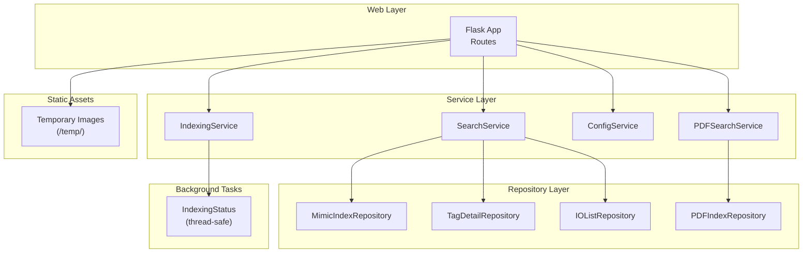
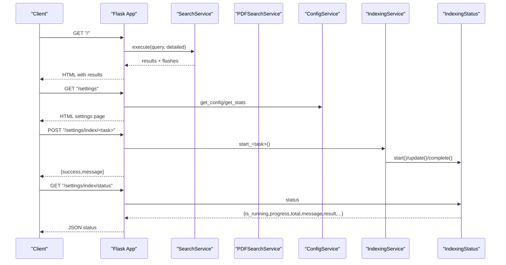
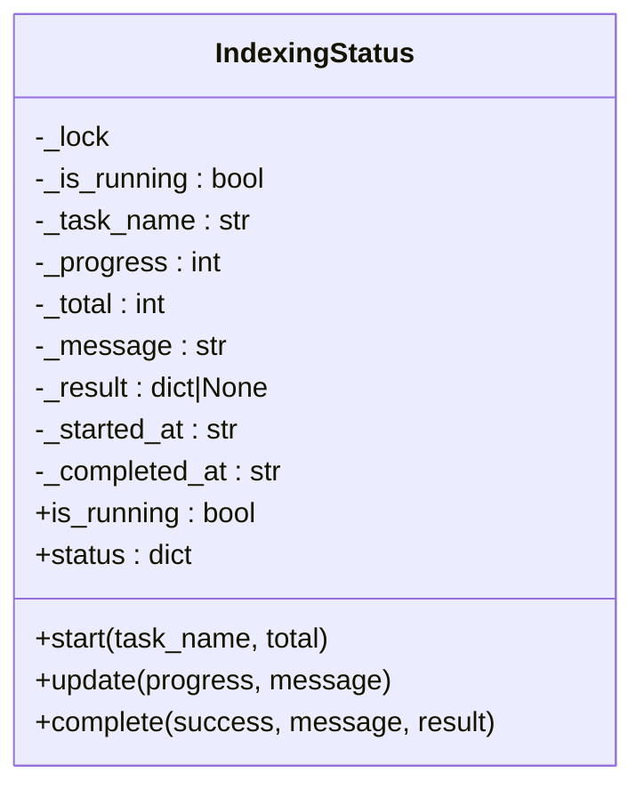
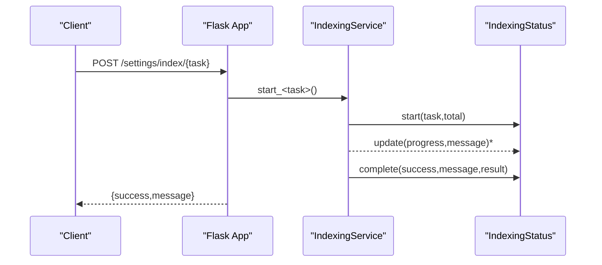
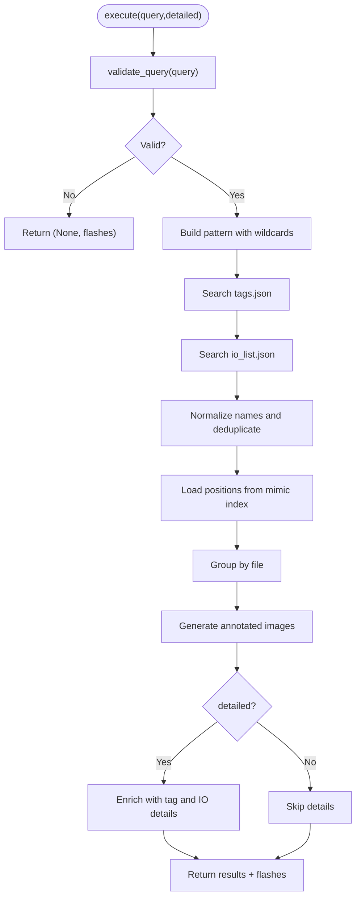
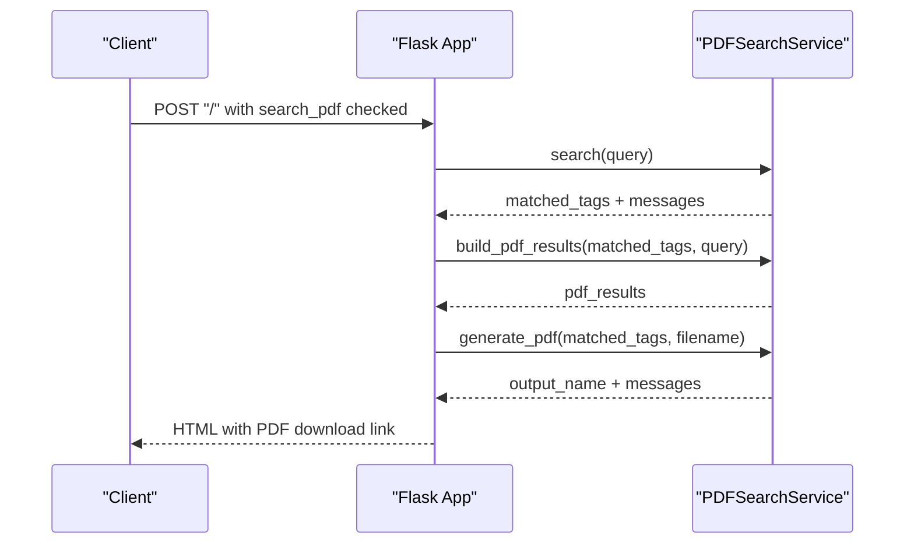
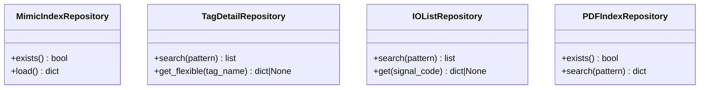
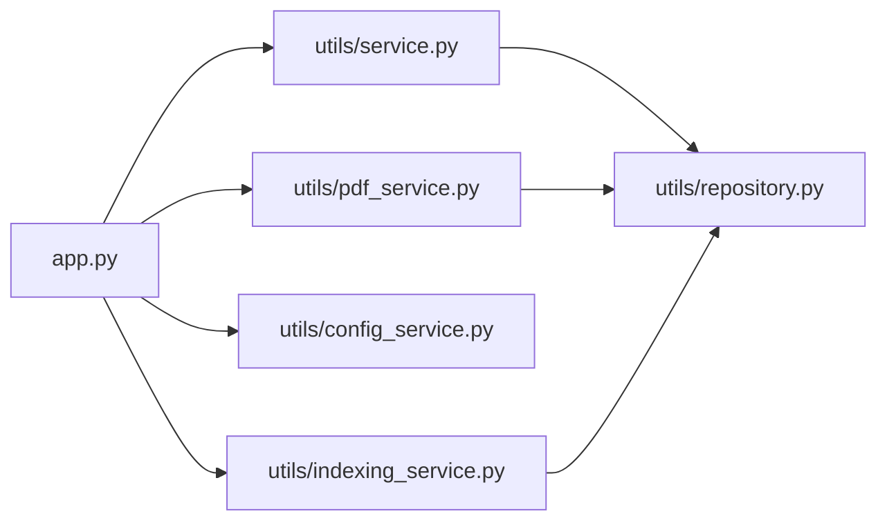

# API Reference

<cite>
**Referenced Files in This Document**
- [app.py](file://app.py)
- [utils/service.py](file://utils/service.py)
- [utils/pdf_service.py](file://utils/pdf_service.py)
- [utils/config_service.py](file://utils/config_service.py)
- [utils/indexing_service.py](file://utils/indexing_service.py)
- [utils/repository.py](file://utils/repository.py)
- [utils/mimic_searcher.py](file://utils/mimic_searcher.py)
- [utils/pdf_indexer.py](file://utils/pdf_indexer.py)
- [utils/iolist_indexer.py](file://utils/iolist_indexer.py)
- [templates/index.html](file://templates/index.html)
- [templates/settings.html](file://templates/settings.html)
- [templates/base.html](file://templates/base.html)
- [pyproject.toml](file://pyproject.toml)
</cite>

## Table of Contents
1. [Introduction](#introduction)
2. [Project Structure](#project-structure)
3. [Core Components](#core-components)
4. [Architecture Overview](#architecture-overview)
5. [Detailed Component Analysis](#detailed-component-analysis)
6. [Dependency Analysis](#dependency-analysis)
7. [Performance Considerations](#performance-considerations)
8. [Troubleshooting Guide](#troubleshooting-guide)
9. [Conclusion](#conclusion)

## Introduction
This document describes the HTTP API surface and background task interfaces exposed by the ECS7Search application. It covers:
- Flask routes for search, settings, index status monitoring, and temporary file serving
- Background task APIs for thread-safe indexing operations, progress tracking, and status reporting
- Request/response schemas, parameter validation, and error handling
- Practical usage examples, authentication considerations, rate limiting, CORS, security, and performance optimization

## Project Structure
ECS7Search is a Flask-based web application with a layered architecture:
- Router layer: Flask routes in the application entrypoint
- Service layer: Business logic for search, PDF generation, and configuration/statistics
- Repository layer: Data access for indices and cached datasets
- Background tasks: Threaded indexing services with shared status tracking

**Diagram sources**
- [app.py:92-201](file://app.py#L92-L201)
- [utils/service.py:25-270](file://utils/service.py#L25-L270)
- [utils/pdf_service.py:18-229](file://utils/pdf_service.py#L18-L229)
- [utils/config_service.py:13-128](file://utils/config_service.py#L13-L128)
- [utils/indexing_service.py:23-239](file://utils/indexing_service.py#L23-L239)
- [utils/repository.py:13-178](file://utils/repository.py#L13-L178)

**Section sources**
- [app.py:88-206](file://app.py#L88-L206)
- [pyproject.toml:1-19](file://pyproject.toml#L1-L19)

## Core Components
- Flask application with routes for search, settings, index control, and file serving
- SearchService orchestrates tag discovery across tag catalog, IO list, and mimic index
- PDFSearchService handles PDF index search and PDF generation
- ConfigService exposes configuration and statistics for all indices
- IndexingService launches background indexing tasks and updates global IndexingStatus
- Repository layer provides cached access to mimic, tag, IO list, and PDF indices

**Section sources**
- [app.py:49-84](file://app.py#L49-L84)
- [utils/service.py:25-270](file://utils/service.py#L25-L270)
- [utils/pdf_service.py:18-229](file://utils/pdf_service.py#L18-L229)
- [utils/config_service.py:13-128](file://utils/config_service.py#L13-L128)
- [utils/indexing_service.py:85-239](file://utils/indexing_service.py#L85-L239)
- [utils/repository.py:13-178](file://utils/repository.py#L13-L178)

## Architecture Overview
The HTTP API is implemented as Flask routes that delegate to service and repository components. Background indexing runs in separate threads and exposes a thread-safe status interface.

**Diagram sources**
- [app.py:92-194](file://app.py#L92-L194)
- [utils/service.py:58-158](file://utils/service.py#L58-L158)
- [utils/pdf_service.py:36-95](file://utils/pdf_service.py#L36-L95)
- [utils/config_service.py:38-106](file://utils/config_service.py#L38-L106)
- [utils/indexing_service.py:106-238](file://utils/indexing_service.py#L106-L238)

## Detailed Component Analysis

### HTTP Routes

#### Route: GET /
- Purpose: Serve the search UI form and results
- Method: GET
- URL: /
- Query parameters: None
- Form fields (POST): query, detailed, search_mimics, search_pdf
- Responses:
  - 200 OK: HTML rendered by index.html template
  - Flash messages: warning/danger/success/info banners
- Behavior:
  - On GET: renders empty form
  - On POST: executes search across mimic index and/or PDF index depending on checkboxes
  - Generates temporary annotated images and optional PDF results

**Section sources**
- [app.py:92-155](file://app.py#L92-L155)
- [templates/index.html:8-37](file://templates/index.html#L8-L37)

#### Route: GET /settings
- Purpose: Serve the settings UI with stats and configuration paths
- Method: GET
- URL: /settings
- Query parameters: None
- Responses: 200 OK with HTML rendered by settings.html template
- Data sources:
  - ConfigService.get_config(), get_mimics_stats(), get_pdf_stats(), get_tags_stats(), get_io_stats()
  - Global IndexingStatus.status for current indexing state

**Section sources**
- [app.py:158-169](file://app.py#L158-L169)
- [utils/config_service.py:38-106](file://utils/config_service.py#L38-L106)
- [utils/indexing_service.py:67-78](file://utils/indexing_service.py#L67-L78)

#### Route: POST /settings/index/<task>
- Purpose: Start a background indexing task
- Method: POST
- URL: /settings/index/{task}
- Allowed task values: mimics, pdf, io_list, mdb
- Responses:
  - 200 OK: JSON object with keys success and message
  - On invalid task: returns {success: false, message: "..."}
- Behavior:
  - Dispatches to IndexingService methods
  - Starts a daemon thread to run the task
  - Uses IndexingStatus to track progress and completion

**Section sources**
- [app.py:172-188](file://app.py#L172-L188)
- [utils/indexing_service.py:106-238](file://utils/indexing_service.py#L106-L238)

#### Route: GET /settings/index/status
- Purpose: Poll for current indexing status
- Method: GET
- URL: /settings/index/status
- Responses: 200 OK with JSON status object
- Status fields:
  - is_running: boolean
  - task_name: string
  - progress: integer
  - total: integer
  - message: string
  - result: object|null
  - started_at: string
  - completed_at: string

**Section sources**
- [app.py:191-194](file://app.py#L191-L194)
- [utils/indexing_service.py:23-78](file://utils/indexing_service.py#L23-L78)

#### Route: GET /temp/<filename>
- Purpose: Serve temporary images generated during search
- Method: GET
- URL: /temp/{filename}
- Responses:
  - 200 OK: image bytes
  - 404 Not Found: if file does not exist under data/temp
- Security: Filename is sanitized to a safe basename before serving

**Section sources**
- [app.py:197-201](file://app.py#L197-L201)

### Background Task Interfaces

#### IndexingStatus (Thread-Safe)
- Responsibilities:
  - Track current indexing operation state
  - Provide thread-safe start/update/complete/status methods
- Fields:
  - is_running, task_name, progress, total, message, result, started_at, completed_at
- Access:
  - Global singleton instance used by IndexingService

**Diagram sources**
- [utils/indexing_service.py:23-78](file://utils/indexing_service.py#L23-L78)

#### IndexingService
- Methods:
  - start_mimics_indexing(): starts threaded indexing of mimic files
  - start_pdf_indexing(): starts threaded indexing of PDF files
  - start_io_list_indexing(): starts threaded parsing of IO list
  - start_mdb_tag_extraction(): starts threaded extraction of tags from MDB databases
- Behavior:
  - Checks IndexingStatus.is_running before launching
  - Uses daemon threads to avoid blocking the server
  - Updates IndexingStatus during execution

**Diagram sources**
- [app.py:172-188](file://app.py#L172-L188)
- [utils/indexing_service.py:106-238](file://utils/indexing_service.py#L106-L238)
- [utils/indexing_service.py:23-78](file://utils/indexing_service.py#L23-L78)

**Section sources**
- [utils/indexing_service.py:85-239](file://utils/indexing_service.py#L85-L239)

### Search Service API

#### SearchService
- Validation:
  - validate_query(query): enforces minimum length and allowed characters (*, ?, underscore, alphanumeric)
- Execution:
  - execute(query, detailed): returns structured results including:
    - query, total_tags, total_files
    - images: list of annotated images with positions
    - skipped: list of warnings for skipped files
    - tag_details: enriched tag metadata (optional)
    - index_metadata: metadata from mimic index

**Diagram sources**
- [utils/service.py:46-158](file://utils/service.py#L46-L158)
- [utils/service.py:162-270](file://utils/service.py#L162-L270)

**Section sources**
- [utils/service.py:25-270](file://utils/service.py#L25-L270)

### PDF Search and Generation API

#### PDFSearchService
- search(query): returns matched tags with positions and messages
- build_pdf_results(matched_tags, query): builds a table-like structure for display
- generate_pdf(matched_tags, output_name): creates a PDF with corner watermark and extracted pages

**Diagram sources**
- [app.py:124-145](file://app.py#L124-L145)
- [utils/pdf_service.py:36-95](file://utils/pdf_service.py#L36-L95)
- [utils/pdf_service.py:97-229](file://utils/pdf_service.py#L97-L229)

**Section sources**
- [utils/pdf_service.py:18-229](file://utils/pdf_service.py#L18-L229)

### Repository Layer

#### Repositories
- MimicIndexRepository: loads mimic index JSON
- TagDetailRepository: cached tag catalog with flexible lookup and pattern search
- IOListRepository: cached IO list with pattern search and field filtering
- PDFIndexRepository: cached PDF index with tag pattern search

**Diagram sources**
- [utils/repository.py:13-178](file://utils/repository.py#L13-L178)

**Section sources**
- [utils/repository.py:13-178](file://utils/repository.py#L13-L178)

### Configuration and Statistics API

#### ConfigService
- get_config(): returns project paths
- get_mimics_stats(), get_pdf_stats(), get_tags_stats(), get_io_stats(): returns index statistics and metadata
- get_index_metadata(): returns mimic index metadata

**Section sources**
- [utils/config_service.py:38-106](file://utils/config_service.py#L38-L106)

## Dependency Analysis

**Diagram sources**
- [app.py:15-24](file://app.py#L15-L24)
- [utils/service.py:15-20](file://utils/service.py#L15-L20)
- [utils/pdf_service.py:15](file://utils/pdf_service.py#L15)
- [utils/indexing_service.py:17-20](file://utils/indexing_service.py#L17-L20)

**Section sources**
- [app.py:15-24](file://app.py#L15-L24)
- [utils/service.py:15-20](file://utils/service.py#L15-L20)
- [utils/pdf_service.py:15](file://utils/pdf_service.py#L15)
- [utils/indexing_service.py:17-20](file://utils/indexing_service.py#L17-L20)

## Performance Considerations
- SearchService limits the number of generated images to reduce response size and rendering cost
- Repository caches are used to minimize repeated disk reads
- Background indexing uses daemon threads to avoid blocking the main server
- PDF generation batches pages and applies watermark efficiently

[No sources needed since this section provides general guidance]

## Troubleshooting Guide
- Search validation errors:
  - Empty or short queries trigger warnings
  - Invalid characters produce danger-level messages
- PDF index availability:
  - If PDF index is missing, search returns an error message and suggests running the PDF indexer
- Temporary file serving:
  - If a requested temporary image is missing, clients receive a 404
- Indexing conflicts:
  - If an indexing task is already running, the API returns a failure message

**Section sources**
- [utils/service.py:46-54](file://utils/service.py#L46-L54)
- [utils/pdf_service.py:43-52](file://utils/pdf_service.py#L43-L52)
- [app.py:197-201](file://app.py#L197-L201)
- [utils/indexing_service.py:108-109](file://utils/indexing_service.py#L108-L109)

## Conclusion
ECS7Search exposes a straightforward HTTP API for search and settings, backed by robust service and repository layers. Background indexing is thread-safe and observable via a dedicated status endpoint. Clients should poll the status endpoint while indexing runs and handle validation and error messages gracefully.