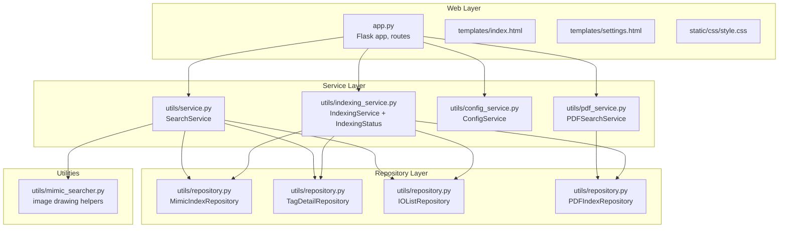
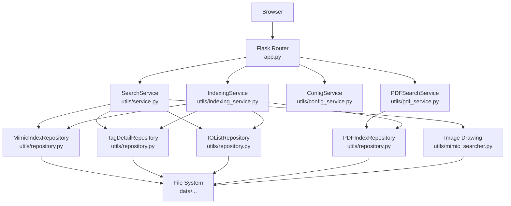
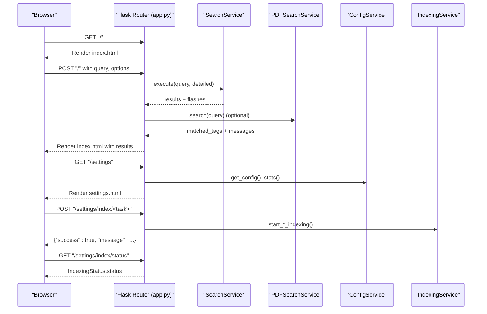
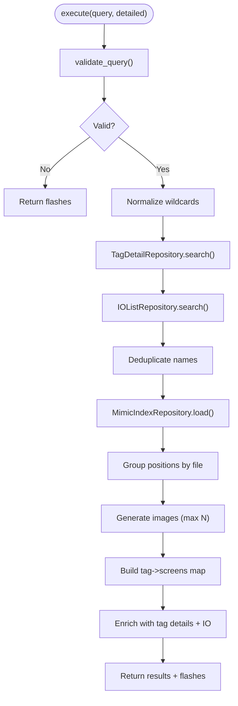
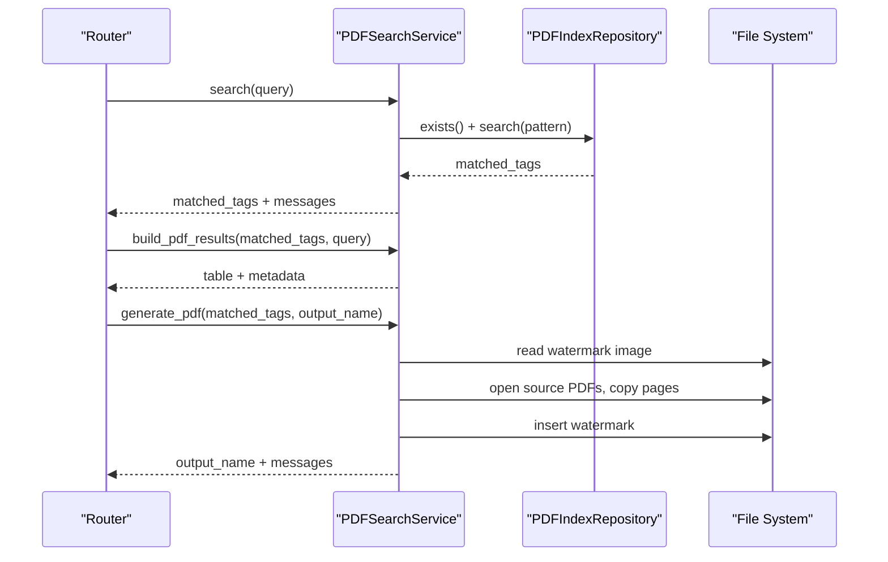
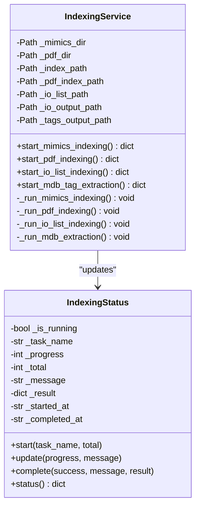
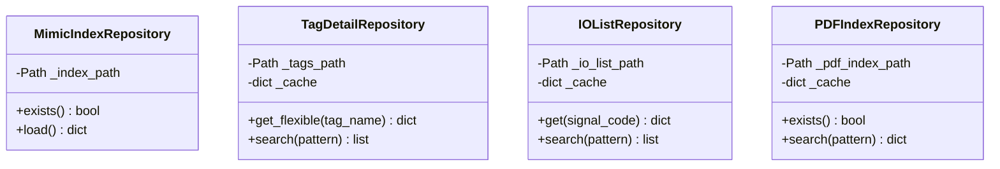
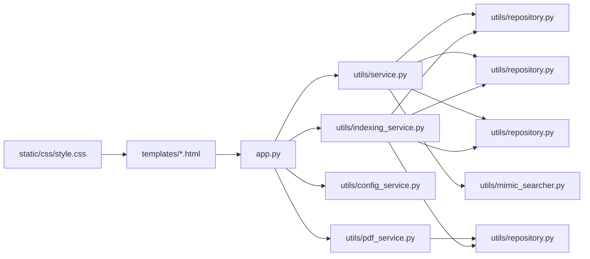

# Architecture Overview

<cite>
**Referenced Files in This Document**
- [app.py](file://app.py)
- [main.py](file://main.py)
- [utils/service.py](file://utils/service.py)
- [utils/repository.py](file://utils/repository.py)
- [utils/indexing_service.py](file://utils/indexing_service.py)
- [utils/mimic_searcher.py](file://utils/mimic_searcher.py)
- [utils/pdf_service.py](file://utils/pdf_service.py)
- [utils/config_service.py](file://utils/config_service.py)
- [templates/index.html](file://templates/index.html)
- [templates/settings.html](file://templates/settings.html)
- [static/css/style.css](file://static/css/style.css)
- [pyproject.toml](file://pyproject.toml)
</cite>

## Table of Contents
1. [Introduction](#introduction)
2. [Project Structure](#project-structure)
3. [Core Components](#core-components)
4. [Architecture Overview](#architecture-overview)
5. [Detailed Component Analysis](#detailed-component-analysis)
6. [Dependency Analysis](#dependency-analysis)
7. [Performance Considerations](#performance-considerations)
8. [Troubleshooting Guide](#troubleshooting-guide)
9. [Conclusion](#conclusion)
10. [Appendices](#appendices)

## Introduction
This document describes the architecture of ECS7Search, a Flask-based web application for searching tags across SCADA ECS7 mimic screens and PDF documents. The system follows a three-layer architecture:
- Router (Flask routes and views)
- Service (business logic)
- Repository (data access abstraction)

It integrates JSON-based indexing for fast lookups, background threading for non-blocking operations, and file system integration for images and PDFs. The document explains component interactions, data flows, and integration patterns, and provides infrastructure and scalability guidance.

## Project Structure
The project is organized around a clear separation of concerns:
- Application entrypoint initializes repositories, services, and Flask app.
- Templates and static assets power the UI.
- Utilities encapsulate business logic and data access.

**Diagram sources**
- [app.py:86-206](file://app.py#L86-L206)
- [utils/service.py:25-270](file://utils/service.py#L25-L270)
- [utils/repository.py:13-178](file://utils/repository.py#L13-L178)
- [utils/indexing_service.py:85-239](file://utils/indexing_service.py#L85-L239)
- [utils/pdf_service.py:18-229](file://utils/pdf_service.py#L18-L229)
- [utils/config_service.py:13-128](file://utils/config_service.py#L13-L128)
- [utils/mimic_searcher.py:1-174](file://utils/mimic_searcher.py#L1-L174)
- [templates/index.html:1-260](file://templates/index.html#L1-L260)
- [templates/settings.html:1-554](file://templates/settings.html#L1-L554)
- [static/css/style.css:1-154](file://static/css/style.css#L1-L154)

**Section sources**
- [app.py:11-84](file://app.py#L11-L84)
- [pyproject.toml:1-19](file://pyproject.toml#L1-L19)

## Core Components
- Router (Flask): Defines endpoints for search, settings, and serving temporary images. It orchestrates user interactions and delegates to services.
- Service layer:
  - SearchService: Implements tag search across JSON indices and builds results with mimic screen highlights.
  - PDFSearchService: Searches PDF index and generates consolidated PDFs with corner watermarks.
  - ConfigService: Provides configuration and statistics for UI.
  - IndexingService: Starts background indexing tasks and exposes status via IndexingStatus.
- Repository layer:
  - MimicIndexRepository, TagDetailRepository, IOListRepository, PDFIndexRepository: Provide cached JSON-backed access to indices and lists.

Key responsibilities:
- Router: Request routing, form handling, flash messaging, and rendering templates.
- Services: Business logic, validation, deduplication, enrichment, and PDF/image generation.
- Repositories: JSON loading, caching, and pattern-based search.

**Section sources**
- [app.py:86-206](file://app.py#L86-L206)
- [utils/service.py:25-270](file://utils/service.py#L25-L270)
- [utils/repository.py:13-178](file://utils/repository.py#L13-L178)
- [utils/pdf_service.py:18-229](file://utils/pdf_service.py#L18-L229)
- [utils/config_service.py:13-128](file://utils/config_service.py#L13-L128)
- [utils/indexing_service.py:85-239](file://utils/indexing_service.py#L85-L239)

## Architecture Overview
The system implements a clean three-layer architecture with explicit boundaries:
- Router layer (Flask) handles HTTP requests and renders HTML.
- Service layer encapsulates business logic and coordinates repositories.
- Repository layer abstracts data access to JSON files and directories.

**Diagram sources**
- [app.py:86-206](file://app.py#L86-L206)
- [utils/service.py:25-270](file://utils/service.py#L25-L270)
- [utils/repository.py:13-178](file://utils/repository.py#L13-L178)
- [utils/pdf_service.py:18-229](file://utils/pdf_service.py#L18-L229)
- [utils/config_service.py:13-128](file://utils/config_service.py#L13-L128)
- [utils/indexing_service.py:85-239](file://utils/indexing_service.py#L85-L239)
- [utils/mimic_searcher.py:1-174](file://utils/mimic_searcher.py#L1-L174)

## Detailed Component Analysis

### Router Layer (Flask)
- Routes:
  - GET "/": Renders the search page with empty results.
  - POST "/": Executes search across mimic and/or PDF indices; serves flash messages and renders results.
  - GET "/settings": Displays configuration and statistics.
  - POST "/settings/index/<task>": Starts background indexing tasks.
  - GET "/settings/index/status": Returns current indexing status.
  - GET "/temp/<filename>": Serves generated images from the temp directory.
- Responsibilities:
  - Form parsing and validation.
  - Flash messaging for user feedback.
  - Rendering Jinja templates with structured data.
  - Non-blocking indexing via background threads.

**Diagram sources**
- [app.py:92-155](file://app.py#L92-L155)
- [app.py:158-194](file://app.py#L158-L194)
- [app.py:197-201](file://app.py#L197-L201)
- [utils/service.py:58-158](file://utils/service.py#L58-L158)
- [utils/pdf_service.py:36-52](file://utils/pdf_service.py#L36-L52)
- [utils/config_service.py:38-106](file://utils/config_service.py#L38-L106)
- [utils/indexing_service.py:106-238](file://utils/indexing_service.py#L106-L238)

**Section sources**
- [app.py:92-201](file://app.py#L92-L201)
- [templates/index.html:1-260](file://templates/index.html#L1-L260)
- [templates/settings.html:1-554](file://templates/settings.html#L1-L554)

### Service Layer

#### SearchService
- Validates query and applies wildcard normalization.
- Searches tags and IO lists, deduplicates names, and enriches with mimic positions.
- Generates highlighted images for matched positions and builds detailed tag tables.
- Integrates mimic image drawing utilities.

**Diagram sources**
- [utils/service.py:58-158](file://utils/service.py#L58-L158)
- [utils/repository.py:78-93](file://utils/repository.py#L78-L93)
- [utils/repository.py:129-135](file://utils/repository.py#L129-L135)
- [utils/repository.py:22-24](file://utils/repository.py#L22-L24)
- [utils/mimic_searcher.py:80-110](file://utils/mimic_searcher.py#L80-L110)

**Section sources**
- [utils/service.py:25-270](file://utils/service.py#L25-L270)
- [utils/mimic_searcher.py:1-174](file://utils/mimic_searcher.py#L1-L174)

#### PDFSearchService
- Searches PDF index by pattern and builds a table of unique pages with associated tags.
- Generates a consolidated PDF with corner watermark and preserves page rotations.

**Diagram sources**
- [utils/pdf_service.py:36-229](file://utils/pdf_service.py#L36-L229)
- [utils/repository.py:164-177](file://utils/repository.py#L164-L177)

**Section sources**
- [utils/pdf_service.py:18-229](file://utils/pdf_service.py#L18-L229)
- [utils/repository.py:138-178](file://utils/repository.py#L138-L178)

#### IndexingService and IndexingStatus
- Manages background indexing tasks for mimics, PDFs, IO lists, and MDB extraction.
- Uses threading with daemon threads to avoid blocking the server.
- Thread-safe status updates via a dedicated class.

**Diagram sources**
- [utils/indexing_service.py:23-82](file://utils/indexing_service.py#L23-L82)
- [utils/indexing_service.py:85-239](file://utils/indexing_service.py#L85-L239)

**Section sources**
- [utils/indexing_service.py:1-239](file://utils/indexing_service.py#L1-L239)

#### ConfigService
- Provides configuration paths and statistics for UI.
- Safely loads JSON files and counts files in directories.

**Section sources**
- [utils/config_service.py:13-128](file://utils/config_service.py#L13-L128)

### Repository Layer
- JSON-backed repositories with caching and pattern-based search.
- MimicIndexRepository and PDFIndexRepository support metadata-aware queries.
- TagDetailRepository and IOListRepository provide flexible lookups and field filtering.

**Diagram sources**
- [utils/repository.py:13-178](file://utils/repository.py#L13-L178)

**Section sources**
- [utils/repository.py:1-178](file://utils/repository.py#L1-L178)

## Dependency Analysis
- Router depends on services and repositories to fulfill requests.
- Services depend on repositories for data access and on utilities for image drawing.
- IndexingService depends on repository instances and writes JSON outputs.
- Frontend templates depend on router-provided data and static assets.

**Diagram sources**
- [app.py:86-206](file://app.py#L86-L206)
- [utils/service.py:25-270](file://utils/service.py#L25-L270)
- [utils/repository.py:13-178](file://utils/repository.py#L13-L178)
- [utils/pdf_service.py:18-229](file://utils/pdf_service.py#L18-L229)
- [utils/config_service.py:13-128](file://utils/config_service.py#L13-L128)
- [utils/indexing_service.py:85-239](file://utils/indexing_service.py#L85-L239)
- [utils/mimic_searcher.py:1-174](file://utils/mimic_searcher.py#L1-L174)
- [templates/index.html:1-260](file://templates/index.html#L1-L260)
- [templates/settings.html:1-554](file://templates/settings.html#L1-L554)
- [static/css/style.css:1-154](file://static/css/style.css#L1-L154)

**Section sources**
- [pyproject.toml:6-15](file://pyproject.toml#L6-L15)

## Performance Considerations
- JSON caching in repositories reduces repeated disk reads and improves search performance.
- Background threading prevents UI blocking during long-running indexing tasks.
- Image generation is capped by a maximum result count to limit resource usage.
- PDF generation preserves original page rotations and avoids unnecessary copies.

Recommendations:
- Monitor memory usage when caching large JSON datasets; consider periodic cache invalidation.
- Limit concurrent indexing tasks to avoid I/O contention.
- Use pagination or result limits for large PDF search results.
- Store temporary images with unique filenames to prevent collisions.

[No sources needed since this section provides general guidance]

## Troubleshooting Guide
Common issues and resolutions:
- Missing index files:
  - Mimic index or PDF index not found leads to warnings; run the corresponding indexing task.
- No results:
  - Verify query syntax; wildcards are supported. Ensure indices are up-to-date.
- Image generation errors:
  - PNG files missing for mimic screens or drawing failures; confirm mimic files and permissions.
- PDF generation errors:
  - Source PDF not found or page out of range; check file paths and page numbers.
- Indexing conflicts:
  - Another indexing task is running; wait until completion or cancel and retry.

**Section sources**
- [utils/service.py:97-98](file://utils/service.py#L97-L98)
- [utils/pdf_service.py:158-171](file://utils/pdf_service.py#L158-L171)
- [utils/indexing_service.py:108-109](file://utils/indexing_service.py#L108-L109)

## Conclusion
ECS7Search’s three-layer architecture cleanly separates concerns: Router handles HTTP and UI, Service encapsulates business logic, and Repository abstracts data access. JSON-based indexing enables fast lookups, while background threading ensures responsiveness. The system integrates file system resources for images and PDFs, and the UI provides actionable feedback and status monitoring.

[No sources needed since this section summarizes without analyzing specific files]

## Appendices

### Infrastructure Requirements
- Python runtime and dependencies declared in the project configuration.
- File system layout for data directories and temporary outputs.
- Optional external tools for image and PDF processing.

**Section sources**
- [pyproject.toml:1-19](file://pyproject.toml#L1-L19)
- [app.py:28-38](file://app.py#L28-L38)

### Deployment Topology
- Single-instance Flask development server suitable for local or small-scale deployments.
- For production, deploy behind a WSGI server and reverse proxy, enable HTTPS, and scale horizontally as needed.
- Ensure persistent storage for data directories and consider backing up JSON indices.

[No sources needed since this section provides general guidance]