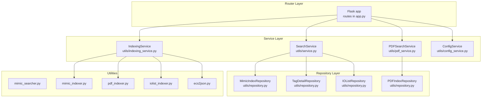
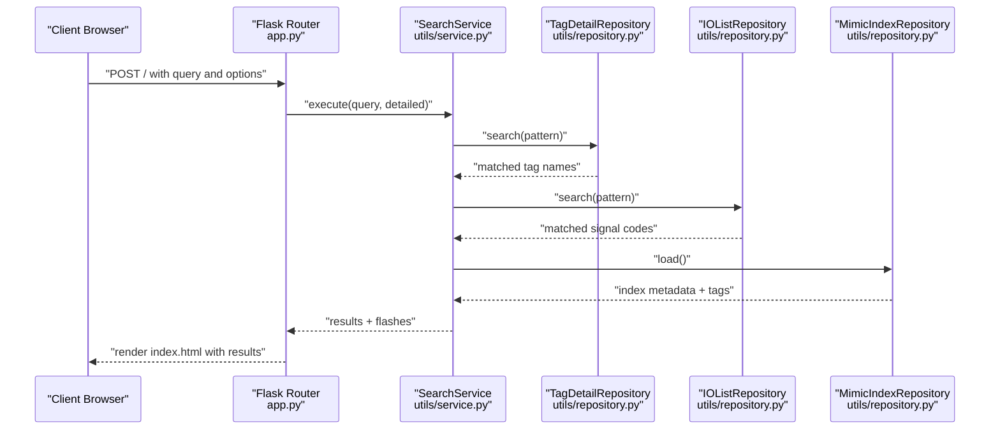
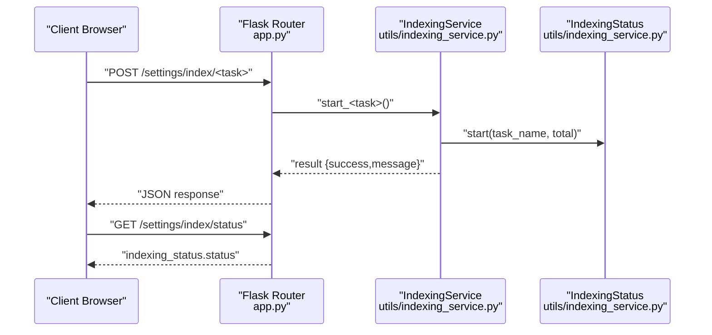
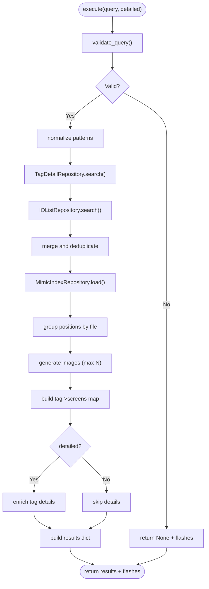
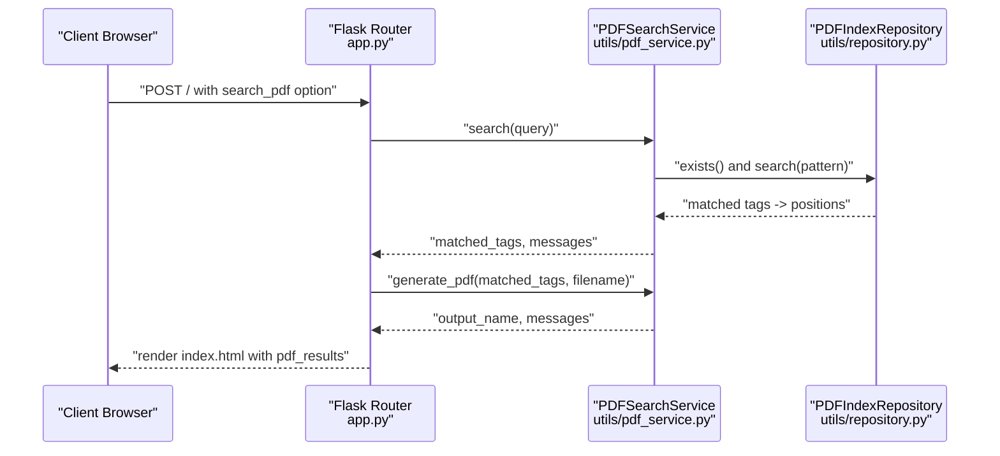
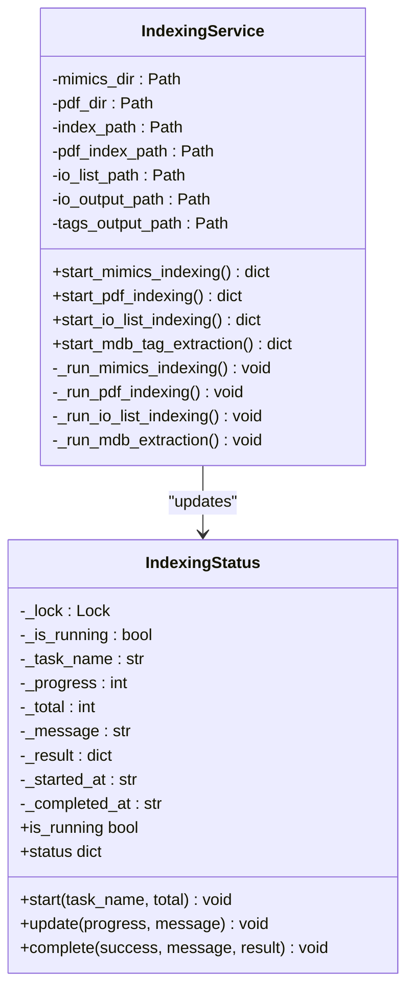
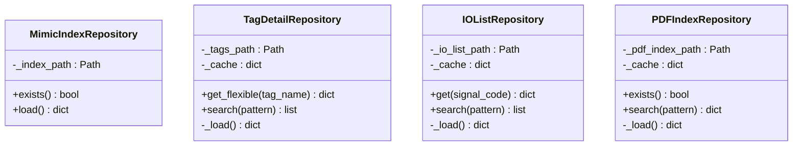
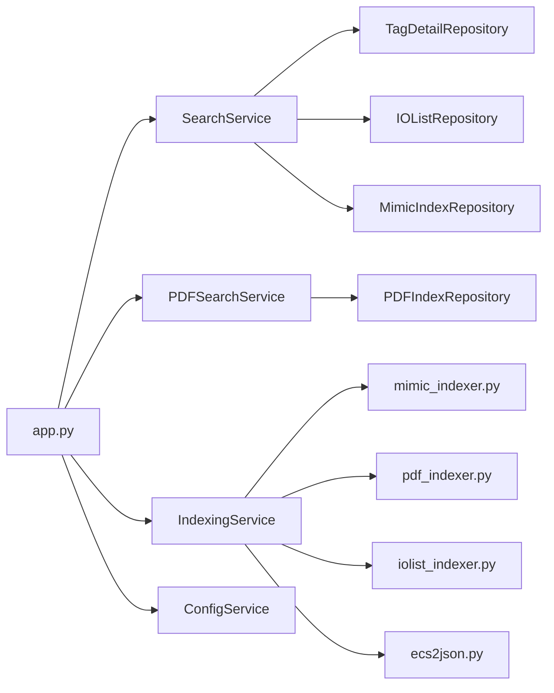

# Data Flow and Patterns

<cite>
**Referenced Files in This Document**
- [app.py](file://app.py)
- [main.py](file://main.py)
- [utils/service.py](file://utils/service.py)
- [utils/repository.py](file://utils/repository.py)
- [utils/indexing_service.py](file://utils/indexing_service.py)
- [utils/pdf_service.py](file://utils/pdf_service.py)
- [utils/mimic_searcher.py](file://utils/mimic_searcher.py)
- [utils/config_service.py](file://utils/config_service.py)
- [utils/iolist_indexer.py](file://utils/iolist_indexer.py)
- [utils/mimic_indexer.py](file://utils/mimic_indexer.py)
- [utils/pdf_indexer.py](file://utils/pdf_indexer.py)
- [utils/ecs2json.py](file://utils/ecs2json.py)
</cite>

## Table of Contents
1. [Introduction](#introduction)
2. [Project Structure](#project-structure)
3. [Core Components](#core-components)
4. [Architecture Overview](#architecture-overview)
5. [Detailed Component Analysis](#detailed-component-analysis)
6. [Dependency Analysis](#dependency-analysis)
7. [Performance Considerations](#performance-considerations)
8. [Troubleshooting Guide](#troubleshooting-guide)
9. [Conclusion](#conclusion)

## Introduction
This document explains the data flow patterns and architectural patterns implemented in ECS7Search. It focuses on the three-layer architecture from Flask router through service layer to repository layer, and documents how search requests propagate through the system. It also details the Repository pattern, Factory-like instantiation of services, Observer-like status tracking for indexing, and a Singleton-like global state for indexing status. The document includes sequence diagrams for typical search workflows, data transformation pipelines, and component interaction patterns, along with design decisions, trade-offs, and maintainability/extensibility benefits.

## Project Structure
The application is organized around a clear separation of concerns:
- Router layer: Flask routes in the main application module
- Service layer: Business logic for search, PDF generation, and configuration
- Repository layer: Data access abstractions for indices and JSON datasets
- Utilities: Indexers and helpers for building indices and extracting data

**Diagram sources**
- [app.py:92-206](file://app.py#L92-L206)
- [utils/service.py:25-270](file://utils/service.py#L25-L270)
- [utils/pdf_service.py:18-229](file://utils/pdf_service.py#L18-L229)
- [utils/indexing_service.py:85-239](file://utils/indexing_service.py#L85-L239)
- [utils/config_service.py:13-128](file://utils/config_service.py#L13-L128)
- [utils/repository.py:13-178](file://utils/repository.py#L13-L178)
- [utils/mimic_searcher.py:1-174](file://utils/mimic_searcher.py#L1-L174)
- [utils/mimic_indexer.py:1-484](file://utils/mimic_indexer.py#L1-L484)
- [utils/pdf_indexer.py:1-215](file://utils/pdf_indexer.py#L1-L215)
- [utils/iolist_indexer.py:1-122](file://utils/iolist_indexer.py#L1-L122)
- [utils/ecs2json.py:1-480](file://utils/ecs2json.py#L1-L480)

**Section sources**
- [app.py:11-84](file://app.py#L11-L84)
- [utils/service.py:1-270](file://utils/service.py#L1-L270)
- [utils/repository.py:1-178](file://utils/repository.py#L1-L178)
- [utils/indexing_service.py:1-239](file://utils/indexing_service.py#L1-L239)
- [utils/pdf_service.py:1-229](file://utils/pdf_service.py#L1-L229)
- [utils/config_service.py:1-128](file://utils/config_service.py#L1-L128)
- [utils/mimic_searcher.py:1-174](file://utils/mimic_searcher.py#L1-L174)
- [utils/mimic_indexer.py:1-484](file://utils/mimic_indexer.py#L1-L484)
- [utils/pdf_indexer.py:1-215](file://utils/pdf_indexer.py#L1-L215)
- [utils/iolist_indexer.py:1-122](file://utils/iolist_indexer.py#L1-L122)
- [utils/ecs2json.py:1-480](file://utils/ecs2json.py#L1-L480)

## Core Components
- Router layer: Flask application with routes for search, settings, indexing tasks, and serving temporary assets.
- Service layer:
  - SearchService: orchestrates tag search across multiple repositories and generates visual overlays.
  - PDFSearchService: searches PDF index and builds PDF results and a consolidated PDF.
  - IndexingService: runs background indexing tasks for mimics, PDFs, IO lists, and MDB tags; exposes status via a shared singleton-like state.
  - ConfigService: aggregates configuration and statistics for UI.
- Repository layer:
  - MimicIndexRepository, TagDetailRepository, IOListRepository, PDFIndexRepository: encapsulate data loading and search logic for JSON datasets.

These components implement a layered architecture that separates concerns and enables testability and reuse.

**Section sources**
- [app.py:92-206](file://app.py#L92-L206)
- [utils/service.py:25-270](file://utils/service.py#L25-L270)
- [utils/pdf_service.py:18-229](file://utils/pdf_service.py#L18-L229)
- [utils/indexing_service.py:85-239](file://utils/indexing_service.py#L85-L239)
- [utils/config_service.py:13-128](file://utils/config_service.py#L13-L128)
- [utils/repository.py:13-178](file://utils/repository.py#L13-L178)

## Architecture Overview
The system follows a strict three-layer flow:
- Router layer (Flask): handles HTTP requests, parses form data, and delegates to services.
- Service layer: performs business logic, validates queries, coordinates repositories, and prepares results.
- Repository layer: abstracts data access and caching for JSON datasets.

**Diagram sources**
- [app.py:114-155](file://app.py#L114-L155)
- [utils/service.py:58-158](file://utils/service.py#L58-L158)
- [utils/repository.py:78-93](file://utils/repository.py#L78-L93)
- [utils/repository.py:129-135](file://utils/repository.py#L129-L135)
- [utils/repository.py:22-24](file://utils/repository.py#L22-L24)

**Section sources**
- [app.py:92-155](file://app.py#L92-L155)
- [utils/service.py:58-158](file://utils/service.py#L58-L158)
- [utils/repository.py:13-178](file://utils/repository.py#L13-L178)

## Detailed Component Analysis

### Router Layer (Flask)
Responsibilities:
- Route definitions for search, settings, indexing tasks, and asset serving.
- Form parsing and request routing to appropriate services.
- Flash messaging for user feedback.
- Temporary asset serving for generated images.

Key flows:
- Home route: renders index template and executes search based on form options.
- Settings route: renders configuration and stats, including indexing status.
- Indexing task routes: start tasks and return status updates.
- Asset route: serves images from temp directory.

**Diagram sources**
- [app.py:172-194](file://app.py#L172-L194)
- [utils/indexing_service.py:106-116](file://utils/indexing_service.py#L106-L116)
- [utils/indexing_service.py:67-78](file://utils/indexing_service.py#L67-L78)

**Section sources**
- [app.py:92-206](file://app.py#L92-L206)
- [utils/indexing_service.py:23-82](file://utils/indexing_service.py#L23-L82)

### Service Layer

#### SearchService
Responsibilities:
- Validates user query.
- Searches tags and IO lists.
- Deduplicates and normalizes names.
- Loads positions from mimic index.
- Generates overlay images and enriches tag details.
- Builds structured results for rendering.

Processing logic highlights:
- Pattern normalization: auto-add wildcards if not present.
- Deduplication by normalized names.
- Position grouping by file for image generation.
- Tag enrichment with IO list and tag metadata.

**Diagram sources**
- [utils/service.py:58-158](file://utils/service.py#L58-L158)
- [utils/repository.py:78-93](file://utils/repository.py#L78-L93)
- [utils/repository.py:129-135](file://utils/repository.py#L129-L135)
- [utils/repository.py:22-24](file://utils/repository.py#L22-L24)

**Section sources**
- [utils/service.py:25-270](file://utils/service.py#L25-L270)
- [utils/mimic_searcher.py:42-111](file://utils/mimic_searcher.py#L42-L111)

#### PDFSearchService
Responsibilities:
- Searches PDF index for tags.
- Builds table-like results for UI.
- Generates a consolidated PDF with corner watermark.

Processing logic highlights:
- Pattern normalization and repository search.
- Aggregation of unique pages across tags.
- PDF generation with watermark placement considering page rotation.

**Diagram sources**
- [app.py:124-146](file://app.py#L124-L146)
- [utils/pdf_service.py:36-106](file://utils/pdf_service.py#L36-L106)
- [utils/repository.py:164-177](file://utils/repository.py#L164-L177)

**Section sources**
- [utils/pdf_service.py:18-229](file://utils/pdf_service.py#L18-L229)
- [utils/repository.py:138-178](file://utils/repository.py#L138-L178)

#### IndexingService
Responsibilities:
- Starts background indexing tasks for mimics, PDFs, IO lists, and MDB tags.
- Updates a shared IndexingStatus object with progress and completion.
- Uses dedicated indexer utilities under the utils package.

**Diagram sources**
- [utils/indexing_service.py:85-239](file://utils/indexing_service.py#L85-L239)
- [utils/indexing_service.py:23-82](file://utils/indexing_service.py#L23-L82)

**Section sources**
- [utils/indexing_service.py:1-239](file://utils/indexing_service.py#L1-L239)

#### ConfigService
Responsibilities:
- Provides configuration paths and statistics for UI.
- Safely loads JSON files and computes counts and metadata.

**Section sources**
- [utils/config_service.py:13-128](file://utils/config_service.py#L13-L128)

### Repository Layer
Responsibilities:
- Encapsulate data loading and search for JSON datasets.
- Provide cached views of large datasets.
- Support flexible search patterns and normalization.

Patterns:
- Repository pattern: each dataset has a dedicated repository class.
- Caching: repositories cache loaded data to avoid repeated I/O.
- Search patterns: support wildcard matching for tags and signal codes.

**Diagram sources**
- [utils/repository.py:13-178](file://utils/repository.py#L13-L178)

**Section sources**
- [utils/repository.py:1-178](file://utils/repository.py#L1-L178)

### Supporting Utilities

#### Indexers and Extractors
- mimic_indexer.py: scans ECS7 mimic files and builds a tag-to-position index.
- pdf_indexer.py: extracts tags from PDFs and builds a tag-to-file-page index.
- iolist_indexer.py: parses Excel IO list and produces a signals dataset.
- ecs2json.py: extracts tags from MS Access databases and saves a structured JSON.

These utilities are invoked by IndexingService to populate indices and datasets.

**Section sources**
- [utils/mimic_indexer.py:1-484](file://utils/mimic_indexer.py#L1-L484)
- [utils/pdf_indexer.py:1-215](file://utils/pdf_indexer.py#L1-L215)
- [utils/iolist_indexer.py:1-122](file://utils/iolist_indexer.py#L1-L122)
- [utils/ecs2json.py:1-480](file://utils/ecs2json.py#L1-L480)

## Dependency Analysis
- Router depends on services and repositories to fulfill requests.
- Services depend on repositories for data access and on utilities for image drawing.
- IndexingService depends on utilities for heavy lifting and on IndexingStatus for progress reporting.
- Repositories depend only on local filesystem and JSON parsing.

**Diagram sources**
- [app.py:18-84](file://app.py#L18-L84)
- [utils/service.py:15-20](file://utils/service.py#L15-L20)
- [utils/pdf_service.py:15](file://utils/pdf_service.py#L15)
- [utils/indexing_service.py:17-21](file://utils/indexing_service.py#L17-L21)

**Section sources**
- [app.py:18-84](file://app.py#L18-L84)
- [utils/service.py:15-20](file://utils/service.py#L15-L20)
- [utils/pdf_service.py:15](file://utils/pdf_service.py#L15)
- [utils/indexing_service.py:17-21](file://utils/indexing_service.py#L17-L21)

## Performance Considerations
- Caching in repositories reduces repeated disk reads and JSON parsing overhead.
- Wildcard search uses efficient pattern matching; consider precomputing normalized keys for very large datasets.
- Image generation caps results to limit UI load; consider pagination or lazy loading for large result sets.
- Background indexing uses threads; ensure thread safety and consider rate-limiting for heavy I/O.
- PDF generation opens and closes documents per page; batch operations could reduce overhead.

## Troubleshooting Guide
Common issues and diagnostics:
- Missing index files: repositories return empty caches; ensure indexing ran successfully.
- Validation failures: SearchService returns flashes for invalid queries; check query patterns and lengths.
- PDF generation errors: PDFSearchService returns messages for missing files or invalid page ranges.
- Indexing conflicts: IndexingService prevents overlapping runs; check status endpoint for current task.
- IO list parsing: iolist_indexer requires a valid Excel file; verify presence and structure.

Operational checks:
- Verify repository existence and loadability before invoking services.
- Monitor IndexingStatus for progress and completion messages.
- Confirm temporary directory permissions for generated images and PDFs.

**Section sources**
- [utils/repository.py:22-24](file://utils/repository.py#L22-L24)
- [utils/service.py:46-54](file://utils/service.py#L46-L54)
- [utils/pdf_service.py:43-52](file://utils/pdf_service.py#L43-L52)
- [utils/indexing_service.py:108-116](file://utils/indexing_service.py#L108-L116)
- [utils/iolist_indexer.py:100-117](file://utils/iolist_indexer.py#L100-L117)

## Conclusion
ECS7Search employs a clean three-layer architecture with explicit separation between router, service, and repository concerns. The Repository pattern encapsulates data access and caching, SearchService orchestrates cross-repository searches and result enrichment, and IndexingService coordinates background tasks with a shared status object. The design emphasizes maintainability and extensibility by keeping responsibilities distinct, enabling easy addition of new data sources and search capabilities. The layered approach simplifies testing, improves readability, and supports future enhancements such as asynchronous processing and advanced filtering.