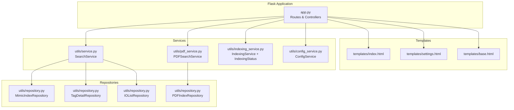
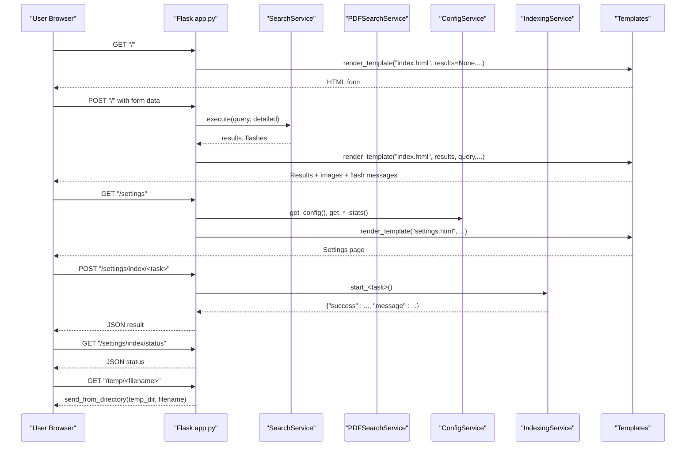
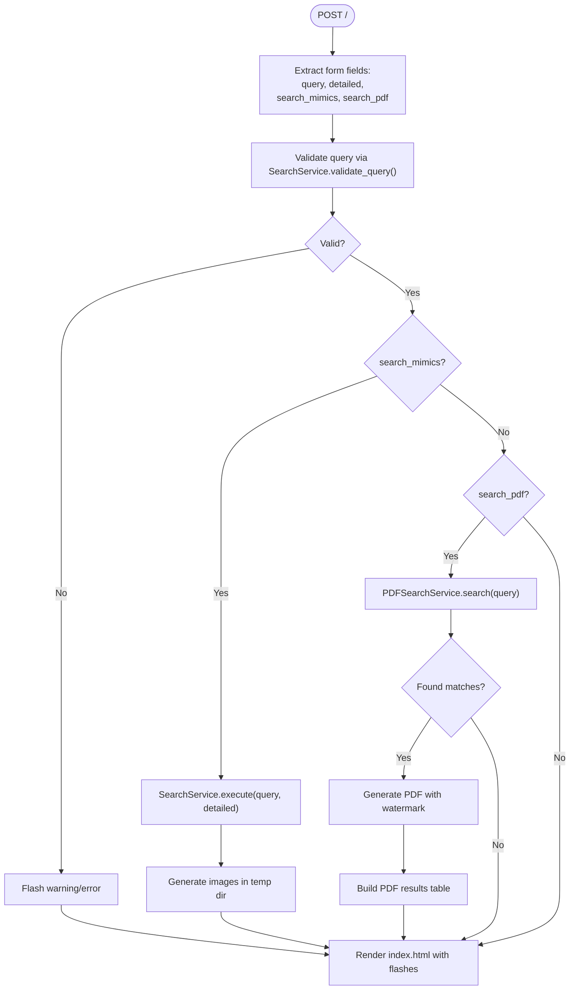
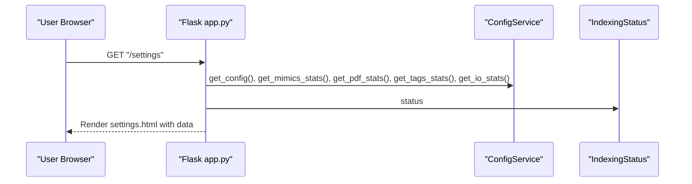
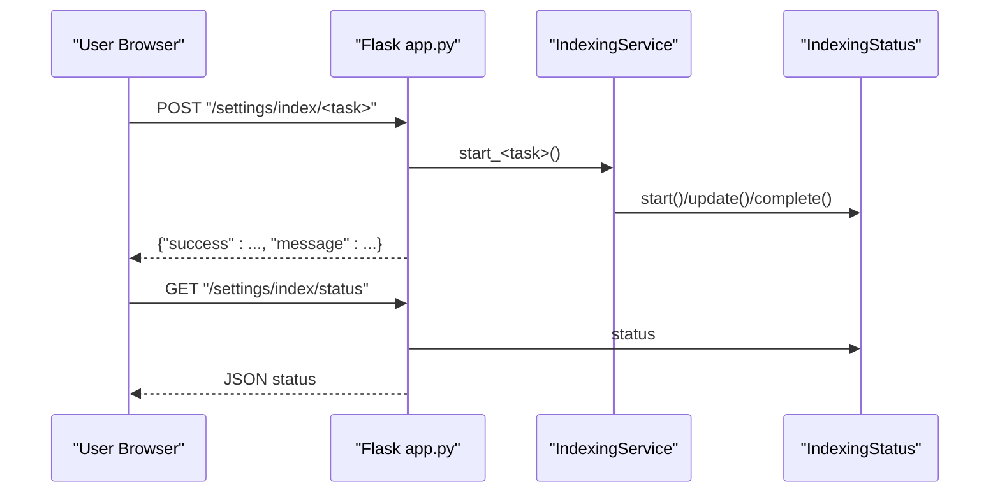
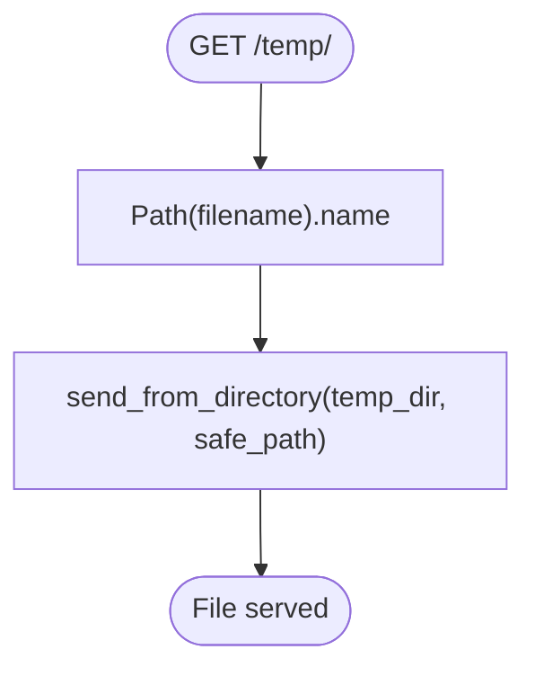
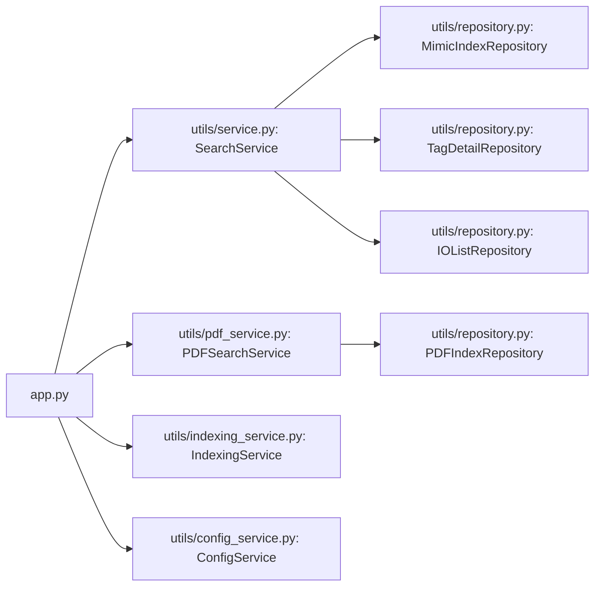

# Flask Router Layer

<cite>
**Referenced Files in This Document**
- [app.py](file://app.py)
- [index.html](file://templates/index.html)
- [settings.html](file://templates/settings.html)
- [base.html](file://templates/base.html)
- [service.py](file://utils/service.py)
- [repository.py](file://utils/repository.py)
- [pdf_service.py](file://utils/pdf_service.py)
- [indexing_service.py](file://utils/indexing_service.py)
- [config_service.py](file://utils/config_service.py)
</cite>

## Table of Contents
1. [Introduction](#introduction)
2. [Project Structure](#project-structure)
3. [Core Components](#core-components)
4. [Architecture Overview](#architecture-overview)
5. [Detailed Component Analysis](#detailed-component-analysis)
6. [Dependency Analysis](#dependency-analysis)
7. [Performance Considerations](#performance-considerations)
8. [Troubleshooting Guide](#troubleshooting-guide)
9. [Conclusion](#conclusion)

## Introduction
This document explains the Flask Router layer implementation in ECS7Search, focusing on how the Flask application serves as the HTTP interface. It covers route definitions for search functionality, settings management, background indexing operations, and temporary file serving. The document details request-response flows, form processing, parameter validation, session management via Flask’s flash messaging, and the integration between Flask routes and service-layer components. It also outlines error handling, template rendering, and provides examples of route handlers, parameter extraction, and response formatting patterns used throughout the application.

## Project Structure
The Flask application initializes repositories and services, then defines routes for:
- Root GET/POST: search interface and results
- Settings GET: configuration and statistics page
- Background indexing POST: trigger tasks and poll status
- Temporary file serving GET: serve generated images and PDFs

**Diagram sources**
- [app.py:88-206](file://app.py#L88-L206)
- [service.py:25-270](file://utils/service.py#L25-L270)
- [pdf_service.py:18-229](file://utils/pdf_service.py#L18-L229)
- [indexing_service.py:23-239](file://utils/indexing_service.py#L23-L239)
- [config_service.py:13-128](file://utils/config_service.py#L13-L128)
- [repository.py:13-178](file://utils/repository.py#L13-L178)

**Section sources**
- [app.py:88-206](file://app.py#L88-L206)

## Core Components
- Flask application initialization and secret key configuration
- Route handlers for:
  - Home page with search form and results
  - Settings page with configuration and stats
  - Background indexing triggers and status polling
  - Temporary file serving
- Template rendering with flash messaging and dynamic content
- Integration with service-layer components for search, PDF generation, indexing, and configuration

Key responsibilities:
- Parameter extraction from forms and URL paths
- Validation and error handling
- Flash messaging for user feedback
- Session management via Flask’s built-in session support (via flash messages)

**Section sources**
- [app.py:88-206](file://app.py#L88-L206)
- [index.html:8-38](file://templates/index.html#L8-L38)
- [settings.html:142-224](file://templates/settings.html#L142-L224)

## Architecture Overview
The Flask Router layer orchestrates HTTP requests and responses, delegating business logic to service-layer components and rendering results via Jinja2 templates. The service layer interacts with repositories to access data sources (indices and JSON files). Background indexing runs in separate threads and exposes status via a shared IndexingStatus object.

**Diagram sources**
- [app.py:92-201](file://app.py#L92-L201)
- [service.py:58-158](file://utils/service.py#L58-L158)
- [pdf_service.py:36-52](file://utils/pdf_service.py#L36-L52)
- [config_service.py:38-106](file://utils/config_service.py#L38-L106)
- [indexing_service.py:106-238](file://utils/indexing_service.py#L106-L238)

## Detailed Component Analysis

### Route: Home Page (/)
- Method: GET/POST
- Purpose: Serve the search interface and handle search submissions
- Request processing:
  - GET: renders the index template with empty defaults
  - POST: extracts form fields (query, detailed, search_mimics, search_pdf), validates, and executes search
- Response:
  - Renders index.html with results, query, flags, and PDF results
  - Uses flash messages for warnings/info/danger categories

Processing logic highlights:
- Query normalization: auto wildcard insertion if no wildcards present
- Dual search mode: mimics + PDF or PDF-only
- PDF generation: generates a PDF with corner watermark and builds a results table
- Image generation: draws borders around tag positions on screen images and stores them in temp directory

**Diagram sources**
- [app.py:92-155](file://app.py#L92-L155)
- [service.py:46-158](file://utils/service.py#L46-L158)
- [pdf_service.py:36-96](file://utils/pdf_service.py#L36-L96)

**Section sources**
- [app.py:92-155](file://app.py#L92-L155)
- [index.html:8-38](file://templates/index.html#L8-L38)
- [service.py:46-158](file://utils/service.py#L46-L158)
- [pdf_service.py:36-96](file://utils/pdf_service.py#L36-L96)

### Route: Settings (/settings)
- Method: GET
- Purpose: Display configuration and statistics for indices and data paths
- Data sources:
  - ConfigService for paths and metadata
  - Stats for mimics, PDF, tags, and IO list
  - Current indexing status from IndexingStatus
- Rendering:
  - settings.html template with cards for stats and configuration
  - Instructions and buttons to trigger indexing tasks

**Diagram sources**
- [app.py:158-169](file://app.py#L158-L169)
- [config_service.py:38-106](file://utils/config_service.py#L38-L106)
- [indexing_service.py:67-78](file://utils/indexing_service.py#L67-L78)

**Section sources**
- [app.py:158-169](file://app.py#L158-L169)
- [settings.html:1-554](file://templates/settings.html#L1-L554)
- [config_service.py:38-106](file://utils/config_service.py#L38-L106)

### Route: Background Indexing (/settings/index/*)
- Methods: POST for task triggers, GET for status polling
- Task mapping:
  - mimics: start_mimics_indexing
  - pdf: start_pdf_indexing
  - io_list: start_io_list_indexing
  - mdb: start_mdb_tag_extraction
- Behavior:
  - POST: starts a background thread; returns JSON result with success/message
  - GET: returns current IndexingStatus as JSON for UI polling

**Diagram sources**
- [app.py:172-194](file://app.py#L172-L194)
- [indexing_service.py:106-238](file://utils/indexing_service.py#L106-L238)
- [indexing_service.py:23-78](file://utils/indexing_service.py#L23-L78)

**Section sources**
- [app.py:172-194](file://app.py#L172-L194)
- [settings.html:226-342](file://templates/settings.html#L226-L342)
- [indexing_service.py:106-238](file://utils/indexing_service.py#L106-L238)

### Route: Temporary File Serving (/temp/*)
- Method: GET
- Purpose: Serve generated images and PDFs from the temp directory
- Security: Sanitizes filename to prevent path traversal
- Behavior: Returns file content from data/temp

**Diagram sources**
- [app.py:197-201](file://app.py#L197-L201)

**Section sources**
- [app.py:197-201](file://app.py#L197-L201)

### Template Integration and Flash Messaging
- Flash messages:
  - Used to communicate validation errors/warnings, operation results, and PDF generation outcomes
  - Rendered in templates via get_flashed_messages with category-based banners
- Template blocks:
  - base.html provides layout, navigation, and modal for image zooming
  - index.html renders search form, results gallery, and PDF results
  - settings.html renders stats, configuration, and interactive indexing controls

**Section sources**
- [index.html:40-57](file://templates/index.html#L40-L57)
- [index.html:173-182](file://templates/index.html#L173-L182)
- [base.html:519-526](file://templates/base.html#L519-L526)
- [settings.html:226-342](file://templates/settings.html#L226-L342)

## Dependency Analysis
The Flask Router layer depends on:
- Service-layer components for business logic
- Repository-layer components for data access
- Templates for rendering UI and flash messages

**Diagram sources**
- [app.py:15-84](file://app.py#L15-L84)
- [service.py:25-43](file://utils/service.py#L25-L43)
- [pdf_service.py:18-35](file://utils/pdf_service.py#L18-L35)
- [repository.py:13-178](file://utils/repository.py#L13-L178)

**Section sources**
- [app.py:15-84](file://app.py#L15-L84)
- [service.py:25-43](file://utils/service.py#L25-L43)
- [pdf_service.py:18-35](file://utils/pdf_service.py#L18-L35)
- [repository.py:13-178](file://utils/repository.py#L13-L178)

## Performance Considerations
- Image generation limit: SearchService limits the number of generated images to avoid excessive disk writes and memory usage
- PDF generation: Uses PyMuPDF to copy pages and insert a watermark; ensure adequate memory for large PDF sets
- Background indexing: Runs in daemon threads; consider rate-limiting UI triggers and providing progress feedback
- Template rendering: Large result sets can increase HTML payload; consider pagination or lazy loading for images

[No sources needed since this section provides general guidance]

## Troubleshooting Guide
Common issues and resolutions:
- No results for search:
  - Verify query length and allowed characters; validation enforces minimum length and character set
  - Check that indices exist and are up-to-date
- PDF search returns no results:
  - Ensure PDF index exists and is generated; otherwise, prompt to run PDF indexing
- PDF generation fails:
  - Confirm the monkey image exists and is readable; verify temp directory permissions
  - Check that referenced PDF files exist and page numbers are valid
- Indexing stuck or not updating:
  - Polling endpoint returns status; confirm that a task is running and progress updates
  - Ensure background thread completes and writes updated index files

**Section sources**
- [service.py:46-54](file://utils/service.py#L46-L54)
- [pdf_service.py:43-52](file://utils/pdf_service.py#L43-L52)
- [pdf_service.py:117-124](file://utils/pdf_service.py#L117-L124)
- [indexing_service.py:67-78](file://utils/indexing_service.py#L67-L78)

## Conclusion
The Flask Router layer in ECS7Search provides a clean separation of concerns: HTTP routing, form processing, and response rendering are handled at the Flask level, while business logic resides in service-layer components. The design leverages repositories for data access, supports background indexing with status polling, and integrates flash messaging for user feedback. The templates encapsulate presentation logic, enabling a responsive and informative user experience for search, settings, and background operations.