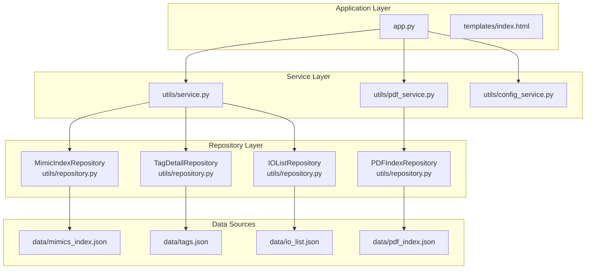
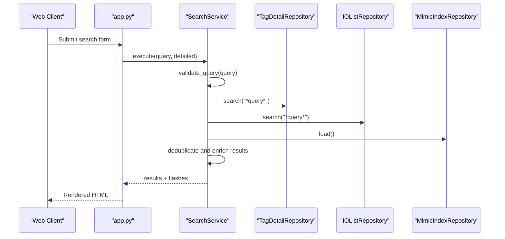
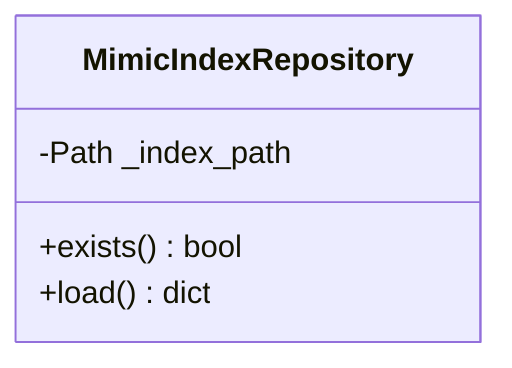
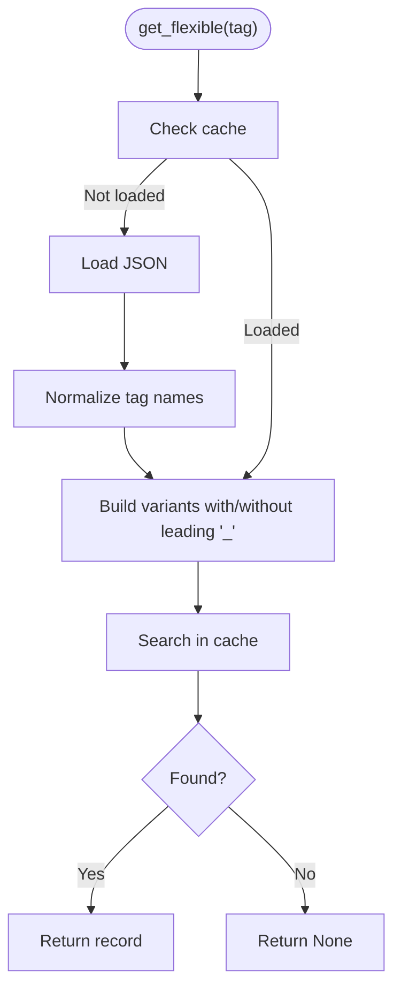
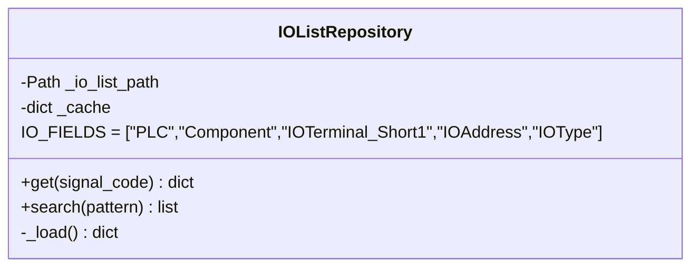
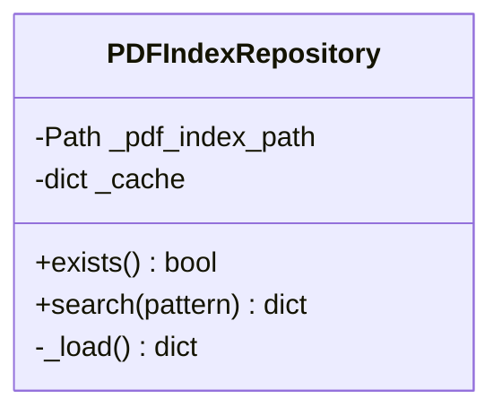
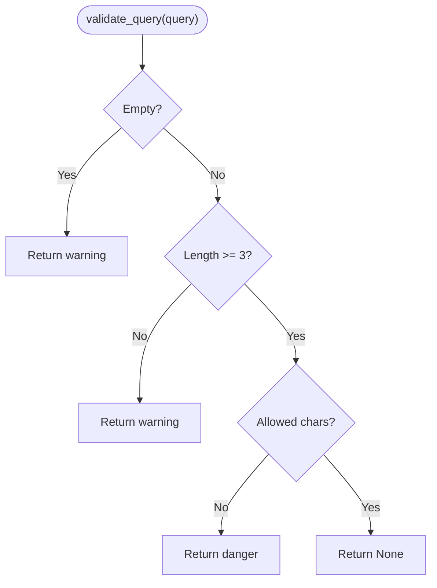
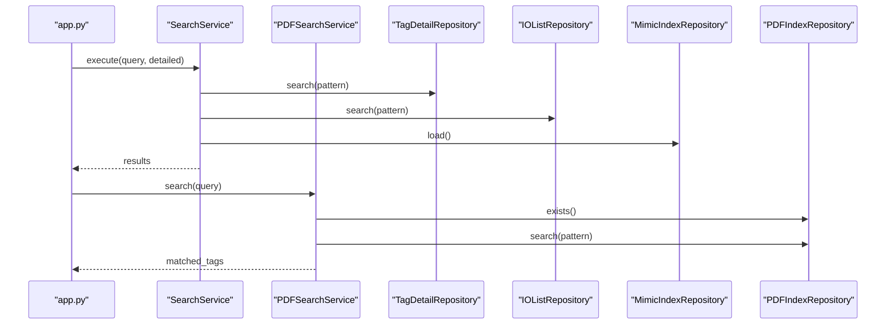
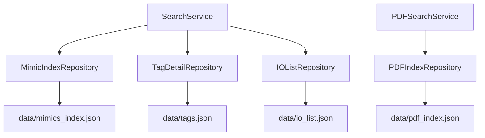

# Repository Layer

<cite>
**Referenced Files in This Document**
- [repository.py](file://utils/repository.py)
- [service.py](file://utils/service.py)
- [app.py](file://app.py)
- [mimic_indexer.py](file://utils/mimic_indexer.py)
- [pdf_indexer.py](file://utils/pdf_indexer.py)
- [iolist_indexer.py](file://utils/iolist_indexer.py)
- [mimic_searcher.py](file://utils/mimic_searcher.py)
- [pdf_service.py](file://utils/pdf_service.py)
- [config_service.py](file://utils/config_service.py)
- [index.html](file://templates/index.html)
- [mimics_index.json](file://data/mimics_index.json)
- [pdf_index.json](file://data/pdf_index.json)
- [io_list.json](file://data/io_list.json)
- [tags.json](file://data/tags.json)
</cite>

## Table of Contents
1. [Introduction](#introduction)
2. [Project Structure](#project-structure)
3. [Core Components](#core-components)
4. [Architecture Overview](#architecture-overview)
5. [Detailed Component Analysis](#detailed-component-analysis)
6. [Dependency Analysis](#dependency-analysis)
7. [Performance Considerations](#performance-considerations)
8. [Troubleshooting Guide](#troubleshooting-guide)
9. [Conclusion](#conclusion)

## Introduction
This document explains the Repository Layer pattern implementation in ECS7Search. The repository pattern centralizes data access for different data sources:
- MimicIndexRepository for screen mimic indices
- TagDetailRepository for tag metadata
- IOListRepository for IO list information
- PDFIndexRepository for PDF document indices

It documents how repositories abstract file system operations, implement caching strategies, handle JSON file operations, and integrate with the service layer. It also covers validation processes, error handling, and performance considerations for efficient data access.

## Project Structure
The repository layer is implemented in a dedicated module and integrated with the service layer and web application.

**Diagram sources**
- [app.py:42-63](file://app.py#L42-L63)
- [service.py:25-42](file://utils/service.py#L25-L42)
- [pdf_service.py:18-35](file://utils/pdf_service.py#L18-L35)
- [repository.py:13-178](file://utils/repository.py#L13-L178)

**Section sources**
- [app.py:26-84](file://app.py#L26-L84)
- [repository.py:13-178](file://utils/repository.py#L13-L178)

## Core Components
The repository layer consists of four specialized repositories, each encapsulating data access for a specific data source.

- MimicIndexRepository
  - Purpose: Load and validate the mimic index JSON file containing screen positions for tags.
  - Key methods: exists(), load().
  - Data source: data/mimics_index.json.

- TagDetailRepository
  - Purpose: Provide cached access to tag metadata from tags.json with flexible lookup and pattern matching.
  - Key methods: get_flexible(), search().
  - Data source: data/tags.json.
  - Caching: In-memory cache populated on first access.

- IOListRepository
  - Purpose: Provide cached access to IO list data from io_list.json with field filtering and pattern matching.
  - Key methods: get(), search().
  - Data source: data/io_list.json.
  - Caching: In-memory cache populated on first access.

- PDFIndexRepository
  - Purpose: Provide cached access to PDF index data from pdf_index.json with pattern-based tag search.
  - Key methods: exists(), search().
  - Data source: data/pdf_index.json.
  - Caching: In-memory cache populated on first access.

Benefits of the repository pattern:
- Abstraction of data sources and file system operations
- Centralized caching for improved performance
- Consistent interface for search and retrieval
- Separation of concerns between data access and business logic

**Section sources**
- [repository.py:13-178](file://utils/repository.py#L13-L178)

## Architecture Overview
The repository layer sits between the service layer and persistent data sources. The service layer orchestrates business logic and delegates data access to repositories. The application layer initializes repositories and wires them into services.

**Diagram sources**
- [app.py:92-155](file://app.py#L92-L155)
- [service.py:58-158](file://utils/service.py#L58-L158)
- [repository.py:27-178](file://utils/repository.py#L27-L178)

## Detailed Component Analysis

### MimicIndexRepository
Responsibilities:
- Validate presence of mimic index file
- Load mimic index JSON into memory
- Provide access to metadata and tag positions

Implementation highlights:
- exists(): checks file existence
- load(): opens and parses JSON with UTF-8 encoding
- Uses data/mimics_index.json

Integration:
- Consumed by SearchService to retrieve screen positions for matched tags

**Diagram sources**
- [repository.py:13-25](file://utils/repository.py#L13-L25)

**Section sources**
- [repository.py:13-25](file://utils/repository.py#L13-L25)
- [service.py:108-112](file://utils/service.py#L108-L112)

### TagDetailRepository
Responsibilities:
- Provide cached access to tag metadata
- Flexible tag lookup supporting underscore variations
- Pattern-based search with wildcard support

Implementation highlights:
- _load(): loads and caches data on first access; supports both old and new JSON formats
- get_flexible(): searches tag with and without leading underscore
- search(): pattern-based tag name filtering

Data model:
- Supports two JSON formats:
  - New: {"metadata": {...}, "tags": [...]}
  - Old: [...]
- Normalizes tag names for deduplication

**Diagram sources**
- [repository.py:34-76](file://utils/repository.py#L34-L76)

**Section sources**
- [repository.py:27-94](file://utils/repository.py#L27-L94)
- [service.py:222-228](file://utils/service.py#L222-L228)

### IOListRepository
Responsibilities:
- Provide cached access to IO list data
- Field filtering for IO records
- Pattern-based search for SignalCode

Implementation highlights:
- _load(): loads signals map into cache on first access
- get(): returns filtered fields for a given SignalCode
- search(): pattern-based SignalCode filtering

Data model:
- Signals keyed by SignalCode
- Fields filtered to IO_FIELDS for consistent presentation

**Diagram sources**
- [repository.py:96-136](file://utils/repository.py#L96-L136)

**Section sources**
- [repository.py:96-136](file://utils/repository.py#L96-L136)
- [service.py:239-243](file://utils/service.py#L239-L243)

### PDFIndexRepository
Responsibilities:
- Provide cached access to PDF index data
- Pattern-based tag search across PDF documents
- Existence validation for index file

Implementation highlights:
- exists(): checks PDF index file presence
- _load(): loads and caches index on first access
- search(): filters tags by pattern and returns positions with file, page, and count

**Diagram sources**
- [repository.py:138-178](file://utils/repository.py#L138-L178)

**Section sources**
- [repository.py:138-178](file://utils/repository.py#L138-L178)
- [pdf_service.py:36-52](file://utils/pdf_service.py#L36-L52)

### Data Loading Patterns and Validation
The service layer coordinates repository usage and applies validation:

- Query validation ensures acceptable input length and allowed characters
- Auto-wildcard expansion for pattern-based searches
- Deduplication logic normalizes tag names and prioritizes non-underscore variants
- Enrichment merges tag metadata and IO list data for detailed results

**Diagram sources**
- [service.py:46-54](file://utils/service.py#L46-L54)

**Section sources**
- [service.py:46-54](file://utils/service.py#L46-L54)
- [service.py:76-99](file://utils/service.py#L76-L99)

### Integration with Service Layer
Repositories are injected into SearchService and PDFSearchService, enabling:
- Unified search across tags and IO lists
- Screen position retrieval from mimic index
- PDF search and report generation

**Diagram sources**
- [app.py:49-63](file://app.py#L49-L63)
- [service.py:58-158](file://utils/service.py#L58-L158)
- [pdf_service.py:36-52](file://utils/pdf_service.py#L36-L52)

**Section sources**
- [app.py:49-63](file://app.py#L49-L63)
- [service.py:58-158](file://utils/service.py#L58-L158)
- [pdf_service.py:36-52](file://utils/pdf_service.py#L36-L52)

## Dependency Analysis
Repositories depend on:
- File system paths for data sources
- JSON parsing for structured data
- Pattern matching for flexible searches

Service layer depends on:
- Repositories for data access
- Utility modules for image processing and PDF operations

**Diagram sources**
- [service.py:25-42](file://utils/service.py#L25-L42)
- [pdf_service.py:18-35](file://utils/pdf_service.py#L18-L35)
- [repository.py:13-178](file://utils/repository.py#L13-L178)

**Section sources**
- [service.py:25-42](file://utils/service.py#L25-L42)
- [pdf_service.py:18-35](file://utils/pdf_service.py#L18-L35)
- [repository.py:13-178](file://utils/repository.py#L13-L178)

## Performance Considerations
- Caching strategy
  - Repositories cache loaded data in memory after first access, reducing repeated file I/O.
  - TagDetailRepository and IOListRepository cache entire datasets; PDFIndexRepository and MimicIndexRepository cache parsed JSON structures.
- File system operations
  - All repositories use UTF-8 encoding for JSON reads.
  - Existence checks prevent unnecessary parsing when files are missing.
- Search efficiency
  - Pattern matching uses fnmatch for wildcard support.
  - Deduplication avoids redundant processing of equivalent tag names.
- Image generation limits
  - SearchService enforces a maximum number of results to limit image generation workload.

Recommendations:
- Monitor cache hit rates for large datasets.
- Consider lazy initialization for very large JSON files.
- Add periodic cache invalidation if external files change frequently.

**Section sources**
- [repository.py:34-62](file://utils/repository.py#L34-L62)
- [repository.py:105-120](file://utils/repository.py#L105-L120)
- [repository.py:148-162](file://utils/repository.py#L148-L162)
- [service.py:162-198](file://utils/service.py#L162-L198)

## Troubleshooting Guide
Common issues and resolutions:
- Missing index files
  - Symptoms: Repository.exists() returns False or empty results.
  - Resolution: Run the corresponding indexer to generate the JSON file.
  - References:
    - [mimic_indexer.py:438-484](file://utils/mimic_indexer.py#L438-L484)
    - [pdf_indexer.py:149-215](file://utils/pdf_indexer.py#L149-L215)
    - [iolist_indexer.py:100-122](file://utils/iolist_indexer.py#L100-L122)
- JSON parsing errors
  - Symptoms: Exceptions during load() or _load().
  - Resolution: Verify JSON validity and encoding; repositories initialize empty cache on failure.
  - References:
    - [repository.py:42-62](file://utils/repository.py#L42-L62)
    - [repository.py:113-120](file://utils/repository.py#L113-L120)
    - [repository.py:156-162](file://utils/repository.py#L156-L162)
- Incorrect tag names
  - Symptoms: get_flexible() returns None.
  - Resolution: Use get_flexible() or search() to account for underscore variations.
  - References:
    - [repository.py:64-76](file://utils/repository.py#L64-L76)
    - [service.py:222-228](file://utils/service.py#L222-L228)
- Large result sets
  - Symptoms: Slow response or excessive image generation.
  - Resolution: Limit query specificity or reduce max_results.
  - References:
    - [service.py:162-198](file://utils/service.py#L162-L198)

**Section sources**
- [repository.py:42-62](file://utils/repository.py#L42-L62)
- [repository.py:113-120](file://utils/repository.py#L113-L120)
- [repository.py:156-162](file://utils/repository.py#L156-L162)
- [service.py:162-198](file://utils/service.py#L162-L198)

## Conclusion
The repository layer in ECS7Search provides a clean abstraction over diverse data sources, implementing robust caching, flexible search capabilities, and consistent integration with the service layer. By centralizing data access and validation, it enables scalable and maintainable search functionality across screen mimic indices, tag metadata, IO lists, and PDF documents.