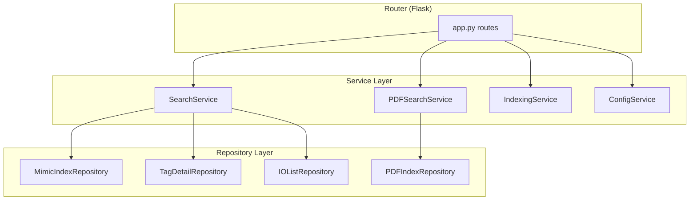
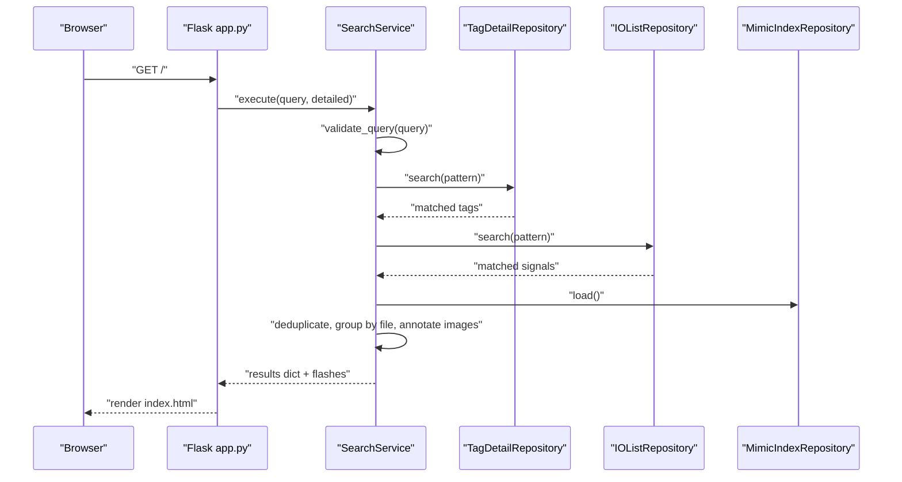
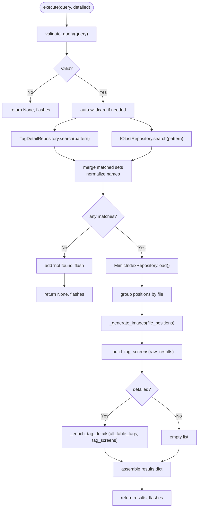
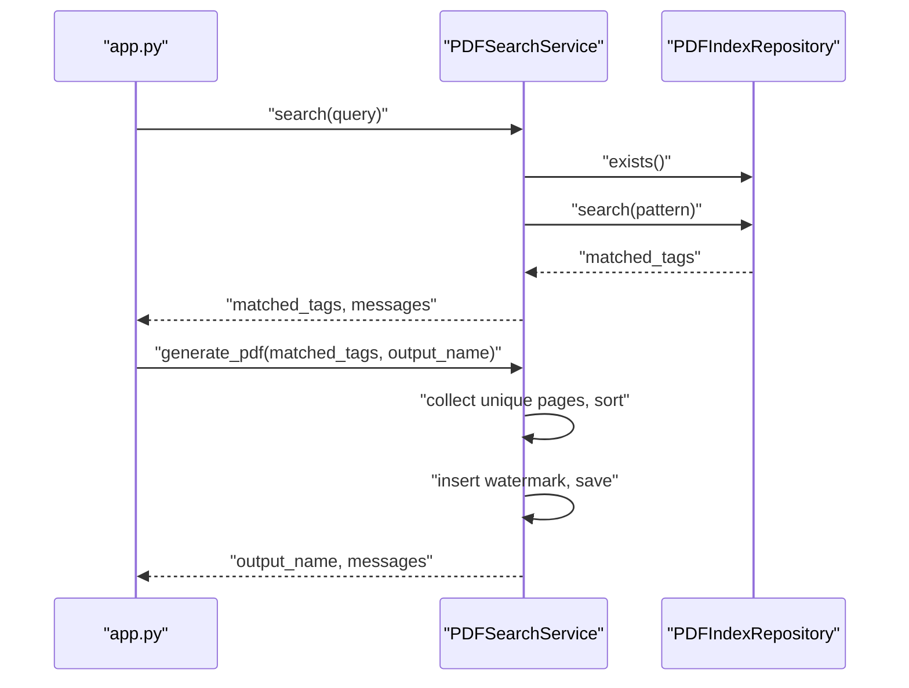
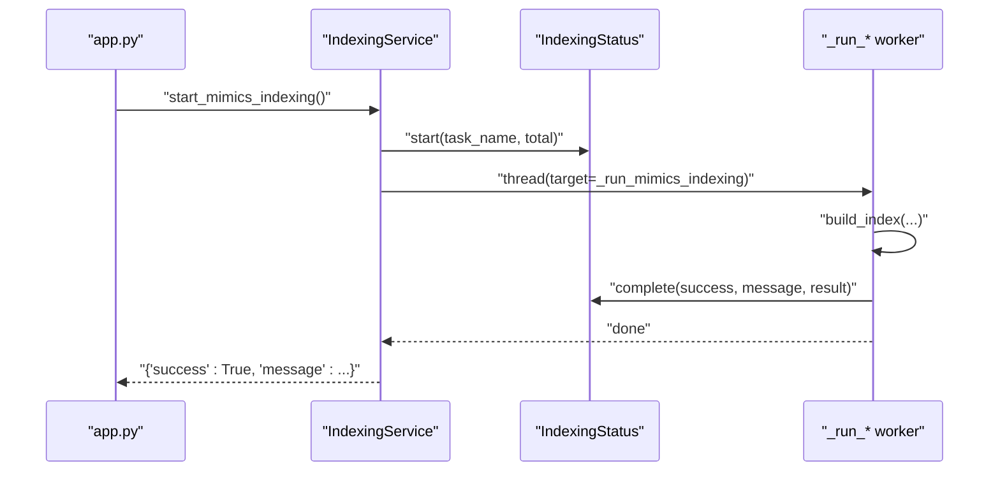
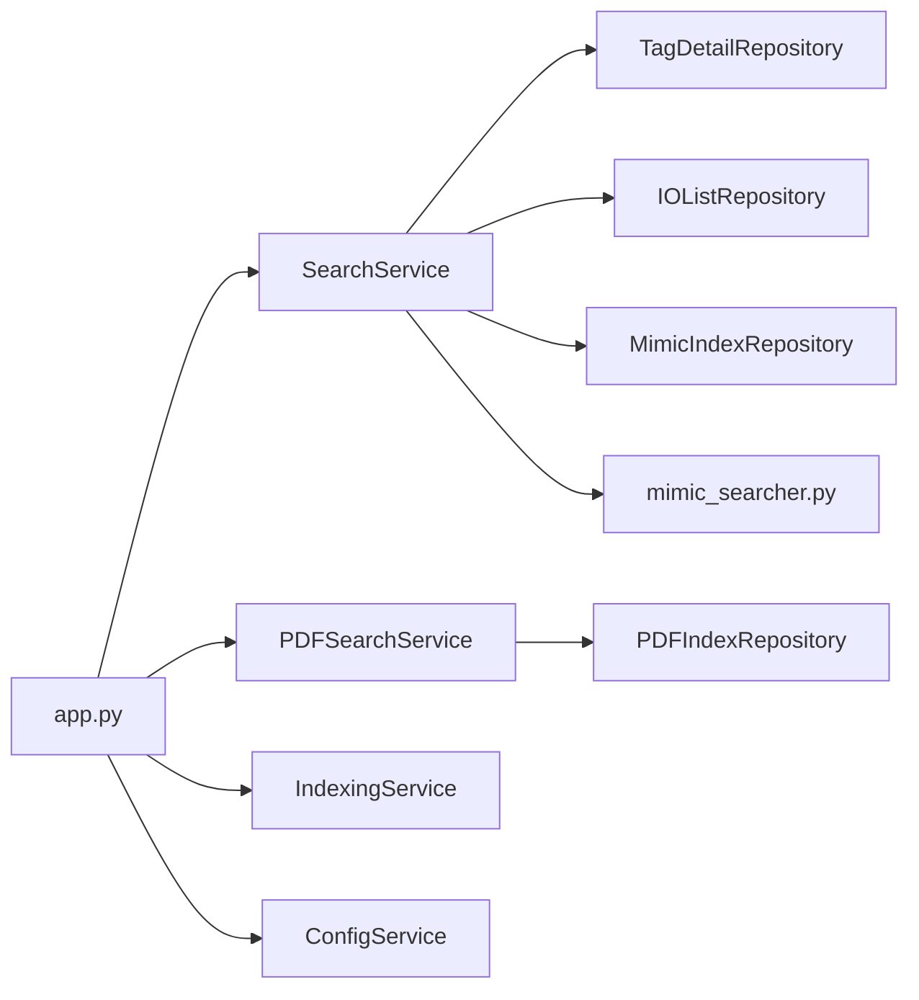

# Service Layer

<cite>
**Referenced Files in This Document**
- [app.py](file://app.py)
- [utils/service.py](file://utils/service.py)
- [utils/pdf_service.py](file://utils/pdf_service.py)
- [utils/indexing_service.py](file://utils/indexing_service.py)
- [utils/config_service.py](file://utils/config_service.py)
- [utils/repository.py](file://utils/repository.py)
- [utils/mimic_searcher.py](file://utils/mimic_searcher.py)
</cite>

## Table of Contents
1. [Introduction](#introduction)
2. [Project Structure](#project-structure)
3. [Core Components](#core-components)
4. [Architecture Overview](#architecture-overview)
5. [Detailed Component Analysis](#detailed-component-analysis)
6. [Dependency Analysis](#dependency-analysis)
7. [Performance Considerations](#performance-considerations)
8. [Troubleshooting Guide](#troubleshooting-guide)
9. [Conclusion](#conclusion)

## Introduction
This document describes the Service Layer components that encapsulate business logic in ECS7Search. The Service Layer acts as an intermediary between the Router (Flask) and the Repository Layer, orchestrating multi-source searches across mimics, tags, and IO lists, processing PDF documents, managing background indexing operations with thread safety, and exposing configuration and statistics. It defines method contracts, parameter handling, result processing, and error management patterns, and integrates with repository components to deliver cohesive search experiences.

## Project Structure
The Service Layer resides primarily under the utils/ directory and is wired into the Flask application via app.py. The key modules are:
- SearchService: coordinates multi-source searches and image generation for mimics.
- PDFSearchService: handles PDF search and PDF generation from matched results.
- IndexingService: runs background indexing tasks for mimics, PDFs, IO lists, and MDB extraction with thread-safe status tracking.
- ConfigService: collects configuration and statistics for monitoring and diagnostics.

**Diagram sources**
- [app.py:88-206](file://app.py#L88-L206)
- [utils/service.py:25-270](file://utils/service.py#L25-L270)
- [utils/pdf_service.py:18-229](file://utils/pdf_service.py#L18-L229)
- [utils/indexing_service.py:85-239](file://utils/indexing_service.py#L85-L239)
- [utils/config_service.py:13-128](file://utils/config_service.py#L13-L128)
- [utils/repository.py:13-178](file://utils/repository.py#L13-L178)

**Section sources**
- [app.py:26-85](file://app.py#L26-L85)
- [utils/service.py:25-270](file://utils/service.py#L25-L270)
- [utils/pdf_service.py:18-229](file://utils/pdf_service.py#L18-L229)
- [utils/indexing_service.py:85-239](file://utils/indexing_service.py#L85-L239)
- [utils/config_service.py:13-128](file://utils/config_service.py#L13-L128)
- [utils/repository.py:13-178](file://utils/repository.py#L13-L178)

## Core Components
This section outlines the responsibilities, method contracts, and integration points for each service.

- SearchService
  - Coordinates multi-source search across tags, IO lists, and mimic index.
  - Validates queries, deduplicates results, enriches tag details, generates annotated images, and builds result summaries.
  - Exposes execute(query, detailed) returning a results dictionary and a list of flash messages.

- PDFSearchService
  - Searches PDF index for tags and constructs a PDF with corner watermarks.
  - Provides search(query), build_pdf_results(matched_tags, query), and generate_pdf(matched_tags, output_name).

- IndexingService
  - Runs background indexing tasks for mimics, PDFs, IO lists, and MDB extraction.
  - Uses a thread-safe IndexingStatus singleton to track progress and completion.
  - Exposes start_*_indexing() methods and internal _run_* methods.

- ConfigService
  - Aggregates configuration paths and statistics for mimics, PDFs, tags, and IO lists.
  - Provides get_config(), get_mimics_stats(), get_pdf_stats(), get_tags_stats(), get_io_stats(), and get_index_metadata().

**Section sources**
- [utils/service.py:25-270](file://utils/service.py#L25-L270)
- [utils/pdf_service.py:18-229](file://utils/pdf_service.py#L18-L229)
- [utils/indexing_service.py:85-239](file://utils/indexing_service.py#L85-L239)
- [utils/config_service.py:13-128](file://utils/config_service.py#L13-L128)

## Architecture Overview
The Service Layer sits between the Router and Repository Layer. The Router initializes repositories and services, then delegates requests to services. Services orchestrate repository operations, transform data, handle errors, and return structured results.

**Diagram sources**
- [app.py:92-155](file://app.py#L92-L155)
- [utils/service.py:58-158](file://utils/service.py#L58-L158)
- [utils/repository.py:27-136](file://utils/repository.py#L27-L136)

## Detailed Component Analysis

### SearchService
Responsibilities:
- Validates user queries against a pattern and returns warnings/dangers.
- Searches tags and IO lists, deduplicates entries, and retrieves mimic positions.
- Groups positions by file, generates annotated images up to a maximum count, and enriches tag details with IO and tag metadata.
- Builds a results dictionary suitable for rendering and returns flash messages for UI feedback.

Key methods and contracts:
- validate_query(query: str) -> tuple[str | None, str] | None
- execute(query: str, detailed: bool) -> tuple[dict | None, list[tuple[str, str]]]

Processing logic highlights:
- Auto-wildcard expansion: adds leading/trailing asterisks when no wildcards are present.
- Deduplication: normalizes names by stripping leading underscores and prioritizing variants without underscores.
- Position grouping: aggregates positions by file and attaches tag names.
- Image generation: draws borders around positions on screenshots and limits output to a maximum number of results.

Integration with repositories:
- TagDetailRepository.search/get_flexible
- IOListRepository.search/get
- MimicIndexRepository.load

Example invocation paths:
- [app.py:116](file://app.py#L116)
- [utils/service.py:58-158](file://utils/service.py#L58-L158)

**Diagram sources**
- [utils/service.py:58-270](file://utils/service.py#L58-L270)
- [utils/repository.py:27-136](file://utils/repository.py#L27-L136)
- [utils/mimic_searcher.py:64-111](file://utils/mimic_searcher.py#L64-L111)

**Section sources**
- [utils/service.py:25-270](file://utils/service.py#L25-L270)
- [utils/repository.py:27-136](file://utils/repository.py#L27-L136)
- [utils/mimic_searcher.py:64-111](file://utils/mimic_searcher.py#L64-L111)

### PDFSearchService
Responsibilities:
- Searches PDF index for tags and returns matched positions grouped by file and page.
- Builds a tabular representation of results for UI display.
- Generates a consolidated PDF with corner watermark images and returns the filename and messages.

Key methods and contracts:
- search(query: str) -> tuple[dict[str, list[dict]], list[str]]
- build_pdf_results(matched_tags: dict[str, list[dict]], query: str) -> dict | None
- generate_pdf(matched_tags: dict[str, list[dict]], output_name: str) -> tuple[str | None, list[str]]

Processing logic highlights:
- Pattern expansion mirrors SearchService behavior.
- Deduplicates pages across tags and aggregates tag lists per page.
- Extracts pages from source PDFs, applies rotation handling, inserts watermark, and saves the combined PDF.

Integration with repositories:
- PDFIndexRepository.search/_load

Example invocation paths:
- [app.py:125-141](file://app.py#L125-L141)
- [utils/pdf_service.py:36-229](file://utils/pdf_service.py#L36-L229)

**Diagram sources**
- [app.py:125-141](file://app.py#L125-L141)
- [utils/pdf_service.py:36-229](file://utils/pdf_service.py#L36-L229)
- [utils/repository.py:138-178](file://utils/repository.py#L138-L178)

**Section sources**
- [utils/pdf_service.py:18-229](file://utils/pdf_service.py#L18-L229)
- [utils/repository.py:138-178](file://utils/repository.py#L138-L178)

### IndexingService
Responsibilities:
- Starts background indexing tasks for mimics, PDFs, IO lists, and MDB tag extraction.
- Tracks progress and completion via a thread-safe IndexingStatus singleton.
- Writes index outputs to configured JSON files and returns status messages.

Key methods and contracts:
- start_mimics_indexing() -> dict
- start_pdf_indexing() -> dict
- start_io_list_indexing() -> dict
- start_mdb_tag_extraction() -> dict

Internal workers:
- _run_mimics_indexing(): builds mimic index, writes to JSON, updates status.
- _run_pdf_indexing(): indexes PDF directory, writes to JSON, updates status.
- _run_io_list_indexing(): parses IO list, writes to JSON, updates status.
- _run_mdb_extraction(): extracts tags from MDB, writes to JSON, updates status.

Thread-safety:
- IndexingStatus uses a threading.Lock to protect shared state during concurrent updates.

Example invocation paths:
- [app.py:172-189](file://app.py#L172-L189)
- [utils/indexing_service.py:106-239](file://utils/indexing_service.py#L106-L239)

**Diagram sources**
- [app.py:172-189](file://app.py#L172-L189)
- [utils/indexing_service.py:106-141](file://utils/indexing_service.py#L106-L141)
- [utils/indexing_service.py:23-78](file://utils/indexing_service.py#L23-L78)

**Section sources**
- [utils/indexing_service.py:85-239](file://utils/indexing_service.py#L85-L239)
- [utils/indexing_service.py:23-78](file://utils/indexing_service.py#L23-L78)

### ConfigService
Responsibilities:
- Exposes configuration paths and statistics for monitoring and diagnostics.
- Safely loads JSON files and counts files in directories.

Key methods and contracts:
- get_config() -> dict[str, str]
- get_mimics_stats() -> dict
- get_pdf_stats() -> dict
- get_tags_stats() -> dict
- get_io_stats() -> dict
- get_index_metadata() -> dict

Error handling:
- Uses safe loaders that catch exceptions and return defaults.

Example invocation paths:
- [app.py:160-169](file://app.py#L160-L169)
- [utils/config_service.py:38-128](file://utils/config_service.py#L38-L128)

**Section sources**
- [utils/config_service.py:13-128](file://utils/config_service.py#L13-L128)
- [app.py:160-169](file://app.py#L160-L169)

## Dependency Analysis
The Service Layer depends on Repository Layer abstractions and utility modules for image drawing and PDF manipulation. The Router wires repositories and services and routes user actions to services.

**Diagram sources**
- [app.py:42-84](file://app.py#L42-L84)
- [utils/service.py:15-20](file://utils/service.py#L15-L20)
- [utils/pdf_service.py:15](file://utils/pdf_service.py#L15)
- [utils/mimic_searcher.py:15-26](file://utils/mimic_searcher.py#L15-L26)

**Section sources**
- [app.py:42-84](file://app.py#L42-L84)
- [utils/service.py:15-20](file://utils/service.py#L15-L20)
- [utils/pdf_service.py:15](file://utils/pdf_service.py#L15)
- [utils/mimic_searcher.py:15-26](file://utils/mimic_searcher.py#L15-L26)

## Performance Considerations
- Query expansion: Adding wildcards increases search scope; consider limiting wildcard usage for large datasets.
- Image generation: The maximum result limit prevents excessive image generation and memory usage.
- PDF generation: Sorting pages and deduplicating reduce overhead; watermark insertion is performed per page.
- Thread-safety: IndexingStatus uses locks to prevent race conditions during concurrent updates.
- Caching: Repositories cache loaded data to minimize repeated disk reads.

## Troubleshooting Guide
Common issues and resolutions:
- Index files missing:
  - Mimic index not found: Ensure the mimic index JSON exists before running searches.
  - PDF index not found: Run PDF indexing prior to PDF search.
- Validation failures:
  - Empty or short queries trigger warnings; ensure queries meet minimum length and allowed character patterns.
- Image generation errors:
  - Missing PNG files or drawing errors produce skip messages; verify mimic assets and permissions.
- PDF generation errors:
  - Missing source PDFs, invalid page numbers, or watermark loading failures produce messages; check file paths and page ranges.
- Indexing conflicts:
  - Concurrent indexing attempts are blocked; wait for the current task to complete.

**Section sources**
- [utils/service.py:46-54](file://utils/service.py#L46-L54)
- [utils/service.py:177-197](file://utils/service.py#L177-L197)
- [utils/pdf_service.py:43-52](file://utils/pdf_service.py#L43-L52)
- [utils/pdf_service.py:158-171](file://utils/pdf_service.py#L158-L171)
- [utils/indexing_service.py:108-109](file://utils/indexing_service.py#L108-L109)

## Conclusion
The Service Layer in ECS7Search provides robust, modular business logic that coordinates multi-source searches, manages PDF workflows, performs background indexing safely, and exposes configuration and statistics. By clearly separating concerns between Router, Service, and Repository layers, the system remains maintainable, testable, and extensible.