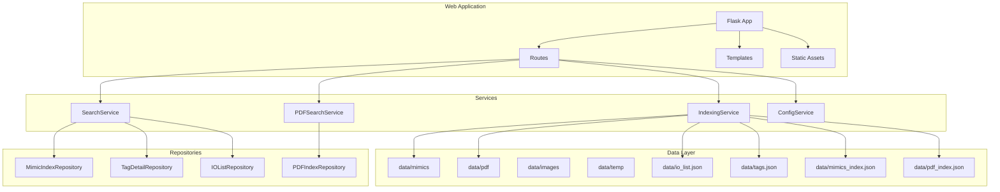
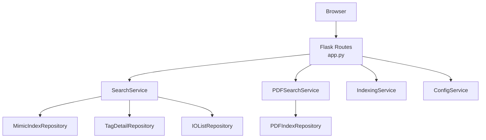
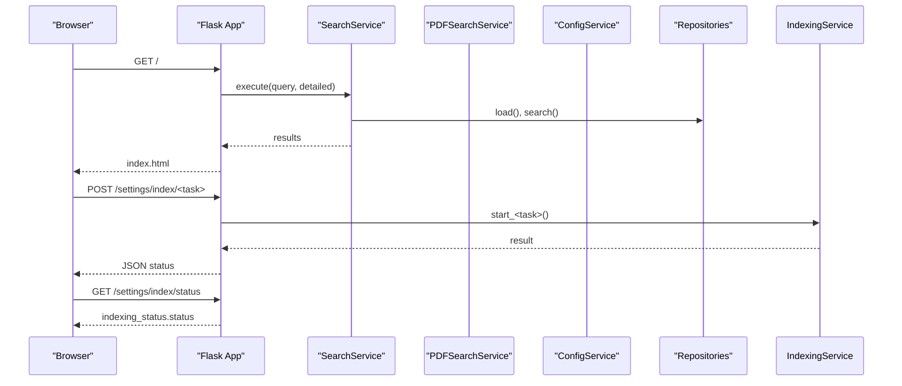
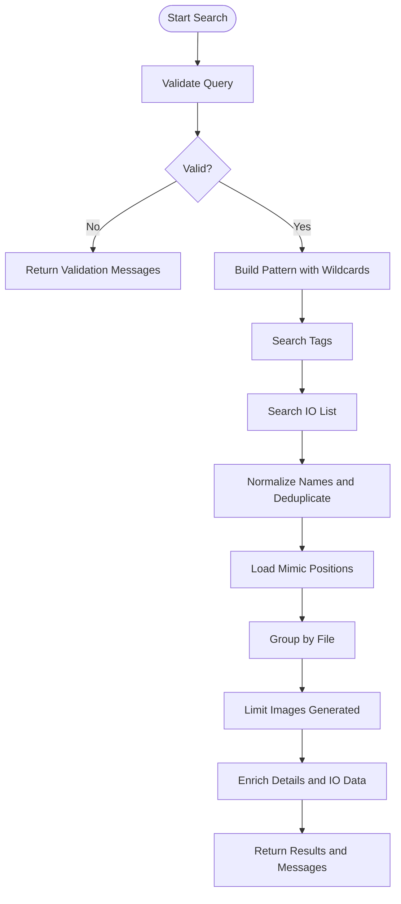
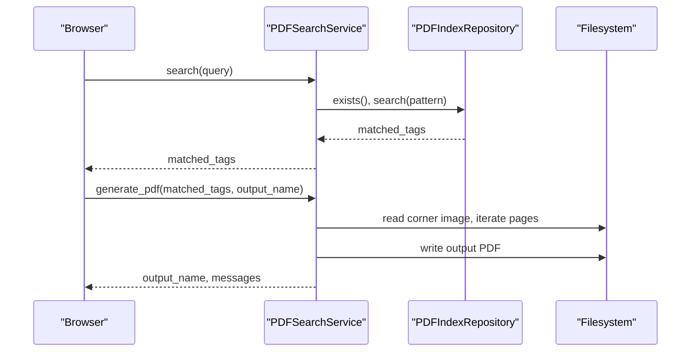
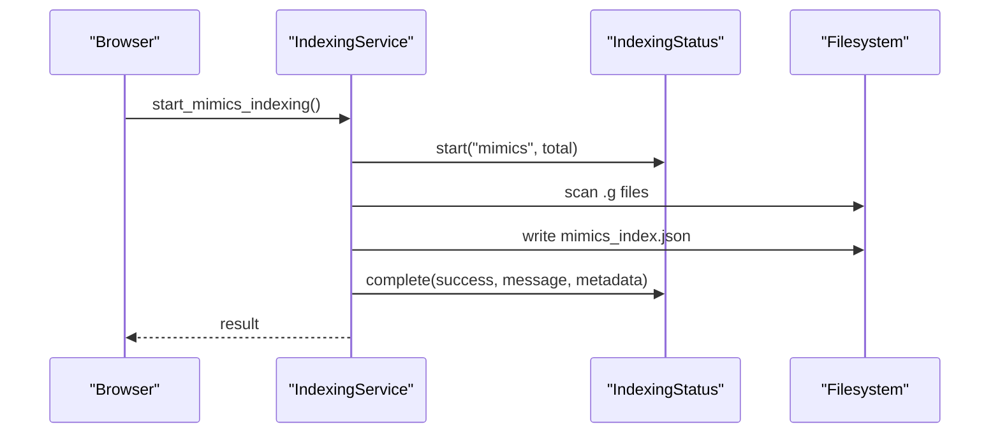
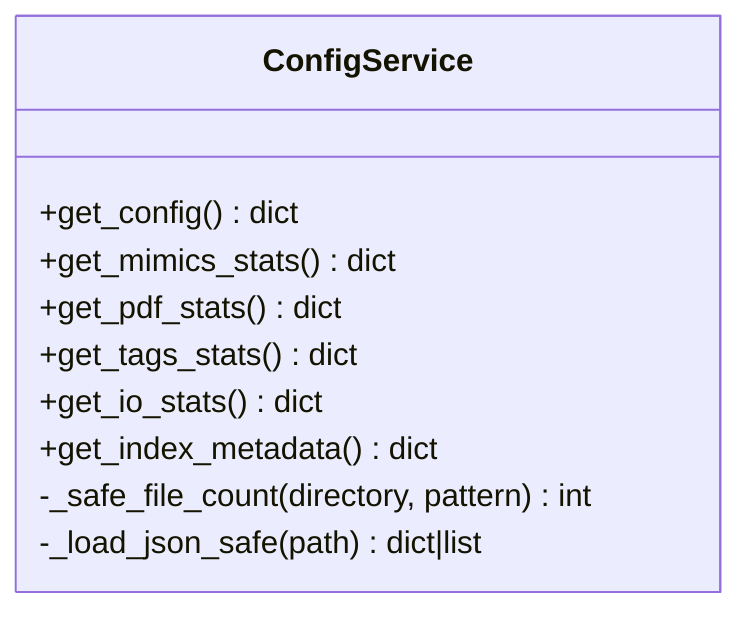
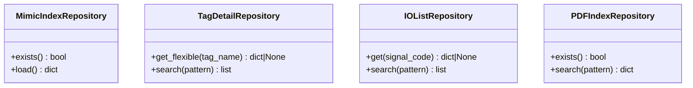
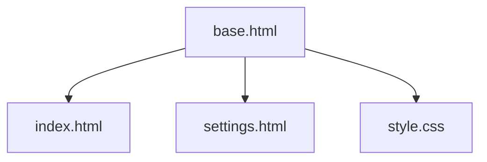
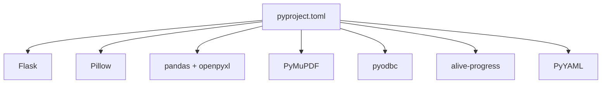

# Configuration and Deployment

<cite>
**Referenced Files in This Document**
- [pyproject.toml](file://pyproject.toml)
- [app.py](file://app.py)
- [main.py](file://main.py)
- [utils/config_service.py](file://utils/config_service.py)
- [utils/repository.py](file://utils/repository.py)
- [utils/service.py](file://utils/service.py)
- [utils/indexing_service.py](file://utils/indexing_service.py)
- [utils/pdf_service.py](file://utils/pdf_service.py)
- [utils/mimic_searcher.py](file://utils/mimic_searcher.py)
- [utils/iolist_indexer.py](file://utils/iolist_indexer.py)
- [utils/pdf_indexer.py](file://utils/pdf_indexer.py)
- [utils/mimic_indexer.py](file://utils/mimic_indexer.py)
- [utils/ecs2json.py](file://utils/ecs2json.py)
- [templates/base.html](file://templates/base.html)
- [templates/index.html](file://templates/index.html)
- [templates/settings.html](file://templates/settings.html)
- [static/css/style.css](file://static/css/style.css)
</cite>

## Table of Contents
1. [Introduction](#introduction)
2. [Project Structure](#project-structure)
3. [Core Components](#core-components)
4. [Architecture Overview](#architecture-overview)
5. [Detailed Component Analysis](#detailed-component-analysis)
6. [Dependency Analysis](#dependency-analysis)
7. [Performance Considerations](#performance-considerations)
8. [Troubleshooting Guide](#troubleshooting-guide)
9. [Conclusion](#conclusion)
10. [Appendices](#appendices)

## Introduction
This document provides comprehensive guidance for configuring and deploying ECS7Search, a SCADA ECS7 mimic files search tool with a web UI. It focuses on project setup, environment configuration, file system path management, deployment options, performance optimization, monitoring, security, backup strategies, and maintenance procedures. It also includes practical examples for customization and troubleshooting.

## Project Structure
ECS7Search follows a layered architecture with a Flask web application at the front-end and multiple utility modules for indexing, searching, and managing data. The project organizes resources under a data directory for mimic images, PDF documents, indices, and temporary artifacts. Templates and static assets provide the UI.

**Diagram sources**
- [app.py:88-206](file://app.py#L88-L206)
- [utils/service.py:25-270](file://utils/service.py#L25-L270)
- [utils/pdf_service.py:18-229](file://utils/pdf_service.py#L18-L229)
- [utils/indexing_service.py:85-239](file://utils/indexing_service.py#L85-L239)
- [utils/config_service.py:13-128](file://utils/config_service.py#L13-L128)
- [utils/repository.py:13-178](file://utils/repository.py#L13-L178)

**Section sources**
- [app.py:28-84](file://app.py#L28-L84)
- [templates/base.html:1-658](file://templates/base.html#L1-L658)
- [static/css/style.css:1-154](file://static/css/style.css#L1-L154)

## Core Components
- Flask application entry and routing: Initializes repositories, services, and routes for search, settings, and indexing.
- Services:
  - SearchService: Orchestrates tag search across mimic indices, tags, and IO lists; generates annotated images.
  - PDFSearchService: Searches PDF indices and generates a consolidated PDF with corner watermarks.
  - IndexingService: Manages asynchronous indexing tasks for mimics, PDFs, IO lists, and MDB tag extraction.
  - ConfigService: Provides configuration paths and statistics for UI.
- Repositories: Encapsulate data access for mimic indices, tags, IO lists, and PDF indices.
- Utility scripts: Standalone CLI tools for mimic indexing, PDF indexing, IO list parsing, and MDB tag extraction.

**Section sources**
- [app.py:49-84](file://app.py#L49-L84)
- [utils/service.py:25-270](file://utils/service.py#L25-L270)
- [utils/pdf_service.py:18-229](file://utils/pdf_service.py#L18-L229)
- [utils/indexing_service.py:85-239](file://utils/indexing_service.py#L85-L239)
- [utils/config_service.py:13-128](file://utils/config_service.py#L13-L128)
- [utils/repository.py:13-178](file://utils/repository.py#L13-L178)

## Architecture Overview
The application uses a clear separation of concerns:
- Router layer: Flask routes handle requests and delegate to services.
- Service layer: Business logic for search, PDF generation, and indexing orchestration.
- Repository layer: Data access for indices and structured datasets.
- Template layer: Jinja2 templates render HTML views.
- Static assets: CSS and JavaScript for UI behavior.

**Diagram sources**
- [app.py:88-206](file://app.py#L88-L206)
- [utils/service.py:25-270](file://utils/service.py#L25-L270)
- [utils/pdf_service.py:18-229](file://utils/pdf_service.py#L18-L229)
- [utils/indexing_service.py:85-239](file://utils/indexing_service.py#L85-L239)
- [utils/config_service.py:13-128](file://utils/config_service.py#L13-L128)
- [utils/repository.py:13-178](file://utils/repository.py#L13-L178)

## Detailed Component Analysis

### Flask Application and Routing
- Initializes project paths and directories, creates repositories and services, and defines routes for search, settings, and indexing.
- Uses a secret key for session management.
- Exposes endpoints for serving temporary images and retrieving indexing status.

**Diagram sources**
- [app.py:92-194](file://app.py#L92-L194)
- [utils/service.py:58-158](file://utils/service.py#L58-L158)
- [utils/pdf_service.py:36-52](file://utils/pdf_service.py#L36-L52)
- [utils/indexing_service.py:106-141](file://utils/indexing_service.py#L106-L141)

**Section sources**
- [app.py:88-206](file://app.py#L88-L206)

### Search Service Logic
- Validates queries, searches tags and IO lists, deduplicates entries, retrieves mimic positions, generates annotated images up to a configured limit, enriches results with tag details and IO list data, and returns structured results for rendering.

**Diagram sources**
- [utils/service.py:46-158](file://utils/service.py#L46-L158)

**Section sources**
- [utils/service.py:25-270](file://utils/service.py#L25-L270)

### PDF Search and Generation
- Searches PDF indices by pattern, builds a tabular result, and generates a PDF with corner watermarks and extracted pages.

**Diagram sources**
- [utils/pdf_service.py:36-229](file://utils/pdf_service.py#L36-L229)
- [utils/repository.py:138-178](file://utils/repository.py#L138-L178)

**Section sources**
- [utils/pdf_service.py:18-229](file://utils/pdf_service.py#L18-L229)

### Indexing Orchestration
- Supports asynchronous indexing tasks for mimics, PDFs, IO lists, and MDB tag extraction. Maintains a shared status object for progress reporting.

**Diagram sources**
- [utils/indexing_service.py:106-141](file://utils/indexing_service.py#L106-L141)
- [utils/indexing_service.py:23-78](file://utils/indexing_service.py#L23-L78)

**Section sources**
- [utils/indexing_service.py:85-239](file://utils/indexing_service.py#L85-L239)

### Configuration and Statistics
- Provides configuration paths and statistics for mimic, PDF, tags, and IO list indices. Safely loads JSON files and counts files with patterns.

**Diagram sources**
- [utils/config_service.py:13-128](file://utils/config_service.py#L13-L128)

**Section sources**
- [utils/config_service.py:13-128](file://utils/config_service.py#L13-L128)

### Data Repositories
- Repositories encapsulate loading and searching logic for mimic indices, tags, IO lists, and PDF indices, including caching and flexible matching.

**Diagram sources**
- [utils/repository.py:13-178](file://utils/repository.py#L13-L178)

**Section sources**
- [utils/repository.py:13-178](file://utils/repository.py#L13-L178)

### UI Templates and Styling
- Base template provides navigation, modals, and responsive layout.
- Index and settings templates render search forms, results, and indexing controls.

**Diagram sources**
- [templates/base.html:1-658](file://templates/base.html#L1-L658)
- [templates/index.html:1-260](file://templates/index.html#L1-L260)
- [templates/settings.html:1-554](file://templates/settings.html#L1-L554)
- [static/css/style.css:1-154](file://static/css/style.css#L1-L154)

**Section sources**
- [templates/base.html:1-658](file://templates/base.html#L1-L658)
- [templates/index.html:1-260](file://templates/index.html#L1-L260)
- [templates/settings.html:1-554](file://templates/settings.html#L1-L554)
- [static/css/style.css:1-154](file://static/css/style.css#L1-L154)

## Dependency Analysis
- Python packaging and runtime dependencies are declared in the project configuration.
- The application relies on Flask for routing and templating, Pillow for image manipulation, pandas and openpyxl for Excel processing, PyMuPDF for PDF operations, pyodbc for MDB access, alive-progress for progress bars, and PyYAML for serialization.

**Diagram sources**
- [pyproject.toml:6-15](file://pyproject.toml#L6-L15)

**Section sources**
- [pyproject.toml:1-19](file://pyproject.toml#L1-L19)

## Performance Considerations
- Image generation limits: The search service limits the number of annotated images produced to manage memory and response time.
- Asynchronous indexing: Indexing tasks run in background threads to keep the UI responsive.
- Efficient pattern matching: Uses fnmatch for wildcard searches across tags and IO lists.
- PDF processing: Iterates pages and extracts tags efficiently; watermark insertion respects page rotations.
- File counting and JSON loading: Safe fallbacks prevent crashes on missing or malformed files.

[No sources needed since this section provides general guidance]

## Troubleshooting Guide
Common issues and resolutions:
- Missing indices or data files:
  - Verify paths in the configuration service and ensure data directories exist.
  - Run indexing tasks for mimics, PDFs, IO lists, and MDB tags.
- Incorrect or empty search results:
  - Confirm query patterns and wildcards; ensure indices are up to date.
  - Check tag normalization and IO-only tags without mimic positions.
- PDF generation failures:
  - Ensure PDF index exists and PDF files referenced by the index are present.
  - Validate corner image availability for watermarking.
- Indexing stuck or not starting:
  - Check the global indexing status endpoint for progress and completion.
  - Ensure no concurrent indexing tasks are running.

**Section sources**
- [utils/config_service.py:38-128](file://utils/config_service.py#L38-L128)
- [utils/service.py:58-158](file://utils/service.py#L58-L158)
- [utils/pdf_service.py:36-229](file://utils/pdf_service.py#L36-L229)
- [utils/indexing_service.py:106-141](file://utils/indexing_service.py#L106-L141)

## Conclusion
ECS7Search offers a modular, layered architecture suitable for enterprise deployment. By leveraging asynchronous indexing, robust data repositories, and a responsive web UI, it supports efficient search across mimic files, PDF documents, tags, and IO lists. Proper configuration of paths, indices, and environment ensures reliable operation and scalability.

[No sources needed since this section summarizes without analyzing specific files]

## Appendices

### Environment Configuration and File System Paths
- Project directory and data paths are initialized at application startup and passed to services and repositories.
- Temporary directory is created automatically for generated images and PDFs.
- Configuration service exposes paths for UI display and diagnostics.

**Section sources**
- [app.py:28-84](file://app.py#L28-L84)
- [utils/config_service.py:38-46](file://utils/config_service.py#L38-L46)

### Deployment Options
- Local development:
  - Use the Flask development server for quick iteration.
  - Ensure dependencies are installed via the project configuration.
- Production deployment:
  - Use a WSGI server (e.g., Gunicorn or uWSGI) behind a reverse proxy (e.g., Nginx).
  - Configure environment variables for sensitive settings and runtime paths.
  - Secure the application with HTTPS and restrict access to administrative endpoints.
  - Monitor resource usage and enable logging for indexing and search operations.

[No sources needed since this section provides general guidance]

### Security Considerations
- Secret key management: Change the default secret key in production deployments.
- File serving: Serve temporary images securely and sanitize filenames.
- Administrative endpoints: Restrict access to indexing endpoints and ensure authentication/authorization where applicable.
- Data protection: Store indices and temporary files on secure volumes with appropriate permissions.

**Section sources**
- [app.py:89](file://app.py#L89)
- [app.py:197-201](file://app.py#L197-L201)

### Backup Strategies
- Back up indices and structured datasets regularly:
  - mimics_index.json, pdf_index.json, tags.json, io_list.json.
- Maintain snapshots of data directories containing mimic images and PDFs.
- Automate backups with retention policies and offsite storage.

[No sources needed since this section provides general guidance]

### Maintenance Procedures
- Periodically refresh indices after data updates.
- Monitor indexing progress via the status endpoint.
- Clean temporary files to control disk usage.
- Validate tag normalization and IO list parsing after schema changes.

**Section sources**
- [utils/indexing_service.py:190-208](file://utils/indexing_service.py#L190-L208)
- [utils/iolist_indexer.py:39-97](file://utils/iolist_indexer.py#L39-L97)

### Scaling Considerations
- Horizontal scaling: Deploy multiple instances behind a load balancer; ensure shared storage for indices and temporary files.
- Caching: Introduce caching for frequently accessed indices and tag metadata.
- Background workers: Offload heavy indexing and PDF generation to dedicated workers.
- Database migration: Consider migrating indices to a database-backed cache for improved performance and concurrency.

[No sources needed since this section provides general guidance]

### Customization Examples
- Adjust maximum results for image generation in the search service initialization.
- Modify temporary directory path for generated artifacts.
- Extend indexing tasks to support additional data sources.
- Customize UI templates and styles for branding and layout preferences.

**Section sources**
- [app.py:49-63](file://app.py#L49-L63)
- [templates/base.html:1-658](file://templates/base.html#L1-L658)
- [static/css/style.css:1-154](file://static/css/style.css#L1-L154)