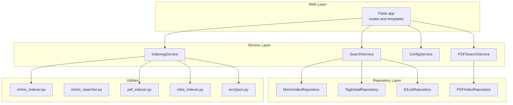
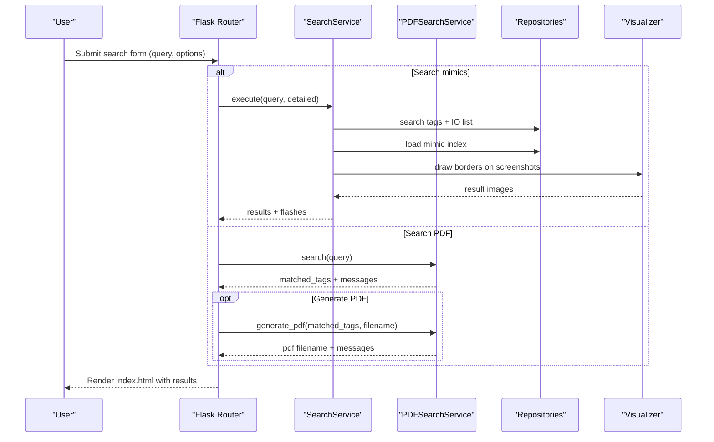
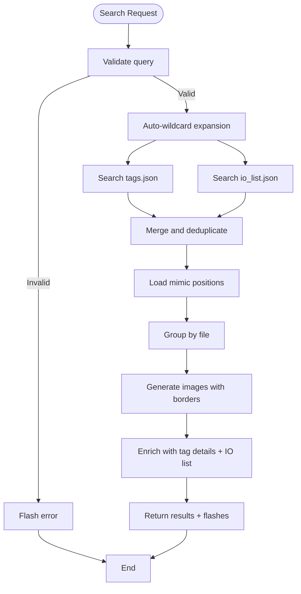
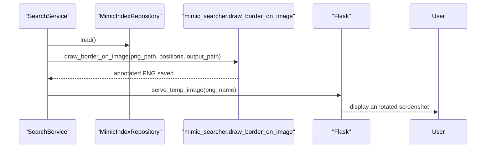
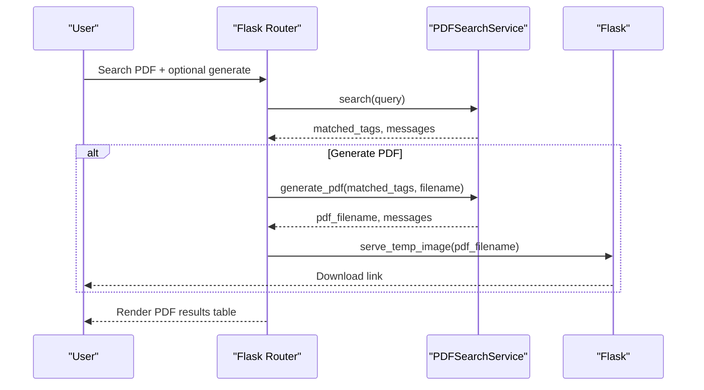
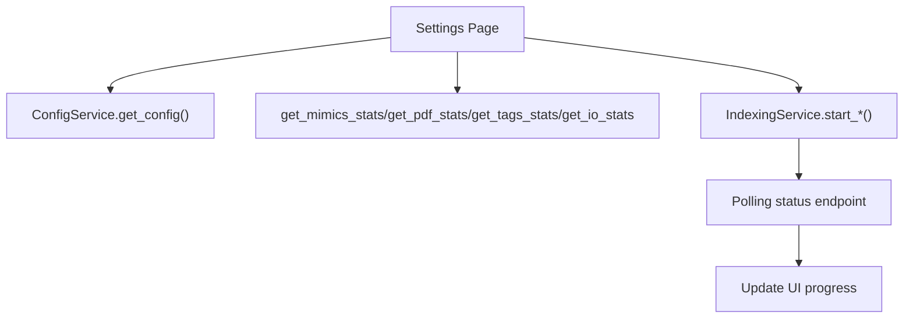
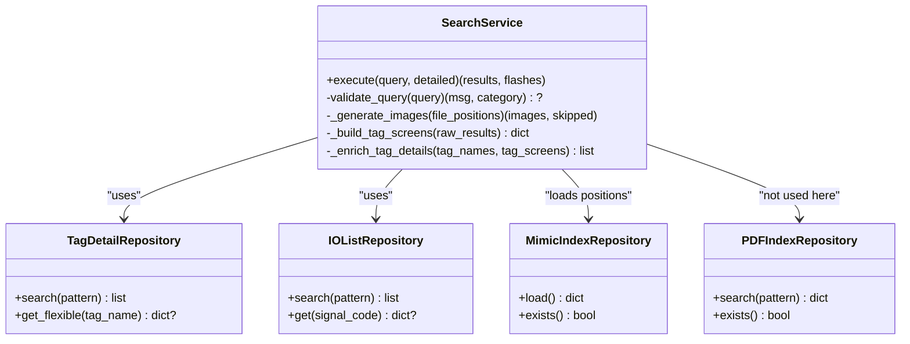
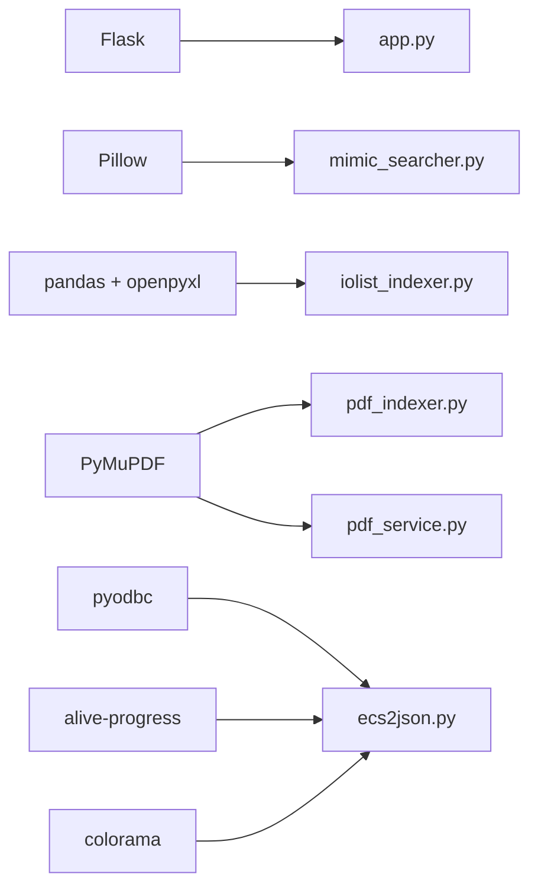

# Core Features

<cite>
**Referenced Files in This Document**
- [app.py](file://app.py)
- [main.py](file://main.py)
- [utils/config_service.py](file://utils/config_service.py)
- [utils/repository.py](file://utils/repository.py)
- [utils/service.py](file://utils/service.py)
- [utils/pdf_service.py](file://utils/pdf_service.py)
- [utils/indexing_service.py](file://utils/indexing_service.py)
- [utils/mimic_searcher.py](file://utils/mimic_searcher.py)
- [utils/mimic_indexer.py](file://utils/mimic_indexer.py)
- [utils/pdf_indexer.py](file://utils/pdf_indexer.py)
- [utils/iolist_indexer.py](file://utils/iolist_indexer.py)
- [utils/ecs2json.py](file://utils/ecs2json.py)
- [templates/index.html](file://templates/index.html)
- [templates/settings.html](file://templates/settings.html)
- [templates/base.html](file://templates/base.html)
- [pyproject.toml](file://pyproject.toml)
- [QWEN.md](file://QWEN.md)
</cite>

## Table of Contents
1. [Introduction](#introduction)
2. [Project Structure](#project-structure)
3. [Core Components](#core-components)
4. [Architecture Overview](#architecture-overview)
5. [Detailed Component Analysis](#detailed-component-analysis)
6. [Dependency Analysis](#dependency-analysis)
7. [Performance Considerations](#performance-considerations)
8. [Troubleshooting Guide](#troubleshooting-guide)
9. [Conclusion](#conclusion)
10. [Appendices](#appendices)

## Introduction
This document explains the core features of ECS7Search, focusing on multi-source tag search across SCADA ECS7 mimic screens, IO lists, and PDF documents. It covers:
- Tag search engine with exact matching and wildcard patterns
- Visual tag visualization showing screen mimic positions
- PDF search and generation with watermark support
- System configuration management and index lifecycle
- Multi-source search coordination, result processing, and UI integration
- Practical examples, configuration options, and performance guidance tailored for SCADA engineers

## Project Structure
The application follows a layered architecture:
- Router layer (Flask) handles HTTP requests and renders templates
- Service layer implements business logic for search, enrichment, and PDF generation
- Repository layer abstracts data access for indices and JSON datasets
- Utilities provide indexing, search, and generation scripts

**Diagram sources**
- [app.py:88-206](file://app.py#L88-L206)
- [utils/service.py:25-270](file://utils/service.py#L25-L270)
- [utils/pdf_service.py:18-229](file://utils/pdf_service.py#L18-L229)
- [utils/config_service.py:13-128](file://utils/config_service.py#L13-L128)
- [utils/indexing_service.py:85-239](file://utils/indexing_service.py#L85-L239)
- [utils/repository.py:13-178](file://utils/repository.py#L13-L178)
- [utils/mimic_indexer.py:363-436](file://utils/mimic_indexer.py#L363-L436)
- [utils/pdf_indexer.py:41-132](file://utils/pdf_indexer.py#L41-L132)
- [utils/iolist_indexer.py:39-98](file://utils/iolist_indexer.py#L39-L98)
- [utils/ecs2json.py:440-455](file://utils/ecs2json.py#L440-L455)

**Section sources**
- [app.py:88-206](file://app.py#L88-L206)
- [pyproject.toml:1-19](file://pyproject.toml#L1-L19)

## Core Components
- SearchService: orchestrates multi-source tag search, deduplicates results, enriches with tag details and IO list data, and generates visual overlays on mimic screenshots.
- PDFSearchService: searches PDF indices by wildcard patterns, builds result tables, and generates watermarked PDFs.
- ConfigService: exposes configuration paths and statistics for indices and datasets.
- IndexingService: runs background tasks to index mimic files, PDFs, IO lists, and extract tags from MDB databases.
- Repositories: provide cached access to mimic index, tag details, IO list, and PDF index.

**Section sources**
- [utils/service.py:25-270](file://utils/service.py#L25-L270)
- [utils/pdf_service.py:18-229](file://utils/pdf_service.py#L18-L229)
- [utils/config_service.py:13-128](file://utils/config_service.py#L13-L128)
- [utils/indexing_service.py:85-239](file://utils/indexing_service.py#L85-L239)
- [utils/repository.py:13-178](file://utils/repository.py#L13-L178)

## Architecture Overview
The system integrates mimic, IO list, and PDF data sources into a unified search experience:
- Mimic index maps tags to positions on screen images
- Tag details and IO list enrich results with descriptions and PLC/IO metadata
- PDF index enables cross-document tag discovery and batch PDF generation with watermarks

**Diagram sources**
- [app.py:92-155](file://app.py#L92-L155)
- [utils/service.py:58-158](file://utils/service.py#L58-L158)
- [utils/pdf_service.py:36-96](file://utils/pdf_service.py#L36-L96)
- [utils/mimic_searcher.py:80-111](file://utils/mimic_searcher.py#L80-L111)

## Detailed Component Analysis

### Tag Search Engine (Multi-Source)
- Input validation enforces minimum length and allowed characters
- Auto-wildcard expansion: queries without wildcards become “*query*”
- Dual-source search:
  - tags.json via TagDetailRepository (supports flexible underscore variants)
  - io_list.json via IOListRepository
- Deduplication normalizes names (removes leading underscore) and prioritizes non-prefixed variants
- Enrichment:
  - Tag details from tags.json
  - IO list fields and SignalPurpose
  - Screen list derived from mimic index positions
- Visualization:
  - For each file with positions, draw yellow rectangles around tag locations on PNG screenshots
  - Limit to a configurable maximum number of images to avoid heavy rendering

**Diagram sources**
- [utils/service.py:46-158](file://utils/service.py#L46-L158)
- [utils/repository.py:78-94](file://utils/repository.py#L78-L94)
- [utils/repository.py:129-136](file://utils/repository.py#L129-L136)
- [utils/mimic_searcher.py:80-111](file://utils/mimic_searcher.py#L80-L111)

**Section sources**
- [utils/service.py:46-158](file://utils/service.py#L46-L158)
- [utils/repository.py:27-94](file://utils/repository.py#L27-L94)
- [utils/repository.py:96-136](file://utils/repository.py#L96-L136)
- [utils/mimic_searcher.py:80-111](file://utils/mimic_searcher.py#L80-L111)

### Visual Tag Visualization (Screen Mimic Positions)
- Uses mimic index to map tag coordinates to screenshot pixels
- Converts ECS7 logical coordinates to PNG pixel space
- Draws yellow rectangles around tag locations, with special offsets for specific element types
- Saves annotated PNGs to a temporary directory and serves them via the UI

**Diagram sources**
- [utils/service.py:162-198](file://utils/service.py#L162-L198)
- [utils/mimic_searcher.py:80-111](file://utils/mimic_searcher.py#L80-L111)
- [app.py:197-201](file://app.py#L197-L201)

**Section sources**
- [utils/mimic_searcher.py:71-111](file://utils/mimic_searcher.py#L71-L111)
- [app.py:197-201](file://app.py#L197-L201)

### PDF Search and Generation (Watermark Support)
- Pattern-based search in PDF index (wildcard expansion)
- Builds a table of unique pages with associated tags
- Generates a consolidated PDF:
  - Extracts pages from original PDFs
  - Inserts a corner watermark image
  - Preserves page rotation and sizes
- Provides download link for the generated PDF

**Diagram sources**
- [app.py:114-146](file://app.py#L114-L146)
- [utils/pdf_service.py:36-96](file://utils/pdf_service.py#L36-L96)
- [utils/pdf_service.py:97-229](file://utils/pdf_service.py#L97-L229)

**Section sources**
- [utils/pdf_service.py:36-96](file://utils/pdf_service.py#L36-L96)
- [utils/pdf_service.py:97-229](file://utils/pdf_service.py#L97-L229)

### System Configuration Management
- Exposes configuration paths for project, mimic, PDF, and temp directories
- Provides statistics for mimic index, PDF index, tags, and IO list
- Offers live indexing controls with progress polling and completion notifications

**Diagram sources**
- [app.py:158-195](file://app.py#L158-L195)
- [utils/config_service.py:38-107](file://utils/config_service.py#L38-L107)
- [utils/indexing_service.py:106-239](file://utils/indexing_service.py#L106-L239)
- [templates/settings.html:126-342](file://templates/settings.html#L126-L342)

**Section sources**
- [utils/config_service.py:38-107](file://utils/config_service.py#L38-L107)
- [app.py:158-195](file://app.py#L158-L195)
- [templates/settings.html:126-342](file://templates/settings.html#L126-L342)

### Multi-Source Search Coordination and Result Processing
- Validation and normalization pipeline ensures robust search behavior
- Deduplication and normalization handle underscore variants consistently
- Enrichment merges tag metadata, IO list fields, and screen lists
- Visualization and PDF generation are optional post-processing steps

**Diagram sources**
- [utils/service.py:25-270](file://utils/service.py#L25-L270)
- [utils/repository.py:27-178](file://utils/repository.py#L27-L178)

**Section sources**
- [utils/service.py:58-270](file://utils/service.py#L58-L270)
- [utils/repository.py:27-178](file://utils/repository.py#L27-L178)

### User Interface Components
- Search page: query input with wildcard hint, checkboxes for search scope and detailed mode, flash messages, and result cards
- Settings page: stats cards, configuration paths, and interactive indexing controls with progress UI
- Base template: navigation, responsive layout, and modal image viewer

**Section sources**
- [templates/index.html:8-260](file://templates/index.html#L8-L260)
- [templates/settings.html:1-554](file://templates/settings.html#L1-L554)
- [templates/base.html:1-658](file://templates/base.html#L1-L658)

## Dependency Analysis
External libraries and their roles:
- Flask: web framework for routing and templating
- Pillow: image manipulation for drawing borders and watermarks
- Pandas + openpyxl: Excel parsing for IO list
- PyMuPDF: PDF parsing and watermark insertion
- pyodbc: Access database connectivity for tag extraction
- alive-progress, colorama: progress bars and colored logs

**Diagram sources**
- [pyproject.toml:6-15](file://pyproject.toml#L6-L15)
- [app.py:13-24](file://app.py#L13-L24)
- [utils/mimic_searcher.py:21-27](file://utils/mimic_searcher.py#L21-L27)
- [utils/pdf_service.py:13-15](file://utils/pdf_service.py#L13-L15)
- [utils/pdf_indexer.py:22-22](file://utils/pdf_indexer.py#L22-L22)
- [utils/iolist_indexer.py:17-17](file://utils/iolist_indexer.py#L17-L17)
- [utils/ecs2json.py:8-15](file://utils/ecs2json.py#L8-L15)

**Section sources**
- [pyproject.toml:6-15](file://pyproject.toml#L6-L15)

## Performance Considerations
- Image generation limit: SearchService limits the number of annotated screenshots to avoid excessive rendering and memory usage.
- Wildcard expansion: Auto-wildcard reduces specificity but improves recall; use explicit wildcards for precision.
- Caching: Repositories cache loaded JSON to reduce repeated disk reads.
- PDF generation: Watermark insertion and page extraction are CPU-bound; keep the number of pages reasonable.
- Indexing: Background threads prevent blocking the UI; polling updates the progress in real time.

[No sources needed since this section provides general guidance]

## Troubleshooting Guide
Common issues and resolutions:
- No results for mimic search:
  - Ensure mimic index exists and is recent
  - Verify PNG screenshots exist for matched files
  - Confirm query pattern matches tag naming conventions
- PDF search yields empty results:
  - Run PDF indexer to build the PDF index
  - Check that the PDF directory contains valid PDFs
- Watermark not visible:
  - Confirm the watermark image exists and is readable
  - Review messages for permission or read errors
- Indexing stuck:
  - Check the settings page for progress and completion messages
  - Ensure required files (MDB, IO list Excel) are present

**Section sources**
- [utils/config_service.py:47-101](file://utils/config_service.py#L47-L101)
- [utils/pdf_service.py:117-124](file://utils/pdf_service.py#L117-L124)
- [utils/indexing_service.py:106-141](file://utils/indexing_service.py#L106-L141)

## Conclusion
ECS7Search delivers a practical, integrated solution for SCADA engineers to locate tags across mimic screens, IO lists, and PDF documents. Its multi-source search engine, visual overlays, and PDF generation with watermarks streamline maintenance and documentation workflows. The modular architecture and web-based configuration simplify deployment and ongoing management.

[No sources needed since this section summarizes without analyzing specific files]

## Appendices

### Practical Usage Examples
- Search for a tag across mimic screens and IO list:
  - Enter a tag or wildcard pattern in the search box
  - Optionally enable “Information by tags” for detailed metadata
  - Review annotated screenshots and tag details
- Search only PDFs:
  - Enable “Search by PDF”
  - Optionally generate a consolidated PDF with watermarks
- Configure and manage indices:
  - Visit Settings to review stats and paths
  - Trigger indexing tasks for mimics, PDFs, IO list, or MDB tags
  - Monitor progress via polling

**Section sources**
- [templates/index.html:8-38](file://templates/index.html#L8-L38)
- [templates/settings.html:142-224](file://templates/settings.html#L142-L224)
- [app.py:114-146](file://app.py#L114-L146)

### Configuration Options
- Paths:
  - Project directory, mimic directory, PDF directory, and temp directory
- Indexing:
  - Mimic index: build from .g files
  - PDF index: scan and index PDFs
  - IO list: parse Excel and produce signals index
  - MDB tags: extract tags from Access databases
- UI behavior:
  - Maximum number of images generated per search
  - Wildcard expansion policy
  - Detailed tag view toggles

**Section sources**
- [utils/config_service.py:38-45](file://utils/config_service.py#L38-L45)
- [utils/indexing_service.py:88-105](file://utils/indexing_service.py#L88-L105)
- [utils/service.py:36-42](file://utils/service.py#L36-L42)

### Integration Patterns
- CLI utilities:
  - Mimic indexer and searcher for standalone workflows
  - PDF indexer for batch indexing
  - IO list parser for Excel ingestion
  - MDB tag extractor for Access database integration
- Web UI:
  - Centralized control for search and indexing
  - Real-time progress reporting and result visualization

**Section sources**
- [utils/mimic_indexer.py:363-436](file://utils/mimic_indexer.py#L363-L436)
- [utils/mimic_searcher.py:113-174](file://utils/mimic_searcher.py#L113-L174)
- [utils/pdf_indexer.py:149-215](file://utils/pdf_indexer.py#L149-L215)
- [utils/iolist_indexer.py:100-122](file://utils/iolist_indexer.py#L100-L122)
- [utils/ecs2json.py:459-480](file://utils/ecs2json.py#L459-L480)