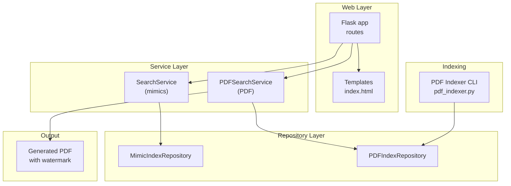
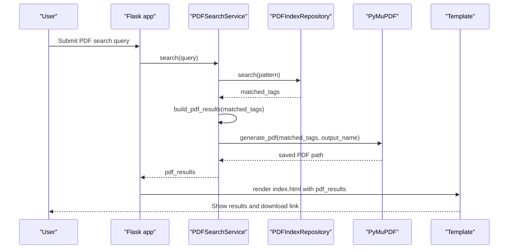
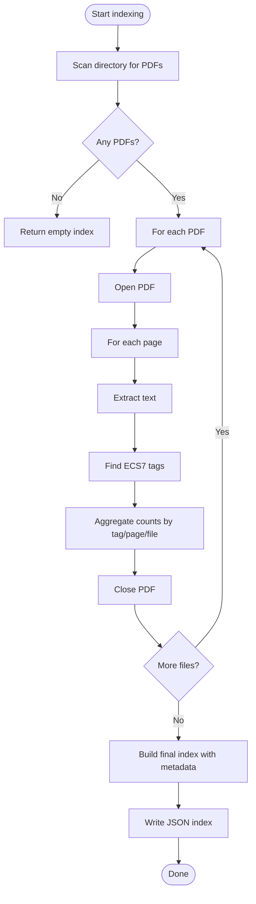
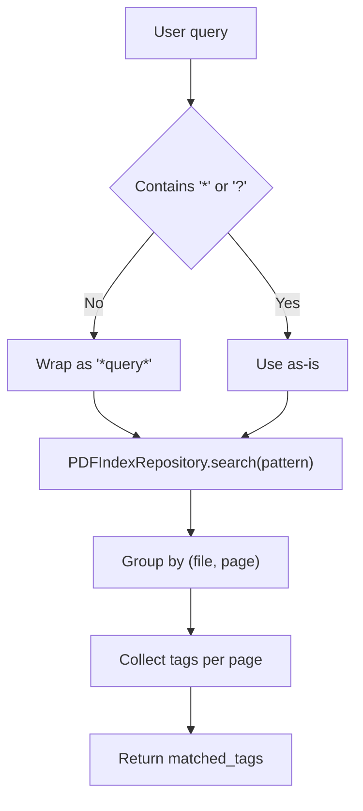
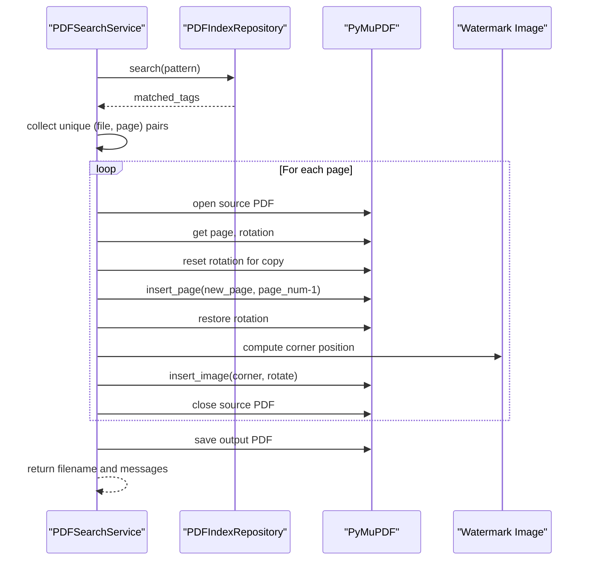
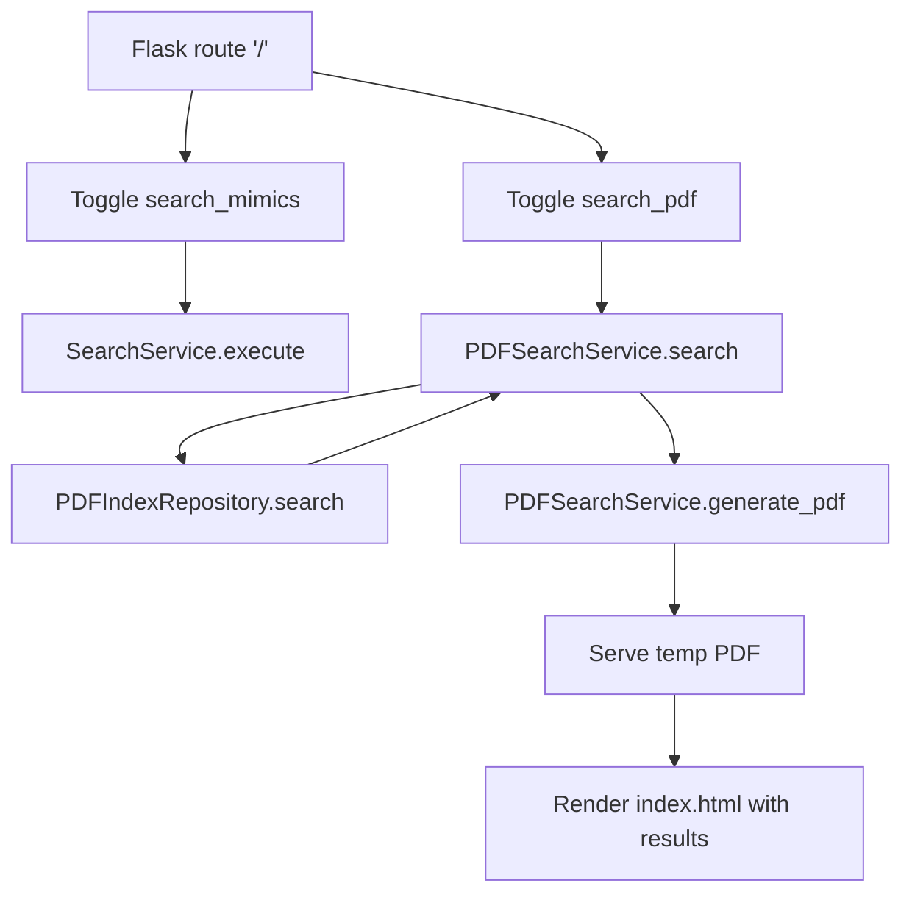
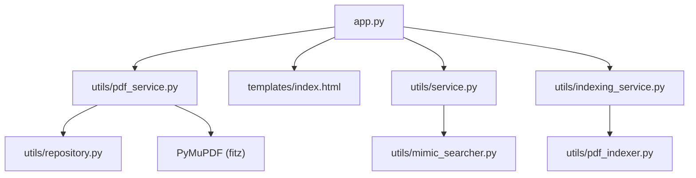

# PDF Search and Generation

<cite>
**Referenced Files in This Document**
- [app.py](file://app.py)
- [utils/pdf_indexer.py](file://utils/pdf_indexer.py)
- [utils/pdf_service.py](file://utils/pdf_service.py)
- [utils/repository.py](file://utils/repository.py)
- [utils/service.py](file://utils/service.py)
- [utils/indexing_service.py](file://utils/indexing_service.py)
- [templates/index.html](file://templates/index.html)
- [promt_pdf.md](file://promt_pdf.md)
- [pyproject.toml](file://pyproject.toml)
</cite>

## Table of Contents
1. [Introduction](#introduction)
2. [Project Structure](#project-structure)
3. [Core Components](#core-components)
4. [Architecture Overview](#architecture-overview)
5. [Detailed Component Analysis](#detailed-component-analysis)
6. [Dependency Analysis](#dependency-analysis)
7. [Performance Considerations](#performance-considerations)
8. [Troubleshooting Guide](#troubleshooting-guide)
9. [Conclusion](#conclusion)
10. [Appendices](#appendices)

## Introduction
This document explains the PDF search and generation capabilities of the ecs7search project. It covers:
- The PDF indexing workflow that extracts ECS7 tags from PDF documents and builds a searchable index
- Page-level search precision algorithms used to locate tags within PDFs
- Multi-page document assembly and PDF generation with watermark integration and rotation handling
- Output optimization techniques and integration with the broader search system for unified document retrieval

## Project Structure
The PDF-related functionality spans several modules:
- Indexing: a dedicated CLI utility that scans PDFs and produces a JSON index
- Repository: a cached reader for the PDF index
- Service: a PDF search service that orchestrates search and PDF generation
- Web integration: Flask routes that expose PDF search and download
- Templates: HTML rendering for PDF search results and links to generated PDFs

**Diagram sources**
- [app.py:92-155](file://app.py#L92-L155)
- [utils/pdf_service.py:18-96](file://utils/pdf_service.py#L18-L96)
- [utils/repository.py:138-178](file://utils/repository.py#L138-L178)
- [utils/pdf_indexer.py:41-131](file://utils/pdf_indexer.py#L41-L131)

**Section sources**
- [app.py:26-84](file://app.py#L26-L84)
- [utils/pdf_service.py:18-96](file://utils/pdf_service.py#L18-L96)
- [utils/repository.py:138-178](file://utils/repository.py#L138-L178)
- [utils/pdf_indexer.py:12-25](file://utils/pdf_indexer.py#L12-L25)

## Core Components
- PDF Indexer CLI: Scans PDFs, extracts ECS7 tags, and writes a structured JSON index
- PDF Index Repository: Loads and searches the PDF index with wildcard support
- PDF Search Service: Executes searches, builds result tables, and generates PDFs with watermarks
- Web Integration: Routes and templates to trigger PDF search, show results, and download generated PDFs
- Search Service (mimics): Provides complementary search for screen-based tags and integrates with the same UI

Key responsibilities:
- Indexing: Extract tags per page, aggregate counts, and persist metadata
- Search: Match patterns against tags and resolve page-level occurrences
- Generation: Assemble pages from multiple PDFs, preserve rotations, and overlay corner watermarks

**Section sources**
- [utils/pdf_indexer.py:28-131](file://utils/pdf_indexer.py#L28-L131)
- [utils/repository.py:164-178](file://utils/repository.py#L164-L178)
- [utils/pdf_service.py:36-96](file://utils/pdf_service.py#L36-L96)
- [app.py:114-155](file://app.py#L114-L155)

## Architecture Overview
The PDF search and generation pipeline follows a layered architecture:
- Web layer: Flask routes accept queries, delegate to services, and render results
- Service layer: PDFSearchService handles search and PDF generation
- Repository layer: PDFIndexRepository loads and filters the index
- Indexing layer: pdf_indexer.py builds the index from PDFs
- Output layer: Generated PDFs are stored temporarily and served via Flask

**Diagram sources**
- [app.py:119-155](file://app.py#L119-L155)
- [utils/pdf_service.py:36-96](file://utils/pdf_service.py#L36-L96)
- [utils/repository.py:164-178](file://utils/repository.py#L164-L178)

## Detailed Component Analysis

### PDF Indexing Workflow
The indexer scans PDFs in a directory, extracts text per page, identifies ECS7 tags using a regex, and aggregates occurrences by tag, file, and page. It writes a JSON index with metadata and a tags dictionary containing files and positions.

Processing logic:
- Enumerate PDF files in the directory
- Open each PDF and iterate pages
- Extract text and find all tag matches
- Aggregate counts per tag per page per file
- Build final index with metadata and sort keys

**Diagram sources**
- [utils/pdf_indexer.py:41-131](file://utils/pdf_indexer.py#L41-L131)

**Section sources**
- [utils/pdf_indexer.py:28-131](file://utils/pdf_indexer.py#L28-L131)
- [promt_pdf.md:14-48](file://promt_pdf.md#L14-L48)

### Page-Level Search Precision Algorithms
The search precision relies on:
- Wildcard pattern matching: fnmatch is used to match tags with "*" and "?"
- Exact vs wildcard behavior: queries without wildcards are auto-wrapped with "*" to match anywhere
- Deduplication and ordering: results are sorted and normalized to avoid duplicates

Key behaviors:
- Pattern expansion: "*query*" if no wildcards present
- Repository search: returns tag-to-positions mapping
- Result construction: groups by file and page, collects tags per page occurrence

**Diagram sources**
- [utils/pdf_service.py:43-52](file://utils/pdf_service.py#L43-L52)
- [utils/repository.py:164-178](file://utils/repository.py#L164-L178)

**Section sources**
- [utils/pdf_service.py:36-52](file://utils/pdf_service.py#L36-L52)
- [utils/repository.py:164-178](file://utils/repository.py#L164-L178)

### Multi-Page Document Assembly and PDF Generation
The PDF generator:
- Validates index existence and prepares a list of unique (file, page) pairs
- Sorts pages deterministically by file and page number
- Copies pages from source PDFs into a new PDF while preserving page sizes
- Handles rotation: temporarily resets rotation for copying, then restores it
- Inserts a watermark image in the lower-left corner (rotated appropriately for rotated pages)
- Saves the assembled PDF to a temporary directory and returns a download link

**Diagram sources**
- [utils/pdf_service.py:97-229](file://utils/pdf_service.py#L97-L229)

**Section sources**
- [utils/pdf_service.py:97-229](file://utils/pdf_service.py#L97-L229)

### Watermark Integration and Rotation Handling
Watermark placement:
- Uses a fixed image size and a small margin
- Computes rectangle coordinates for the lower-left corner
- Adjusts coordinates and rotation when the page is rotated (90 or 270 degrees)
- Inserts the image with appropriate rotation to align with page orientation

Rotation handling:
- Detects page rotation
- Temporarily sets rotation to zero during page extraction to ensure correct geometry
- Restores original rotation on both source and destination pages

**Section sources**
- [utils/pdf_service.py:174-212](file://utils/pdf_service.py#L174-L212)

### Output Optimization Techniques
Optimization strategies implemented:
- Single-pass page extraction: opens each source PDF only when needed
- Deterministic sorting: sorts pages by file and page number to ensure consistent order
- Minimal memory footprint: avoids loading entire documents into memory
- Efficient aggregation: deduplicates pages using a set of (file, page) tuples

**Section sources**
- [utils/pdf_service.py:125-148](file://utils/pdf_service.py#L125-L148)
- [utils/pdf_service.py:154-229](file://utils/pdf_service.py#L154-L229)

### Integration with the Broader Search System
The PDF search integrates with the existing mimics search:
- Web form toggles enable PDF search alongside mimics search
- Results are rendered in the same template with separate sections for PDF results
- Download link is provided for the generated PDF
- Index metadata is shown for both mimics and PDF indices

**Diagram sources**
- [app.py:92-155](file://app.py#L92-L155)
- [templates/index.html:154-209](file://templates/index.html#L154-L209)

**Section sources**
- [app.py:92-155](file://app.py#L92-L155)
- [templates/index.html:154-209](file://templates/index.html#L154-L209)

## Dependency Analysis
External dependencies relevant to PDF processing:
- PyMuPDF: used for text extraction and page manipulation
- Pillow: used by other parts of the system (not directly in PDF generation)
- Flask: web framework for serving results and generated PDFs

**Diagram sources**
- [app.py:17-24](file://app.py#L17-L24)
- [utils/pdf_service.py:15](file://utils/pdf_service.py#L15)
- [utils/repository.py:15](file://utils/repository.py#L15)
- [utils/indexing_service.py:19](file://utils/indexing_service.py#L19)
- [utils/pdf_indexer.py:22](file://utils/pdf_indexer.py#L22)

**Section sources**
- [pyproject.toml:6-15](file://pyproject.toml#L6-L15)
- [app.py:17-24](file://app.py#L17-L24)

## Performance Considerations
- Indexing speed: The PDF indexer processes each PDF independently and aggregates counts per page, minimizing memory overhead
- Search performance: Wildcard matching is efficient for moderate-sized indices; consider caching frequently accessed indices
- PDF generation: Opening and closing PDFs per file reduces memory usage; avoid keeping many documents open simultaneously
- Watermark insertion: Image insertion is performed once per page; keep watermark images small to reduce processing time

## Troubleshooting Guide
Common issues and resolutions:
- Index not found: Ensure the PDF index exists before searching; run the PDF indexer first
- No pages generated: Verify that matched tags correspond to valid files and page numbers within the PDF bounds
- Rotation anomalies: Confirm that rotation is restored correctly; check that watermark placement accounts for rotated pages
- Permission errors: Ensure write permissions to the temporary directory for saving generated PDFs

Operational checks:
- Validate index existence before invoking search
- Review warnings and errors returned by the PDF generation process
- Confirm that the watermark image exists and is readable

**Section sources**
- [utils/pdf_service.py:43-52](file://utils/pdf_service.py#L43-L52)
- [utils/pdf_service.py:158-171](file://utils/pdf_service.py#L158-L171)
- [utils/pdf_service.py:216-223](file://utils/pdf_service.py#L216-L223)

## Conclusion
The PDF search and generation subsystem provides a robust pipeline for indexing ECS7 tags in PDFs, performing precise wildcard-based searches, and assembling multi-page PDFs with watermark overlays. It integrates seamlessly with the broader search system, offering unified document retrieval across mimics and PDF sources. The implementation emphasizes performance, reliability, and maintainability through careful resource management and clear separation of concerns.

## Appendices

### Example Workflows
- Indexing workflow:
  - Run the PDF indexer to scan a directory and produce a JSON index
  - Verify the index metadata and tag entries
- Search workflow:
  - Submit a query via the web interface with wildcard support
  - Receive matched tags grouped by file and page
- PDF generation workflow:
  - Generate a consolidated PDF from matched pages
  - Download the resulting file from the UI

**Section sources**
- [utils/pdf_indexer.py:149-211](file://utils/pdf_indexer.py#L149-L211)
- [utils/pdf_service.py:36-96](file://utils/pdf_service.py#L36-L96)
- [app.py:119-155](file://app.py#L119-L155)