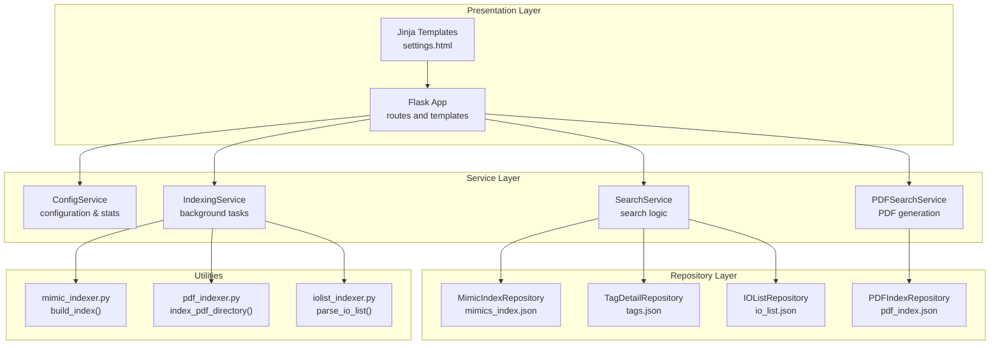
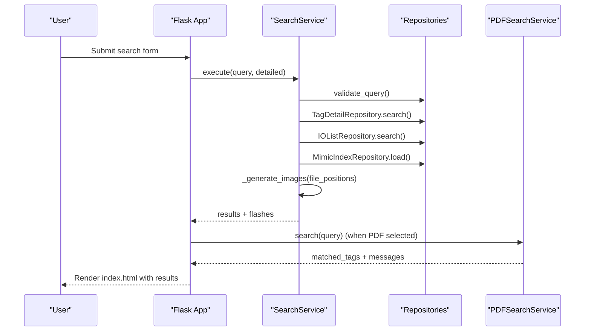
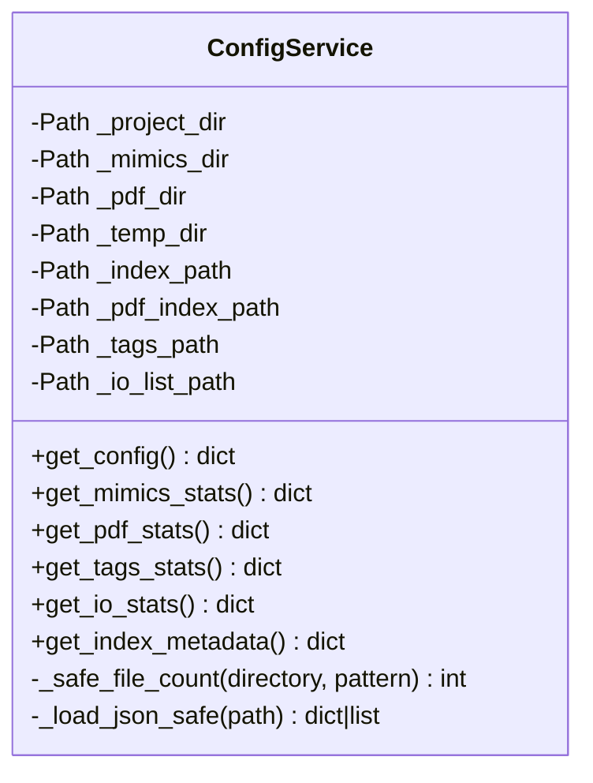
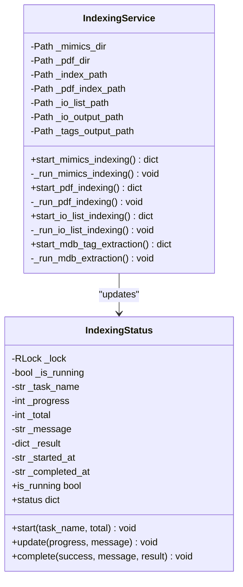
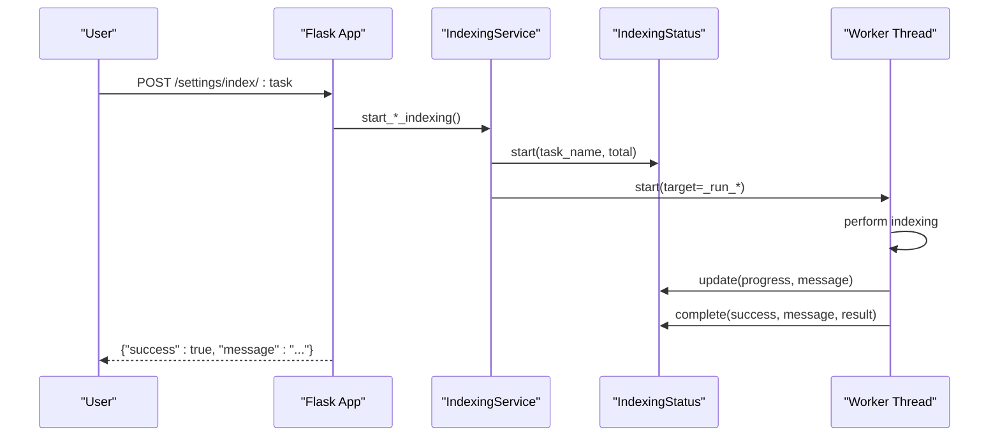
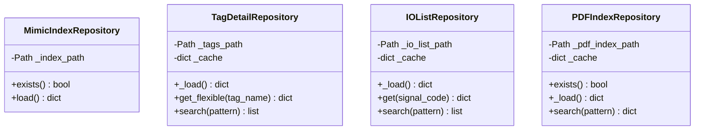
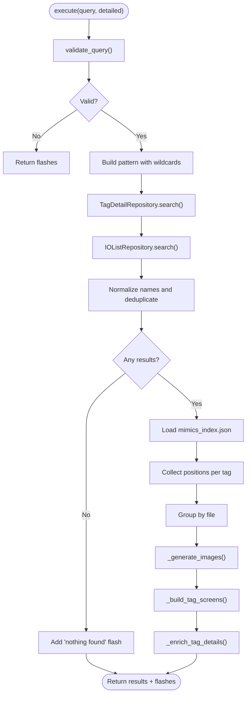
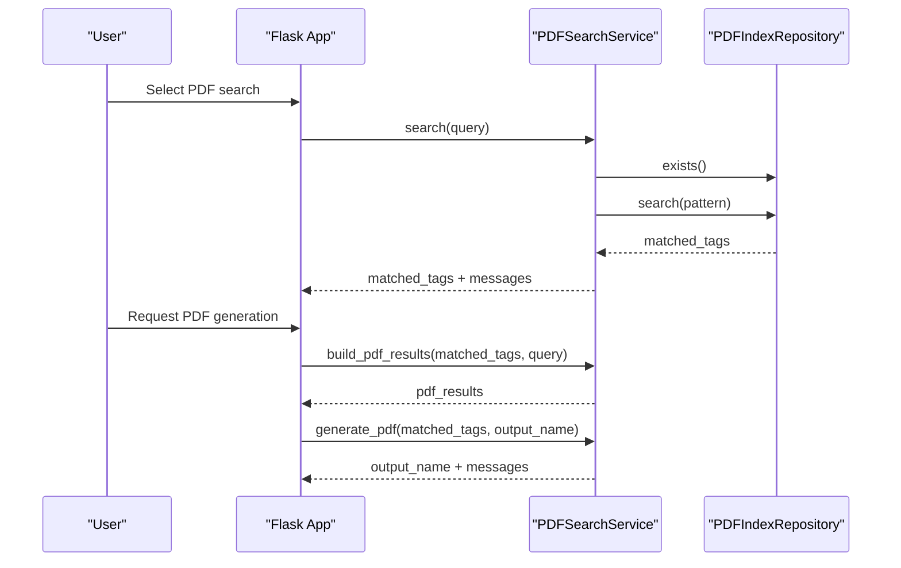
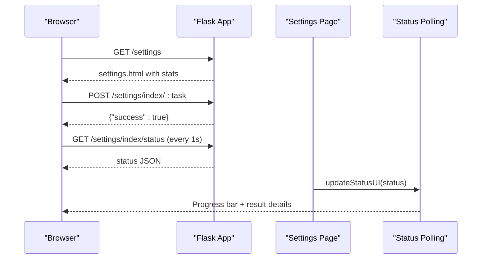
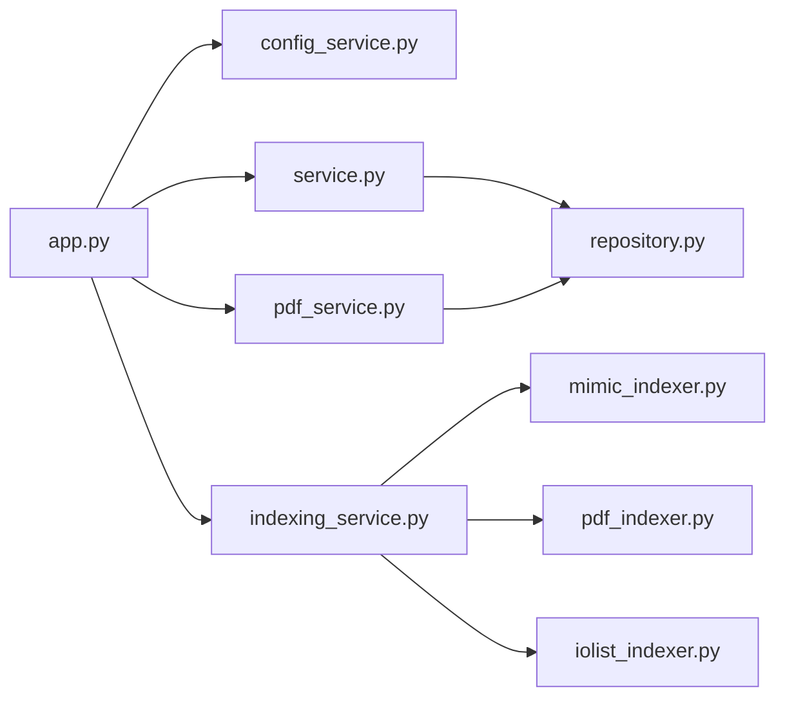

# System Configuration and Management

<cite>
**Referenced Files in This Document**
- [app.py](file://app.py)
- [config_service.py](file://utils/config_service.py)
- [indexing_service.py](file://utils/indexing_service.py)
- [repository.py](file://utils/repository.py)
- [service.py](file://utils/service.py)
- [mimic_indexer.py](file://utils/mimic_indexer.py)
- [pdf_indexer.py](file://utils/pdf_indexer.py)
- [iolist_indexer.py](file://utils/iolist_indexer.py)
- [pdf_service.py](file://utils/pdf_service.py)
- [settings.html](file://templates/settings.html)
- [main.py](file://main.py)
</cite>

## Table of Contents
1. [Introduction](#introduction)
2. [Project Structure](#project-structure)
3. [Core Components](#core-components)
4. [Architecture Overview](#architecture-overview)
5. [Detailed Component Analysis](#detailed-component-analysis)
6. [Dependency Analysis](#dependency-analysis)
7. [Performance Considerations](#performance-considerations)
8. [Troubleshooting Guide](#troubleshooting-guide)
9. [Conclusion](#conclusion)

## Introduction
This document explains the system configuration and management features of the ECS7 search application. It covers background indexing operations, thread-safe implementation patterns, progress tracking mechanisms, configuration service functionality, index statistics monitoring, and system health reporting. It also demonstrates how the Flask application integrates with the backend services to provide real-time status updates and user feedback during background tasks.

## Project Structure
The application follows a layered architecture:
- Presentation layer: Flask routes and templates
- Service layer: Business logic and orchestration
- Repository layer: Data access and caching
- Utility layer: Indexers and helpers

**Diagram sources**
- [app.py:88-206](file://app.py#L88-L206)
- [config_service.py:13-128](file://utils/config_service.py#L13-L128)
- [indexing_service.py:85-239](file://utils/indexing_service.py#L85-L239)
- [repository.py:13-178](file://utils/repository.py#L13-L178)
- [service.py:25-270](file://utils/service.py#L25-L270)
- [pdf_service.py:18-229](file://utils/pdf_service.py#L18-L229)
- [mimic_indexer.py:363-436](file://utils/mimic_indexer.py#L363-L436)
- [pdf_indexer.py:41-132](file://utils/pdf_indexer.py#L41-L132)
- [iolist_indexer.py:39-98](file://utils/iolist_indexer.py#L39-L98)

**Section sources**
- [app.py:88-206](file://app.py#L88-L206)
- [config_service.py:13-128](file://utils/config_service.py#L13-L128)
- [indexing_service.py:85-239](file://utils/indexing_service.py#L85-L239)
- [repository.py:13-178](file://utils/repository.py#L13-L178)
- [service.py:25-270](file://utils/service.py#L25-L270)
- [pdf_service.py:18-229](file://utils/pdf_service.py#L18-L229)
- [mimic_indexer.py:363-436](file://utils/mimic_indexer.py#L363-L436)
- [pdf_indexer.py:41-132](file://utils/pdf_indexer.py#L41-L132)
- [iolist_indexer.py:39-98](file://utils/iolist_indexer.py#L39-L98)

## Core Components
- Configuration Service: Provides configuration paths and index statistics safely, with robust JSON loading and file counting.
- Indexing Service: Manages background indexing tasks for mimics, PDFs, IO lists, and MDB extraction with thread-safe progress tracking.
- Repository Layer: Caches and exposes index data with flexible search and normalization.
- Search Service: Orchestrates tag discovery across multiple sources and generates visual results.
- PDF Service: Searches PDF indices and generates consolidated PDFs with watermarks.
- Flask Application: Routes, forms, and real-time status polling for background tasks.

**Section sources**
- [config_service.py:13-128](file://utils/config_service.py#L13-L128)
- [indexing_service.py:23-82](file://utils/indexing_service.py#L23-L82)
- [repository.py:13-178](file://utils/repository.py#L13-L178)
- [service.py:25-270](file://utils/service.py#L25-L270)
- [pdf_service.py:18-229](file://utils/pdf_service.py#L18-L229)
- [app.py:88-206](file://app.py#L88-L206)

## Architecture Overview
The system separates concerns across layers:
- Flask routes handle user requests and render templates.
- Services encapsulate business logic and coordinate repositories.
- Repositories provide cached access to JSON indices.
- Utilities implement specialized indexing and PDF operations.

**Diagram sources**
- [app.py:92-155](file://app.py#L92-L155)
- [service.py:58-158](file://utils/service.py#L58-L158)
- [repository.py:22-178](file://utils/repository.py#L22-L178)
- [pdf_service.py:36-52](file://utils/pdf_service.py#L36-L52)

## Detailed Component Analysis

### Configuration Service
The configuration service centralizes system configuration and index statistics:
- Exposes configuration paths (project, mimics, PDF, temp).
- Computes index statistics safely with fallbacks for missing or malformed JSON.
- Normalizes index metadata formats for tags and IO lists.

Key capabilities:
- Safe JSON loading with exception handling.
- File counting with glob patterns.
- Metadata extraction for mimics, PDF, tags, and IO list.

**Diagram sources**
- [config_service.py:13-128](file://utils/config_service.py#L13-L128)

**Section sources**
- [config_service.py:38-128](file://utils/config_service.py#L38-L128)

### Indexing Service and Background Tasks
The indexing service orchestrates background indexing with thread-safe progress tracking:
- Global IndexingStatus maintains state protected by a threading lock.
- Each task starts a daemon thread and sets initial status.
- Status updates are atomic and exposed via a property accessor.
- Completion stores result metadata and completion timestamp.

Supported tasks:
- Mimics indexing: scans .g files, extracts tags and coordinates, writes mimics_index.json.
- PDF indexing: scans PDFs, extracts ECS7 tags, writes pdf_index.json.
- IO list indexing: parses Excel IO list, writes io_list.json.
- MDB tag extraction: reads MDB database and saves tags.json.

**Diagram sources**
- [indexing_service.py:23-82](file://utils/indexing_service.py#L23-L82)
- [indexing_service.py:85-239](file://utils/indexing_service.py#L85-L239)

Background task lifecycle:

**Diagram sources**
- [app.py:172-189](file://app.py#L172-L189)
- [indexing_service.py:106-239](file://utils/indexing_service.py#L106-L239)
- [indexing_service.py:23-82](file://utils/indexing_service.py#L23-L82)

**Section sources**
- [indexing_service.py:23-82](file://utils/indexing_service.py#L23-L82)
- [indexing_service.py:85-239](file://utils/indexing_service.py#L85-L239)

### Repository Layer
The repository layer caches and exposes index data:
- MimicIndexRepository: loads mimics_index.json.
- TagDetailRepository: caches tags.json with flexible lookup and pattern matching.
- IOListRepository: caches io_list.json with normalized field selection.
- PDFIndexRepository: loads pdf_index.json and searches by tag pattern.

**Diagram sources**
- [repository.py:13-178](file://utils/repository.py#L13-L178)

**Section sources**
- [repository.py:13-178](file://utils/repository.py#L13-L178)

### Search Service
SearchService executes tag discovery across sources:
- Validates query patterns.
- Searches tags.json and io_list.json with wildcard support.
- Normalizes names to avoid duplicates with leading underscore variants.
- Retrieves positions from mimics_index.json and generates annotated images.
- Builds enriched tag details with IO list data.

**Diagram sources**
- [service.py:58-158](file://utils/service.py#L58-L158)
- [service.py:162-270](file://utils/service.py#L162-L270)

**Section sources**
- [service.py:25-270](file://utils/service.py#L25-L270)

### PDF Service
PDFSearchService handles PDF search and generation:
- Searches PDF index by pattern and returns matched pages with counts.
- Builds a table of unique pages across matched tags.
- Generates a consolidated PDF with corner watermark and preserves page rotations.

**Diagram sources**
- [app.py:119-146](file://app.py#L119-L146)
- [pdf_service.py:36-96](file://utils/pdf_service.py#L36-L96)
- [pdf_service.py:97-229](file://utils/pdf_service.py#L97-L229)

**Section sources**
- [pdf_service.py:18-229](file://utils/pdf_service.py#L18-L229)

### Flask Application Integration
The Flask application integrates configuration, search, indexing, and PDF services:
- Routes for home, settings, and temporary image serving.
- Settings page renders configuration and statistics, and exposes endpoints to start tasks and poll status.
- Real-time updates via AJAX polling to /settings/index/status.

**Diagram sources**
- [app.py:158-195](file://app.py#L158-L195)
- [settings.html:226-342](file://templates/settings.html#L226-L342)

**Section sources**
- [app.py:88-206](file://app.py#L88-L206)
- [settings.html:126-342](file://templates/settings.html#L126-L342)

## Dependency Analysis
The system exhibits low coupling and high cohesion:
- Flask depends on services and repositories for data access.
- Services depend on repositories for cached data and on utilities for indexing.
- Utilities are standalone and can be executed independently.

**Diagram sources**
- [app.py:15-24](file://app.py#L15-L24)
- [service.py:15-20](file://utils/service.py#L15-L20)
- [indexing_service.py:17-20](file://utils/indexing_service.py#L17-L20)
- [pdf_service.py:15](file://utils/pdf_service.py#L15)

**Section sources**
- [app.py:15-24](file://app.py#L15-L24)
- [service.py:15-20](file://utils/service.py#L15-L20)
- [indexing_service.py:17-20](file://utils/indexing_service.py#L17-L20)
- [pdf_service.py:15](file://utils/pdf_service.py#L15)

## Performance Considerations
- Background indexing uses daemon threads to prevent blocking the main process. Consider using a dedicated worker pool or queue for long-running tasks in production.
- Repository caching reduces repeated JSON loads; ensure cache invalidation when underlying files change.
- Image generation limits results to a maximum count to control memory and rendering time.
- PDF generation preserves original page rotations and copies pages efficiently.

## Troubleshooting Guide
Common issues and resolutions:
- Index files not found: Verify paths in configuration and ensure files exist. The configuration service returns empty stats when files are missing.
- Background indexing conflicts: The service prevents overlapping runs; wait for completion or restart the server to clear stale state.
- PDF generation failures: Check that PDF index exists and that source PDFs are readable. Messages indicate missing files or page ranges.
- Search results empty: Confirm that tags.json, io_list.json, and mimics_index.json are up-to-date and contain the searched patterns.

**Section sources**
- [config_service.py:118-128](file://utils/config_service.py#L118-L128)
- [indexing_service.py:108-116](file://utils/indexing_service.py#L108-L116)
- [pdf_service.py:43-52](file://utils/pdf_service.py#L43-L52)

## Conclusion
The system provides a robust foundation for configuration management, background indexing, and real-time status reporting. The thread-safe progress tracking and layered architecture enable scalable enhancements, while the Flask integration delivers immediate user feedback. Extending the system can focus on adding more indexers, improving caching strategies, and integrating asynchronous task queues for production deployments.