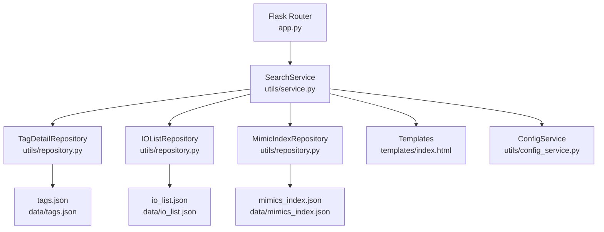
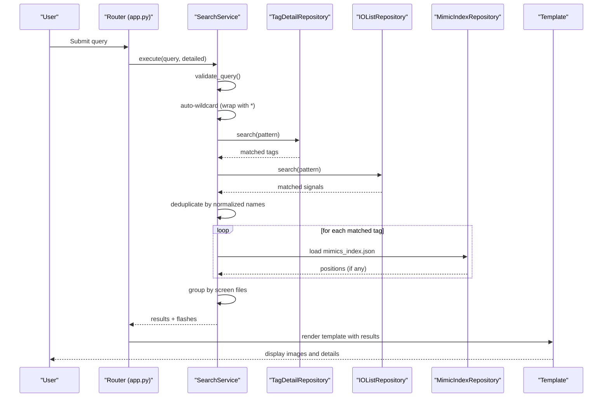
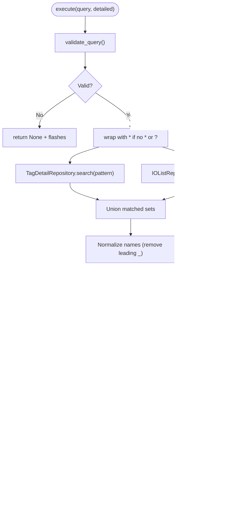
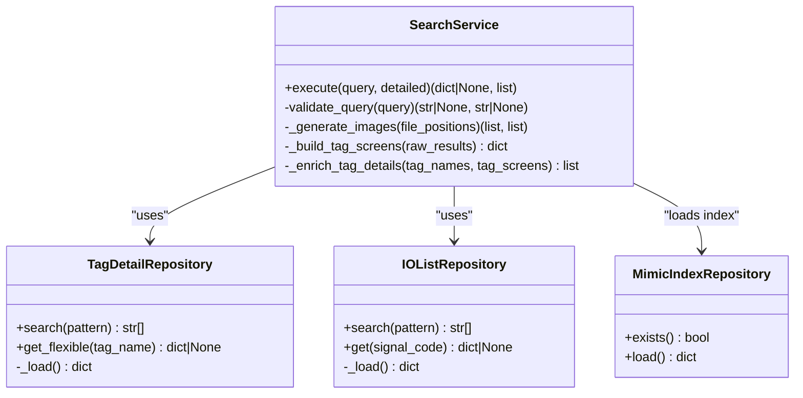
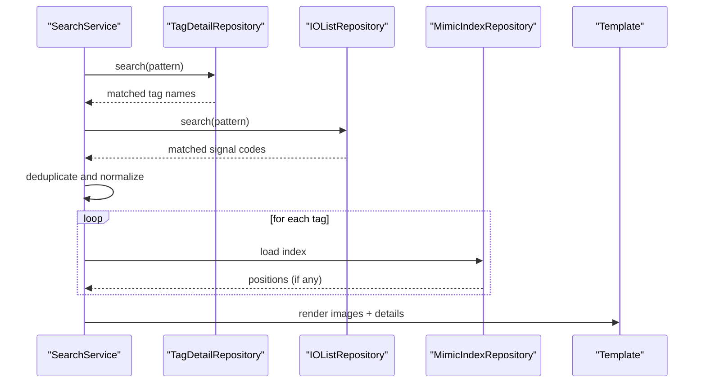
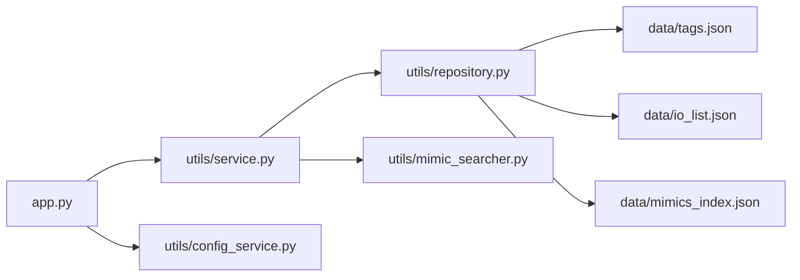

# Tag Search Engine

<cite>
**Referenced Files in This Document**
- [app.py](file://app.py)
- [utils/service.py](file://utils/service.py)
- [utils/repository.py](file://utils/repository.py)
- [utils/mimic_searcher.py](file://utils/mimic_searcher.py)
- [utils/config_service.py](file://utils/config_service.py)
- [data/tags.json](file://data/tags.json)
- [data/io_list.json](file://data/io_list.json)
- [data/mimics_index.json](file://data/mimics_index.json)
- [templates/index.html](file://templates/index.html)
</cite>

## Table of Contents
1. [Introduction](#introduction)
2. [Project Structure](#project-structure)
3. [Core Components](#core-components)
4. [Architecture Overview](#architecture-overview)
5. [Detailed Component Analysis](#detailed-component-analysis)
6. [Dependency Analysis](#dependency-analysis)
7. [Performance Considerations](#performance-considerations)
8. [Troubleshooting Guide](#troubleshooting-guide)
9. [Conclusion](#conclusion)

## Introduction
This document explains the tag search engine that powers multi-source tag discovery for SCADA ECS7 systems. It covers:
- Simultaneous search across tags.json and io_list.json
- Wildcard pattern matching using *, ?, and underscore variants
- Query validation, auto-wildcard behavior, and result deduplication
- Result processing pipeline integrating with the repository layer
- Practical examples and performance guidance for large datasets commonly used by SCADA engineers

## Project Structure
The tag search engine is implemented as a layered application:
- Router layer (Flask) handles requests and renders results
- Service layer performs multi-source search, validation, deduplication, and enrichment
- Repository layer abstracts data access for tags.json, io_list.json, and mimics_index.json
- Template layer renders results and user feedback

**Diagram sources**
- [app.py:92-155](file://app.py#L92-L155)
- [utils/service.py:25-158](file://utils/service.py#L25-L158)
- [utils/repository.py:27-178](file://utils/repository.py#L27-L178)
- [utils/config_service.py:13-128](file://utils/config_service.py#L13-L128)
- [templates/index.html:1-260](file://templates/index.html#L1-L260)

**Section sources**
- [app.py:88-155](file://app.py#L88-L155)
- [utils/service.py:25-158](file://utils/service.py#L25-L158)
- [utils/repository.py:13-178](file://utils/repository.py#L13-L178)
- [templates/index.html:1-260](file://templates/index.html#L1-L260)

## Core Components
- SearchService orchestrates multi-source search, validation, deduplication, and result enrichment.
- TagDetailRepository loads and searches tags.json with flexible underscore handling.
- IOListRepository loads and searches io_list.json by SignalCode.
- MimicIndexRepository loads mimics_index.json for screen positions.
- ConfigService provides index statistics and metadata for UI rendering.

Key responsibilities:
- Validation: enforce minimum length and allowed characters
- Auto-wildcard: wrap queries without wildcards with *
- Deduplication: normalize names by removing leading underscore
- Enrichment: combine tag metadata and IO list data

**Section sources**
- [utils/service.py:25-158](file://utils/service.py#L25-L158)
- [utils/repository.py:27-136](file://utils/repository.py#L27-L136)
- [utils/repository.py:138-178](file://utils/repository.py#L138-L178)
- [utils/config_service.py:13-128](file://utils/config_service.py#L13-L128)

## Architecture Overview
The tag search engine follows a clean separation of concerns:
- Router receives user queries and delegates to SearchService
- SearchService validates, builds a unified query, searches both repositories, and enriches results
- Repositories abstract JSON loading and pattern matching
- Results are grouped by screen files and rendered with highlighted positions

**Diagram sources**
- [app.py:92-155](file://app.py#L92-L155)
- [utils/service.py:58-158](file://utils/service.py#L58-L158)
- [utils/repository.py:78-136](file://utils/repository.py#L78-L136)
- [utils/repository.py:138-178](file://utils/repository.py#L138-L178)

## Detailed Component Analysis

### SearchService: Multi-source Search and Deduplication
Responsibilities:
- Validates query length and allowed characters
- Applies auto-wildcard when no wildcards present
- Searches tags.json and io_list.json concurrently
- Deduplicates results by normalizing names (leading underscore removed)
- Loads screen positions from mimics_index.json and groups by file
- Enriches results with tag metadata and IO list data

**Diagram sources**
- [utils/service.py:58-158](file://utils/service.py#L58-L158)

**Section sources**
- [utils/service.py:46-158](file://utils/service.py#L46-L158)

### Repository Layer: Pattern Matching and Flexible Names
- TagDetailRepository
  - Supports two formats of tags.json (new with metadata/tags, old as list)
  - Provides flexible lookup considering leading underscore variants
  - Implements fnmatch-based pattern matching for *, ?
- IOListRepository
  - Loads io_list.json and filters by SignalCode using fnmatch
  - Exposes IO fields for downstream enrichment
- MimicIndexRepository
  - Loads mimics_index.json for screen positions
  - Used by SearchService to resolve tag positions

**Diagram sources**
- [utils/repository.py:27-178](file://utils/repository.py#L27-L178)
- [utils/service.py:25-158](file://utils/service.py#L25-L158)

**Section sources**
- [utils/repository.py:27-136](file://utils/repository.py#L27-L136)
- [utils/repository.py:138-178](file://utils/repository.py#L138-L178)

### Wildcard Pattern Matching and Auto-Wildcard
- Allowed characters: letters, digits, asterisk, question mark, underscore
- Auto-wildcard behavior: if no wildcard is present, the query is wrapped with * on both sides
- Pattern matching uses fnmatch against cached dictionaries of tag names and SignalCodes
- Underscore normalization ensures consistent deduplication

Practical examples:
- Exact match: “020MG021M01” matches only that tag
- Prefix: “020MG*” matches tags starting with “020MG”
- Contains: “*AF05*” matches tags containing “AF05”
- Single-character wildcard: “020?G021M01” matches one-character substitution
- Underscore variant: “_020MG021M01” and “020MG021M01” are treated as the same after normalization

**Section sources**
- [utils/service.py:22-74](file://utils/service.py#L22-L74)
- [utils/repository.py:78-93](file://utils/repository.py#L78-L93)
- [utils/repository.py:129-135](file://utils/repository.py#L129-L135)

### Result Processing and Integration with Repository Layer
- After deduplication, SearchService resolves screen positions from mimics_index.json
- Positions are grouped by screen file and used to generate annotated images
- Tag metadata and IO list entries are merged to produce enriched details
- The UI displays counts, images, and optional detailed tables

**Diagram sources**
- [utils/service.py:58-158](file://utils/service.py#L58-L158)
- [utils/repository.py:78-136](file://utils/repository.py#L78-L136)
- [utils/repository.py:138-178](file://utils/repository.py#L138-L178)
- [templates/index.html:60-254](file://templates/index.html#L60-L254)

**Section sources**
- [utils/service.py:101-158](file://utils/service.py#L101-L158)
- [templates/index.html:60-254](file://templates/index.html#L60-L254)

### Query Validation and Error Handling
- Validation enforces minimum length and allowed character set
- Auto-wildcard simplifies common queries
- Flash messages inform users about empty results or warnings
- Deduplication prevents repeated entries for underscore variants

Common validations:
- Empty or short queries
- Disallowed characters
- No matches found

**Section sources**
- [utils/service.py:46-74](file://utils/service.py#L46-L74)
- [app.py:114-122](file://app.py#L114-L122)

## Dependency Analysis
- Router depends on SearchService and ConfigService
- SearchService depends on repositories and mimic searcher utilities
- Repositories depend on JSON files and fnmatch for pattern matching
- Templates depend on results produced by SearchService

**Diagram sources**
- [app.py:88-155](file://app.py#L88-L155)
- [utils/service.py:25-158](file://utils/service.py#L25-L158)
- [utils/repository.py:27-178](file://utils/repository.py#L27-L178)
- [utils/mimic_searcher.py:15-20](file://utils/mimic_searcher.py#L15-L20)
- [data/tags.json:1-800](file://data/tags.json#L1-L800)
- [data/io_list.json:1-800](file://data/io_list.json#L1-L800)
- [data/mimics_index.json:1-800](file://data/mimics_index.json#L1-L800)

**Section sources**
- [app.py:88-155](file://app.py#L88-L155)
- [utils/service.py:25-158](file://utils/service.py#L25-L158)
- [utils/repository.py:27-178](file://utils/repository.py#L27-L178)

## Performance Considerations
Guidance for large datasets:
- Use wildcards strategically to reduce result sets (e.g., “prefix*”, “*substring*”)
- Prefer exact matches when possible to minimize scanning
- Limit concurrent image generation by adjusting max_results
- Keep tags.json and io_list.json up-to-date to avoid unnecessary fallbacks
- For frequent searches, rely on prebuilt mimics_index.json to avoid runtime scans

Common SCADA patterns:
- Equipment-centric: “060TN340A01*”
- Function-centric: “*Motor*”
- PLC-centric: “991CS100::I340.*”

[No sources needed since this section provides general guidance]

## Troubleshooting Guide
- No results found:
  - Verify query length and allowed characters
  - Try adding wildcards or adjusting pattern
  - Confirm that mimics_index.json contains positions for searched tags
- Missing images:
  - Ensure PNG files exist for screen files
  - Check that mimics directory paths are correct
- Slow performance:
  - Narrow the search scope with wildcards
  - Reduce max_results to limit image generation
- Underscore mismatches:
  - Treat “_020MG021M01” and “020MG021M01” as equivalent after normalization

**Section sources**
- [utils/service.py:162-198](file://utils/service.py#L162-L198)
- [app.py:114-122](file://app.py#L114-L122)

## Conclusion
The tag search engine integrates multiple data sources to deliver fast, flexible, and user-friendly tag discovery for SCADA ECS7. By combining validated queries, auto-wildcard behavior, robust pattern matching, and intelligent deduplication, it supports common engineering workflows while maintaining simplicity and reliability.