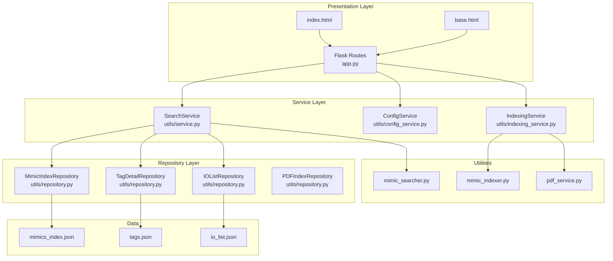
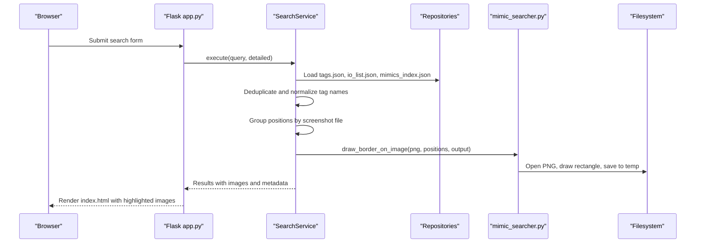
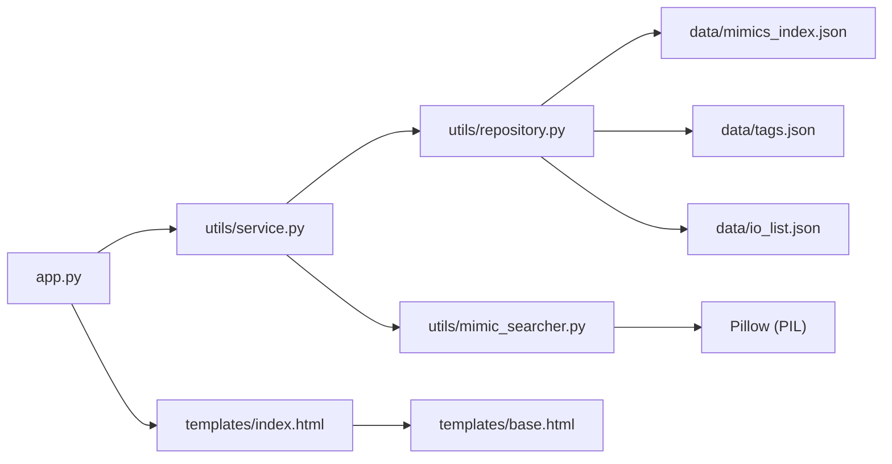

# Visual Tag Visualization

<cite>
**Referenced Files in This Document**
- [app.py](file://app.py)
- [main.py](file://main.py)
- [utils/mimic_indexer.py](file://utils/mimic_indexer.py)
- [utils/mimic_searcher.py](file://utils/mimic_searcher.py)
- [utils/service.py](file://utils/service.py)
- [utils/repository.py](file://utils/repository.py)
- [utils/config_service.py](file://utils/config_service.py)
- [utils/indexing_service.py](file://utils/indexing_service.py)
- [utils/pdf_service.py](file://utils/pdf_service.py)
- [templates/index.html](file://templates/index.html)
- [templates/base.html](file://templates/base.html)
- [data/mimics_index.json](file://data/mimics_index.json)
- [data/io_list.json](file://data/io_list.json)
- [data/tags.json](file://data/tags.json)
</cite>

## Table of Contents
1. [Introduction](#introduction)
2. [Project Structure](#project-structure)
3. [Core Components](#core-components)
4. [Architecture Overview](#architecture-overview)
5. [Detailed Component Analysis](#detailed-component-analysis)
6. [Dependency Analysis](#dependency-analysis)
7. [Performance Considerations](#performance-considerations)
8. [Troubleshooting Guide](#troubleshooting-guide)
9. [Conclusion](#conclusion)

## Introduction
This document explains the visual tag visualization system used to locate and highlight SCADA ECS7 screen tags on mimic screenshots. It covers the screen mimic processing workflow, coordinate system transformation from ECS7 coordinates to pixel positions, image border drawing algorithms, automatic screenshot generation, position validation mechanisms, error handling for missing or invalid mimic files, and integration with the Flask web interface for displaying highlighted tag positions.

## Project Structure
The system is organized around a Flask web application with layered services:
- Presentation layer: Flask routes and Jinja templates
- Service layer: SearchService orchestrates search and image generation
- Repository layer: Loads indices and metadata
- Utilities: Indexing, searching, and visualization helpers

**Diagram sources**
- [app.py:88-206](file://app.py#L88-L206)
- [utils/service.py:25-270](file://utils/service.py#L25-L270)
- [utils/repository.py:13-178](file://utils/repository.py#L13-L178)
- [utils/config_service.py:13-128](file://utils/config_service.py#L13-L128)
- [utils/indexing_service.py:85-239](file://utils/indexing_service.py#L85-L239)
- [utils/mimic_indexer.py:363-484](file://utils/mimic_indexer.py#L363-L484)
- [utils/mimic_searcher.py:113-174](file://utils/mimic_searcher.py#L113-L174)
- [utils/pdf_service.py:18-229](file://utils/pdf_service.py#L18-L229)
- [templates/index.html:1-260](file://templates/index.html#L1-L260)
- [templates/base.html:1-658](file://templates/base.html#L1-L658)

**Section sources**
- [app.py:88-206](file://app.py#L88-L206)
- [utils/service.py:25-270](file://utils/service.py#L25-L270)
- [utils/repository.py:13-178](file://utils/repository.py#L13-L178)
- [utils/config_service.py:13-128](file://utils/config_service.py#L13-L128)
- [utils/indexing_service.py:85-239](file://utils/indexing_service.py#L85-L239)
- [utils/mimic_indexer.py:363-484](file://utils/mimic_indexer.py#L363-L484)
- [utils/mimic_searcher.py:113-174](file://utils/mimic_searcher.py#L113-L174)
- [utils/pdf_service.py:18-229](file://utils/pdf_service.py#L18-L229)
- [templates/index.html:1-260](file://templates/index.html#L1-L260)
- [templates/base.html:1-658](file://templates/base.html#L1-L658)

## Core Components
- Screen mimic indexing: parses .g files to extract tag positions and saves them to mimics_index.json.
- Tag search and visualization: searches tags, groups positions by screenshot, generates highlighted images, and serves them via Flask.
- Coordinate transformation: converts ECS7 coordinates to pixel positions on screenshots.
- Image border drawing: draws rectangles around tag positions with configurable sizes and offsets.
- Position validation and error handling: validates queries, checks for PNG availability, and handles exceptions during image generation.
- Web integration: renders results in index.html and displays images served from data/temp.

**Section sources**
- [utils/mimic_indexer.py:83-361](file://utils/mimic_indexer.py#L83-L361)
- [utils/mimic_searcher.py:42-111](file://utils/mimic_searcher.py#L42-L111)
- [utils/service.py:58-198](file://utils/service.py#L58-L198)
- [app.py:92-155](file://app.py#L92-L155)
- [templates/index.html:231-252](file://templates/index.html#L231-L252)

## Architecture Overview
The visual tag visualization pipeline integrates search, indexing, and rendering:

**Diagram sources**
- [app.py:92-155](file://app.py#L92-L155)
- [utils/service.py:58-198](file://utils/service.py#L58-L198)
- [utils/mimic_searcher.py:80-111](file://utils/mimic_searcher.py#L80-L111)

## Detailed Component Analysis

### Screen Mimic Processing Workflow
- Parses .g files to extract tag positions and metadata.
- Supports inst, group, poly, frect, rect, and property commands.
- Tracks hierarchical grouping and applies move/scale/tran transforms.
- Outputs a JSON index with tag positions per screenshot file.

Key behaviors:
- Extracts tag identifiers from userdata or renamedvars TagCode.
- Aggregates positions across files and groups.
- Rounds coordinates to two decimals for stability.

**Section sources**
- [utils/mimic_indexer.py:83-361](file://utils/mimic_indexer.py#L83-L361)
- [utils/mimic_indexer.py:363-435](file://utils/mimic_indexer.py#L363-L435)

### Coordinate System Transformation
- ECS7 coordinates are mapped to pixel positions on screenshots.
- ECS7 bounds are normalized to a fixed size and then scaled to the PNG’s pixel dimensions.
- Y-axis is flipped to match image coordinate convention.
- Special offsets are applied for certain element functions to fine-tune alignment.

Transformation formula:
- ECS7 bounds: width = 137 units, height = 77 units
- Normalized: x_norm = x / 137, y_norm = (77 - y) / 77
- Pixel: x_px = x_norm × image_width, y_px = y_norm × image_height

Offset adjustments:
- Certain functions receive horizontal shifts to align with visual elements.

**Section sources**
- [utils/mimic_searcher.py:71-78](file://utils/mimic_searcher.py#L71-L78)
- [utils/mimic_searcher.py:96-101](file://utils/mimic_searcher.py#L96-L101)

### Image Border Drawing Algorithms
- Opens the PNG and creates a drawing context.
- Converts each tag position to pixel coordinates.
- Draws a rectangle centered at the transformed position with fixed half-width and half-height.
- Applies function-specific offsets for precise alignment.
- Saves the annotated image to the temporary directory.

Parameters:
- Border color and width are constants.
- Half-width and half-height define the rectangle size.

**Section sources**
- [utils/mimic_searcher.py:80-111](file://utils/mimic_searcher.py#L80-L111)

### Automatic Screenshot Generation Process
- Groups tag positions by screenshot file.
- Resolves PNG path from .g filename.
- Generates a new filename with a suffix indicating search results.
- Calls the drawing routine and stores the result in data/temp.
- Limits the number of generated images per request.

**Section sources**
- [utils/service.py:162-198](file://utils/service.py#L162-L198)
- [utils/mimic_searcher.py:113-174](file://utils/mimic_searcher.py#L113-L174)

### Position Validation Mechanisms
- Validates query length and allowed characters.
- Auto-applies wildcard pattern if no wildcards are present.
- Normalizes tag names by removing leading underscores and deduplicates results.
- Checks for PNG availability before attempting to generate images.

**Section sources**
- [utils/service.py:46-54](file://utils/service.py#L46-L54)
- [utils/service.py:74-98](file://utils/service.py#L74-L98)
- [utils/service.py:105-120](file://utils/service.py#L105-L120)
- [utils/mimic_searcher.py:64-68](file://utils/mimic_searcher.py#L64-L68)

### Error Handling for Missing or Invalid Mimic Files
- If PNG is missing for a .g file, the file is skipped and reported.
- Exceptions during image generation are caught and reported as skipped entries.
- Missing index files produce explicit warnings.

**Section sources**
- [utils/mimic_searcher.py:156-158](file://utils/mimic_searcher.py#L156-L158)
- [utils/mimic_searcher.py:195-196](file://utils/mimic_searcher.py#L195-L196)
- [utils/service.py:177-180](file://utils/service.py#L177-L180)

### Integration with Flask Web Interface
- The route renders index.html with results, including:
  - Query statistics
  - Tag details (when enabled)
  - Gallery of highlighted images
  - Metadata about the mimic index
  - Status banners for skipped files and warnings
- Images are served from data/temp via a dedicated route.

**Section sources**
- [app.py:92-155](file://app.py#L92-L155)
- [templates/index.html:60-252](file://templates/index.html#L60-L252)
- [app.py:197-201](file://app.py#L197-L201)

### Example Workflows

#### Example: Search for a Tag Pattern and Generate Highlighted Images
- User submits a pattern (e.g., “020ML*”).
- SearchService:
  - Validates query
  - Searches tags.json and io_list.json
  - Normalizes and deduplicates tag names
  - Loads mimics_index.json and groups positions by screenshot
  - Generates up to a configured maximum number of images
- Flask:
  - Renders index.html with results and image gallery
  - Serves images from data/temp

**Section sources**
- [utils/service.py:58-158](file://utils/service.py#L58-L158)
- [templates/index.html:231-252](file://templates/index.html#L231-L252)

#### Example: Coordinate Conversion Flow
- Input: ECS7 coordinates (x, y) and PNG dimensions (width, height)
- Steps:
  - Normalize to ECS7 bounds
  - Flip Y-axis
  - Scale to pixel dimensions
  - Apply function-specific offset if needed

**Section sources**
- [utils/mimic_searcher.py:71-78](file://utils/mimic_searcher.py#L71-L78)
- [utils/mimic_searcher.py:96-101](file://utils/mimic_searcher.py#L96-L101)

## Dependency Analysis
The system exhibits layered dependencies:
- Presentation depends on Service
- Service depends on Repositories and Utilities
- Utilities depend on Pillow for image manipulation
- Repositories depend on JSON data files
- Templates depend on Flask routes and repositories

**Diagram sources**
- [app.py:88-206](file://app.py#L88-L206)
- [utils/service.py:25-270](file://utils/service.py#L25-L270)
- [utils/repository.py:13-178](file://utils/repository.py#L13-L178)
- [utils/mimic_searcher.py:21-27](file://utils/mimic_searcher.py#L21-L27)
- [templates/index.html:1-260](file://templates/index.html#L1-L260)
- [templates/base.html:1-658](file://templates/base.html#L1-L658)

**Section sources**
- [app.py:88-206](file://app.py#L88-L206)
- [utils/service.py:25-270](file://utils/service.py#L25-L270)
- [utils/repository.py:13-178](file://utils/repository.py#L13-L178)
- [utils/mimic_searcher.py:21-27](file://utils/mimic_searcher.py#L21-L27)
- [templates/index.html:1-260](file://templates/index.html#L1-L260)
- [templates/base.html:1-658](file://templates/base.html#L1-L658)

## Performance Considerations
- Indexing: mimic_indexer builds a JSON index of tag positions; ensure mimics_index.json is regenerated when .g files change.
- Image generation: Limit the number of generated images per request to avoid excessive disk writes and memory usage.
- Coordinate conversion: Keep calculations vectorized if scaling to large datasets; current implementation processes one position at a time.
- Template rendering: Large galleries can increase HTML payload; consider pagination or lazy loading if needed.

## Troubleshooting Guide
Common issues and resolutions:
- Missing PNG for a .g file:
  - Symptom: Skipped file in results with a warning.
  - Resolution: Ensure the PNG exists in data/mimics with the same base name as the .g file.
- Invalid mimic files:
  - Symptom: Exceptions during image generation reported as skipped entries.
  - Resolution: Verify .g file syntax and that userdata contains valid tag identifiers.
- Missing index files:
  - Symptom: Warnings about missing mimics_index.json or tags.json.
  - Resolution: Re-run indexing via the web interface or mimic_indexer CLI.
- Query validation failures:
  - Symptom: Flash messages indicating invalid characters or too short queries.
  - Resolution: Adjust query to meet allowed characters and minimum length.

**Section sources**
- [utils/mimic_searcher.py:156-158](file://utils/mimic_searcher.py#L156-L158)
- [utils/mimic_searcher.py:195-196](file://utils/mimic_searcher.py#L195-L196)
- [utils/service.py:46-54](file://utils/service.py#L46-L54)
- [app.py:117-118](file://app.py#L117-L118)

## Conclusion
The visual tag visualization system integrates mimic indexing, tag search, coordinate transformation, and image annotation to highlight ECS7 tag positions on screenshots. The Flask interface presents results with clear feedback for missing or invalid files, enabling efficient manual verification and cross-referencing with tag metadata and IO lists.