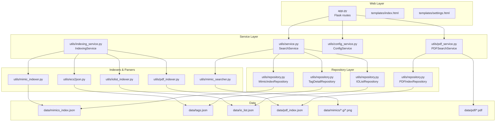
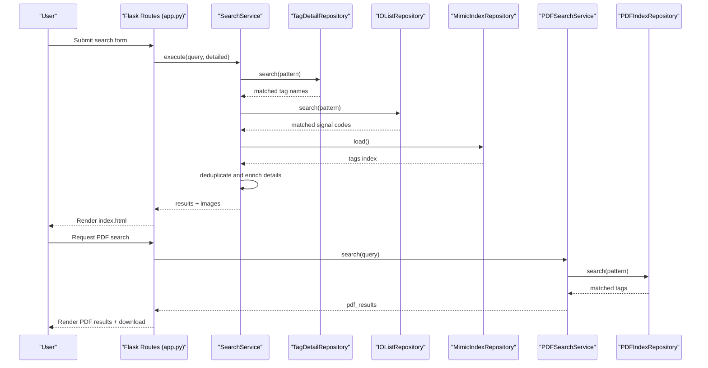
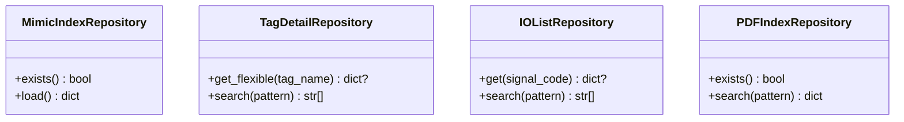
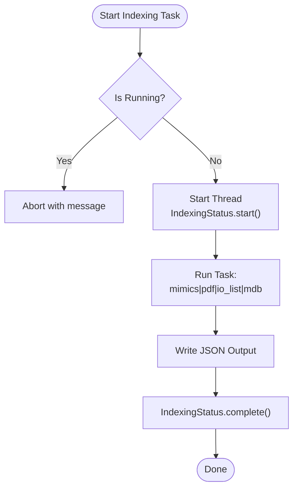
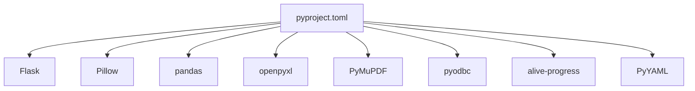

# Data Management

<cite>
**Referenced Files in This Document**
- [app.py](file://app.py)
- [main.py](file://main.py)
- [pyproject.toml](file://pyproject.toml)
- [README.md](file://README.md)
- [utils/repository.py](file://utils/repository.py)
- [utils/indexing_service.py](file://utils/indexing_service.py)
- [utils/mimic_indexer.py](file://utils/mimic_indexer.py)
- [utils/pdf_indexer.py](file://utils/pdf_indexer.py)
- [utils/iolist_indexer.py](file://utils/iolist_indexer.py)
- [utils/service.py](file://utils/service.py)
- [utils/pdf_service.py](file://utils/pdf_service.py)
- [utils/config_service.py](file://utils/config_service.py)
- [utils/ecs2json.py](file://utils/ecs2json.py)
- [utils/mimic_searcher.py](file://utils/mimic_searcher.py)
- [templates/index.html](file://templates/index.html)
- [templates/settings.html](file://templates/settings.html)
- [data/io_list.json](file://data/io_list.json)
</cite>

## Table of Contents
1. [Introduction](#introduction)
2. [Project Structure](#project-structure)
3. [Core Components](#core-components)
4. [Architecture Overview](#architecture-overview)
5. [Detailed Component Analysis](#detailed-component-analysis)
6. [Dependency Analysis](#dependency-analysis)
7. [Performance Considerations](#performance-considerations)
8. [Troubleshooting Guide](#troubleshooting-guide)
9. [Conclusion](#conclusion)
10. [Appendices](#appendices)

## Introduction
This document describes the ECS7Search data management system with a focus on the JSON-based indexing architecture. It explains how screen mimics, tag metadata, IO lists, and PDF documents are indexed, stored, and queried. It documents entity relationships, field definitions, validation rules, access patterns, caching strategies, file system operations, lifecycle management, maintenance procedures, and performance considerations. It also covers the repository pattern implementation, JSON parsing/validation mechanisms, and data integrity checks.

## Project Structure
The project follows a layered architecture:
- Router layer (Flask) in the application entry point
- Service layer for business logic
- Repository layer for data access
- Utilities for indexing, parsing, and PDF operations
- Templates for UI rendering

**Diagram sources**
- [app.py:88-206](file://app.py#L88-L206)
- [utils/service.py:25-270](file://utils/service.py#L25-L270)
- [utils/pdf_service.py:18-229](file://utils/pdf_service.py#L18-L229)
- [utils/config_service.py:13-128](file://utils/config_service.py#L13-L128)
- [utils/indexing_service.py:85-239](file://utils/indexing_service.py#L85-L239)
- [utils/repository.py:13-178](file://utils/repository.py#L13-L178)
- [utils/mimic_indexer.py:363-436](file://utils/mimic_indexer.py#L363-L436)
- [utils/pdf_indexer.py:41-132](file://utils/pdf_indexer.py#L41-L132)
- [utils/iolist_indexer.py:39-98](file://utils/iolist_indexer.py#L39-L98)
- [utils/ecs2json.py:439-455](file://utils/ecs2json.py#L439-L455)
- [utils/mimic_searcher.py:36-111](file://utils/mimic_searcher.py#L36-L111)

**Section sources**
- [app.py:26-85](file://app.py#L26-L85)
- [pyproject.toml:1-19](file://pyproject.toml#L1-L19)

## Core Components
- Repository layer encapsulates JSON file access and caching:
  - MimicIndexRepository: reads mimics index JSON
  - TagDetailRepository: cached tag metadata with flexible lookup and pattern search
  - IOListRepository: cached IO signals keyed by SignalCode with field filtering
  - PDFIndexRepository: cached PDF tag index with pattern search
- Service layer:
  - SearchService: orchestrates tag search across tag metadata, IO list, and mimic positions; generates annotated images
  - PDFSearchService: searches PDF index and generates a consolidated PDF with corner watermark
  - ConfigService: collects stats and configuration
  - IndexingService: runs background indexing tasks for mimics, PDFs, IO list, and MDB extraction
- Indexers and parsers:
  - mimic_indexer.py: parses .g files, extracts tags and coordinates, writes mimics_index.json
  - pdf_indexer.py: scans PDFs, extracts ECS7 tags, writes pdf_index.json
  - iolist_indexer.py: parses IO_list.xlsx, writes io_list.json
  - ecs2json.py: extracts tags from MDB databases, writes tags.json
  - mimic_searcher.py: standalone CLI to draw borders around tag positions on screenshots

**Section sources**
- [utils/repository.py:13-178](file://utils/repository.py#L13-L178)
- [utils/service.py:25-270](file://utils/service.py#L25-L270)
- [utils/pdf_service.py:18-229](file://utils/pdf_service.py#L18-L229)
- [utils/config_service.py:13-128](file://utils/config_service.py#L13-L128)
- [utils/indexing_service.py:85-239](file://utils/indexing_service.py#L85-L239)
- [utils/mimic_indexer.py:363-436](file://utils/mimic_indexer.py#L363-L436)
- [utils/pdf_indexer.py:41-132](file://utils/pdf_indexer.py#L41-L132)
- [utils/iolist_indexer.py:39-98](file://utils/iolist_indexer.py#L39-L98)
- [utils/ecs2json.py:439-455](file://utils/ecs2json.py#L439-L455)
- [utils/mimic_searcher.py:36-111](file://utils/mimic_searcher.py#L36-L111)

## Architecture Overview
The system uses a repository pattern to abstract JSON storage and caching. Services coordinate search and generation workflows, while indexers populate JSON indices from source files. The UI exposes search forms and settings panels to trigger indexing and display results.

**Diagram sources**
- [app.py:92-155](file://app.py#L92-L155)
- [utils/service.py:58-159](file://utils/service.py#L58-L159)
- [utils/pdf_service.py:36-53](file://utils/pdf_service.py#L36-L53)
- [utils/repository.py:27-94](file://utils/repository.py#L27-L94)
- [utils/repository.py:96-136](file://utils/repository.py#L96-L136)
- [utils/repository.py:138-178](file://utils/repository.py#L138-L178)

## Detailed Component Analysis

### Repository Pattern and Data Access
- MimicIndexRepository
  - Purpose: load mimics index JSON
  - Methods: exists(), load()
  - Access pattern: read once per request; JSON loaded from disk
- TagDetailRepository
  - Purpose: cached tag metadata from tags.json
  - Methods: get_flexible(tag), search(pattern)
  - Caching: in-memory cache initialized on first access; supports old/new formats
  - Flexible lookup: handles leading underscore variants
  - Pattern search: supports wildcard patterns
- IOListRepository
  - Purpose: cached IO signals keyed by SignalCode
  - Methods: get(signal_code), search(pattern)
  - Field filtering: returns only configured IO fields
  - Caching: in-memory cache initialized on first access
- PDFIndexRepository
  - Purpose: cached PDF tag index
  - Methods: exists(), search(pattern)
  - Pattern search: returns grouped positions by tag

**Diagram sources**
- [utils/repository.py:13-178](file://utils/repository.py#L13-L178)

**Section sources**
- [utils/repository.py:13-178](file://utils/repository.py#L13-L178)

### JSON Indexes and Entity Relationships
- mimics_index.json
  - Root keys: metadata, tags
  - tags: tag_name -> { files: [..], positions: [{ file, x, y, func }] }
  - Positions represent tag locations on screens with ECS coordinates
- tags.json
  - New format: { metadata: {...}, tags: [...] }
  - Old format: [...] (legacy support)
  - Tag records include Tag, Groups, DescEng, DescRus, Algorithms, PLC, etc.
- io_list.json
  - Root keys: metadata, signals
  - signals: SignalCode -> { fields..., sheets: [...] }
  - Fields include PLC, Component, IOTerminal_Short1, IOAddress, IOType, etc.
- pdf_index.json
  - Root keys: metadata, tags
  - tags: tag_name -> { files: [...], positions: [{ file, page, count }] }

Entity relationships:
- Tag metadata (tags.json) enriches search results with descriptions and PLC info
- IO list (io_list.json) provides IO details for tags not present on screens
- Mimic index (mimics_index.json) provides screen positions for tags
- PDF index (pdf_index.json) provides PDF page occurrences for tags

**Section sources**
- [utils/mimic_indexer.py:363-436](file://utils/mimic_indexer.py#L363-L436)
- [utils/pdf_indexer.py:41-132](file://utils/pdf_indexer.py#L41-L132)
- [utils/iolist_indexer.py:39-98](file://utils/iolist_indexer.py#L39-L98)
- [utils/ecs2json.py:439-455](file://utils/ecs2json.py#L439-L455)
- [data/io_list.json:1-120](file://data/io_list.json#L1-L120)

### Field Definitions, Data Types, and Validation Rules
- mimics_index.json
  - metadata: directory (str), indexed_at (str), total_files (int), total_tags (int), total_positions (int), indexing_time_sec (float)
  - tags: tag_name (str) -> files (list[str]), positions (list[dict])
  - positions: file (str), x (float), y (float), func (str)
- tags.json
  - metadata: directory (str), indexed_at (str), total_tags (int), indexing_time_sec (float)
  - tags: list of dicts with keys Tag (str), Groups (str), DescEng (str), DescRus (str), Algorithms (dict), PLC (dict), etc.
- io_list.json
  - metadata: source_file (str), generated_at (str), total_sheets (int), sheet_names (list[str]), total_signals (int), parsing_time_sec (float)
  - signals: SignalCode (str) -> fields (str|null), sheets (list[str])
  - IO fields: PLC, Component, IOTerminal_Short1, IOAddress, IOType, ComponentDescription, SignalPurpose, PLCDescription, JunctionBoxTerm, Revision, RevisionType
- pdf_index.json
  - metadata: directory (str), indexed_at (str), total_files (int), total_tags (int), total_occurrences (int), indexing_time_sec (float)
  - tags: tag_name -> files (list[str]), positions (list[dict])
  - positions: file (str), page (int), count (int)

Validation rules:
- Search query validation (SearchService): non-empty, minimum length, allowed characters (*, ?, _, letters, digits)
- Pattern-based search: fnmatch wildcards supported
- Repository caches: fallback to empty structures on load failure

**Section sources**
- [utils/mimic_indexer.py:385-435](file://utils/mimic_indexer.py#L385-L435)
- [utils/pdf_indexer.py:119-131](file://utils/pdf_indexer.py#L119-L131)
- [utils/iolist_indexer.py:85-97](file://utils/iolist_indexer.py#L85-L97)
- [utils/ecs2json.py:443-454](file://utils/ecs2json.py#L443-L454)
- [utils/service.py:46-54](file://utils/service.py#L46-L54)

### Data Access Patterns and Caching Strategies
- Repository caching
  - TagDetailRepository and IOListRepository cache parsed JSON in memory after first access
  - PDFIndexRepository and MimicIndexRepository cache parsed JSON after first access
  - On error or missing files, caches fall back to empty structures
- SearchService access patterns
  - Query normalization: adds wildcards automatically if not provided
  - Deduplication: removes underscore variants preferring non-underscore names
  - Enrichment: merges tag metadata, IO list details, and screen counts
- PDFSearchService access patterns
  - Pattern-based search across PDF index
  - Builds consolidated table of unique (file, page) pairs
  - Generates PDF with watermark and preserves page rotations

**Section sources**
- [utils/repository.py:34-62](file://utils/repository.py#L34-L62)
- [utils/repository.py:105-120](file://utils/repository.py#L105-L120)
- [utils/repository.py:148-162](file://utils/repository.py#L148-L162)
- [utils/service.py:58-159](file://utils/service.py#L58-L159)
- [utils/pdf_service.py:36-96](file://utils/pdf_service.py#L36-L96)

### File System Operations and Lifecycle Management
- IndexingService runs background threads for:
  - Mimics: scan .g files, build mimics_index.json
  - PDFs: scan .pdf files, build pdf_index.json
  - IO List: parse IO_list.xlsx, build io_list.json
  - MDB: extract tags from Access databases, build tags.json
- Status tracking: shared IndexingStatus with thread-safe updates
- Lifecycle:
  - Initialization: repositories and services created with configured paths
  - Indexing: write JSON files atomically; update metadata timestamps
  - Search: read JSON files; cache for duration of request
  - Cleanup: temporary images remain under data/temp for serving

**Diagram sources**
- [utils/indexing_service.py:106-141](file://utils/indexing_service.py#L106-L141)
- [utils/indexing_service.py:142-177](file://utils/indexing_service.py#L142-L177)
- [utils/indexing_service.py:178-209](file://utils/indexing_service.py#L178-L209)
- [utils/indexing_service.py:210-239](file://utils/indexing_service.py#L210-L239)

**Section sources**
- [utils/indexing_service.py:23-82](file://utils/indexing_service.py#L23-L82)
- [utils/indexing_service.py:106-239](file://utils/indexing_service.py#L106-L239)

### JSON Parsing and Validation Mechanisms
- Repository loading
  - Safe JSON load with exception handling; fallback to empty structures
  - TagDetailRepository supports both legacy and new tag index formats
- Indexers
  - mimic_indexer.py: regex-based parsing of .g files, coordinate computation, JSON output
  - pdf_indexer.py: regex-based tag extraction from PDF text, JSON output
  - iolist_indexer.py: Excel parsing with pandas, JSON output
  - ecs2json.py: MDB extraction via pyodbc, JSON output with metadata
- Validation
  - SearchService validates query format and length
  - PDFSearchService validates index existence and returns informative messages

**Section sources**
- [utils/repository.py:34-62](file://utils/repository.py#L34-L62)
- [utils/mimic_indexer.py:33-68](file://utils/mimic_indexer.py#L33-L68)
- [utils/pdf_indexer.py:24-25](file://utils/pdf_indexer.py#L24-L25)
- [utils/iolist_indexer.py:23-36](file://utils/iolist_indexer.py#L23-L36)
- [utils/ecs2json.py:439-454](file://utils/ecs2json.py#L439-L454)
- [utils/service.py:46-54](file://utils/service.py#L46-L54)

### Data Integrity Checks
- Repository fallbacks: on load errors or missing files, return empty structures to prevent crashes
- SearchService deduplication: avoids duplicate entries by normalizing underscore variants
- PDFSearchService: de-duplicates (file, page) pairs and aggregates tags per page
- IndexingService: writes JSON with metadata; ensures directories exist before writing

**Section sources**
- [utils/repository.py:34-62](file://utils/repository.py#L34-L62)
- [utils/service.py:82-99](file://utils/service.py#L82-L99)
- [utils/pdf_service.py:66-95](file://utils/pdf_service.py#L66-L95)
- [utils/indexing_service.py:134-136](file://utils/indexing_service.py#L134-L136)

### Examples of Data Structures and Common Operations
- Example mimics_index.json structure
  - Root: { metadata: {...}, tags: { tag_name: { files: [...], positions: [...] } } }
  - Position: { file: "...", x: 123.45, y: 67.89, func: "..." }
- Example tags.json structure
  - Root: { metadata: {...}, tags: [ { Tag: "...", Groups: "...", DescEng: "...", Algorithms: {...}, PLC: {...} }, ... ] }
- Example io_list.json structure
  - Root: { metadata: {...}, signals: { SignalCode: { PLC: "...", Component: "...", IOTerminal_Short1: "...", IOAddress: "...", IOType: "...", sheets: [...] } } }
- Example pdf_index.json structure
  - Root: { metadata: {...}, tags: { tag_name: { files: [...], positions: [...] } } }
  - Position: { file: "...", page: 123, count: 2 }

Common operations:
- SearchService.execute(query, detailed)
- TagDetailRepository.search(pattern)
- IOListRepository.search(pattern)
- PDFSearchService.search(query)
- PDFSearchService.generate_pdf(matched_tags, output_name)

**Section sources**
- [utils/mimic_indexer.py:363-436](file://utils/mimic_indexer.py#L363-L436)
- [utils/pdf_indexer.py:41-132](file://utils/pdf_indexer.py#L41-L132)
- [utils/iolist_indexer.py:39-98](file://utils/iolist_indexer.py#L39-L98)
- [utils/ecs2json.py:439-455](file://utils/ecs2json.py#L439-L455)
- [utils/service.py:58-159](file://utils/service.py#L58-L159)
- [utils/pdf_service.py:36-107](file://utils/pdf_service.py#L36-L107)

## Dependency Analysis
External dependencies include Flask, Pillow, pandas, PyMuPDF, pyodbc, alive-progress, and PyYAML. These enable web routing, image manipulation, Excel parsing, PDF text extraction, database connectivity, progress bars, and YAML serialization.

**Diagram sources**
- [pyproject.toml:6-15](file://pyproject.toml#L6-L15)

**Section sources**
- [pyproject.toml:1-19](file://pyproject.toml#L1-L19)

## Performance Considerations
- Caching: repositories cache parsed JSON in memory to reduce repeated disk reads
- Wildcard search: fnmatch-based pattern matching; keep patterns efficient to minimize scanning
- Image generation: limits number of generated images per search; skips files without PNGs
- PDF generation: preserves original page rotations; watermark insertion handled efficiently
- Indexing: background threads prevent blocking; metadata includes timing metrics
- File system: ensure adequate disk space for temporary images and generated PDFs

[No sources needed since this section provides general guidance]

## Troubleshooting Guide
- Missing indices
  - Mimics index not found: rebuild mimics index
  - PDF index not found: rebuild PDF index
  - IO list not found: rebuild IO list index
  - MDB tags not found: ensure MDB files are present and accessible
- Query validation errors
  - Empty or too short queries
  - Invalid characters in query
- PDF generation issues
  - Missing corner image
  - Page out of range
  - File not found
- Repository failures
  - JSON load errors: repositories fall back to empty structures

**Section sources**
- [utils/pdf_service.py:43-52](file://utils/pdf_service.py#L43-L52)
- [utils/service.py:46-54](file://utils/service.py#L46-L54)
- [utils/pdf_service.py:117-124](file://utils/pdf_service.py#L117-L124)
- [utils/pdf_service.py:158-171](file://utils/pdf_service.py#L158-L171)
- [utils/repository.py:34-62](file://utils/repository.py#L34-L62)

## Conclusion
ECS7Search employs a robust JSON-based indexing architecture with a clear separation of concerns. Repositories abstract data access and caching, services orchestrate search and generation, and indexers populate indices from diverse sources. The system supports flexible pattern-based searches, integrates tag metadata and IO details, and provides efficient image and PDF generation workflows. Proper lifecycle management, validation, and integrity checks ensure reliable operation across screen mimics, tag metadata, IO lists, and PDF documents.

[No sources needed since this section summarizes without analyzing specific files]

## Appendices

### UI Integration and Data Presentation
- index.html renders search results, tag details, and PDF results
- settings.html displays statistics, configuration paths, and triggers indexing tasks
- Temporary images served from data/temp for quick preview

**Section sources**
- [templates/index.html:1-260](file://templates/index.html#L1-L260)
- [templates/settings.html:1-554](file://templates/settings.html#L1-L554)
- [app.py:197-202](file://app.py#L197-L202)