# Data Operations and Processing

<cite>
**Referenced Files in This Document**
- [mimic_indexer.py](file://utils/mimic_indexer.py)
- [iolist_indexer.py](file://utils/iolist_indexer.py)
- [pdf_indexer.py](file://utils/pdf_indexer.py)
- [indexing_service.py](file://utils/indexing_service.py)
- [repository.py](file://utils/repository.py)
- [service.py](file://utils/service.py)
- [pdf_service.py](file://utils/pdf_service.py)
- [config_service.py](file://utils/config_service.py)
- [app.py](file://app.py)
- [ecs2json.py](file://utils/ecs2json.py)
</cite>

## Table of Contents
1. [Introduction](#introduction)
2. [Project Structure](#project-structure)
3. [Core Components](#core-components)
4. [Architecture Overview](#architecture-overview)
5. [Detailed Component Analysis](#detailed-component-analysis)
6. [Dependency Analysis](#dependency-analysis)
7. [Performance Considerations](#performance-considerations)
8. [Troubleshooting Guide](#troubleshooting-guide)
9. [Conclusion](#conclusion)

## Introduction
This document explains the data operations and processing workflows in ECS7Search with a focus on indexing and processing utilities. It covers:
- Screen mimic processing via the mimic indexer
- Process variable data indexing via the IO list indexer
- Document indexing via the PDF indexer
- Data validation rules, file system operations, and background processing
- Integration with the repository layer
- Example processing pipelines, error handling, and performance optimization techniques
- Thread safety considerations and progress tracking for long-running operations

## Project Structure
The application is organized around a layered architecture:
- Router (Flask): app.py
- Service layer: service.py, indexing_service.py, pdf_service.py, config_service.py
- Repository layer: repository.py
- Utilities: mimic_indexer.py, iolist_indexer.py, pdf_indexer.py, ecs2json.py

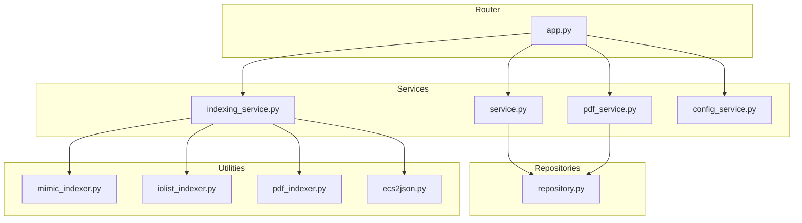

**Diagram sources**
- [app.py:1-206](file://app.py#L1-L206)
- [service.py:1-270](file://utils/service.py#L1-L270)
- [indexing_service.py:1-239](file://utils/indexing_service.py#L1-L239)
- [pdf_service.py:1-229](file://utils/pdf_service.py#L1-L229)
- [config_service.py:1-128](file://utils/config_service.py#L1-L128)
- [repository.py:1-178](file://utils/repository.py#L1-L178)
- [mimic_indexer.py:1-484](file://utils/mimic_indexer.py#L1-L484)
- [iolist_indexer.py:1-122](file://utils/iolist_indexer.py#L1-L122)
- [pdf_indexer.py:1-215](file://utils/pdf_indexer.py#L1-L215)
- [ecs2json.py:1-480](file://utils/ecs2json.py#L1-L480)

**Section sources**
- [app.py:1-206](file://app.py#L1-L206)

## Core Components
- Mimic indexer: Parses ECS7 screen mimic files (.g), extracts tags and coordinates, and builds a JSON index.
- IO list indexer: Parses Excel IO list and produces a JSON index keyed by SignalCode.
- PDF indexer: Scans PDF documents, extracts ECS7 tags per page, and builds a JSON index.
- Indexing service: Orchestrates background indexing tasks, tracks progress, and persists results.
- Repository layer: Provides cached access to mimic, tags, IO list, and PDF indices.
- Search service: Validates queries, searches across indices, enriches results, and generates annotated images.
- PDF search service: Searches PDF index and generates a consolidated PDF with watermarks.
- Config service: Provides configuration and statistics for UI.

**Section sources**
- [mimic_indexer.py:1-484](file://utils/mimic_indexer.py#L1-L484)
- [iolist_indexer.py:1-122](file://utils/iolist_indexer.py#L1-L122)
- [pdf_indexer.py:1-215](file://utils/pdf_indexer.py#L1-L215)
- [indexing_service.py:1-239](file://utils/indexing_service.py#L1-L239)
- [repository.py:1-178](file://utils/repository.py#L1-L178)
- [service.py:1-270](file://utils/service.py#L1-L270)
- [pdf_service.py:1-229](file://utils/pdf_service.py#L1-L229)
- [config_service.py:1-128](file://utils/config_service.py#L1-L128)

## Architecture Overview
The system separates concerns across layers:
- Router (app.py) handles HTTP requests and delegates to services.
- Services encapsulate business logic and orchestrate repositories and utilities.
- Repositories abstract data access and caching.
- Utilities implement specialized indexing and processing.

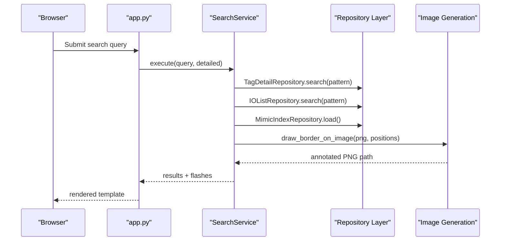

**Diagram sources**
- [app.py:92-155](file://app.py#L92-L155)
- [service.py:58-158](file://utils/service.py#L58-L158)
- [repository.py:27-94](file://utils/repository.py#L27-L94)

## Detailed Component Analysis

### Mimic Indexer
The mimic indexer parses ECS7 screen mimic files (.g) to extract tags and compute positions. It:
- Normalizes line endings and removes continuation lines
- Uses regex patterns to detect element blocks (inst, group, poly, frect, rect)
- Tracks nested groups with a stack and applies .move, .scale, and .tran transforms
- Extracts tags from userdata or renamedvars TagCode
- Aggregates positions per tag and writes a JSON index with metadata

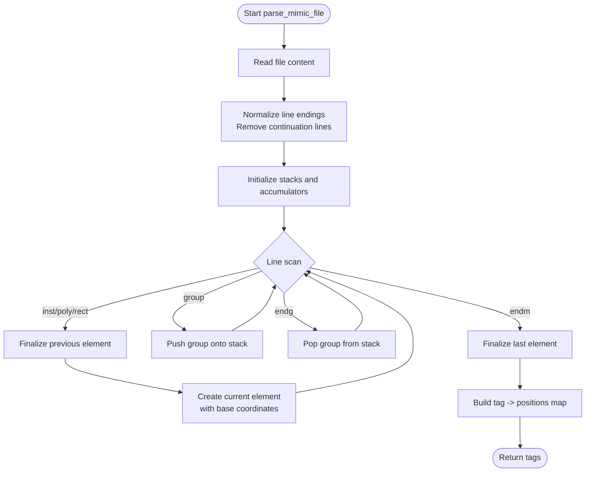

**Diagram sources**
- [mimic_indexer.py:83-360](file://utils/mimic_indexer.py#L83-L360)

Key processing logic:
- Element lifecycle: finalize element when encountering a new element or end markers
- Transform propagation: .move offsets accumulate from parent groups; .scale and .tran apply affine transforms
- Tag extraction: prioritize userdata-derived tags; fallback to renamedvars TagCode
- Output: per-tag entries include files, positions with rounded coordinates, and function type

Data validation rules:
- Tag pattern: ECS7 tag format validated by regex
- Coordinate parsing: numeric values extracted with robust regex
- Group nesting: stack ensures correct transform scoping

Background processing:
- build_index scans directory recursively, prints progress, and updates metadata

Thread safety:
- No shared mutable state during parsing; results aggregated in a single-threaded loop

**Section sources**
- [mimic_indexer.py:70-435](file://utils/mimic_indexer.py#L70-L435)

### IO List Indexer
The IO list indexer reads an Excel file and builds a JSON index keyed by SignalCode. It:
- Loads each sheet, normalizes headers, and filters rows with empty SignalCode
- Strips and normalizes values for selected columns
- Accumulates sheet names per SignalCode
- Produces metadata including total sheets, signals, and parsing time

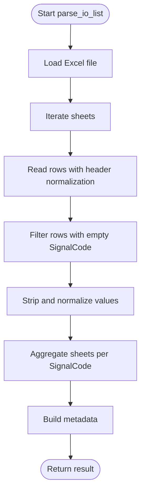

**Diagram sources**
- [iolist_indexer.py:39-97](file://utils/iolist_indexer.py#L39-L97)

Data validation rules:
- SignalCode must be present and non-empty
- Selected columns are conditionally included if present in the sheet

Background processing:
- Runs synchronously in main; can be invoked from CLI or integrated into indexing service

**Section sources**
- [iolist_indexer.py:39-118](file://utils/iolist_indexer.py#L39-L118)

### PDF Indexer
The PDF indexer scans PDFs and extracts ECS7 tags per page. It:
- Enumerates PDF files in a directory
- Iterates pages, extracts text, and finds tag occurrences
- Aggregates counts per tag per file per page
- Filters by minimum occurrence count and writes a structured JSON index

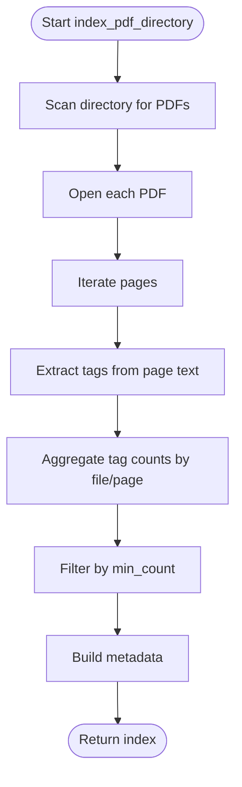

**Diagram sources**
- [pdf_indexer.py:41-131](file://utils/pdf_indexer.py#L41-L131)

Data validation rules:
- Directory existence and type checks
- Page range validation when copying pages
- Minimum occurrence threshold for inclusion

Background processing:
- Runs synchronously in main; can be integrated into indexing service

**Section sources**
- [pdf_indexer.py:41-211](file://utils/pdf_indexer.py#L41-L211)

### Indexing Service
The indexing service runs indexing tasks in background threads and exposes a shared status object for progress tracking. It:
- Starts mimic, PDF, IO list, and MDB tag extraction tasks
- Updates a thread-safe status object with task name, progress, and completion messages
- Persists results to JSON files

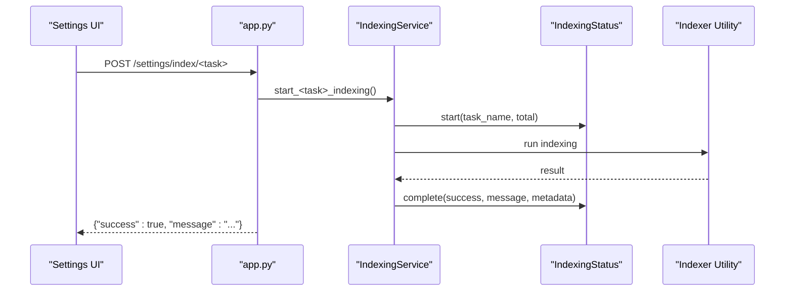

**Diagram sources**
- [app.py:172-194](file://app.py#L172-L194)
- [indexing_service.py:106-239](file://utils/indexing_service.py#L106-L239)

Thread safety:
- IndexingStatus uses a threading lock to protect shared state
- Accessor methods copy internal state to avoid race conditions

Progress tracking:
- Tasks initialize with a total count and update progress incrementally
- Completion sets progress equal to total on success

**Section sources**
- [indexing_service.py:23-78](file://utils/indexing_service.py#L23-L78)
- [indexing_service.py:106-239](file://utils/indexing_service.py#L106-L239)

### Repository Layer
The repository layer provides cached access to indices and metadata:
- MimicIndexRepository: loads mimic index JSON
- TagDetailRepository: flexible lookup with underscore variants and pattern search
- IOListRepository: cached IO list keyed by SignalCode with pattern search
- PDFIndexRepository: cached PDF index with pattern-based tag search

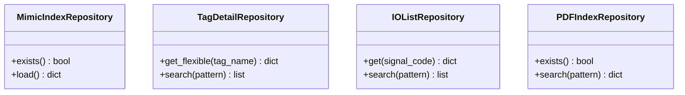

**Diagram sources**
- [repository.py:13-178](file://utils/repository.py#L13-L178)

Caching and robustness:
- Caches loaded data and resets cache on load failures
- Supports two formats for tags.json (new with metadata, old direct list)
- Pattern matching uses shell-style wildcards

**Section sources**
- [repository.py:13-178](file://utils/repository.py#L13-L178)

### Search Service
The search service validates queries, searches across indices, enriches results, and generates annotated images:
- Validates query length and allowed characters
- Searches tags.json and io_list.json with wildcard expansion
- Deduplicates names with underscore variants
- Retrieves mimic positions and groups by file
- Generates annotated PNGs and enriches with tag details and IO list data

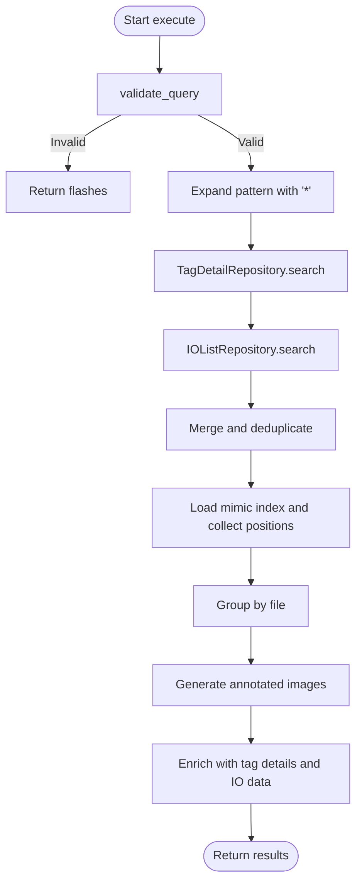

**Diagram sources**
- [service.py:46-158](file://utils/service.py#L46-L158)
- [repository.py:27-136](file://utils/repository.py#L27-L136)

Data validation rules:
- Query must be non-empty and at least 3 characters
- Allowed characters: letters, digits, asterisk, question mark, underscore

Error handling:
- Graceful handling of missing images and annotation errors
- Flash messages for warnings and info

**Section sources**
- [service.py:46-270](file://utils/service.py#L46-L270)

### PDF Search Service
The PDF search service:
- Searches PDF index for tags matching a pattern
- Builds a table of unique pages with associated tags
- Generates a consolidated PDF with corner watermark and preserves page rotations

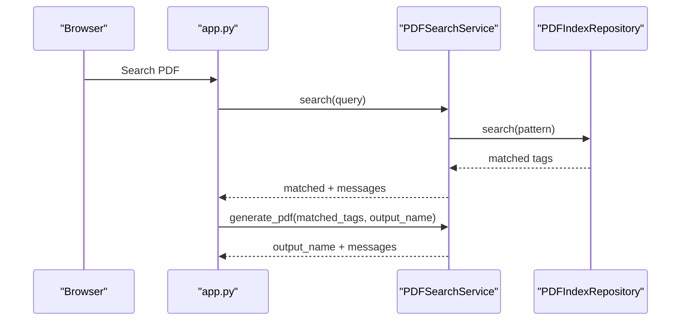

**Diagram sources**
- [app.py:119-146](file://app.py#L119-L146)
- [pdf_service.py:36-229](file://utils/pdf_service.py#L36-L229)
- [repository.py:138-178](file://utils/repository.py#L138-L178)

**Section sources**
- [pdf_service.py:36-229](file://utils/pdf_service.py#L36-L229)

### MDB Tag Extraction (via ecs2json)
The MDB extraction utility connects to ECS Access databases, joins tables, and saves a structured JSON with metadata. It:
- Loads caches for block algorithms, conversion algorithms, and engineering units
- Executes SQL queries to fetch tags and related data
- Optionally searches tags on mimics and saves to JSON

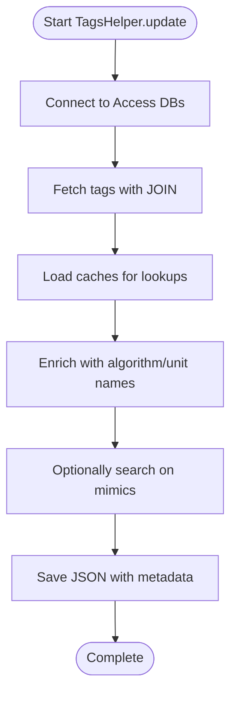

**Diagram sources**
- [ecs2json.py:256-454](file://utils/ecs2json.py#L256-L454)

**Section sources**
- [ecs2json.py:256-454](file://utils/ecs2json.py#L256-L454)

## Dependency Analysis
- Router depends on services and repositories for rendering and data access.
- Services depend on repositories for cached data and on utilities for indexing.
- Utilities are standalone and can be executed independently or via services.
- Indexing service orchestrates utilities and persists results.

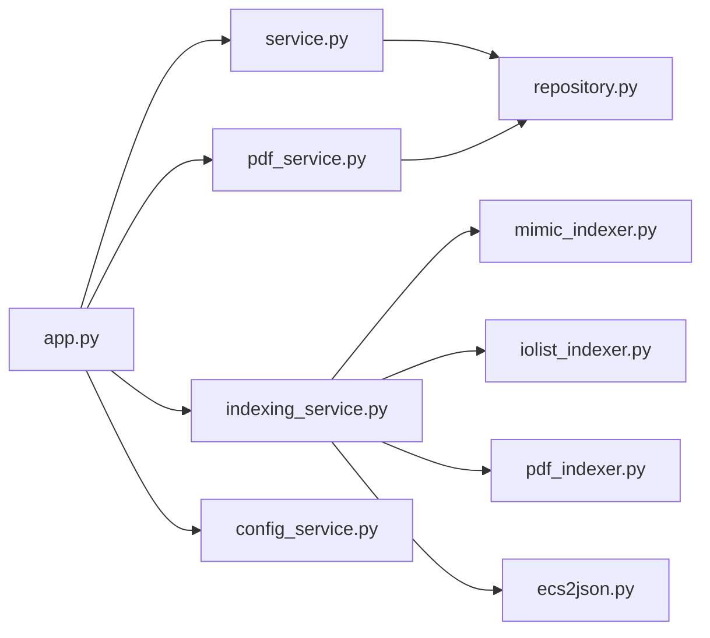

**Diagram sources**
- [app.py:1-206](file://app.py#L1-L206)
- [service.py:1-270](file://utils/service.py#L1-L270)
- [indexing_service.py:1-239](file://utils/indexing_service.py#L1-L239)
- [pdf_service.py:1-229](file://utils/pdf_service.py#L1-L229)
- [config_service.py:1-128](file://utils/config_service.py#L1-L128)
- [repository.py:1-178](file://utils/repository.py#L1-L178)
- [mimic_indexer.py:1-484](file://utils/mimic_indexer.py#L1-L484)
- [iolist_indexer.py:1-122](file://utils/iolist_indexer.py#L1-L122)
- [pdf_indexer.py:1-215](file://utils/pdf_indexer.py#L1-L215)
- [ecs2json.py:1-480](file://utils/ecs2json.py#L1-L480)

**Section sources**
- [app.py:1-206](file://app.py#L1-L206)

## Performance Considerations
- Regex-based parsing: Efficiently captures coordinates and tags; ensure patterns remain minimal and anchored to reduce backtracking.
- Caching: Repository layer caches parsed JSON to avoid repeated disk I/O.
- Background processing: Long-running tasks run in daemon threads; use IndexingStatus to track progress without blocking the UI.
- File system operations: Prefer pathlib.Path for cross-platform paths; batch directory scans and sort results to minimize overhead.
- PDF processing: PyMuPDF operations are efficient; preserve page rotations and avoid unnecessary conversions.
- Memory usage: Limit concurrent image generation; cap maximum results to control memory footprint.
- I/O throughput: Write JSON outputs in batches and close file handles promptly.

[No sources needed since this section provides general guidance]

## Troubleshooting Guide
Common issues and resolutions:
- Mimic parsing errors: Verify .g file integrity; ensure userdata and renamedvars TagCode are present where expected.
- IO list parsing errors: Confirm SignalCode column presence and non-empty values; check for sheet header normalization.
- PDF parsing errors: Validate PDF accessibility and page ranges; handle exceptions when opening documents.
- Indexing conflicts: Ensure only one indexing task runs at a time; use IndexingStatus to prevent overlapping jobs.
- Repository loading failures: Repository caches reset on exceptions; confirm JSON validity and encoding.
- Image generation failures: Check PNG availability and permissions; review annotation errors and skip lists.

**Section sources**
- [mimic_indexer.py:410-412](file://utils/mimic_indexer.py#L410-L412)
- [iolist_indexer.py:101-103](file://utils/iolist_indexer.py#L101-L103)
- [pdf_indexer.py:74-78](file://utils/pdf_indexer.py#L74-L78)
- [indexing_service.py:108-140](file://utils/indexing_service.py#L108-L140)
- [repository.py:38-62](file://utils/repository.py#L38-L62)
- [service.py:195-196](file://utils/service.py#L195-L196)

## Conclusion
ECS7Search implements a robust, layered approach to indexing and processing ECS7-related data:
- Mimic indexer extracts tags and positions from screen mimic files
- IO list indexer converts Excel data into a searchable JSON index
- PDF indexer locates ECS7 tags across documents and aggregates counts
- Indexing service coordinates background tasks with thread-safe progress tracking
- Repository layer provides cached, resilient access to indices
- Search and PDF services deliver enriched results and annotated outputs

This design enables scalable, maintainable data operations suitable for large-scale SCADA environments.