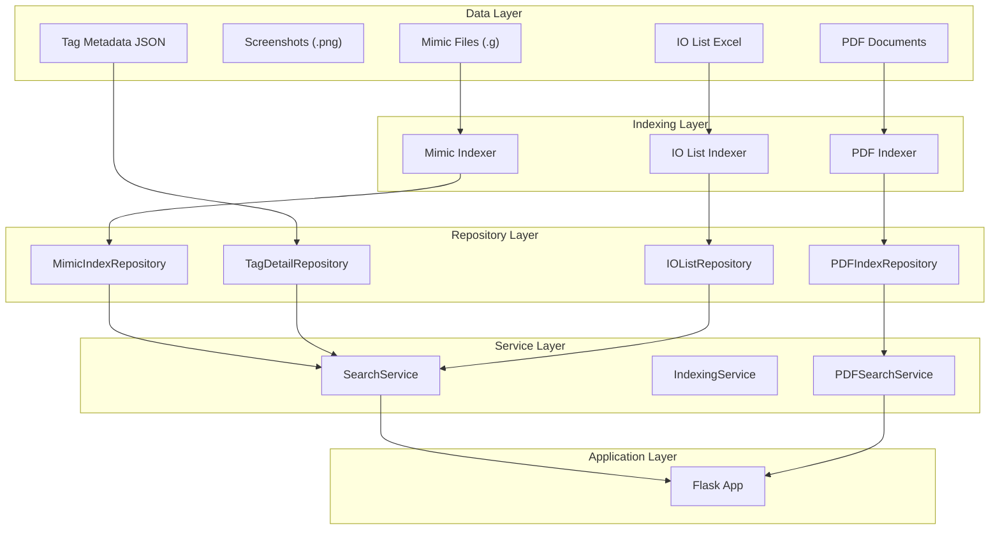
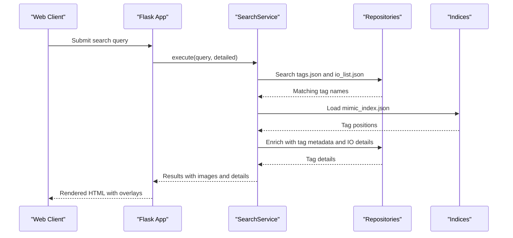
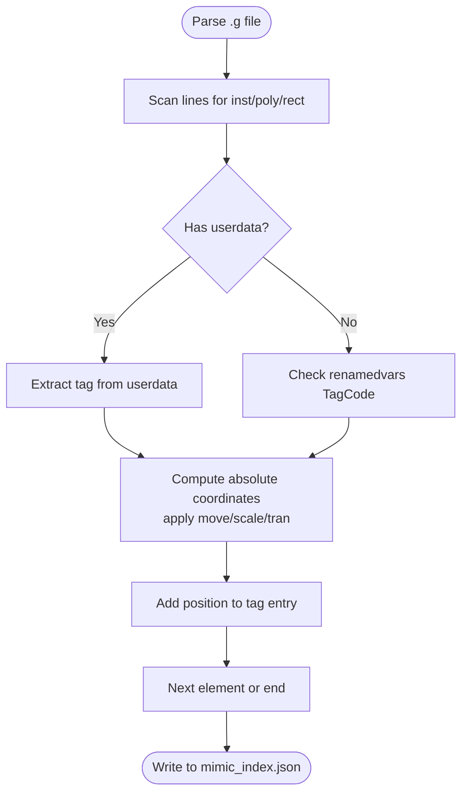
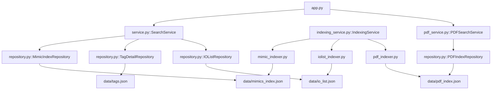

# Data Sources

<cite>
**Referenced Files in This Document**
- [mimic_indexer.py](file://utils/mimic_indexer.py)
- [iolist_indexer.py](file://utils/iolist_indexer.py)
- [pdf_indexer.py](file://utils/pdf_indexer.py)
- [repository.py](file://utils/repository.py)
- [mimic_searcher.py](file://utils/mimic_searcher.py)
- [service.py](file://utils/service.py)
- [app.py](file://app.py)
- [indexing_service.py](file://utils/indexing_service.py)
- [pdf_service.py](file://utils/pdf_service.py)
- [config_service.py](file://utils/config_service.py)
- [io_list.json](file://data/io_list.json)
- [mimics_index.json](file://data/mimics_index.json)
- [pdf_index.json](file://data/pdf_index.json)
- [tags.json](file://data/tags.json)
</cite>

## Table of Contents
1. [Introduction](#introduction)
2. [Project Structure](#project-structure)
3. [Core Components](#core-components)
4. [Architecture Overview](#architecture-overview)
5. [Detailed Component Analysis](#detailed-component-analysis)
6. [Dependency Analysis](#dependency-analysis)
7. [Performance Considerations](#performance-considerations)
8. [Troubleshooting Guide](#troubleshooting-guide)
9. [Conclusion](#conclusion)

## Introduction
This document provides comprehensive documentation for ECS7Search data sources, focusing on four primary data types: screen mimics, tag metadata, IO lists, and PDF documents. It explains the structure and purpose of each data source, the mimic index containing screen positions and tag locations, tag metadata with descriptions and PLC information, IO list data for process variables, and PDF index for document search capabilities. The document also details the data formats, field definitions, and relationships between different data sources, and how each contributes to the overall search functionality and visual tag location capabilities.

## Project Structure
The ECS7Search project organizes data sources and processing utilities in a layered architecture:
- Data sources: mimic files (.g), PNG screenshots, Excel IO lists, PDF documents, and JSON indices
- Utilities: indexing and search services for each data type
- Application layer: Flask web interface coordinating search and visualization

**Diagram sources**
- [app.py:26-84](file://app.py#L26-L84)
- [mimic_indexer.py:363-435](file://utils/mimic_indexer.py#L363-L435)
- [iolist_indexer.py:39-97](file://utils/iolist_indexer.py#L39-L97)
- [pdf_indexer.py:41-131](file://utils/pdf_indexer.py#L41-L131)
- [repository.py:13-178](file://utils/repository.py#L13-L178)
- [service.py:25-270](file://utils/service.py#L25-L270)
- [indexing_service.py:85-239](file://utils/indexing_service.py#L85-L239)
- [pdf_service.py:18-229](file://utils/pdf_service.py#L18-L229)

**Section sources**
- [app.py:26-84](file://app.py#L26-L84)

## Core Components
This section outlines the four primary data sources and their roles:

- Screen Mimics (mimic_index.json): Contains tag-to-screen position mappings extracted from ECS7 mimic files (.g). Each tag entry includes files where the tag appears and precise coordinates for visual overlay.
- Tag Metadata (tags.json): Comprehensive tag descriptions, groups, and PLC mapping details for detailed tag information during search results.
- IO List (io_list.json): Process variable data from Excel spreadsheets, including PLC, component, terminal, address, type, and purpose, enabling IO-based search and filtering.
- PDF Documents (pdf_index.json): Extracted ECS7 tag occurrences from PDF documents, including file, page, and occurrence counts for document search.

Each data source contributes to search results differently:
- Screen Mimics enable visual tag location on screenshots.
- Tag Metadata enriches results with descriptions and PLC details.
- IO List provides process variable context and IO addresses.
- PDF Documents support textual search across documentation.

**Section sources**
- [mimic_indexer.py:12-22](file://utils/mimic_indexer.py#L12-L22)
- [repository.py:13-178](file://utils/repository.py#L13-L178)
- [service.py:58-158](file://utils/service.py#L58-L158)

## Architecture Overview
The system follows a repository-service-application architecture:
- Repository layer abstracts data access for each source.
- Service layer implements business logic for search and enrichment.
- Application layer exposes web routes and integrates all components.

**Diagram sources**
- [app.py:92-155](file://app.py#L92-L155)
- [service.py:58-158](file://utils/service.py#L58-L158)
- [repository.py:13-178](file://utils/repository.py#L13-L178)

## Detailed Component Analysis

### Screen Mimics Data Source
The mimic index captures tag locations across ECS7 mimic files and their corresponding screenshot positions.

- Data format: JSON with metadata and tags structure.
- Structure:
  - metadata: directory, indexed_at, total_files, total_tags, total_positions, indexing_time_sec
  - tags: tag_name -> {files: [file.g], positions: [{file, x, y, func}]}

Key processing steps:
- Parse .g files to extract tag definitions and geometric transformations.
- Track hierarchical grouping (.group/.endg) and affine transforms (.scale/.tran).
- Compute absolute screen coordinates for each tag occurrence.
- Aggregate positions per tag across files.

**Diagram sources**
- [mimic_indexer.py:83-360](file://utils/mimic_indexer.py#L83-L360)

Field definitions:
- tag_name: ECS7 tag identifier
- files: list of .g files where the tag occurs
- positions: list of tag occurrences with:
  - file: mimic filename
  - x, y: screen coordinates (rounded to two decimals)
  - func: ECS7 function type (e.g., POINTVAL, acesys_sym_valve)

Integration with visualization:
- SearchService loads mimic_index.json and generates overlaid images for matched tags.
- mimic_searcher draws rectangles around tag positions on screenshots.

**Section sources**
- [mimic_indexer.py:12-22](file://utils/mimic_indexer.py#L12-L22)
- [mimic_indexer.py:363-435](file://utils/mimic_indexer.py#L363-L435)
- [mimic_searcher.py:42-111](file://utils/mimic_searcher.py#L42-L111)
- [service.py:101-158](file://utils/service.py#L101-L158)

### Tag Metadata Data Source
Tag metadata provides detailed descriptions and PLC mapping for tags.

- Data format: JSON with metadata and tags array.
- Structure:
  - metadata: directory, indexed_at, total_tags, indexing_time_sec
  - tags: array of tag records with fields like Tag, Groups, DescEng, DescRus, Algorithms, PLC, PLC_INP, etc.

Processing pipeline:
- Extracted from MDB via ecs2json TagsHelper (separate utility).
- Stored in tags.json for fast lookup and enrichment.

Enrichment logic:
- SearchService retrieves tag details from TagDetailRepository.
- Handles flexible naming variants (leading underscore).
- Combines with IO list data and screen occurrences for comprehensive results.

**Section sources**
- [tags.json:1-200](file://data/tags.json#L1-L200)
- [repository.py:27-94](file://utils/repository.py#L27-L94)
- [service.py:215-269](file://utils/service.py#L215-L269)

### IO List Data Source
IO list data originates from Excel spreadsheets and is transformed into a searchable JSON structure.

- Data format: JSON with metadata and signals structure.
- Structure:
  - metadata: source_file, generated_at, total_sheets, sheet_names, total_signals, parsing_time_sec
  - signals: signal_code -> {PLC, Component, IOTerminal_Short1, IOAddress, IOType, ComponentDescription, SignalPurpose, PLCDescription, JunctionBoxTerm, Revision, RevisionType, sheets: [sheet_names]}

Processing pipeline:
- iolist_indexer reads Excel sheets and normalizes headers.
- Builds a dictionary keyed by SignalCode with selected fields and sheet lists.
- Writes io_list.json for efficient search and filtering.

Search and filtering:
- IOListRepository provides pattern-based search and field extraction.
- Supports wildcard patterns for SignalCode matching.

**Section sources**
- [iolist_indexer.py:39-97](file://utils/iolist_indexer.py#L39-L97)
- [io_list.json:1-126](file://data/io_list.json#L1-L126)
- [repository.py:96-136](file://utils/repository.py#L96-L136)

### PDF Documents Data Source
PDF indexing enables textual search across ECS7 documentation.

- Data format: JSON with metadata and tags structure.
- Structure:
  - metadata: directory, indexed_at, total_files, total_tags, total_occurrences, indexing_time_sec
  - tags: tag_name -> {files: [file.pdf], positions: [{file, page, count}]}

Processing pipeline:
- pdf_indexer scans PDFs and extracts ECS7 tags using regex patterns.
- Aggregates occurrences by file and page, counting repetitions.
- Generates pdf_index.json for fast PDF search.

PDF search and generation:
- PDFSearchService searches tags by pattern and builds result tables.
- Generates a consolidated PDF with found pages and corner watermark.

**Section sources**
- [pdf_indexer.py:41-131](file://utils/pdf_indexer.py#L41-L131)
- [pdf_index.json:1-200](file://data/pdf_index.json#L1-L200)
- [repository.py:138-178](file://utils/repository.py#L138-L178)
- [pdf_service.py:36-95](file://utils/pdf_service.py#L36-L95)

## Dependency Analysis
The following diagram illustrates dependencies among components and data sources:

**Diagram sources**
- [app.py:42-63](file://app.py#L42-L63)
- [service.py:25-42](file://utils/service.py#L25-L42)
- [indexing_service.py:85-104](file://utils/indexing_service.py#L85-L104)
- [pdf_service.py:18-35](file://utils/pdf_service.py#L18-L35)
- [repository.py:13-178](file://utils/repository.py#L13-L178)
- [mimic_indexer.py:438-484](file://utils/mimic_indexer.py#L438-L484)
- [iolist_indexer.py:100-122](file://utils/iolist_indexer.py#L100-L122)
- [pdf_indexer.py:149-215](file://utils/pdf_indexer.py#L149-L215)

**Section sources**
- [app.py:42-84](file://app.py#L42-L84)
- [service.py:25-42](file://utils/service.py#L25-L42)
- [repository.py:13-178](file://utils/repository.py#L13-L178)

## Performance Considerations
- Index caching: Repository classes cache loaded JSON data to minimize repeated disk I/O.
- Pattern matching: fnmatch-based searches efficiently match wildcards across large datasets.
- Image generation limits: SearchService caps the number of generated overlay images to prevent excessive resource usage.
- Parallelization: IndexingService runs indexing tasks in separate threads to keep the UI responsive.
- Regex efficiency: PDF and mimic indexers use compiled patterns for fast tag extraction.

[No sources needed since this section provides general guidance]

## Troubleshooting Guide
Common issues and resolutions:
- Missing indices: Ensure mimic_index.json, io_list.json, and pdf_index.json exist before searching.
- Corrupted JSON: Repository classes handle exceptions by returning empty caches; regenerate indices if needed.
- Missing screenshots: mimic_searcher skips files without corresponding PNG images; verify data/mimics contains both .g and .png files.
- PDF processing errors: pdf_service logs warnings for missing files or invalid page ranges; check PDF directory and page numbers.
- Large result sets: Adjust SearchService max_results to limit image generation and improve responsiveness.

**Section sources**
- [repository.py:34-62](file://utils/repository.py#L34-L62)
- [mimic_searcher.py:128-131](file://utils/mimic_searcher.py#L128-L131)
- [pdf_service.py:159-171](file://utils/pdf_service.py#L159-L171)
- [service.py:171-197](file://utils/service.py#L171-L197)

## Conclusion
ECS7Search integrates four complementary data sources—screen mimics, tag metadata, IO lists, and PDF documents—to deliver comprehensive search capabilities. The mimic index enables precise visual tag location, while tag metadata and IO lists provide contextual information. PDF indexing extends search to documentation. The repository-service-application architecture ensures modular, maintainable, and scalable functionality, with robust error handling and performance optimizations.