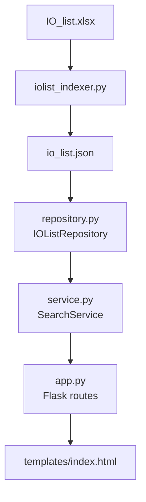
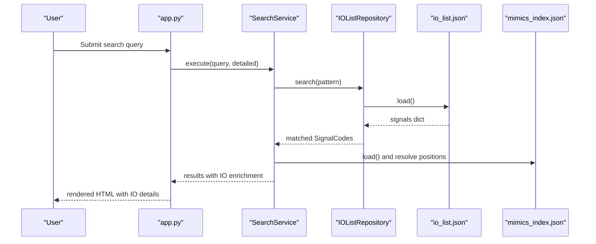
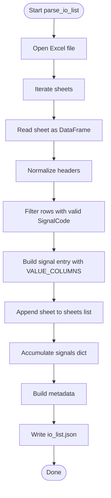
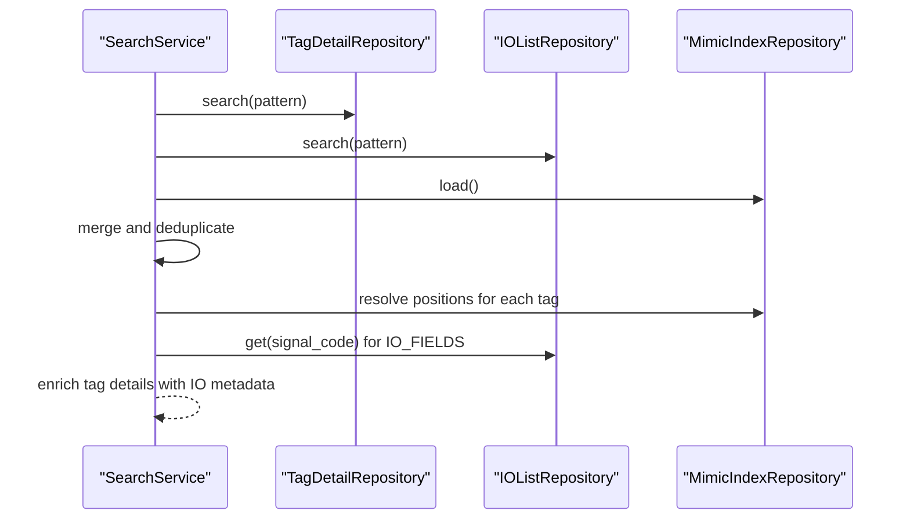
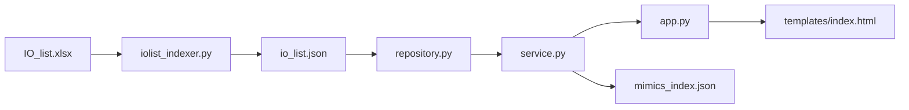

# IO Lists

<cite>
**Referenced Files in This Document**
- [io_list.json](file://data/io_list.json)
- [IO_list.xlsx](file://data/IO_list.xlsx)
- [iolist_indexer.py](file://utils/iolist_indexer.py)
- [repository.py](file://utils/repository.py)
- [service.py](file://utils/service.py)
- [indexing_service.py](file://utils/indexing_service.py)
- [app.py](file://app.py)
- [index.html](file://templates/index.html)
- [QWEN.md](file://QWEN.md)
- [pyproject.toml](file://pyproject.toml)
</cite>

## Table of Contents
1. [Introduction](#introduction)
2. [Project Structure](#project-structure)
3. [Core Components](#core-components)
4. [Architecture Overview](#architecture-overview)
5. [Detailed Component Analysis](#detailed-component-analysis)
6. [Dependency Analysis](#dependency-analysis)
7. [Performance Considerations](#performance-considerations)
8. [Troubleshooting Guide](#troubleshooting-guide)
9. [Conclusion](#conclusion)

## Introduction
This document explains the IO lists data source used by the application to enrich search results with process variable information and I/O configuration details. It covers the IO list structure, indexing pipeline, data transformation from raw spreadsheets to searchable JSON, and how IO list data integrates with mimic-based tag search results to provide operational context.

## Project Structure
The IO list feature spans a small set of files:
- Raw spreadsheet input: IO_list.xlsx
- Indexing pipeline: iolist_indexer.py
- Persistent JSON cache: io_list.json
- Repository and service layers: repository.py, service.py
- Web app integration: app.py, templates/index.html
- Supporting services: indexing_service.py
- Project metadata: pyproject.toml
- Related documentation: QWEN.md

**Diagram sources**
- [IO_list.xlsx](file://data/IO_list.xlsx)
- [iolist_indexer.py](file://utils/iolist_indexer.py)
- [io_list.json](file://data/io_list.json)
- [repository.py](file://utils/repository.py)
- [service.py](file://utils/service.py)
- [app.py](file://app.py)
- [index.html](file://templates/index.html)

**Section sources**
- [QWEN.md:1-93](file://QWEN.md#L1-L93)
- [pyproject.toml:1-19](file://pyproject.toml#L1-L19)

## Core Components
- IO list spreadsheet: IO_list.xlsx contains process variable definitions across multiple sheets (PLCs).
- Indexer: iolist_indexer.py parses the Excel file, normalizes rows, and writes io_list.json with metadata and a signals dictionary keyed by SignalCode.
- Repository: IOListRepository loads io_list.json and exposes search and retrieval APIs.
- Service: SearchService merges IO list results with mimic index results, enriches tag details with IO metadata, and prepares UI output.
- Web app: app.py wires repositories and services into Flask routes; templates/index.html renders results and IO list details.

Key IO list fields exposed to users include PLC, Component, IOTerminal_Short1, IOAddress, IOType, ComponentDescription, SignalPurpose, and sheets.

**Section sources**
- [iolist_indexer.py:24-36](file://utils/iolist_indexer.py#L24-L36)
- [repository.py:96-136](file://utils/repository.py#L96-L136)
- [service.py:215-269](file://utils/service.py#L215-L269)
- [index.html:125-135](file://templates/index.html#L125-L135)

## Architecture Overview
The IO list pipeline transforms structured spreadsheets into a fast, cached JSON index and integrates with the main search flow.

**Diagram sources**
- [app.py:92-155](file://app.py#L92-L155)
- [service.py:58-158](file://utils/service.py#L58-L158)
- [repository.py:129-136](file://utils/repository.py#L129-L136)
- [io_list.json:1-12](file://data/io_list.json#L1-L12)

## Detailed Component Analysis

### IO List Structure and Fields
The io_list.json file organizes entries under a metadata section and a signals dictionary. Each signal entry includes:
- PLC: controller identifier
- Component: equipment or subsystem identifier
- IOTerminal_Short1: terminal reference
- IOAddress: address string
- IOType: digital input/output or analog input type
- ComponentDescription: human-readable description
- SignalPurpose: functional purpose of the signal
- PLCDescription, JunctionBoxTerm, Revision, RevisionType
- sheets: list of sheet names (PLC identifiers) where the signal appears

These fields provide process context and I/O configuration that complement mimic-based tag positions.

**Section sources**
- [io_list.json:1-12](file://data/io_list.json#L1-L12)
- [io_list.json:13-29](file://data/io_list.json#L13-L29)
- [iolist_indexer.py:24-36](file://utils/iolist_indexer.py#L24-L36)

### Indexing Pipeline: From Spreadsheet to JSON
The indexer reads IO_list.xlsx, iterates sheets, normalizes headers, filters rows with empty or missing SignalCode, and aggregates per-signal fields plus a deduplicated list of sheets.

**Diagram sources**
- [iolist_indexer.py:39-97](file://utils/iolist_indexer.py#L39-L97)

**Section sources**
- [iolist_indexer.py:39-97](file://utils/iolist_indexer.py#L39-L97)

### Repository Layer: IOListRepository
The repository caches io_list.json and exposes:
- search(pattern): returns SignalCodes matching a shell-style pattern
- get(signal_code): returns a subset of fields (IO_FIELDS) for quick UI rendering
- Internal loading with caching and safe fallbacks

IO_FIELDS currently includes PLC, Component, IOTerminal_Short1, IOAddress, IOType.

**Section sources**
- [repository.py:96-136](file://utils/repository.py#L96-L136)

### Service Layer: Enrichment and Integration
SearchService merges IO list results with mimic index results:
- Validates query and auto-wraps with wildcards if needed
- Searches tags.json and io_list.json, deduplicates with underscore variants
- Resolves mimic positions for matched tags
- Builds tag details enriched with IO list data and SignalPurpose
- Generates images for matched files and prepares UI output

**Diagram sources**
- [service.py:58-158](file://utils/service.py#L58-L158)
- [service.py:215-269](file://utils/service.py#L215-L269)

**Section sources**
- [service.py:58-158](file://utils/service.py#L58-L158)
- [service.py:215-269](file://utils/service.py#L215-L269)

### Web UI Integration
The template displays IO list fields alongside mimic positions and tag details. When a tag is found only in IO list (no mimic positions), the service adds a warning and still shows a synthetic record with IO metadata.

**Section sources**
- [index.html:125-135](file://templates/index.html#L125-L135)
- [index.html:130-136](file://templates/index.html#L130-L136)
- [service.py:130-136](file://utils/service.py#L130-L136)
- [service.py:254-267](file://utils/service.py#L254-L267)

## Dependency Analysis
- iolist_indexer.py depends on pandas for Excel parsing and standard libraries for JSON and timing.
- repository.py depends on JSON and pathlib for file access and caching.
- service.py depends on mimic_searcher utilities for image generation and repository abstractions.
- app.py wires repositories and services into Flask routes.
- indexing_service.py orchestrates background indexing tasks and updates global status.

**Diagram sources**
- [pyproject.toml:6-15](file://pyproject.toml#L6-L15)
- [iolist_indexer.py:17-17](file://utils/iolist_indexer.py#L17-L17)
- [repository.py:101-120](file://utils/repository.py#L101-L120)
- [service.py:15-20](file://utils/service.py#L15-L20)
- [app.py:18-24](file://app.py#L18-L24)

**Section sources**
- [pyproject.toml:6-15](file://pyproject.toml#L6-L15)

## Performance Considerations
- Parsing: The indexer uses pandas to read Excel sheets and iterates rows once per sheet. The metadata reports parsing time and total signals processed.
- Caching: IOListRepository caches the signals dictionary in memory after first load, reducing repeated disk reads.
- Search: Pattern matching uses shell-style wildcards; the repository returns a sorted list of matched keys.
- Deduplication: SearchService deduplicates tags by normalizing underscore variants and prioritizes non-underscore forms.
- Image generation: The service limits the number of generated images to a maximum and skips problematic files with warnings.

Recommendations:
- For very large IO datasets, consider pre-filtering sheets or adding column selection to reduce memory footprint during parsing.
- Introduce field-level caching for frequently accessed IO fields if UI grows to require more fields.
- Add pagination or result truncation for extremely broad queries to keep UI responsive.

**Section sources**
- [iolist_indexer.py:83-97](file://utils/iolist_indexer.py#L83-L97)
- [repository.py:105-120](file://utils/repository.py#L105-L120)
- [service.py:82-96](file://utils/service.py#L82-L96)
- [service.py:162-198](file://utils/service.py#L162-L198)

## Troubleshooting Guide
Common issues and resolutions:
- Missing IO_list.xlsx: The indexer checks for the file’s existence and prints an error if absent.
- Empty or invalid SignalCode: Rows without a valid SignalCode are skipped during parsing.
- No mimic positions: If a tag exists in IO list but not in mimic index, the service warns and still shows IO metadata in the table.
- JSON load errors: Repositories catch exceptions and fall back to empty caches.
- Background indexing conflicts: IndexingService prevents concurrent runs and tracks status.

Operational tips:
- Ensure IO_list.xlsx is placed in the data directory before indexing.
- Use wildcard patterns (*, ?) in the UI to broaden searches.
- Verify io_list.json was generated after updating IO_list.xlsx.

**Section sources**
- [iolist_indexer.py:100-117](file://utils/iolist_indexer.py#L100-L117)
- [iolist_indexer.py:60-68](file://utils/iolist_indexer.py#L60-L68)
- [repository.py:113-120](file://utils/repository.py#L113-L120)
- [service.py:130-136](file://utils/service.py#L130-L136)
- [indexing_service.py:178-208](file://utils/indexing_service.py#L178-L208)

## Conclusion
The IO lists feature provides essential process context and I/O configuration that complements mimic-based tag search. By transforming spreadsheets into a cached JSON index and integrating with the search pipeline, the system delivers enriched results with minimal overhead. The modular design allows straightforward extension to additional fields and improved performance for large datasets.