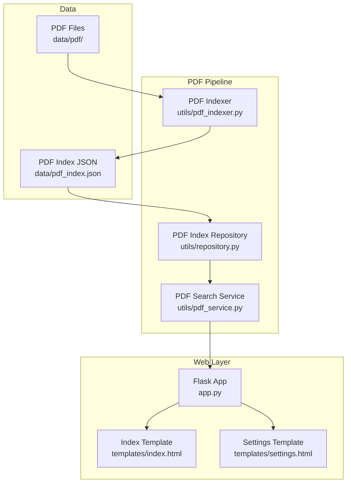
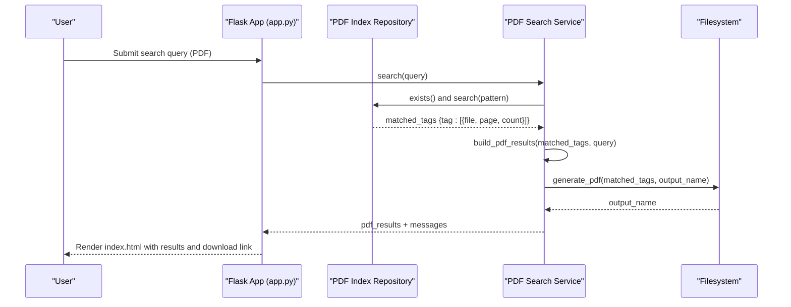
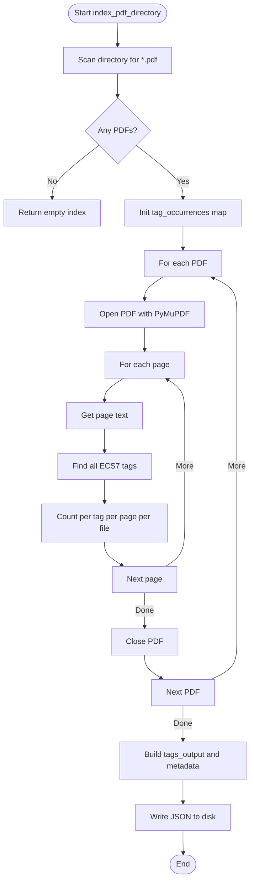
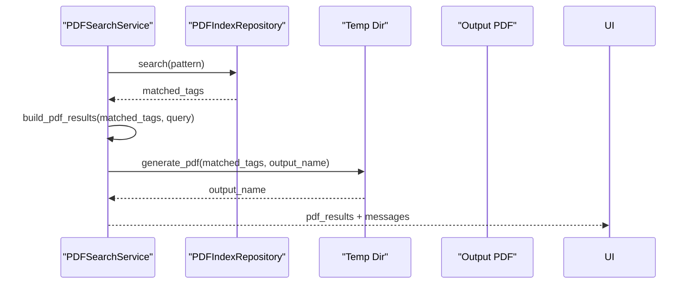
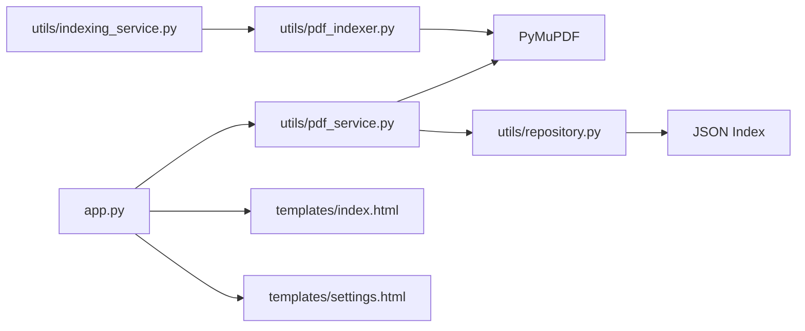

# PDF Documents

<cite>
**Referenced Files in This Document**
- [pdf_indexer.py](file://utils/pdf_indexer.py)
- [pdf_service.py](file://utils/pdf_service.py)
- [repository.py](file://utils/repository.py)
- [indexing_service.py](file://utils/indexing_service.py)
- [app.py](file://app.py)
- [index.html](file://templates/index.html)
- [settings.html](file://templates/settings.html)
- [pdf_index.json](file://data/pdf_index.json)
- [mimic_indexer.py](file://utils/mimic_indexer.py)
- [mimic_searcher.py](file://utils/mimic_searcher.py)
- [config_service.py](file://utils/config_service.py)
</cite>

## Table of Contents
1. [Introduction](#introduction)
2. [Project Structure](#project-structure)
3. [Core Components](#core-components)
4. [Architecture Overview](#architecture-overview)
5. [Detailed Component Analysis](#detailed-component-analysis)
6. [Dependency Analysis](#dependency-analysis)
7. [Performance Considerations](#performance-considerations)
8. [Troubleshooting Guide](#troubleshooting-guide)
9. [Conclusion](#conclusion)
10. [Appendices](#appendices)

## Introduction
This document explains the PDF documents data source and its search capabilities within the application. It covers the PDF index structure, the processing pipeline for extracting and indexing ECS7 tags from PDFs, and how PDF search results are presented and integrated with visual tag locations. It also compares PDF search with mimic-based search, highlighting page-level precision and document context. Finally, it addresses practical concerns such as image-based documents, encrypted PDFs, large document handling, and cross-referencing between screen mimics and document pages.

## Project Structure
The PDF subsystem consists of:
- Indexing pipeline: scans PDFs, extracts ECS7 tags, and builds a JSON index.
- Search service: queries the PDF index and generates a PDF report with page-level results.
- Web integration: exposes indexing and search via the Flask UI and settings page.
- Templates: present search results and links to generated PDF reports.

**Diagram sources**
- [pdf_indexer.py:1-215](file://utils/pdf_indexer.py#L1-L215)
- [repository.py:138-178](file://utils/repository.py#L138-L178)
- [pdf_service.py:18-229](file://utils/pdf_service.py#L18-L229)
- [app.py:88-206](file://app.py#L88-L206)
- [index.html:155-210](file://templates/index.html#L155-L210)
- [settings.html:37-182](file://templates/settings.html#L37-L182)

**Section sources**
- [pdf_indexer.py:1-215](file://utils/pdf_indexer.py#L1-L215)
- [repository.py:138-178](file://utils/repository.py#L138-L178)
- [pdf_service.py:18-229](file://utils/pdf_service.py#L18-L229)
- [app.py:88-206](file://app.py#L88-L206)
- [index.html:155-210](file://templates/index.html#L155-L210)
- [settings.html:37-182](file://templates/settings.html#L37-L182)

## Core Components
- PDF Indexer: Scans a directory of PDFs, extracts ECS7 tags from each page’s text, and produces a structured JSON index with metadata and tag-to-file/page positions.
- PDF Index Repository: Loads and searches the PDF index JSON using shell-style wildcards.
- PDF Search Service: Executes searches against the repository, builds a tabular result structure, and generates a PDF report with page thumbnails and corner markers.
- Web Integration: Exposes indexing and search via the Flask UI and settings page, rendering results and linking to generated PDFs.

Key behaviors:
- Tag extraction uses a regex pattern matching ECS7 tag syntax.
- Index stores per-tag files and per-page occurrences with counts.
- Search supports wildcard patterns and returns page-level positions.
- Generated PDF preserves original page sizes and rotations, adds a corner watermark.

**Section sources**
- [pdf_indexer.py:24-131](file://utils/pdf_indexer.py#L24-L131)
- [repository.py:164-177](file://utils/repository.py#L164-L177)
- [pdf_service.py:36-96](file://utils/pdf_service.py#L36-L96)
- [pdf_service.py:97-229](file://utils/pdf_service.py#L97-L229)

## Architecture Overview
The PDF search architecture integrates indexing, repository access, and UI rendering:

**Diagram sources**
- [app.py:119-146](file://app.py#L119-L146)
- [pdf_service.py:36-96](file://utils/pdf_service.py#L36-L96)
- [repository.py:164-177](file://utils/repository.py#L164-L177)
- [pdf_service.py:97-229](file://utils/pdf_service.py#L97-L229)
- [index.html:155-210](file://templates/index.html#L155-L210)

## Detailed Component Analysis

### PDF Indexer
Responsibilities:
- Scan a directory for PDF files.
- Open each PDF, iterate pages, extract text, and locate ECS7 tags using a compiled regex.
- Aggregate tag occurrences by file and page, counting repeats.
- Build a JSON index with metadata and a tags dictionary containing files and positions.

Index structure:
- metadata: directory path, indexed_at timestamp, total_files, total_tags, total_occurrences, indexing_time_sec.
- tags: tag_name -> {files: [file1, ...], positions: [{file, page, count}, ...]}.

Processing logic highlights:
- Uses PyMuPDF to open and iterate pages.
- Extracts text per page and applies regex to find tag matches.
- Accumulates counts per page per file per tag.
- Filters positions by a configurable minimum occurrence threshold.

**Diagram sources**
- [pdf_indexer.py:41-131](file://utils/pdf_indexer.py#L41-L131)

**Section sources**
- [pdf_indexer.py:41-131](file://utils/pdf_indexer.py#L41-L131)

### PDF Index Repository
Responsibilities:
- Load the PDF index JSON lazily with caching.
- Search tags by wildcard pattern and return tag-to-positions mapping.

Search behavior:
- Supports shell-style wildcards (* and ?).
- Returns a dictionary keyed by tag name with a list of position dictionaries.

**Section sources**
- [repository.py:138-178](file://utils/repository.py#L138-L178)

### PDF Search Service
Responsibilities:
- Validate index existence.
- Normalize query to wildcard if needed.
- Search the repository and return matched tags plus messages.
- Build a tabular result structure grouping by file and page.
- Generate a PDF report:
  - Collect unique (file, page) pairs from matched tags.
  - Sort by file and page.
  - Copy pages preserving rotation and size.
  - Insert a corner watermark image if available.
  - Save to a temporary file and return the filename and messages.

Result presentation:
- The UI template renders a table with PDF file, page, and associated tags.
- Provides a download link to the generated PDF.

**Diagram sources**
- [pdf_service.py:36-96](file://utils/pdf_service.py#L36-L96)
- [pdf_service.py:97-229](file://utils/pdf_service.py#L97-L229)

**Section sources**
- [pdf_service.py:36-96](file://utils/pdf_service.py#L36-L96)
- [pdf_service.py:97-229](file://utils/pdf_service.py#L97-L229)
- [index.html:155-210](file://templates/index.html#L155-L210)

### Web Integration and Templates
- The Flask route handles PDF search submissions, invokes the PDF service, and renders results.
- The settings page displays PDF index statistics and provides an “Index PDF” button.
- The index template presents a table of results and a download link to the generated PDF.

**Section sources**
- [app.py:119-146](file://app.py#L119-L146)
- [settings.html:37-182](file://templates/settings.html#L37-L182)
- [index.html:155-210](file://templates/index.html#L155-L210)

### Comparison: PDF Search vs Mimic-Based Search
- PDF search operates at page level and returns file/page/tag combinations with counts. It does not embed visual overlays on screenshots.
- Mimic-based search loads the mimic index, converts ECS coordinates to screenshot pixel coordinates, draws bounding boxes, and saves annotated PNGs. It provides visual tag locations on screen images.

Integration note:
- The PDF search results can be combined with mimic search results in the UI. PDF results show document context and page-level precision, while mimic search shows screen-level tag locations.

**Section sources**
- [mimic_searcher.py:42-111](file://utils/mimic_searcher.py#L42-L111)
- [mimic_indexer.py:363-435](file://utils/mimic_indexer.py#L363-L435)
- [pdf_service.py:54-96](file://utils/pdf_service.py#L54-L96)

## Dependency Analysis
High-level dependencies:
- PDF Indexer depends on PyMuPDF for text extraction and page iteration.
- PDF Search Service depends on PDF Index Repository and PyMuPDF for PDF generation.
- Flask app composes repositories, services, and templates.
- Indexing Service orchestrates background indexing tasks for PDFs.

**Diagram sources**
- [pdf_indexer.py:22](file://utils/pdf_indexer.py#L22)
- [pdf_service.py:13](file://utils/pdf_service.py#L13)
- [app.py:17-24](file://app.py#L17-L24)
- [indexing_service.py:19](file://utils/indexing_service.py#L19)

**Section sources**
- [pdf_indexer.py:22](file://utils/pdf_indexer.py#L22)
- [pdf_service.py:13](file://utils/pdf_service.py#L13)
- [app.py:17-24](file://app.py#L17-L24)
- [indexing_service.py:19](file://utils/indexing_service.py#L19)

## Performance Considerations
- Text extraction and regex scanning are linear in page text length; performance scales with document size and page count.
- Page-level aggregation and dictionary lookups are efficient; memory usage grows with unique tags and positions.
- PDF generation copies pages and inserts images; performance depends on page count and image size.
- Background indexing via the service reduces UI blocking.

Recommendations:
- Use a minimum occurrence threshold to reduce index size and improve search speed.
- Consider caching the loaded index in memory for repeated searches.
- For very large PDFs, consider segmenting or pre-processing to reduce page count.

[No sources needed since this section provides general guidance]

## Troubleshooting Guide
Common issues and resolutions:
- No PDFs found: Ensure the PDF directory exists and contains .pdf files.
- Index not found: Run the PDF indexer or trigger indexing from the settings page.
- Encrypted PDFs: PyMuPDF may fail to open encrypted files; remove encryption or unlock before indexing.
- Large documents: Indexing and PDF generation may take time; monitor progress via the settings page.
- Watermark image missing: The corner marker is optional; the PDF still contains extracted pages.
- Page out of range: The generator skips invalid page numbers and logs warnings.

**Section sources**
- [pdf_service.py:43-52](file://utils/pdf_service.py#L43-L52)
- [pdf_service.py:117-124](file://utils/pdf_service.py#L117-L124)
- [pdf_service.py:164-171](file://utils/pdf_service.py#L164-L171)
- [pdf_service.py:216-218](file://utils/pdf_service.py#L216-L218)

## Conclusion
The PDF documents data source provides robust page-level search over ECS7 tags embedded in PDF schematics. Its index structure captures document metadata, per-tag files, and per-page positions with counts. The search service delivers both tabular results and a downloadable PDF report with page thumbnails and corner markers. Compared to mimic-based search, PDF search emphasizes document context and page-level precision, while mimic search focuses on visual overlay on screen images. Together, they enable comprehensive discovery across documents and screens.

[No sources needed since this section summarizes without analyzing specific files]

## Appendices

### PDF Index Structure Reference
- metadata: directory, indexed_at, total_files, total_tags, total_occurrences, indexing_time_sec.
- tags: tag_name -> {files: [...], positions: [{file, page, count}, ...]}.

Example structure:
- See [pdf_index.json:1-200](file://data/pdf_index.json#L1-L200) for a representative excerpt.

**Section sources**
- [pdf_index.json:1-200](file://data/pdf_index.json#L1-L200)

### Supported Document Formats
- PDF: The indexer scans .pdf files and extracts text for tag detection.

**Section sources**
- [pdf_indexer.py:52-60](file://utils/pdf_indexer.py#L52-L60)

### Search Result Presentation
- Tabular results include PDF file, page number, and associated tags.
- Download link to the generated PDF report is provided in the UI.

**Section sources**
- [index.html:155-210](file://templates/index.html#L155-L210)

### Cross-Reference Between Screens and Documents
- Mimic search locates tags on screen images using coordinate conversion.
- PDF search provides page-level locations within documents.
- Users can combine both views to navigate from screen visuals to document pages.

**Section sources**
- [mimic_searcher.py:71-111](file://utils/mimic_searcher.py#L71-L111)
- [pdf_service.py:54-96](file://utils/pdf_service.py#L54-L96)