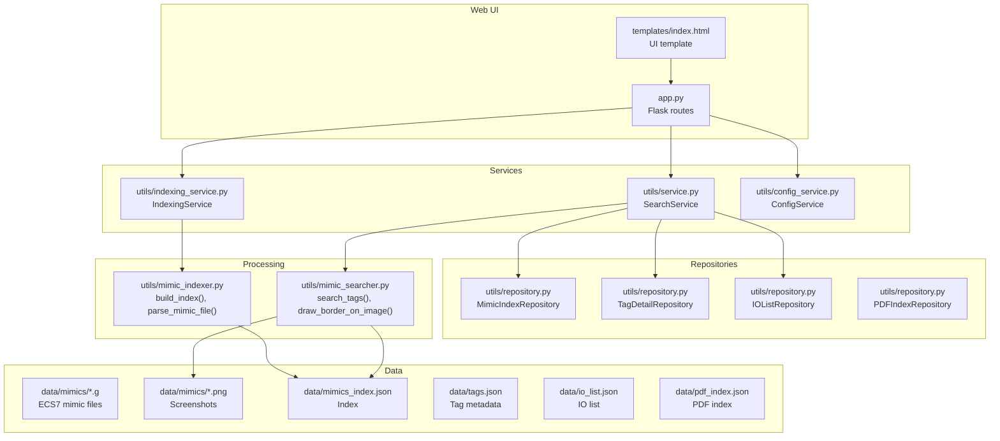
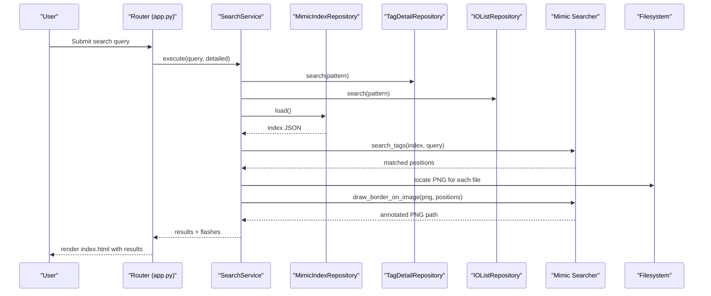
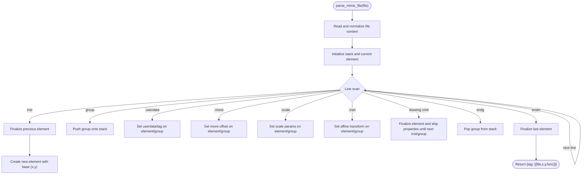
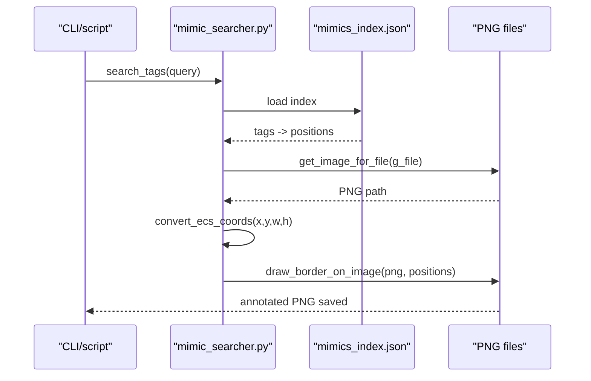
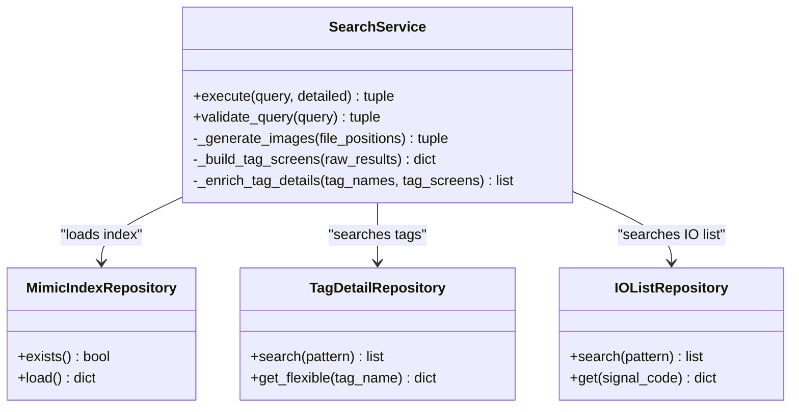
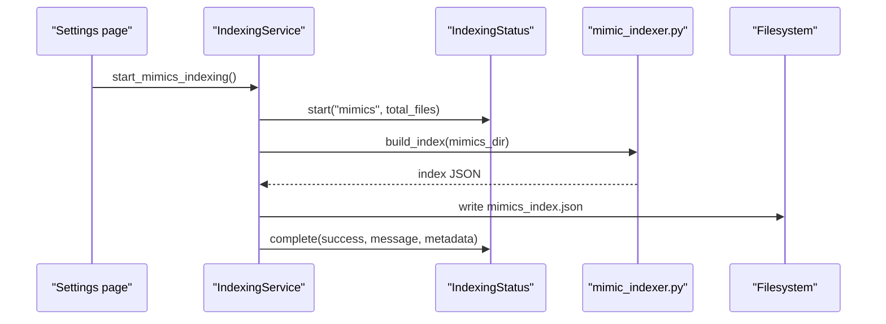
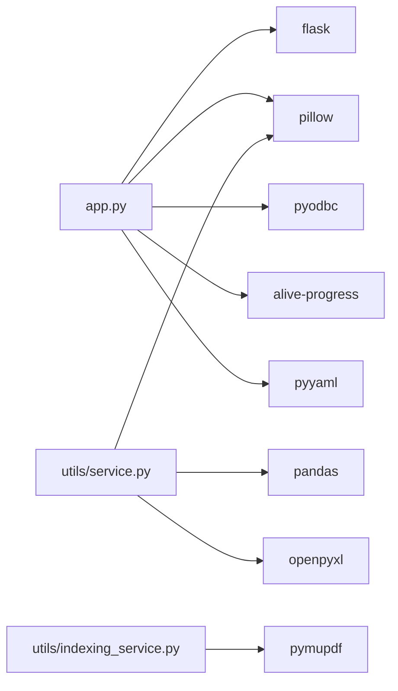

# Screen Mimics

<cite>
**Referenced Files in This Document**
- [mimic_indexer.py](file://utils/mimic_indexer.py)
- [mimic_searcher.py](file://utils/mimic_searcher.py)
- [service.py](file://utils/service.py)
- [indexing_service.py](file://utils/indexing_service.py)
- [repository.py](file://utils/repository.py)
- [app.py](file://app.py)
- [config_service.py](file://utils/config_service.py)
- [index.html](file://templates/index.html)
- [mimics_index.json](file://data/mimics_index.json)
- [_pavlik_992_group_01_.g](file://data/mimics/_pavlik_992_group_01_.g)
- [pyproject.toml](file://pyproject.toml)
</cite>

## Table of Contents
1. [Introduction](#introduction)
2. [Project Structure](#project-structure)
3. [Core Components](#core-components)
4. [Architecture Overview](#architecture-overview)
5. [Detailed Component Analysis](#detailed-component-analysis)
6. [Dependency Analysis](#dependency-analysis)
7. [Performance Considerations](#performance-considerations)
8. [Troubleshooting Guide](#troubleshooting-guide)
9. [Conclusion](#conclusion)
10. [Appendices](#appendices)

## Introduction
This document explains the screen mimics data source focused on the ECS7 mimic file processing and indexing system. It details how mimic index files are structured, how tags are positioned across multiple screen files, and how the system enables visual tag location on screenshots. It covers the mimic file format, tag extraction, coordinate transformation from ECS7 units to pixel coordinates, indexing workflows, file system integration, and performance considerations for large mimic datasets.

## Project Structure
The project organizes mimic-related logic in a layered architecture:
- Utilities for mimic parsing, searching, indexing, and repositories
- A Flask web application that exposes search and settings endpoints
- Templates for rendering results and configuration pages
- Data assets including mimic files, PNG screenshots, and JSON indices

**Diagram sources**
- [app.py:1-206](file://app.py#L1-L206)
- [service.py:1-270](file://utils/service.py#L1-L270)
- [indexing_service.py:1-239](file://utils/indexing_service.py#L1-L239)
- [repository.py:1-178](file://utils/repository.py#L1-L178)
- [mimic_indexer.py:1-484](file://utils/mimic_indexer.py#L1-L484)
- [mimic_searcher.py:1-174](file://utils/mimic_searcher.py#L1-L174)

**Section sources**
- [app.py:1-206](file://app.py#L1-L206)
- [indexing_service.py:1-239](file://utils/indexing_service.py#L1-L239)
- [service.py:1-270](file://utils/service.py#L1-L270)
- [repository.py:1-178](file://utils/repository.py#L1-L178)
- [mimic_indexer.py:1-484](file://utils/mimic_indexer.py#L1-L484)
- [mimic_searcher.py:1-174](file://utils/mimic_searcher.py#L1-L174)

## Core Components
- Mimic indexer: Scans mimic directories, parses .g files, extracts tags and positions, and writes a JSON index with metadata.
- Mimic searcher: Loads the index, searches tags by pattern, and draws bounding boxes on screenshots.
- Search service: Orchestrates tag discovery across tags.json and io_list.json, enriches results with tag metadata, and generates annotated screenshots.
- Indexing service: Runs indexing tasks in background threads and updates a global status object.
- Repositories: Provide cached access to index and metadata JSON files.
- Web app: Exposes endpoints for search, settings, and serving temporary images.

**Section sources**
- [mimic_indexer.py:363-435](file://utils/mimic_indexer.py#L363-L435)
- [mimic_searcher.py:36-111](file://utils/mimic_searcher.py#L36-L111)
- [service.py:25-270](file://utils/service.py#L25-L270)
- [indexing_service.py:85-239](file://utils/indexing_service.py#L85-L239)
- [repository.py:13-178](file://utils/repository.py#L13-L178)
- [app.py:88-206](file://app.py#L88-L206)

## Architecture Overview
The system follows a router-service-repository pattern:
- Router (Flask app) handles requests and renders templates.
- Service layer executes search logic, coordinates repositories, and triggers image generation.
- Repository layer abstracts JSON file access and caching.
- Processing utilities handle mimic parsing and screenshot annotation.

**Diagram sources**
- [app.py:92-155](file://app.py#L92-L155)
- [service.py:58-158](file://utils/service.py#L58-L158)
- [repository.py:13-77](file://utils/repository.py#L13-L77)
- [mimic_searcher.py:42-111](file://utils/mimic_searcher.py#L42-L111)

## Detailed Component Analysis

### Mimic Indexer
The indexer parses ECS7 mimic files (.g) and builds a tag-position index:
- Recognizes element blocks (inst, group, endg, endm) and property lines (.userdata, .move, .scale, .tran, renamedvars).
- Extracts tags from userdata strings and TagCode declarations.
- Computes absolute coordinates by combining base positions, .move offsets, and inherited group transforms.
- Aggregates positions per tag and writes a JSON index with metadata.

Key behaviors:
- Tag extraction uses a pattern that captures the last tag-like token in userdata.
- Group stacks track cumulative .move, .scale, and .tran transforms.
- Finalization of elements occurs on inst, group end, endm, or when encountering drawing commands.

**Diagram sources**
- [mimic_indexer.py:83-360](file://utils/mimic_indexer.py#L83-L360)

**Section sources**
- [mimic_indexer.py:33-67](file://utils/mimic_indexer.py#L33-L67)
- [mimic_indexer.py:83-360](file://utils/mimic_indexer.py#L83-L360)
- [mimic_indexer.py:363-435](file://utils/mimic_indexer.py#L363-L435)

### Mimic Searcher
The searcher loads the index, resolves tag patterns, and annotates screenshots:
- Loads mimics_index.json and filters tags by wildcard pattern.
- Groups positions by source .g file and locates corresponding PNGs.
- Converts ECS7 coordinates to pixel coordinates using a fixed screen size and flips Y.
- Draws rectangles around tag locations and saves annotated images to a temp directory.

Coordinate transformation specifics:
- ECS screen size is normalized to 137 x 77 units.
- Y-axis is flipped (top-left origin in ECS vs bottom-left in images).
- Output coordinates are rounded to integers.

**Diagram sources**
- [mimic_searcher.py:36-111](file://utils/mimic_searcher.py#L36-L111)
- [mimics_index.json:1-200](file://data/mimics_index.json#L1-L200)

**Section sources**
- [mimic_searcher.py:36-111](file://utils/mimic_searcher.py#L36-L111)
- [mimics_index.json:1-200](file://data/mimics_index.json#L1-L200)

### Search Service
The service integrates mimic search with tag and IO metadata:
- Validates queries and auto-applies wildcards.
- Searches tags.json and io_list.json for matches.
- Deduplicates names by removing leading underscores.
- Retrieves positions from mimics_index.json and groups by file.
- Generates annotated screenshots and enriches tag details with metadata and IO info.

**Diagram sources**
- [service.py:25-270](file://utils/service.py#L25-L270)
- [repository.py:13-178](file://utils/repository.py#L13-L178)

**Section sources**
- [service.py:46-158](file://utils/service.py#L46-L158)
- [service.py:162-270](file://utils/service.py#L162-L270)
- [repository.py:13-178](file://utils/repository.py#L13-L178)

### Indexing Service
The indexing service runs background tasks for mimic, PDF, IO list, and MDB tag extraction:
- Starts tasks in separate threads and updates a shared status object.
- Uses mimic indexer to write mimics_index.json.
- Uses PDF indexer to write pdf_index.json.
- Parses IO lists and writes io_list.json.
- Extracts tags from MDB and writes tags.json.

**Diagram sources**
- [indexing_service.py:106-141](file://utils/indexing_service.py#L106-L141)
- [mimic_indexer.py:363-435](file://utils/mimic_indexer.py#L363-L435)

**Section sources**
- [indexing_service.py:23-82](file://utils/indexing_service.py#L23-L82)
- [indexing_service.py:106-141](file://utils/indexing_service.py#L106-L141)

### Web Application and UI
The Flask app exposes:
- GET/POST /: search form and results
- GET /settings: configuration and stats
- POST /settings/index/<task>: trigger indexing tasks
- GET /settings/index/status: polling endpoint for indexing status
- GET /temp/<filename>: serve annotated images

The index.html template renders:
- Search form with options for mimic and PDF search, and detailed tag info
- Results gallery with annotated screenshots grouped by file
- Tag details table enriched with metadata and IO info
- Status banners for warnings and skipped files

**Section sources**
- [app.py:92-206](file://app.py#L92-L206)
- [index.html:1-261](file://templates/index.html#L1-L261)

## Dependency Analysis
External dependencies include Flask, Pillow, pandas, openpyxl, PyMuPDF, pyodbc, alive-progress, and PyYAML. These support the web framework, image manipulation, spreadsheet processing, PDF handling, database connectivity, progress reporting, and YAML parsing.

**Diagram sources**
- [pyproject.toml:6-15](file://pyproject.toml#L6-L15)

**Section sources**
- [pyproject.toml:1-19](file://pyproject.toml#L1-L19)

## Performance Considerations
- Indexing speed: The mimic indexer reports indexing time in metadata. For large mimic datasets, consider:
  - Parallelizing file scanning and parsing (current implementation is single-threaded).
  - Caching parsed content or using streaming parsers to reduce memory usage.
  - Limiting concurrent image generation to avoid I/O saturation.
- Image generation: The service caps the number of generated images per search to prevent UI overload.
- Regex-heavy parsing: Patterns are precompiled; ensure they remain efficient and avoid catastrophic backtracking.
- File system I/O: Batch operations and minimize repeated filesystem checks.

[No sources needed since this section provides general guidance]

## Troubleshooting Guide
Common issues and resolutions:
- Missing index file: Ensure mimics_index.json exists and is readable. Trigger indexing via the settings page.
- Missing PNGs: For each .g file, a corresponding .png must exist in the mimics directory; otherwise, the file is skipped with a warning.
- Invalid queries: Queries must be at least 3 characters and may include wildcard characters. Validation returns user-friendly messages.
- Large result sets: The service limits the number of generated images per search; refine the query to reduce results.
- Background indexing conflicts: Only one indexing task can run at a time; wait for completion or cancel the current task.

**Section sources**
- [service.py:46-54](file://utils/service.py#L46-L54)
- [service.py:162-198](file://utils/service.py#L162-L198)
- [indexing_service.py:108-116](file://utils/indexing_service.py#L108-L116)

## Conclusion
The screen mimics subsystem provides a robust pipeline for extracting tags from ECS7 mimic files, indexing their positions, and enabling visual tag location on screenshots. The layered design separates concerns across routing, services, repositories, and processing utilities, while the web interface offers convenient search and configuration capabilities. With careful attention to performance and error handling, the system scales to large mimic datasets and integrates seamlessly with tag and IO metadata.

## Appendices

### ECS7 Mimic File Format Notes
- Elements: inst defines functional elements with base coordinates; group/endg define hierarchical scopes; endm terminates the mimic.
- Properties: .userdata holds tag information; .move adds offsets; .scale and .tran apply transformations; renamedvars can carry TagCode.
- Example patterns: userdata tokens include tag-like sequences; drawing commands (e.g., text, line, frect) terminate current element processing.

**Section sources**
- [mimic_indexer.py:33-67](file://utils/mimic_indexer.py#L33-L67)
- [_pavlik_992_group_01_.g:18-21](file://data/mimics/_pavlik_992_group_01_.g#L18-L21)
- [_pavlik_992_group_01_.g:33-39](file://data/mimics/_pavlik_992_group_01_.g#L33-L39)
- [_pavlik_992_group_01_.g:184-195](file://data/mimics/_pavlik_992_group_01_.g#L184-L195)

### Index JSON Schema
- metadata: directory path, indexed_at timestamp, total_files, total_tags, total_positions, indexing_time_sec.
- tags: tag_name -> { files: [...], positions: [{ file, x, y, func }] }.

**Section sources**
- [mimics_index.json:1-200](file://data/mimics_index.json#L1-L200)

### Coordinate Transformation Details
- ECS screen size: 137 x 77 units.
- Y-axis flip: ECS y increases upward; image y increases downward.
- Pixel scaling: x_px = img_width / 137 * x_ecs; y_px = img_height / 77 * (77 - y_ecs).

**Section sources**
- [mimic_searcher.py:71-77](file://utils/mimic_searcher.py#L71-L77)