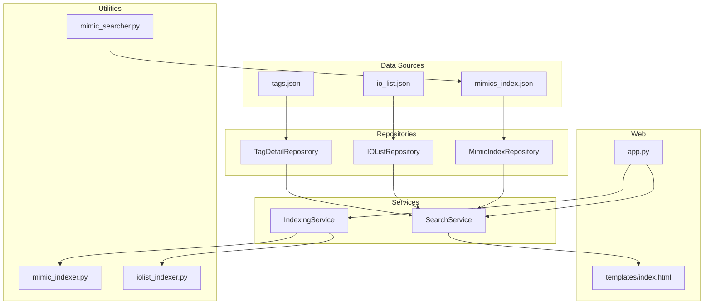
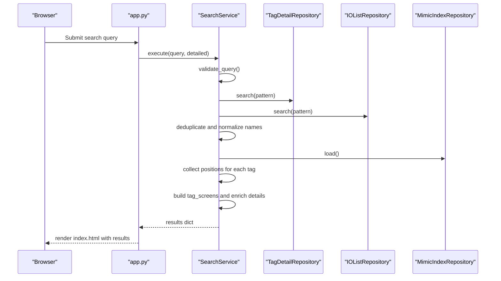
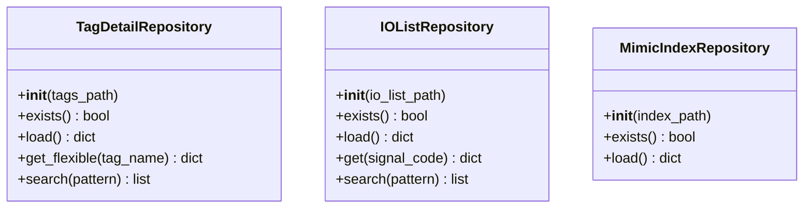
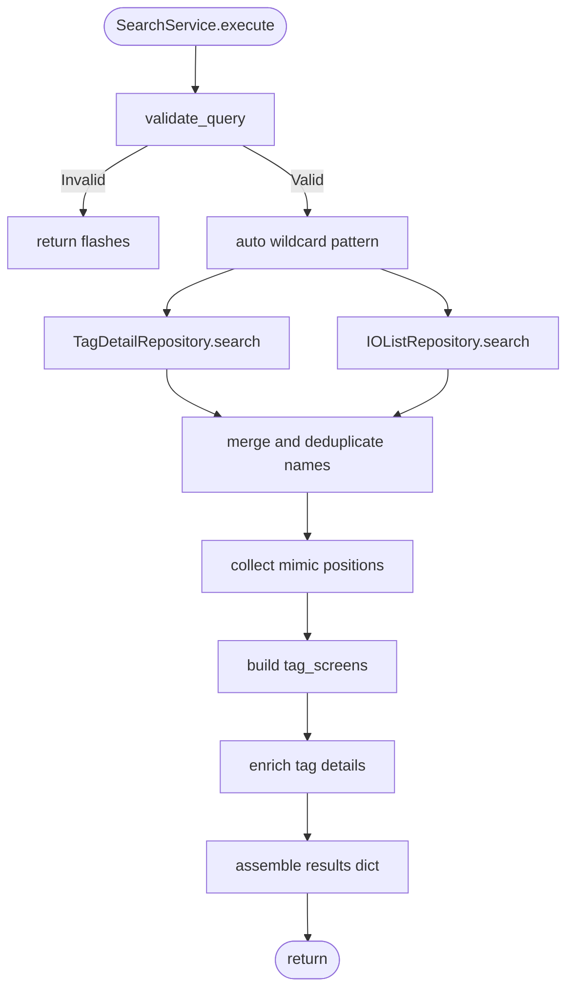
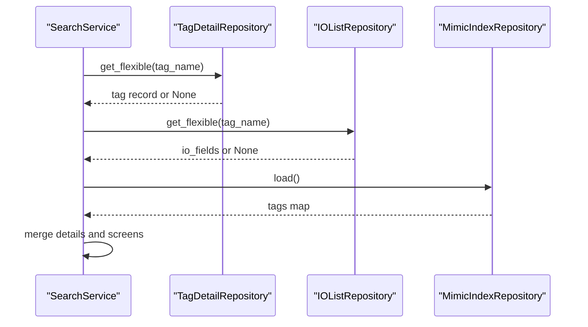
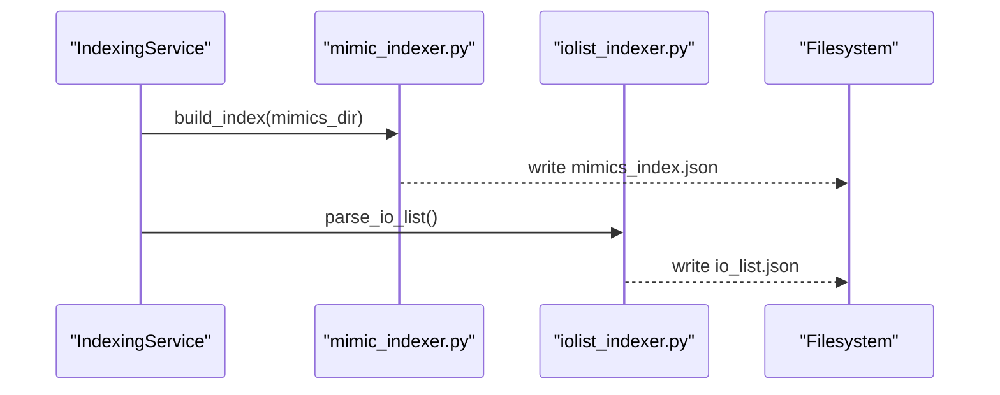
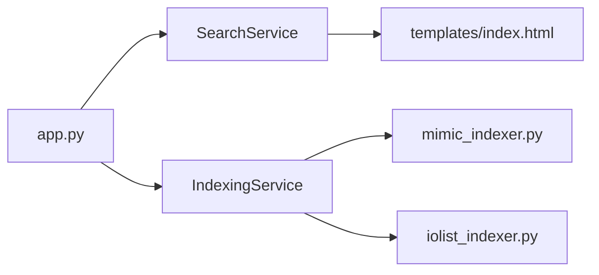
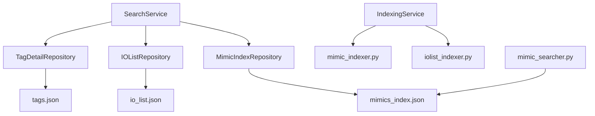

# Tag Metadata

<cite>
**Referenced Files in This Document**
- [data/io_list.json](file://data/io_list.json)
- [data/tags.json](file://data/tags.json)
- [utils/repository.py](file://utils/repository.py)
- [utils/service.py](file://utils/service.py)
- [utils/mimic_indexer.py](file://utils/mimic_indexer.py)
- [utils/iolist_indexer.py](file://utils/iolist_indexer.py)
- [utils/mimic_searcher.py](file://utils/mimic_searcher.py)
- [utils/indexing_service.py](file://utils/indexing_service.py)
- [utils/config_service.py](file://utils/config_service.py)
- [app.py](file://app.py)
- [templates/index.html](file://templates/index.html)
</cite>

## Table of Contents
1. [Introduction](#introduction)
2. [Project Structure](#project-structure)
3. [Core Components](#core-components)
4. [Architecture Overview](#architecture-overview)
5. [Detailed Component Analysis](#detailed-component-analysis)
6. [Dependency Analysis](#dependency-analysis)
7. [Performance Considerations](#performance-considerations)
8. [Troubleshooting Guide](#troubleshooting-guide)
9. [Conclusion](#conclusion)

## Introduction
This document describes the tag metadata data source that powers search results in the SCADA ECS7 search application. It focuses on how tag metadata is structured, how it enriches search results beyond visual locations, and how it integrates with mimic positions and IO list data. The metadata includes tag names, descriptions, PLC addresses, device types, and operational parameters. The document also explains validation, enrichment strategies, and integration patterns with other data sources.

## Project Structure
The tag metadata system spans several modules:
- Data sources: tags.json (tag details), io_list.json (IO list), mimics_index.json (mimic positions)
- Repositories: loading and caching of JSON data
- Services: search orchestration and enrichment
- Utilities: indexing and conversion tools
- Web interface: rendering results and statistics

**Diagram sources**
- [utils/repository.py:27-178](file://utils/repository.py#L27-L178)
- [utils/service.py:25-270](file://utils/service.py#L25-L270)
- [utils/indexing_service.py:85-239](file://utils/indexing_service.py#L85-L239)
- [utils/mimic_indexer.py:363-484](file://utils/mimic_indexer.py#L363-L484)
- [utils/iolist_indexer.py:39-122](file://utils/iolist_indexer.py#L39-L122)
- [utils/mimic_searcher.py:36-174](file://utils/mimic_searcher.py#L36-L174)
- [app.py:11-85](file://app.py#L11-L85)
- [templates/index.html:1-261](file://templates/index.html#L1-L261)

**Section sources**
- [app.py:11-85](file://app.py#L11-L85)
- [utils/repository.py:27-178](file://utils/repository.py#L27-L178)
- [utils/service.py:25-270](file://utils/service.py#L25-L270)
- [utils/indexing_service.py:85-239](file://utils/indexing_service.py#L85-L239)

## Core Components
- TagDetailRepository: loads and caches tag metadata from tags.json, supports flexible matching with leading underscore variants, and pattern-based search.
- IOListRepository: loads and caches IO list entries from io_list.json, exposes IO fields and supports pattern-based search.
- MimicIndexRepository: loads mimic index with tag-to-position mappings for screen locations.
- SearchService: orchestrates search across tag metadata and IO list, enriches results with descriptions and IO details, and groups results by screen files.
- IndexingService: runs background tasks to rebuild mimic index, IO list JSON, and extract tags from MDB sources.
- Utilities: mimic_indexer.py parses ECS7 mimic files and builds mimics_index.json; iolist_indexer.py converts Excel IO list to io_list.json; mimic_searcher.py draws highlight boxes on screenshots.

Key responsibilities:
- Tag metadata structure: Tag name, Groups, DescEng, DescRus, Algorithms, PLC, and related fields.
- IO list structure: PLC, Component, IOTerminal_Short1, IOAddress, IOType, ComponentDescription, SignalPurpose, PLCDescription, JunctionBoxTerm, Revision, RevisionType, plus sheets.
- Enrichment: SearchService merges tag metadata with IO list data and mimic positions to produce detailed results.

**Section sources**
- [utils/repository.py:27-178](file://utils/repository.py#L27-L178)
- [utils/service.py:25-270](file://utils/service.py#L25-L270)
- [utils/mimic_indexer.py:363-484](file://utils/mimic_indexer.py#L363-L484)
- [utils/iolist_indexer.py:39-122](file://utils/iolist_indexer.py#L39-L122)
- [utils/mimic_searcher.py:36-174](file://utils/mimic_searcher.py#L36-L174)

## Architecture Overview
The tag metadata pipeline integrates three primary data sources:
- tags.json: tag-level metadata including descriptions, algorithms, and PLC mapping.
- io_list.json: IO list entries with device and terminal information.
- mimics_index.json: mimic screen positions for each tag.

SearchService validates queries, searches tags and IO lists, deduplicates names, retrieves mimic positions, enriches details, and renders results.

**Diagram sources**
- [app.py:92-155](file://app.py#L92-L155)
- [utils/service.py:58-158](file://utils/service.py#L58-L158)
- [utils/repository.py:27-178](file://utils/repository.py#L27-L178)

## Detailed Component Analysis

### Tag Metadata Structure
Tag metadata is stored in tags.json with a top-level metadata block and a tags array. Each tag record includes:
- Tag: canonical tag name (may start with underscore)
- Groups: group identifier
- DescEng: English description
- DescRus: Russian description
- Algorithms: conversion/calculation/block algorithm identifiers
- PLC: structured PLC mapping including PLC number, function code, and input/output descriptors
- Additional fields such as constants and units

IO list metadata is stored in io_list.json under signals with:
- PLC, Component, IOTerminal_Short1, IOAddress, IOType
- ComponentDescription, SignalPurpose, PLCDescription
- JunctionBoxTerm, Revision, RevisionType
- sheets: list of PLC sheets where the signal appears

These structures enable contextual search beyond visual locations by combining descriptions, device types, and operational parameters.

**Section sources**
- [data/tags.json:1-200](file://data/tags.json#L1-L200)
- [data/io_list.json:13-125](file://data/io_list.json#L13-L125)

### Repository Layer
- TagDetailRepository:
  - Loads tags.json (supports new format with metadata and tags array, or legacy array format)
  - Builds cache keyed by Tag field
  - Provides flexible lookup with underscore variants
  - Supports wildcard pattern search using fnmatch
- IOListRepository:
  - Loads io_list.json signals map
  - Exposes IO fields and supports wildcard pattern search
  - Returns subset of IO fields for quick access
- MimicIndexRepository:
  - Loads mimics_index.json with metadata and tags map
  - Provides existence checks and load operations

**Diagram sources**
- [utils/repository.py:27-178](file://utils/repository.py#L27-L178)

**Section sources**
- [utils/repository.py:27-178](file://utils/repository.py#L27-L178)

### SearchService Orchestration
SearchService executes the search workflow:
- Validates query length and allowed characters
- Auto-encloses query with wildcards if not provided
- Searches tags.json and io_list.json
- Deduplicates by normalizing names (removing leading underscore)
- Retrieves mimic positions for each tag
- Groups positions by screen file
- Generates enriched details:
  - From tags.json: merge screens and IO list fields
  - From io_list.json: synthesize minimal tag record with IO fields and signal purpose
- Produces results dictionary for rendering

**Diagram sources**
- [utils/service.py:58-158](file://utils/service.py#L58-L158)

**Section sources**
- [utils/service.py:58-158](file://utils/service.py#L58-L158)

### Enrichment Strategies
- Flexible tag matching: supports names with or without leading underscore
- IO list enrichment: adds IO fields and signal purpose to tag details
- Screen coverage: lists mimic files where a tag appears
- Synthesized records: when a tag exists only in IO list, creates a minimal record with IO data and signal purpose

**Diagram sources**
- [utils/service.py:215-269](file://utils/service.py#L215-L269)
- [utils/repository.py:64-93](file://utils/repository.py#L64-L93)

**Section sources**
- [utils/service.py:215-269](file://utils/service.py#L215-L269)
- [utils/repository.py:64-93](file://utils/repository.py#L64-L93)

### Indexing and Conversion
- mimic_indexer.py:
  - Parses ECS7 mimic files (.g) and extracts tag positions
  - Builds mimics_index.json with metadata and tags map
- iolist_indexer.py:
  - Converts Excel IO list to io_list.json with signals map and metadata
- mimic_searcher.py:
  - Draws highlight rectangles around tag positions on screenshots
  - Converts ECS coordinates to screenshot pixel coordinates

**Diagram sources**
- [utils/indexing_service.py:106-208](file://utils/indexing_service.py#L106-L208)
- [utils/mimic_indexer.py:363-484](file://utils/mimic_indexer.py#L363-L484)
- [utils/iolist_indexer.py:39-122](file://utils/iolist_indexer.py#L39-L122)

**Section sources**
- [utils/indexing_service.py:106-208](file://utils/indexing_service.py#L106-L208)
- [utils/mimic_indexer.py:363-484](file://utils/mimic_indexer.py#L363-L484)
- [utils/iolist_indexer.py:39-122](file://utils/iolist_indexer.py#L39-L122)

### Web Integration and Rendering
- app.py initializes repositories and services, routes requests, and passes results to templates
- templates/index.html renders:
  - Search form with options for mimic search, PDF search, and detailed tag info
  - Results gallery with highlighted screenshots
  - Detailed table with tag metadata, IO list fields, and screen coverage
  - Status banners for warnings and messages

**Diagram sources**
- [app.py:92-155](file://app.py#L92-L155)
- [templates/index.html:1-261](file://templates/index.html#L1-L261)

**Section sources**
- [app.py:92-155](file://app.py#L92-L155)
- [templates/index.html:1-261](file://templates/index.html#L1-L261)

## Dependency Analysis
- SearchService depends on repositories for tags.json, io_list.json, and mimics_index.json
- Repositories encapsulate data loading and caching
- IndexingService orchestrates background tasks to keep indices fresh
- Utilities depend on external libraries (Pillow) for image processing

**Diagram sources**
- [utils/service.py:25-270](file://utils/service.py#L25-L270)
- [utils/repository.py:27-178](file://utils/repository.py#L27-L178)
- [utils/indexing_service.py:85-239](file://utils/indexing_service.py#L85-L239)
- [utils/mimic_searcher.py:36-174](file://utils/mimic_searcher.py#L36-L174)

**Section sources**
- [utils/service.py:25-270](file://utils/service.py#L25-L270)
- [utils/repository.py:27-178](file://utils/repository.py#L27-L178)
- [utils/indexing_service.py:85-239](file://utils/indexing_service.py#L85-L239)

## Performance Considerations
- Caching: repositories cache loaded data to avoid repeated disk reads
- Pattern matching: fnmatch-based searches are efficient for wildcard queries
- Deduplication: normalization removes underscore variants to reduce duplicates
- Limiting results: SearchService limits the number of generated images to improve responsiveness
- Background indexing: IndexingService runs tasks asynchronously to prevent UI blocking

## Troubleshooting Guide
Common issues and resolutions:
- Missing indices:
  - Ensure mimics_index.json, io_list.json, and tags.json exist and are readable
  - Use the settings page to trigger indexing tasks
- Invalid queries:
  - Queries must be at least 3 characters and contain only allowed characters
  - Wildcards are supported for pattern matching
- No results:
  - Verify that tags exist in tags.json or io_list.json
  - Confirm mimic positions exist for searched tags
- Image generation failures:
  - Check that PNG files exist for mimic files
  - Review status banners for skipped files and error messages

Validation and error handling:
- Query validation enforces minimum length and allowed characters
- Flash messages provide feedback for empty results and warnings
- Safe JSON loading prevents crashes on malformed files

**Section sources**
- [utils/service.py:46-54](file://utils/service.py#L46-L54)
- [app.py:114-155](file://app.py#L114-L155)
- [utils/config_service.py:108-128](file://utils/config_service.py#L108-L128)

## Conclusion
The tag metadata data source integrates tag descriptions, PLC information, and IO list details to enhance search results beyond visual locations. By combining tags.json, io_list.json, and mimics_index.json, the system delivers contextual insights, operational parameters, and screen coverage. The repository and service layers provide robust caching, flexible matching, and enrichment strategies, while the web interface presents results clearly with detailed tables and highlighted screenshots.