# Repository Pattern Implementation

<cite>
**Referenced Files in This Document**
- [repository.py](file://utils/repository.py)
- [service.py](file://utils/service.py)
- [app.py](file://app.py)
- [mimic_indexer.py](file://utils/mimic_indexer.py)
- [pdf_indexer.py](file://utils/pdf_indexer.py)
- [iolist_indexer.py](file://utils/iolist_indexer.py)
- [indexing_service.py](file://utils/indexing_service.py)
- [mimic_searcher.py](file://utils/mimic_searcher.py)
- [pdf_service.py](file://utils/pdf_service.py)
- [config_service.py](file://utils/config_service.py)
- [ecs2json.py](file://utils/ecs2json.py)
</cite>

## Table of Contents
1. [Introduction](#introduction)
2. [Project Structure](#project-structure)
3. [Core Components](#core-components)
4. [Architecture Overview](#architecture-overview)
5. [Detailed Component Analysis](#detailed-component-analysis)
6. [Dependency Analysis](#dependency-analysis)
7. [Performance Considerations](#performance-considerations)
8. [Troubleshooting Guide](#troubleshooting-guide)
9. [Conclusion](#conclusion)

## Introduction
This document explains the repository pattern implementation in ECS7Search, focusing on data access abstractions. The repository pattern separates data access logic from business logic, enabling clean interfaces for loading, caching, and querying structured data sources such as mimic indices, tag details, IO lists, and PDF indices. It also documents caching strategies, file system operations, and JSON parsing/validation mechanisms used across the system.

## Project Structure
The repository pattern is implemented primarily in the utils/repository.py module, with supporting services and indexers that produce the underlying data files consumed by repositories.

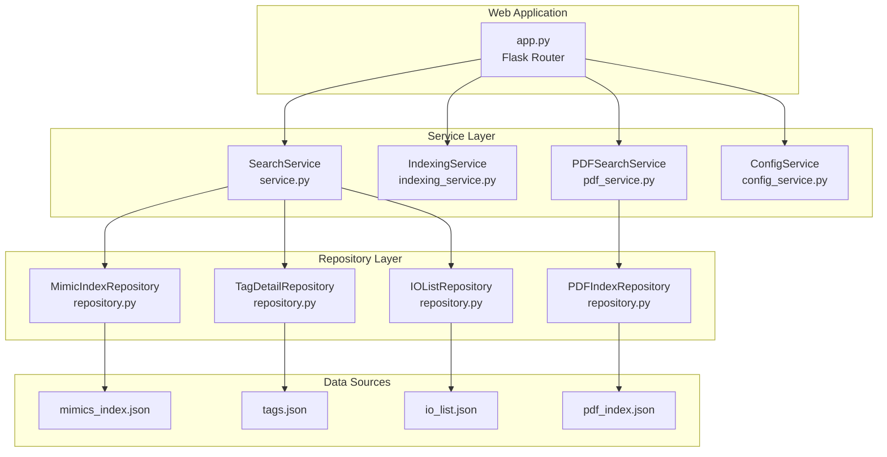

**Diagram sources**
- [app.py:88-206](file://app.py#L88-L206)
- [service.py:25-270](file://utils/service.py#L25-L270)
- [indexing_service.py:85-239](file://utils/indexing_service.py#L85-L239)
- [pdf_service.py:18-229](file://utils/pdf_service.py#L18-L229)
- [repository.py:13-178](file://utils/repository.py#L13-L178)

**Section sources**
- [app.py:26-85](file://app.py#L26-L85)
- [repository.py:13-178](file://utils/repository.py#L13-L178)

## Core Components
The repository layer consists of four specialized repositories:

- MimicIndexRepository: Loads mimic index JSON and checks existence.
- TagDetailRepository: Caches and searches tag metadata with flexible matching.
- IOListRepository: Caches IO list data and filters by SignalCode patterns.
- PDFIndexRepository: Caches PDF index and searches tags by pattern.

Each repository encapsulates:
- File system access via pathlib.Path
- JSON parsing and validation
- In-memory caching for performance
- Pattern-based search using fnmatch

**Section sources**
- [repository.py:13-178](file://utils/repository.py#L13-L178)

## Architecture Overview
The application follows a layered architecture:
- Router (Flask): app.py handles HTTP requests and routes to services.
- Service layer: Implements business logic and orchestrates repositories.
- Repository layer: Encapsulates data access and caching.
- Data sources: JSON files produced by indexers and parsers.

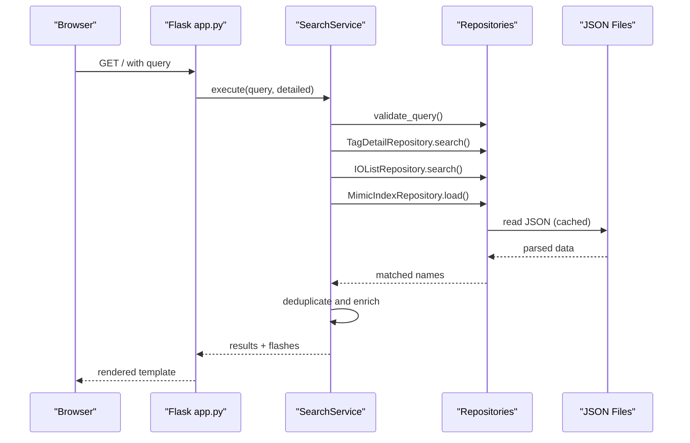

**Diagram sources**
- [app.py:92-156](file://app.py#L92-L156)
- [service.py:58-158](file://utils/service.py#L58-L158)
- [repository.py:27-178](file://utils/repository.py#L27-L178)

## Detailed Component Analysis

### Repository Layer

#### MimicIndexRepository
- Responsibilities:
  - Check existence of mimic index file.
  - Load mimic index JSON into memory.
- Caching: No in-memory cache; reads directly from disk on each load.
- Error handling: Raises exceptions on file read failures; callers should handle.

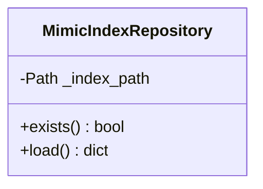

**Diagram sources**
- [repository.py:13-25](file://utils/repository.py#L13-L25)

**Section sources**
- [repository.py:13-25](file://utils/repository.py#L13-L25)

#### TagDetailRepository
- Responsibilities:
  - Load and cache tag metadata from tags.json.
  - Flexible tag lookup supporting underscore variations.
  - Pattern-based search using fnmatch.
- Caching: In-memory cache initialized lazily; cleared on exceptions.
- JSON format support: New format {"metadata": {...}, "tags": [...]} and legacy list format.

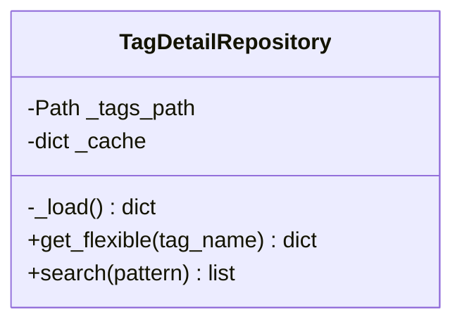

**Diagram sources**
- [repository.py:27-94](file://utils/repository.py#L27-L94)

**Section sources**
- [repository.py:27-94](file://utils/repository.py#L27-L94)

#### IOListRepository
- Responsibilities:
  - Load and cache IO list data from io_list.json.
  - Filter by SignalCode patterns.
  - Return subset of fields defined by IO_FIELDS.
- Caching: In-memory cache initialized lazily; cleared on exceptions.

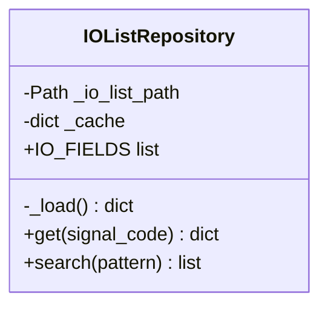

**Diagram sources**
- [repository.py:96-136](file://utils/repository.py#L96-L136)

**Section sources**
- [repository.py:96-136](file://utils/repository.py#L96-L136)

#### PDFIndexRepository
- Responsibilities:
  - Load and cache PDF index from pdf_index.json.
  - Search tags by pattern and return positions with file/page/count.
- Caching: In-memory cache initialized lazily; cleared on exceptions.

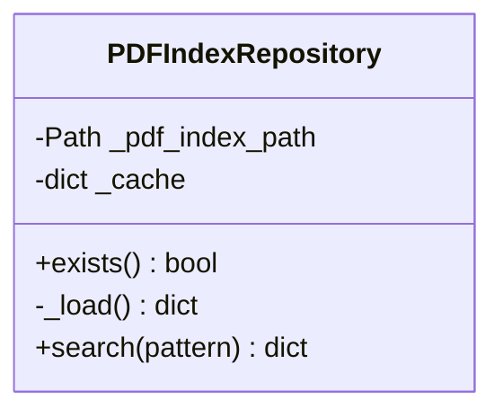

**Diagram sources**
- [repository.py:138-178](file://utils/repository.py#L138-L178)

**Section sources**
- [repository.py:138-178](file://utils/repository.py#L138-L178)

### Service Layer

#### SearchService
- Responsibilities:
  - Validates user queries.
  - Searches tags in TagDetailRepository and IOListRepository.
  - Enriches results with mimic positions from MimicIndexRepository.
  - Generates annotated images for matched positions.
  - Builds detailed tag information combining tags.json and io_list.json.
- Error handling: Returns flashes with warnings/dangers; returns None when no results.

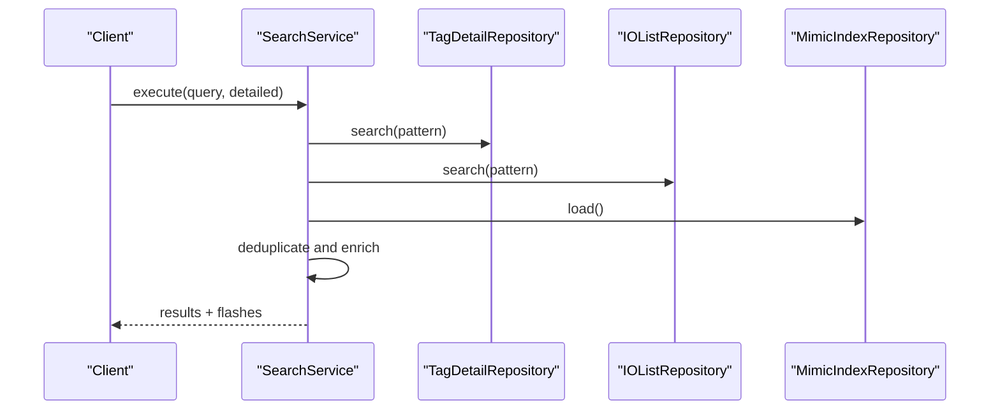

**Diagram sources**
- [service.py:58-158](file://utils/service.py#L58-L158)
- [repository.py:27-136](file://utils/repository.py#L27-L136)

**Section sources**
- [service.py:25-270](file://utils/service.py#L25-L270)

#### IndexingService
- Responsibilities:
  - Runs mimic, PDF, and IO list indexing in background threads.
  - Updates global IndexingStatus with progress and completion.
  - Saves results to JSON files.
- Concurrency: Uses threading.Lock for thread-safe status updates.

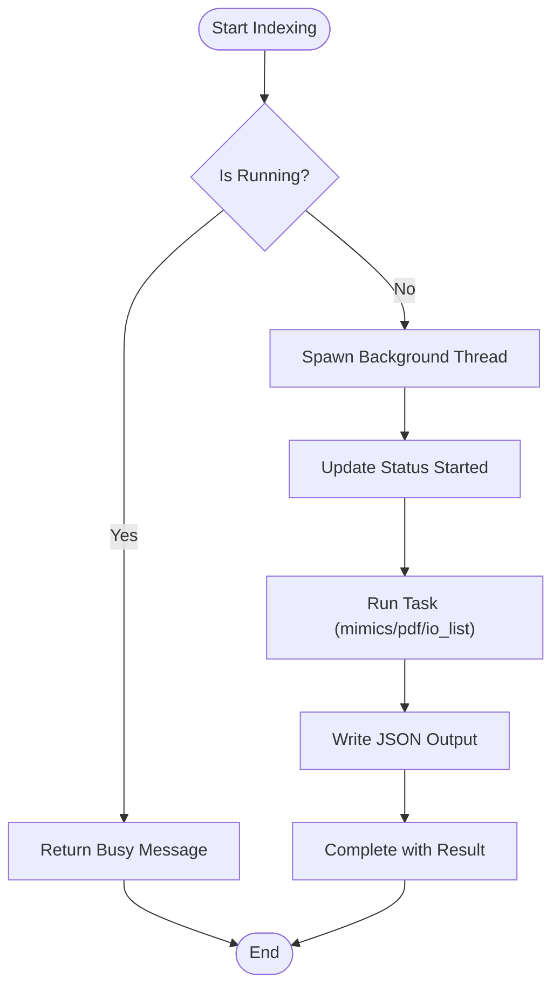

**Diagram sources**
- [indexing_service.py:106-239](file://utils/indexing_service.py#L106-L239)

**Section sources**
- [indexing_service.py:85-239](file://utils/indexing_service.py#L85-L239)

#### PDFSearchService
- Responsibilities:
  - Searches PDF index by pattern.
  - Builds PDF results table grouped by file/page.
  - Generates a consolidated PDF with corner watermark.

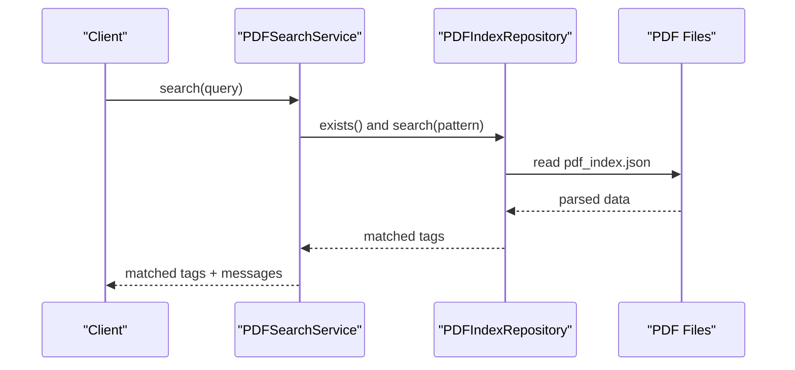

**Diagram sources**
- [pdf_service.py:36-96](file://utils/pdf_service.py#L36-L96)
- [repository.py:138-178](file://utils/repository.py#L138-L178)

**Section sources**
- [pdf_service.py:18-229](file://utils/pdf_service.py#L18-L229)

#### ConfigService
- Responsibilities:
  - Provides configuration paths and statistics for UI.
  - Safely loads JSON files and returns metadata.

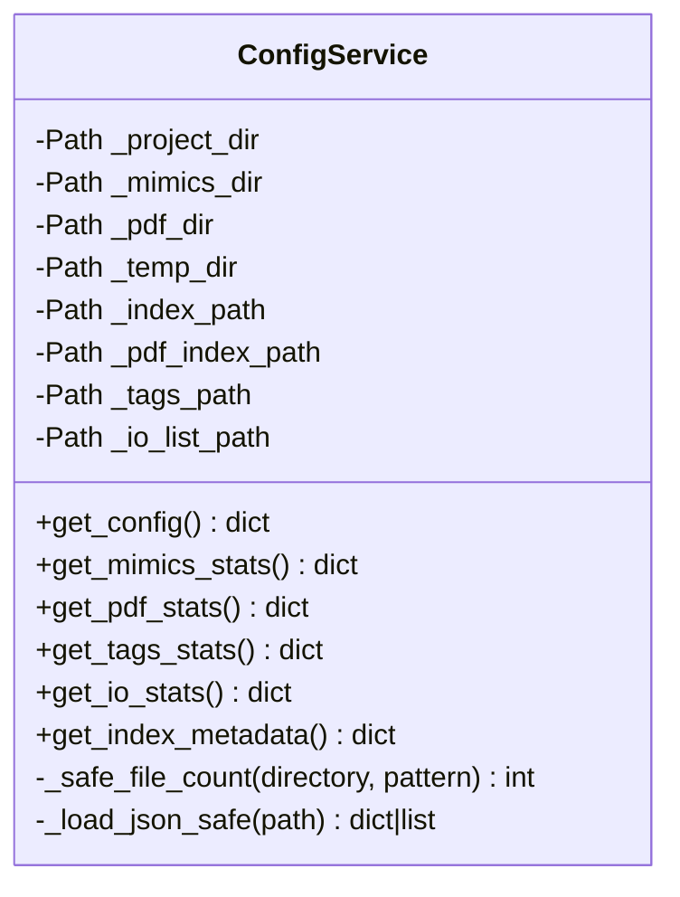

**Diagram sources**
- [config_service.py:13-128](file://utils/config_service.py#L13-L128)

**Section sources**
- [config_service.py:13-128](file://utils/config_service.py#L13-L128)

### Data Generation and Indexing

#### Mimic Indexer
- Scans .g files, extracts tags and coordinates, writes mimic index JSON.
- Supports recursive directory scanning and saves metadata.

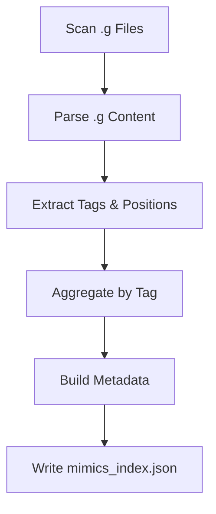

**Diagram sources**
- [mimic_indexer.py:363-435](file://utils/mimic_indexer.py#L363-L435)

**Section sources**
- [mimic_indexer.py:1-484](file://utils/mimic_indexer.py#L1-L484)

#### PDF Indexer
- Scans PDF files, extracts ECS7 tags, counts occurrences, writes PDF index JSON.

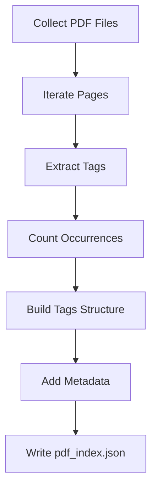

**Diagram sources**
- [pdf_indexer.py:41-131](file://utils/pdf_indexer.py#L41-L131)

**Section sources**
- [pdf_indexer.py:1-215](file://utils/pdf_indexer.py#L1-L215)

#### IO List Parser
- Reads Excel IO list, normalizes headers, builds signals dictionary with sheets.

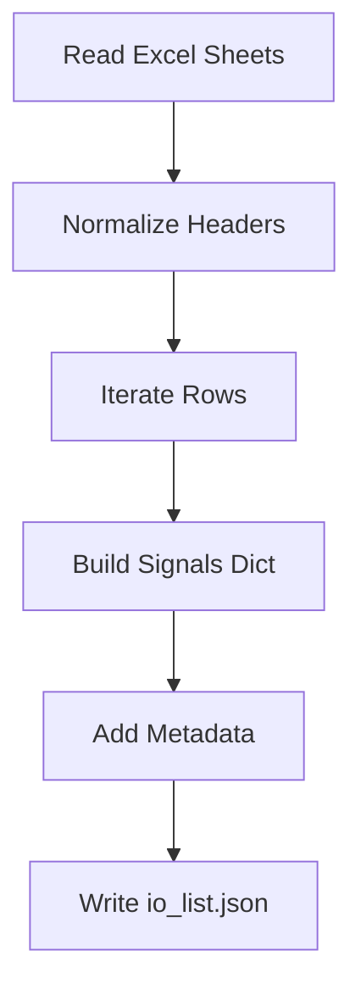

**Diagram sources**
- [iolist_indexer.py:39-97](file://utils/iolist_indexer.py#L39-L97)

**Section sources**
- [iolist_indexer.py:1-122](file://utils/iolist_indexer.py#L1-L122)

#### MDB Tag Extraction (via ecs2json.py)
- Connects to MS Access databases, joins tables, and exports tags to JSON with metadata.

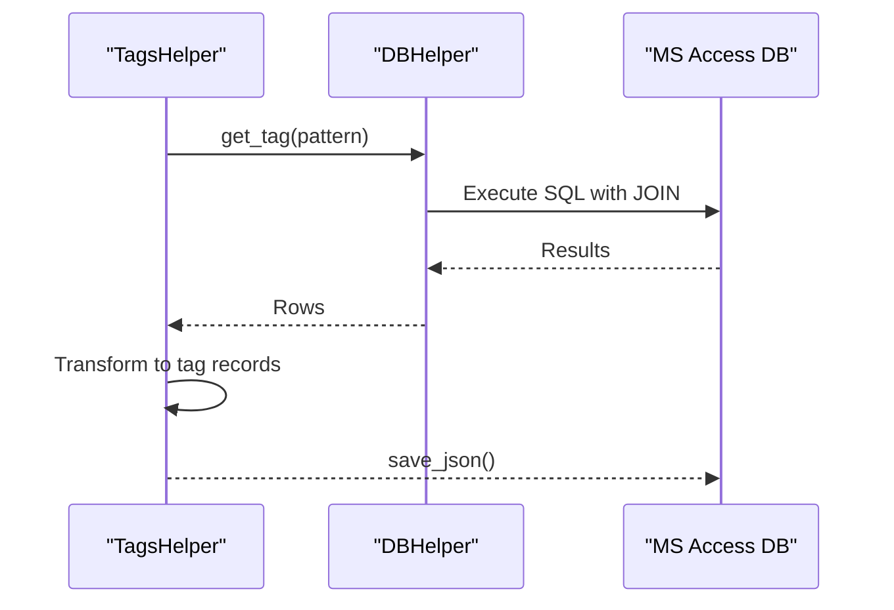

**Diagram sources**
- [ecs2json.py:159-222](file://utils/ecs2json.py#L159-L222)
- [ecs2json.py:439-454](file://utils/ecs2json.py#L439-L454)

**Section sources**
- [ecs2json.py:224-480](file://utils/ecs2json.py#L224-L480)

## Dependency Analysis
- Repositories depend only on file system and JSON parsing.
- Services depend on repositories and coordinate business logic.
- Indexers depend on external libraries (PyMuPDF, pandas, regex) and write JSON outputs.
- Router depends on services and repositories to fulfill requests.

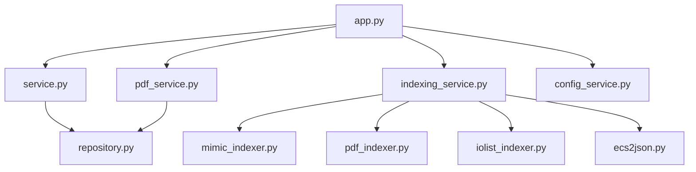

**Diagram sources**
- [app.py:18-84](file://app.py#L18-L84)
- [service.py:20-20](file://utils/service.py#L20-L20)
- [indexing_service.py:17-20](file://utils/indexing_service.py#L17-L20)
- [repository.py:13-178](file://utils/repository.py#L13-L178)

**Section sources**
- [app.py:18-84](file://app.py#L18-L84)
- [service.py:20-20](file://utils/service.py#L20-L20)
- [indexing_service.py:17-20](file://utils/indexing_service.py#L17-L20)

## Performance Considerations
- Caching: TagDetailRepository, IOListRepository, and PDFIndexRepository cache loaded JSON in memory to avoid repeated disk I/O. This improves search performance but requires careful handling of cache invalidation on exceptions.
- Lazy initialization: Repositories initialize caches on first access, reducing startup overhead.
- Pattern matching: fnmatch is used for wildcard searches; keep patterns reasonable to avoid excessive filtering.
- File operations: Indexers and services create directories and write JSON; ensure adequate disk space and permissions.
- Threading: IndexingService runs tasks in background threads with locks for status updates; avoid concurrent writes to the same JSON file.
- Image generation: SearchService limits the number of generated images to max_results to control resource usage.

[No sources needed since this section provides general guidance]

## Troubleshooting Guide
Common issues and resolutions:
- Missing index files:
  - Mimic index not found: Ensure mimic indexer has run and mimics_index.json exists.
  - PDF index not found: Ensure PDF indexer has run and pdf_index.json exists.
  - IO list not found: Ensure IO list parser has run and io_list.json exists.
- JSON parsing errors:
  - Repositories catch exceptions and return empty caches; verify JSON validity.
- Validation errors:
  - SearchService returns flashes for invalid queries (too short, unsupported characters).
- Background indexing conflicts:
  - IndexingService prevents overlapping tasks; wait for completion or check status endpoint.
- Image generation failures:
  - SearchService skips files with missing PNGs or drawing errors; verify mimic images exist and are readable.

**Section sources**
- [repository.py:42-62](file://utils/repository.py#L42-L62)
- [repository.py:113-120](file://utils/repository.py#L113-L120)
- [repository.py:156-162](file://utils/repository.py#L156-L162)
- [service.py:46-54](file://utils/service.py#L46-L54)
- [indexing_service.py:108-116](file://utils/indexing_service.py#L108-L116)
- [pdf_service.py:43-52](file://utils/pdf_service.py#L43-L52)

## Conclusion
The repository pattern in ECS7Search cleanly separates data access concerns from business logic. Repositories provide consistent interfaces for JSON-backed data sources with caching, pattern-based search, and robust error handling. Services orchestrate repository usage to deliver search results, while indexers and parsers populate the underlying data stores. This design enables scalability, maintainability, and clear separation of concerns across the application layers.