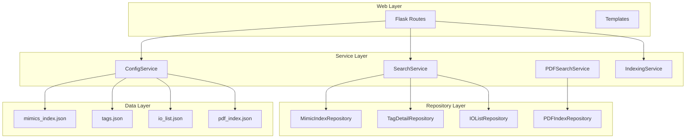

# Getting Started

<cite>
**Referenced Files in This Document**
- [README.md](file://README.md)
- [pyproject.toml](file://pyproject.toml)
- [app.py](file://app.py)
- [main.py](file://main.py)
- [templates/index.html](file://templates/index.html)
- [templates/settings.html](file://templates/settings.html)
- [static/css/style.css](file://static/css/style.css)
- [utils/config_service.py](file://utils/config_service.py)
- [utils/indexing_service.py](file://utils/indexing_service.py)
- [utils/repository.py](file://utils/repository.py)
- [utils/service.py](file://utils/service.py)
- [utils/pdf_service.py](file://utils/pdf_service.py)
- [utils/mimic_searcher.py](file://utils/mimic_searcher.py)
- [utils/mimic_indexer.py](file://utils/mimic_indexer.py)
- [utils/iolist_indexer.py](file://utils/iolist_indexer.py)
- [utils/pdf_indexer.py](file://utils/pdf_indexer.py)
- [utils/ecs2json.py](file://utils/ecs2json.py)
- [.Qwen/settings.json](file://.Qwen/settings.json)
</cite>

## Table of Contents
1. [Introduction](#introduction)
2. [Prerequisites](#prerequisites)
3. [Installation](#installation)
4. [First-Time Setup](#first-time-setup)
5. [Basic Usage](#basic-usage)
6. [Common Configuration Tasks](#common-configuration-tasks)
7. [Architecture Overview](#architecture-overview)
8. [Troubleshooting](#troubleshooting)
9. [Next Steps](#next-steps)

## Introduction
ECS7Search is a web-based SCADA ECS7 mimic and PDF tag search tool. It provides a Flask-based interface to search for ECS7 tags across mimic screen images and PDF documents, with visual highlighting of tag locations on screenshots and downloadable PDF reports.

## Prerequisites
- Python 3.10 or newer
- pip package manager
- Windows operating system (recommended) for full compatibility with Microsoft Access database support
- Basic familiarity with SCADA ECS7 systems and tag naming conventions

## Installation
1. **Install Python 3.10+**
   - Download from python.org or use your system's package manager
   - Verify installation: `python --version`

2. **Install dependencies**
   ```bash
   pip install flask pillow pandas openpyxl pymupdf pyodbc alive-progress pyyaml
   ```

3. **Verify installation**
   - Run the main entry point: `python main.py`
   - You should see a greeting message indicating successful installation

## First-Time Setup
Complete these essential steps to prepare your environment:

### 1. Prepare Data Directories
The application expects specific directory structure under the project root:

- `data/` - Main data directory containing all searchable content
- `data/mimics/` - ECS7 mimic files (.g) and corresponding screenshots (.png)
- `data/pdf/` - PDF documents containing ECS7 tag references
- `data/images/` - Contains visual assets (e.g., monkey image for PDF watermarks)
- `data/temp/` - Temporary directory for generated result images

### 2. Initial Configuration
1. **Create required directories:**
   - Create `data/mimics/`, `data/pdf/`, `data/images/`, and `data/temp/` directories
   - Place your ECS7 mimic files (.g) and corresponding PNG screenshots in `data/mimics/`
   - Place PDF documents in `data/pdf/`

2. **Prepare IO List Excel file:**
   - Copy your IO_list.xlsx file to `data/IO_list.xlsx`
   - This enables IO list indexing for cross-referencing

3. **Set up Microsoft Access database (optional but recommended):**
   - Create `data/FlsaProDb/` directory
   - Place ECS7 Access database files (SdrPoint30.mdb, SdrApAlg30.mdb, etc.) in this directory
   - This enables advanced tag extraction from the ECS7 database

### 3. Run the Application
```bash
python app.py
```

The web interface will be available at http://127.0.0.1:5000

## Basic Usage
### Searching Tags
1. **Open the web interface** at http://127.0.0.1:5000
2. **Enter a tag name or pattern** in the search box:
   - Exact match: `050FL230M01`
   - Prefix search: `050FL230M01*`
   - Wildcard search: `*AF05*`
3. **Select search options:**
   - Enable "Search by screens" for mimic searches
   - Enable "Search by PDF" for document searches
   - Enable "Detailed tag information" for comprehensive results
4. **Click "Find"** to execute the search

### Navigating Results
- **Visual highlights:** Matching tags are highlighted on screenshot images
- **Tag details:** Detailed information appears in tabular form when enabled
- **Navigation:** Click on tag names to see all occurrences across screens
- **Pagination:** Results are limited to prevent excessive loading

### Using Visual Tag Location Features
1. **Image gallery:** Results display screenshot thumbnails with yellow highlight boxes around tag positions
2. **Zoom functionality:** Hover over images to see zoom effect
3. **Tag lists:** Each screenshot shows all tags found at that location
4. **Screen navigation:** Click on tag entries to jump to specific screenshots

## Common Configuration Tasks
### Index Management
1. **Access the Settings page** at `/settings`
2. **Index Mimics:**
   - Place .g files in `data/mimics/`
   - Click "Index Screens"
   - Monitor progress in the status panel
3. **Index PDF Documents:**
   - Place PDF files in `data/pdf/`
   - Click "Index PDF"
   - Progress updates automatically
4. **Index IO List:**
   - Ensure IO_list.xlsx is in `data/`
   - Click "Index IO List"
   - Creates io_list.json for cross-referencing
5. **Extract Tags from MDB:**
   - Place Access database files in `data/FlsaProDb/`
   - Click "Extract Tags from MDB"
   - Generates tags.json with detailed tag information

### Configuration Verification
1. **Check index status:** Visit `/settings` to verify all indices are populated
2. **Verify file counts:** Confirm expected number of mimic files and PDF documents
3. **Test search functionality:** Perform a simple tag search to validate indexing

## Architecture Overview
The application follows a layered architecture with clear separation of concerns:



**Diagram sources**
- [app.py:88-206](file://app.py#L88-L206)
- [utils/service.py:25-270](file://utils/service.py#L25-L270)
- [utils/config_service.py:13-128](file://utils/config_service.py#L13-L128)
- [utils/indexing_service.py:85-239](file://utils/indexing_service.py#L85-L239)

## Troubleshooting

### Common Issues and Solutions

#### 1. Missing Dependencies
**Problem:** Import errors when running the application
**Solution:** Install missing dependencies
```bash
pip install flask pillow pandas openpyxl pymupdf pyodbc alive-progress pyyaml
```

#### 2. Database Connection Issues
**Problem:** Errors related to Microsoft Access database
**Solution:** Ensure Access database files are present in `data/FlsaProDb/`
- Required files: SdrPoint30.mdb, SdrApAlg30.mdb, SdrBlkAlg30.mdb, SdrBpAlg30.mdb, SdrSimS5Config30.mdb, SdrPntTextDyn30.mdb

#### 3. Index Not Found Errors
**Problem:** "Index not found" messages when searching
**Solution:** Generate indices using the Settings page
- Click "Index Screens" for mimic files
- Click "Index PDF" for document files
- Click "Index IO List" for IO list data

#### 4. Permission Issues
**Problem:** Cannot write to data directories
**Solution:** Ensure write permissions for the project directory
- Run command prompt as administrator if needed
- Verify antivirus is not blocking file operations

#### 5. Large Result Sets
**Problem:** Slow performance with many results
**Solution:** Refine search queries using wildcards
- Use `*prefix*` patterns instead of broad searches
- Limit results by adding more specific criteria

### Verification Steps
1. **Application startup:** Confirm no import errors when running `python app.py`
2. **Index population:** Check `/settings` shows populated statistics
3. **Search validation:** Test with known tag names from your system
4. **Visual verification:** Ensure screenshot highlighting works correctly

## Next Steps
### Advanced Usage
1. **Refine search patterns:** Use wildcard characters for more precise results
2. **Cross-reference data:** Combine mimic searches with IO list and tag database information
3. **Batch processing:** Use the CLI tools for bulk operations:
   - `python utils/mimic_indexer.py` for mimic indexing
   - `python utils/pdf_indexer.py` for PDF indexing
   - `python utils/iolist_indexer.py` for IO list processing

### Maintenance
1. **Regular updates:** Re-index data when mimic files or PDF documents change
2. **Performance monitoring:** Monitor index sizes and search response times
3. **Backup strategy:** Regularly backup index files and configuration data

### Integration
1. **Automated indexing:** Schedule periodic re-indexing using system scheduler
2. **Data synchronization:** Integrate with your ECS7 data management workflows
3. **Reporting:** Use the PDF generation feature for documentation and audit trails