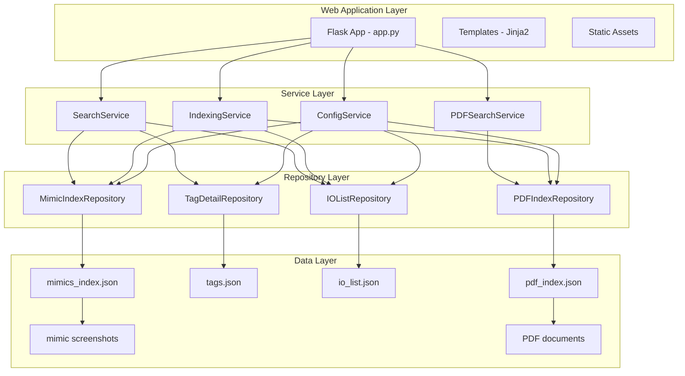
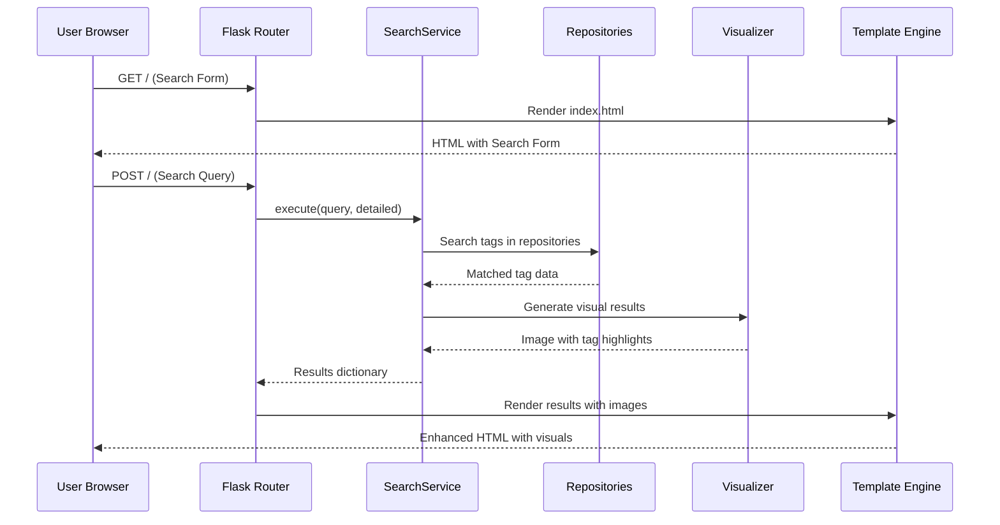
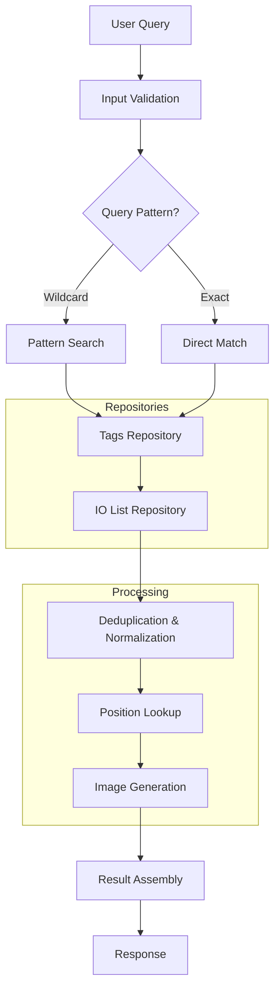
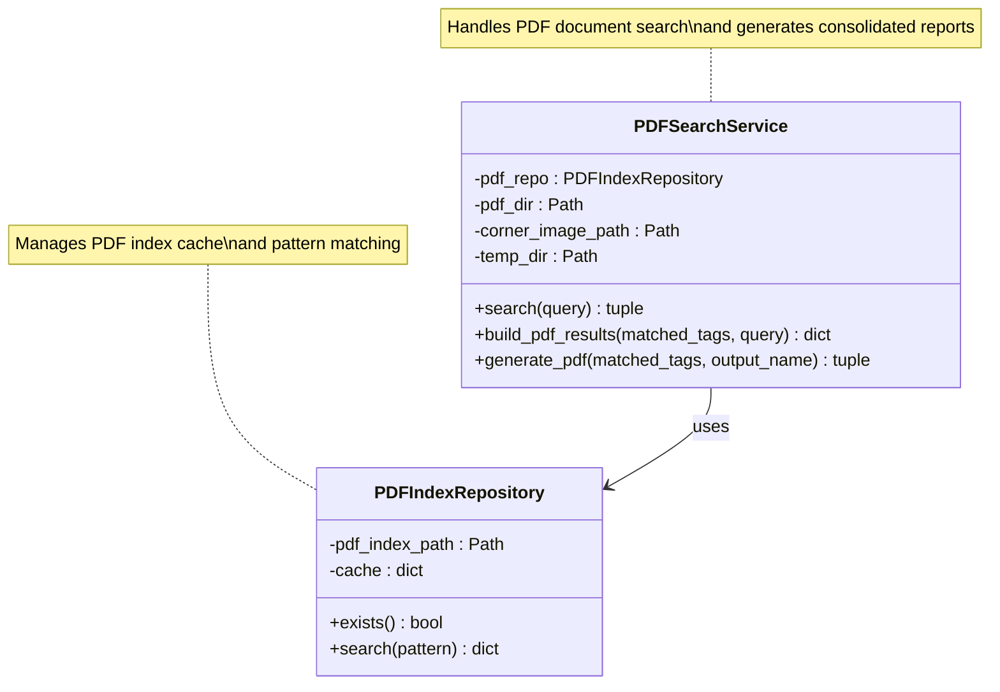
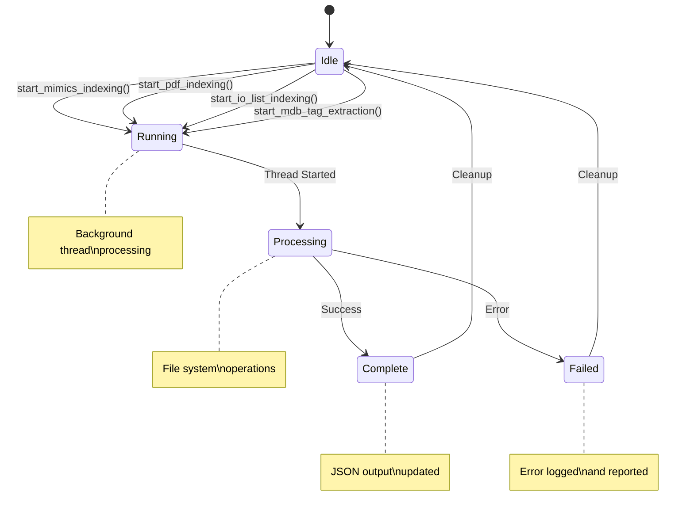
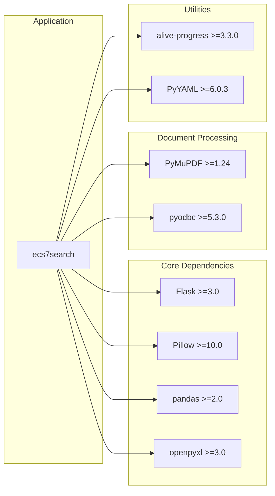

# Project Overview

<cite>
**Referenced Files in This Document**
- [README.md](file://README.md)
- [app.py](file://app.py)
- [main.py](file://main.py)
- [pyproject.toml](file://pyproject.toml)
- [QWEN.md](file://QWEN.md)
- [promt.md](file://promt.md)
- [templates/base.html](file://templates/base.html)
- [templates/index.html](file://templates/index.html)
- [templates/settings.html](file://templates/settings.html)
- [utils/service.py](file://utils/service.py)
- [utils/repository.py](file://utils/repository.py)
- [utils/config_service.py](file://utils/config_service.py)
- [utils/mimic_searcher.py](file://utils/mimic_searcher.py)
- [utils/pdf_service.py](file://utils/pdf_service.py)
- [utils/indexing_service.py](file://utils/indexing_service.py)
- [data/io_list.json](file://data/io_list.json)
</cite>

## Table of Contents
1. [Introduction](#introduction)
2. [Project Structure](#project-structure)
3. [Core Components](#core-components)
4. [Architecture Overview](#architecture-overview)
5. [Detailed Component Analysis](#detailed-component-analysis)
6. [Dependency Analysis](#dependency-analysis)
7. [Performance Considerations](#performance-considerations)
8. [Troubleshooting Guide](#troubleshooting-guide)
9. [Conclusion](#conclusion)

## Introduction

ecs7search is a web-based SCADA ECS7 tag search tool designed to help engineers and operators quickly locate process tags across screen mimics and documentation. The application provides a user-friendly interface for searching ECS7 tags, visualizing their positions on screen screenshots, and generating PDF reports for documentation purposes.

The tool serves as a bridge between SCADA ECS7 systems and modern web technologies, enabling users to efficiently navigate complex industrial control interfaces. It combines Flask backend with Jinja2 templating to deliver responsive search results with visual tag location indicators.

## Project Structure

The project follows a clean layered architecture with clear separation of concerns:

**Diagram sources**
- [app.py:88-206](file://app.py#L88-L206)
- [utils/service.py:25-270](file://utils/service.py#L25-L270)
- [utils/repository.py:13-178](file://utils/repository.py#L13-L178)

**Section sources**
- [app.py:1-206](file://app.py#L1-L206)
- [pyproject.toml:1-19](file://pyproject.toml#L1-L19)

## Core Components

### Web Application Foundation

The application is built around a Flask-based architecture that handles HTTP requests and renders dynamic content through Jinja2 templates. The main application file initializes all core services and defines routing endpoints for user interactions.

Key architectural decisions include:
- Single-file Flask application for simplicity and maintainability
- Centralized service initialization with dependency injection
- Modular routing structure supporting both search and administrative functions
- Integrated PDF generation capabilities alongside traditional mimic search

### Data Access Layer

The repository pattern provides abstraction over various data sources:
- **MimicIndexRepository**: Handles JSON index files containing tag positions on screen mimics
- **TagDetailRepository**: Manages detailed tag information from structured JSON datasets
- **IOListRepository**: Processes IO list Excel data for comprehensive tag coverage
- **PDFIndexRepository**: Manages PDF document indexing for cross-referencing

Each repository implements caching mechanisms and flexible search patterns to optimize performance while maintaining data consistency.

### Business Logic Services

The service layer encapsulates core business logic:
- **SearchService**: Coordinates multi-source tag searches across mimics, tags, and IO lists
- **PDFSearchService**: Provides PDF document search capabilities with visual watermarking
- **IndexingService**: Manages background indexing operations for all data sources
- **ConfigService**: Handles application configuration and statistics reporting

**Section sources**
- [utils/repository.py:13-178](file://utils/repository.py#L13-L178)
- [utils/service.py:25-270](file://utils/service.py#L25-L270)
- [utils/pdf_service.py:18-229](file://utils/pdf_service.py#L18-L229)
- [utils/indexing_service.py:85-239](file://utils/indexing_service.py#L85-L239)

## Architecture Overview

The system employs a three-tier architecture with clear separation between presentation, business logic, and data access layers:

**Diagram sources**
- [app.py:92-155](file://app.py#L92-L155)
- [utils/service.py:58-158](file://utils/service.py#L58-L158)

The architecture emphasizes:
- **Separation of Concerns**: Each layer has distinct responsibilities
- **Extensibility**: New data sources can be integrated through repository pattern
- **Performance**: Caching and efficient search algorithms minimize response times
- **Maintainability**: Clear module boundaries simplify debugging and updates

## Detailed Component Analysis

### Flask Application Router

The main application file serves as the central coordinator, initializing all services and defining HTTP endpoints. The routing system supports both GET and POST operations for search functionality and administrative tasks.

Key routing endpoints include:
- **GET /**: Main search interface with form rendering
- **POST /**: Search execution with result processing
- **GET /settings**: Administrative interface for index management
- **POST /settings/index/<task>**: Background indexing operations
- **GET /settings/index/status**: Real-time indexing status monitoring

The router implements comprehensive input validation and error handling to ensure robust operation under various conditions.

### Search Service Implementation

The SearchService orchestrates multi-source tag searches through a sophisticated pipeline:

**Diagram sources**
- [utils/service.py:58-158](file://utils/service.py#L58-L158)

The service implements intelligent tag matching with support for wildcard patterns and automatic normalization of tag variations. It seamlessly integrates with multiple data sources while maintaining consistent result formatting.

### PDF Search and Generation

The PDFSearchService extends the search capabilities to document-based resources:

**Diagram sources**
- [utils/pdf_service.py:18-229](file://utils/pdf_service.py#L18-L229)
- [utils/repository.py:138-178](file://utils/repository.py#L138-L178)

The PDF service provides advanced features including:
- Multi-document search with consolidated result presentation
- Automatic PDF generation with visual watermarks
- Page-level positioning with tag highlighting
- Comprehensive error handling for document processing

### Index Management System

The IndexingService manages background operations for maintaining up-to-date search indexes:

**Diagram sources**
- [utils/indexing_service.py:106-239](file://utils/indexing_service.py#L106-L239)

The system provides real-time status monitoring through a shared IndexingStatus object, enabling users to track long-running operations without blocking the main application interface.

**Section sources**
- [app.py:88-206](file://app.py#L88-L206)
- [utils/service.py:25-270](file://utils/service.py#L25-L270)
- [utils/pdf_service.py:18-229](file://utils/pdf_service.py#L18-L229)
- [utils/indexing_service.py:23-82](file://utils/indexing_service.py#L23-L82)

## Dependency Analysis

The project maintains minimal external dependencies while leveraging essential libraries for specific functionalities:

**Diagram sources**
- [pyproject.toml:6-15](file://pyproject.toml#L6-L15)

The dependency tree reflects careful selection for:
- **Web Framework**: Flask for lightweight WSGI application
- **Image Processing**: Pillow for tag visualization on screenshots
- **Excel Processing**: pandas and openpyxl for IO list parsing
- **PDF Operations**: PyMuPDF for document search and generation
- **Database Connectivity**: pyodbc for MDB database access
- **Progress Tracking**: alive-progress for user feedback
- **Configuration**: PyYAML for flexible settings management

**Section sources**
- [pyproject.toml:1-19](file://pyproject.toml#L1-L19)

## Performance Considerations

The application implements several optimization strategies:

### Caching Strategies
- Repository-level caching reduces repeated file I/O operations
- JSON index loading is optimized with lazy initialization
- Temporary image generation avoids redundant processing

### Memory Management
- Streaming PDF processing prevents memory overflow
- Progressive image generation limits concurrent operations
- Garbage collection for temporary files ensures cleanup

### Scalability Features
- Background indexing prevents UI blocking
- Modular architecture enables horizontal scaling
- Efficient search algorithms minimize computational overhead

## Troubleshooting Guide

### Common Issues and Solutions

**Index Not Found Errors**
- Verify `data/mimics_index.json` exists and is readable
- Check file permissions for the data directory
- Ensure proper JSON formatting without syntax errors

**Missing Screen Images**
- Confirm PNG screenshots exist for all referenced mimic files
- Validate file naming conventions match .g file extensions
- Check image resolution and format compatibility

**Search Performance Issues**
- Monitor available disk space in temporary directory
- Verify adequate RAM for concurrent image processing
- Consider reducing search result limits for large datasets

**PDF Generation Failures**
- Validate PDF files are accessible and not password-protected
- Check PyMuPDF installation and version compatibility
- Ensure sufficient disk space for generated PDFs

### Diagnostic Commands

For development and debugging:
- Use Flask's built-in debug mode for detailed error reporting
- Monitor application logs for runtime exceptions
- Validate JSON schemas using dedicated validation tools

**Section sources**
- [utils/config_service.py:108-128](file://utils/config_service.py#L108-L128)
- [utils/mimic_searcher.py:15-27](file://utils/mimic_searcher.py#L15-L27)

## Conclusion

ecs7search represents a comprehensive solution for SCADA ECS7 tag management, combining modern web technologies with industrial automation requirements. The application successfully bridges the gap between legacy SCADA systems and contemporary search interfaces, providing engineers and operators with powerful tools for tag discovery and documentation.

The modular architecture ensures maintainability while the multi-source search capabilities deliver comprehensive coverage of ECS7 tag information. The integration of visual tag location displays and PDF generation capabilities makes the tool invaluable for both operational tasks and documentation workflows.

Future enhancements could include advanced filtering options, export capabilities, and integration with additional SCADA systems, building upon the solid foundation established by this implementation.