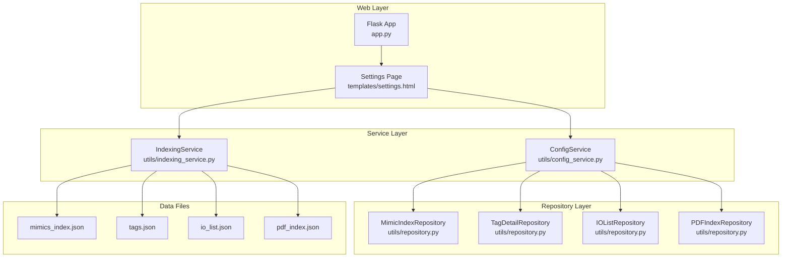
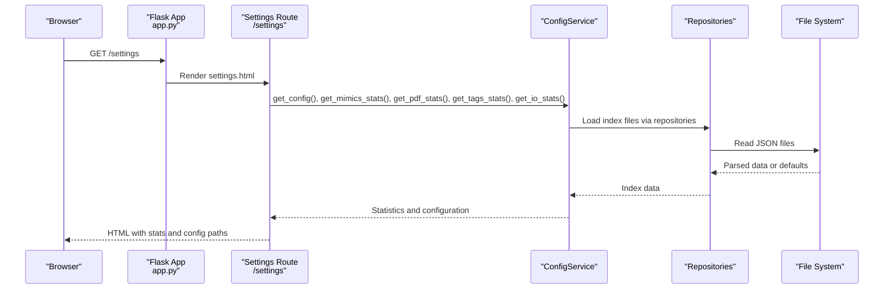
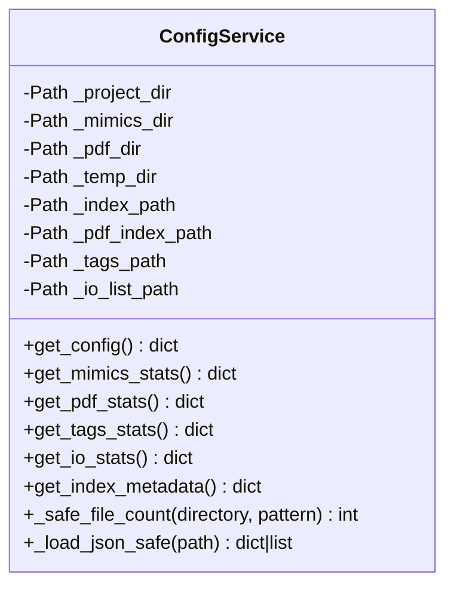
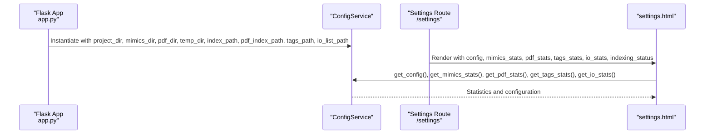
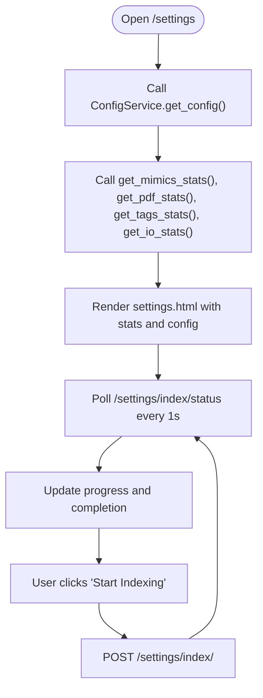
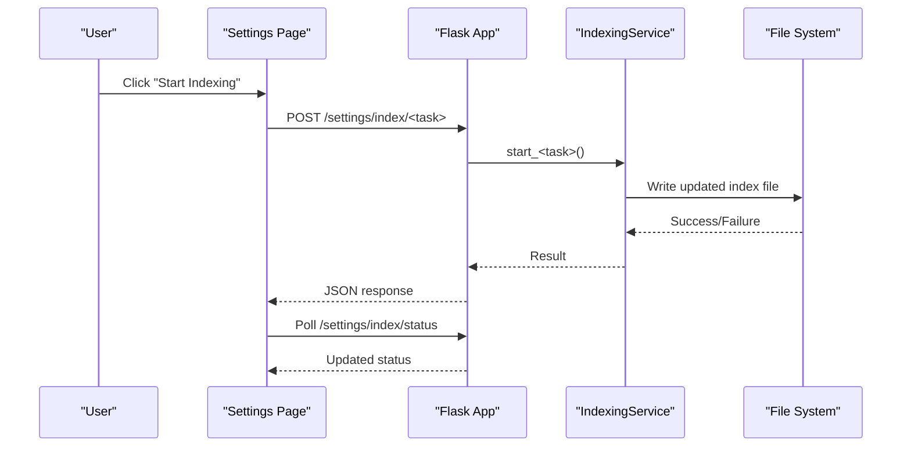
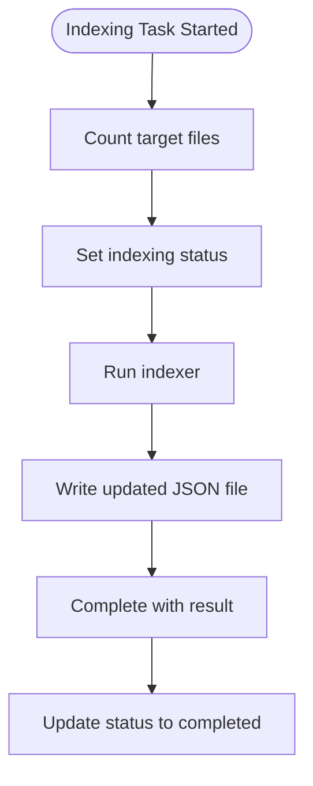
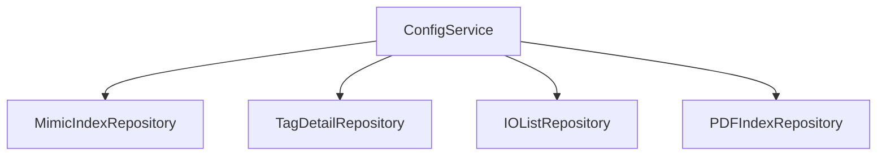

# ConfigService

<cite>
**Referenced Files in This Document**
- [config_service.py](file://utils/config_service.py)
- [app.py](file://app.py)
- [settings.html](file://templates/settings.html)
- [indexing_service.py](file://utils/indexing_service.py)
- [repository.py](file://utils/repository.py)
- [io_list.json](file://data/io_list.json)
- [settings.json](file://.qwen/settings.json)
- [pyproject.toml](file://pyproject.toml)
</cite>

## Table of Contents
1. [Introduction](#introduction)
2. [Project Structure](#project-structure)
3. [Core Components](#core-components)
4. [Architecture Overview](#architecture-overview)
5. [Detailed Component Analysis](#detailed-component-analysis)
6. [Dependency Analysis](#dependency-analysis)
7. [Performance Considerations](#performance-considerations)
8. [Troubleshooting Guide](#troubleshooting-guide)
9. [Conclusion](#conclusion)

## Introduction
This document provides comprehensive documentation for the ConfigService component, focusing on system configuration management and settings persistence. It explains how configuration is loaded, validated, and updated, describes the configuration file structure, default values, and environment-specific overrides. It also covers integration with the Flask application configuration, settings page functionality, runtime configuration changes, security considerations, configuration backup, and migration strategies for configuration updates.

## Project Structure
The project follows a layered architecture with clear separation of concerns:
- Router layer (Flask): routes requests and renders templates.
- Service layer: business logic and orchestration.
- Repository layer: data access and caching.
- Utilities: shared services like ConfigService and indexing services.

Key configuration-related files and their roles:
- ConfigService: centralizes configuration paths and statistics retrieval.
- Flask app initialization: defines default paths and instantiates ConfigService.
- Settings template: displays configuration and statistics, triggers indexing tasks.
- Indexing service: writes updated index files and metadata.
- Repository layer: reads and caches index files for fast access.

**Diagram sources**
- [app.py:65-74](file://app.py#L65-L74)
- [config_service.py:13-35](file://utils/config_service.py#L13-L35)
- [indexing_service.py:85-105](file://utils/indexing_service.py#L85-L105)
- [repository.py:13-25](file://utils/repository.py#L13-L25)
- [repository.py:27-63](file://utils/repository.py#L27-L63)
- [repository.py:96-136](file://utils/repository.py#L96-L136)
- [repository.py:138-178](file://utils/repository.py#L138-L178)

**Section sources**
- [app.py:28-74](file://app.py#L28-L74)
- [config_service.py:13-35](file://utils/config_service.py#L13-L35)
- [settings.html:158-169](file://templates/settings.html#L158-L169)

## Core Components
This section focuses on ConfigService and its role in configuration management.

- Purpose: Provides configuration paths and statistical summaries for indices and datasets.
- Responsibilities:
  - Expose configuration paths (project, mimics, PDF, temp).
  - Compute and return statistics for mimics, PDF, tags, and IO lists.
  - Safely load JSON index files and handle missing or malformed data.
- Integration points:
  - Flask routes (/settings) consume ConfigService to render statistics and configuration.
  - IndexingService writes updated index files; ConfigService reads them for statistics.

Key methods and their behavior:
- get_config(): Returns a dictionary of configured paths.
- get_mimics_stats(): Computes total files and images, and metadata from mimics index.
- get_pdf_stats(): Computes total PDF files and metadata from PDF index.
- get_tags_stats(): Supports both old and new tag index formats and returns counts and timestamps.
- get_io_stats(): Computes total records and generation timestamp from IO list index.
- get_index_metadata(): Returns metadata from mimics index.
- Internal helpers:
  - _safe_file_count(): Counts files safely with fallback to zero.
  - _load_json_safe(): Loads JSON safely with fallback to empty dict/list.

Validation and error handling:
- Safe file counting and JSON loading prevent crashes on missing directories or corrupted files.
- Statistics gracefully degrade when metadata is absent.

**Section sources**
- [config_service.py:38-128](file://utils/config_service.py#L38-L128)

## Architecture Overview
ConfigService sits between the Flask settings route and the repository layer. It encapsulates configuration paths and provides read-only access to index statistics. IndexingService writes updated index files; ConfigService reads them to reflect current state.

**Diagram sources**
- [app.py:158-169](file://app.py#L158-L169)
- [config_service.py:38-101](file://utils/config_service.py#L38-L101)
- [repository.py:22-24](file://utils/repository.py#L22-L24)
- [repository.py:42-62](file://utils/repository.py#L42-L62)
- [repository.py:105-120](file://utils/repository.py#L105-L120)
- [repository.py:148-162](file://utils/repository.py#L148-L162)

## Detailed Component Analysis

### ConfigService Class
ConfigService is a lightweight service responsible for exposing configuration paths and computing statistics from index files. It does not manage persistent configuration updates itself; instead, it reads from pre-existing index files and returns computed metrics.

**Diagram sources**
- [config_service.py:13-35](file://utils/config_service.py#L13-L35)
- [config_service.py:38-128](file://utils/config_service.py#L38-L128)

**Section sources**
- [config_service.py:13-128](file://utils/config_service.py#L13-L128)

### Flask Application Integration
The Flask application initializes configuration paths and creates a ConfigService instance. Routes use ConfigService to populate the settings page with configuration and statistics.

- Default paths are defined at module level and passed to ConfigService.
- The settings route (/settings) renders statistics and configuration paths to the template.
- The settings template consumes these values to present index statuses and configuration paths.

**Diagram sources**
- [app.py:28-74](file://app.py#L28-L74)
- [app.py:158-169](file://app.py#L158-L169)
- [settings.html:158-169](file://templates/settings.html#L158-L169)

**Section sources**
- [app.py:28-74](file://app.py#L28-L74)
- [app.py:158-169](file://app.py#L158-L169)
- [settings.html:158-169](file://templates/settings.html#L158-L169)

### Settings Page Functionality
The settings page template integrates with ConfigService to display:
- Configuration paths (project, mimics, PDF, temp).
- Index statistics for mimics, PDF, tags, and IO list.
- Indexing controls that trigger background indexing tasks.

It also polls the indexing status endpoint to update the UI during long-running operations.

**Diagram sources**
- [settings.html:158-169](file://templates/settings.html#L158-L169)
- [settings.html:226-342](file://templates/settings.html#L226-L342)
- [app.py:191-194](file://app.py#L191-L194)
- [app.py:172-188](file://app.py#L172-L188)

**Section sources**
- [settings.html:158-169](file://templates/settings.html#L158-L169)
- [settings.html:226-342](file://templates/settings.html#L226-L342)
- [app.py:172-194](file://app.py#L172-L194)

### Indexing and Runtime Updates
IndexingService writes updated index files upon user request. These updates are reflected immediately in subsequent ConfigService calls because ConfigService reads index files directly from disk.

- Mimics indexing writes to mimics_index.json.
- PDF indexing writes to pdf_index.json.
- IO list indexing writes to io_list.json.
- Tag extraction writes to tags.json.

**Diagram sources**
- [settings.html:226-342](file://templates/settings.html#L226-L342)
- [app.py:172-188](file://app.py#L172-L188)
- [indexing_service.py:106-141](file://utils/indexing_service.py#L106-L141)
- [indexing_service.py:142-177](file://utils/indexing_service.py#L142-L177)
- [indexing_service.py:178-208](file://utils/indexing_service.py#L178-L208)
- [indexing_service.py:210-239](file://utils/indexing_service.py#L210-L239)

**Section sources**
- [indexing_service.py:106-239](file://utils/indexing_service.py#L106-L239)

### Configuration Loading, Validation, and Update Mechanisms
- Loading: ConfigService reads index files via repository layer and falls back gracefully when files are missing or invalid.
- Validation: Input validation occurs in SearchService for queries; ConfigService does not validate configuration values.
- Updates: IndexingService writes updated index files; ConfigService reflects these changes on subsequent reads.

**Diagram sources**
- [indexing_service.py:118-141](file://utils/indexing_service.py#L118-L141)
- [indexing_service.py:154-177](file://utils/indexing_service.py#L154-L177)
- [indexing_service.py:190-208](file://utils/indexing_service.py#L190-L208)
- [indexing_service.py:222-239](file://utils/indexing_service.py#L222-L239)

**Section sources**
- [config_service.py:118-128](file://utils/config_service.py#L118-L128)
- [repository.py:22-24](file://utils/repository.py#L22-L24)
- [repository.py:42-62](file://utils/repository.py#L42-L62)
- [repository.py:105-120](file://utils/repository.py#L105-L120)
- [repository.py:148-162](file://utils/repository.py#L148-L162)

### Configuration File Structure and Formats
- mimics_index.json: Contains metadata and tags with positions.
- pdf_index.json: Contains metadata and tags with positions and occurrence counts.
- tags.json: Supports two formats:
  - New: {"metadata": {...}, "tags": [...]}
  - Old: [...]
- io_list.json: Contains metadata and signals with structured fields.

ConfigService handles both formats for tags.json and io_list.json to ensure backward compatibility.

**Section sources**
- [config_service.py:64-84](file://utils/config_service.py#L64-L84)
- [repository.py:46-62](file://utils/repository.py#L46-L62)
- [repository.py:105-120](file://utils/repository.py#L105-L120)
- [io_list.json:1-12](file://data/io_list.json#L1-L12)

### Default Values and Environment-Specific Overrides
- Default paths are defined at application startup and passed to ConfigService.
- Environment-specific overrides are not implemented in the current codebase; paths are derived from the project root.

**Section sources**
- [app.py:28-38](file://app.py#L28-L38)
- [app.py:65-74](file://app.py#L65-L74)

### Examples of Configuration Operations
- Retrieving configuration paths: Call get_config() to obtain project, mimics, PDF, and temp directories.
- Getting statistics:
  - get_mimics_stats(): Total files, images, and metadata.
  - get_pdf_stats(): Total PDF files and metadata.
  - get_tags_stats(): Total tags and indexed timestamp.
  - get_io_stats(): Total records and generation timestamp.
- Triggering indexing: Use the settings page buttons to start mimics, PDF, IO list, or MDB indexing tasks.

**Section sources**
- [config_service.py:38-101](file://utils/config_service.py#L38-L101)
- [settings.html:158-169](file://templates/settings.html#L158-L169)
- [app.py:172-188](file://app.py#L172-L188)

### Validation Rules and Error Handling
- File counting and JSON loading are wrapped in try-except blocks to prevent crashes.
- Statistics gracefully handle missing metadata by providing defaults.
- IndexingService manages concurrency via a global status object and thread-safe updates.

**Section sources**
- [config_service.py:110-128](file://utils/config_service.py#L110-L128)
- [indexing_service.py:23-78](file://utils/indexing_service.py#L23-L78)

### Security Considerations
- The application uses a secret key for Flask sessions; ensure it is changed in production.
- File operations are constrained to predefined directories; ensure proper permissions.
- The .qwen/settings.json file defines allowed shell commands; review and restrict as needed.

**Section sources**
- [app.py:89](file://app.py#L89)
- [settings.json:1-33](file://.qwen/settings.json#L1-L33)

### Configuration Backup and Migration Strategies
- Backup: Periodically copy index files (mimics_index.json, pdf_index.json, tags.json, io_list.json) to a secure location.
- Migration: When changing index formats, ensure ConfigService supports both old and new formats during transition. After validation, remove support for legacy formats.

**Section sources**
- [config_service.py:64-84](file://utils/config_service.py#L64-L84)
- [repository.py:46-62](file://utils/repository.py#L46-L62)

## Dependency Analysis
ConfigService depends on repository classes to read index files and on the filesystem for data access. IndexingService writes updated index files, which ConfigService reads to reflect current state.

**Diagram sources**
- [config_service.py:38-101](file://utils/config_service.py#L38-L101)
- [repository.py:13-25](file://utils/repository.py#L13-L25)
- [repository.py:27-63](file://utils/repository.py#L27-L63)
- [repository.py:96-136](file://utils/repository.py#L96-L136)
- [repository.py:138-178](file://utils/repository.py#L138-L178)

**Section sources**
- [config_service.py:38-101](file://utils/config_service.py#L38-L101)
- [repository.py:13-178](file://utils/repository.py#L13-L178)

## Performance Considerations
- File counting and JSON loading are O(n) with respect to file counts; ensure directories are not excessively large.
- Repository layer caches data where applicable; ConfigService relies on repository caching for efficiency.
- Indexing operations run in separate threads to avoid blocking the UI.

[No sources needed since this section provides general guidance]

## Troubleshooting Guide
Common issues and resolutions:
- Missing index files: ConfigService returns empty statistics; run the corresponding indexing task.
- Corrupted index files: ConfigService falls back to defaults; rebuild the index.
- Permission errors: Ensure the application has read/write access to data directories.
- UI not updating: Verify the status polling endpoint is reachable and the global indexing status is updated.

**Section sources**
- [config_service.py:118-128](file://utils/config_service.py#L118-L128)
- [indexing_service.py:67-78](file://utils/indexing_service.py#L67-L78)
- [app.py:191-194](file://app.py#L191-L194)

## Conclusion
ConfigService provides a clean abstraction for configuration paths and index statistics. It integrates seamlessly with the Flask settings page and IndexingService, enabling users to monitor and refresh index data. While it does not persist configuration updates itself, it reliably reflects changes made by indexing operations. For robust deployments, ensure proper backups, secure secrets, and controlled environment overrides.