# IndexingService

<cite>
**Referenced Files in This Document**
- [indexing_service.py](file://utils/indexing_service.py)
- [mimic_indexer.py](file://utils/mimic_indexer.py)
- [iolist_indexer.py](file://utils/iolist_indexer.py)
- [pdf_indexer.py](file://utils/pdf_indexer.py)
- [app.py](file://app.py)
- [settings.html](file://templates/settings.html)
- [repository.py](file://utils/repository.py)
- [ecs2json.py](file://utils/ecs2json.py)
</cite>

## Table of Contents
1. [Introduction](#introduction)
2. [Project Structure](#project-structure)
3. [Core Components](#core-components)
4. [Architecture Overview](#architecture-overview)
5. [Detailed Component Analysis](#detailed-component-analysis)
6. [Dependency Analysis](#dependency-analysis)
7. [Performance Considerations](#performance-considerations)
8. [Troubleshooting Guide](#troubleshooting-guide)
9. [Conclusion](#conclusion)

## Introduction
This document provides comprehensive documentation for the IndexingService, focusing on background indexing operations and thread safety. It explains the indexing workflow for mimics, IO lists, and PDF documents, including status tracking and progress monitoring. It also covers the thread-safe implementation, concurrent operations handling, and background processing mechanisms. Examples of indexing triggers, status reporting, and error recovery procedures are included, along with details on the IndexingStatus singleton pattern, task scheduling, and resource management. Performance considerations, memory optimization, and integration with the main application lifecycle are addressed.

## Project Structure
The indexing subsystem is organized around a central service that orchestrates background tasks and exposes a global status object for UI updates. Supporting modules implement the actual parsing and indexing logic for each data source.

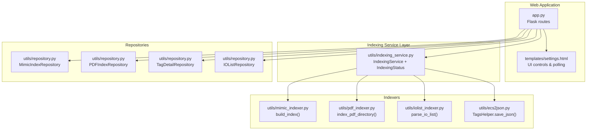

**Diagram sources**
- [app.py:76-84](file://app.py#L76-L84)
- [indexing_service.py:85-239](file://utils/indexing_service.py#L85-L239)
- [mimic_indexer.py:363-435](file://utils/mimic_indexer.py#L363-L435)
- [pdf_indexer.py:41-131](file://utils/pdf_indexer.py#L41-L131)
- [iolist_indexer.py:39-97](file://utils/iolist_indexer.py#L39-L97)
- [ecs2json.py:439-454](file://utils/ecs2json.py#L439-L454)
- [repository.py:13-178](file://utils/repository.py#L13-L178)

**Section sources**
- [app.py:76-84](file://app.py#L76-L84)
- [indexing_service.py:85-239](file://utils/indexing_service.py#L85-L239)

## Core Components
- IndexingService: Orchestrates background indexing tasks for mimics, PDFs, IO lists, and MDB tags. It starts threads, delegates to specialized indexers, and persists results to JSON files. It checks the global IndexingStatus to prevent overlapping runs.
- IndexingStatus: Thread-safe singleton that tracks whether a task is running, the current task name, progress counters, messages, result payload, and timestamps. It exposes a status snapshot for UI polling.
- Indexers:
  - Mimic indexer: Parses ECS7 .g files to extract tags and positions, building a structured index.
  - PDF indexer: Extracts ECS7 tags from PDF text and builds a per-tag occurrence index.
  - IO list indexer: Parses Excel IO list into a normalized JSON structure keyed by SignalCode.
  - MDB tags extractor: Uses TagsHelper to query Access databases and save a JSON index of tags.

**Section sources**
- [indexing_service.py:23-82](file://utils/indexing_service.py#L23-L82)
- [indexing_service.py:85-239](file://utils/indexing_service.py#L85-L239)
- [mimic_indexer.py:363-435](file://utils/mimic_indexer.py#L363-L435)
- [pdf_indexer.py:41-131](file://utils/pdf_indexer.py#L41-L131)
- [iolist_indexer.py:39-97](file://utils/iolist_indexer.py#L39-L97)
- [ecs2json.py:224-454](file://utils/ecs2json.py#L224-L454)

## Architecture Overview
The indexing pipeline integrates with the Flask application via routes that trigger background tasks and expose a polling endpoint for status updates. The UI initiates tasks and renders progress using a client-side polling loop.

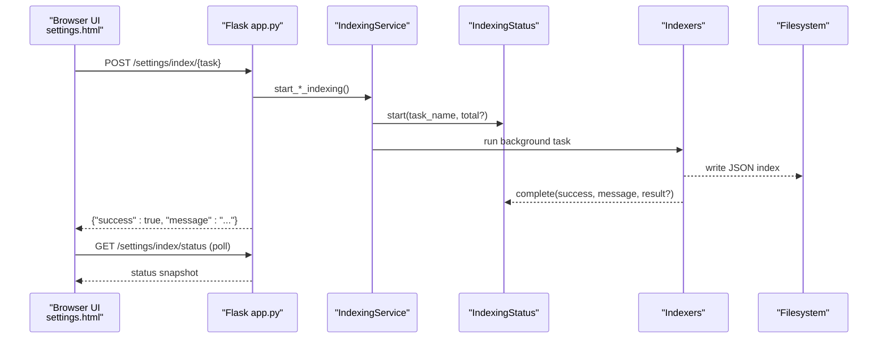

**Diagram sources**
- [app.py:172-194](file://app.py#L172-L194)
- [indexing_service.py:106-239](file://utils/indexing_service.py#L106-L239)
- [settings.html:229-342](file://templates/settings.html#L229-L342)

## Detailed Component Analysis

### IndexingStatus Singleton Pattern
IndexingStatus encapsulates shared mutable state with a threading lock to ensure thread-safe reads/writes. It exposes:
- start(task_name, total): initializes a new task and resets counters.
- update(progress, message): increments progress and optionally updates the message.
- complete(success, message, result): marks completion, sets timestamps, and stores result.
- status: returns a copy of the current state for UI consumption.

Thread-safety is achieved by guarding all property setters and the status getter with a Lock. This prevents race conditions during concurrent background indexing operations.

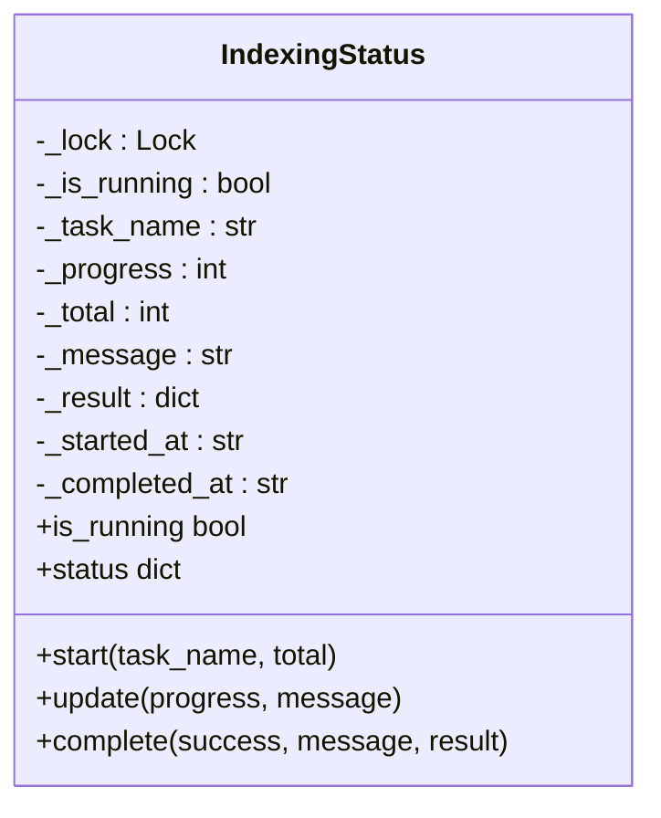

**Diagram sources**
- [indexing_service.py:23-82](file://utils/indexing_service.py#L23-L82)

**Section sources**
- [indexing_service.py:23-82](file://utils/indexing_service.py#L23-L82)

### IndexingService Background Operations
IndexingService coordinates four indexing tasks:
- Mimics: Scans .g files, builds tag-to-position index, writes JSON.
- PDF: Scans PDFs, extracts tags, aggregates occurrences, writes JSON.
- IO List: Reads Excel, normalizes fields, writes signals index.
- MDB Tags: Queries Access DBs, constructs tag metadata, writes JSON.

Each task:
- Checks IndexingStatus.is_running to prevent overlap.
- Starts a daemon thread targeting a private runner method.
- Calls the corresponding indexer and persists results.
- Updates IndexingStatus with completion details.

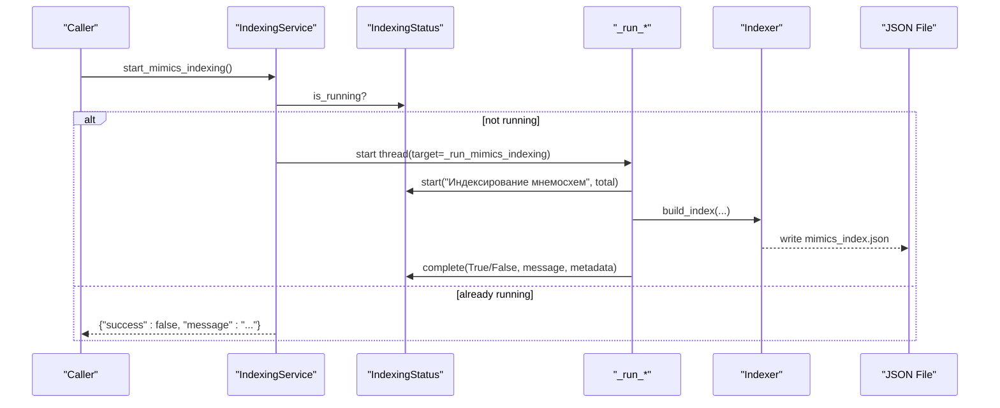

**Diagram sources**
- [indexing_service.py:106-141](file://utils/indexing_service.py#L106-L141)
- [mimic_indexer.py:363-435](file://utils/mimic_indexer.py#L363-L435)

**Section sources**
- [indexing_service.py:106-239](file://utils/indexing_service.py#L106-L239)

### Mimics Indexing Workflow
- Discovery: Counts .g files in the mimics directory.
- Parsing: For each file, parses .userdata and geometry commands to extract tags and positions.
- Aggregation: Builds a tags dictionary with per-file positions and computes totals.
- Persistence: Writes a JSON with metadata and tags to the configured index path.

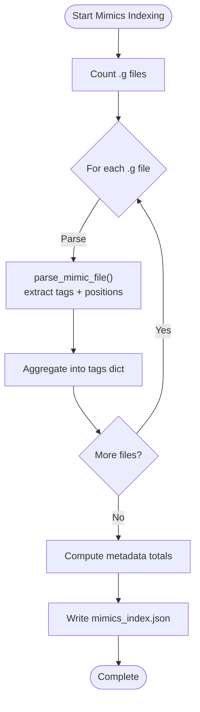

**Diagram sources**
- [indexing_service.py:118-141](file://utils/indexing_service.py#L118-L141)
- [mimic_indexer.py:83-435](file://utils/mimic_indexer.py#L83-L435)

**Section sources**
- [indexing_service.py:118-141](file://utils/indexing_service.py#L118-L141)
- [mimic_indexer.py:83-435](file://utils/mimic_indexer.py#L83-L435)

### PDF Indexing Workflow
- Discovery: Lists .pdf files in the PDF directory.
- Extraction: For each page, extracts ECS7 tags using a regex pattern.
- Aggregation: Builds a per-tag structure with files and page counts.
- Persistence: Writes a JSON with metadata and tags to the configured PDF index path.

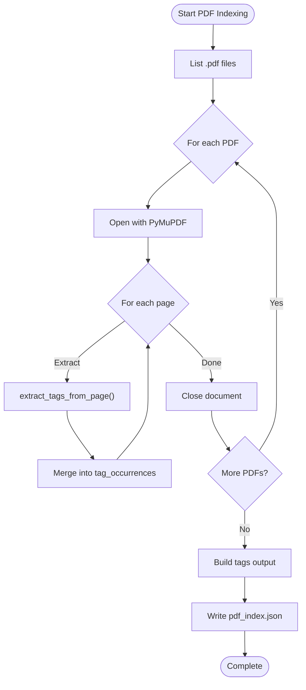

**Diagram sources**
- [indexing_service.py:154-176](file://utils/indexing_service.py#L154-L176)
- [pdf_indexer.py:41-131](file://utils/pdf_indexer.py#L41-L131)

**Section sources**
- [indexing_service.py:154-176](file://utils/indexing_service.py#L154-L176)
- [pdf_indexer.py:41-131](file://utils/pdf_indexer.py#L41-L131)

### IO List Indexing Workflow
- Discovery: Loads Excel workbook and enumerates sheet names.
- Parsing: Iterates rows, normalizes columns, and collects sheets per SignalCode.
- Persistence: Writes a JSON with metadata and signals to the configured IO list path.

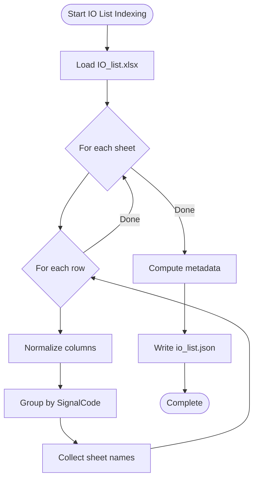

**Diagram sources**
- [indexing_service.py:190-208](file://utils/indexing_service.py#L190-L208)
- [iolist_indexer.py:39-97](file://utils/iolist_indexer.py#L39-L97)

**Section sources**
- [indexing_service.py:190-208](file://utils/indexing_service.py#L190-L208)
- [iolist_indexer.py:39-97](file://utils/iolist_indexer.py#L39-L97)

### MDB Tags Extraction Workflow
- Initialization: Creates TagsHelper with database access and caches.
- Query: Executes SQL against Access databases to retrieve tag records.
- Formatting: Transforms records into a structured JSON with metadata.
- Persistence: Writes tags JSON to the configured tags output path.

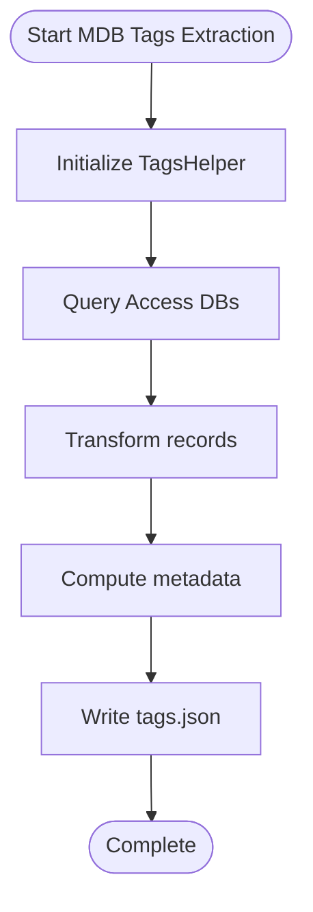

**Diagram sources**
- [indexing_service.py:222-238](file://utils/indexing_service.py#L222-L238)
- [ecs2json.py:224-454](file://utils/ecs2json.py#L224-L454)

**Section sources**
- [indexing_service.py:222-238](file://utils/indexing_service.py#L222-L238)
- [ecs2json.py:224-454](file://utils/ecs2json.py#L224-L454)

### Status Tracking and Progress Monitoring
- UI Polling: The settings page polls the status endpoint every second and updates the progress bar and message area.
- Task Name: The current task name is displayed alongside progress.
- Completion: On completion, the spinner turns to a checkmark, and the result payload is shown if present.

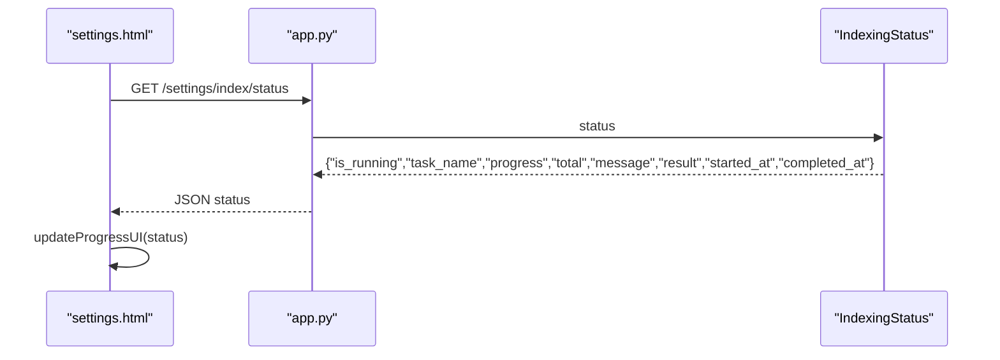

**Diagram sources**
- [app.py:191-194](file://app.py#L191-L194)
- [indexing_service.py:66-78](file://utils/indexing_service.py#L66-L78)
- [settings.html:255-326](file://templates/settings.html#L255-L326)

**Section sources**
- [app.py:191-194](file://app.py#L191-L194)
- [settings.html:255-326](file://templates/settings.html#L255-L326)

### Thread Safety and Concurrent Operations
- Global Lock: IndexingStatus uses a threading.Lock to guard all state mutations and the status snapshot.
- Daemon Threads: Background runners are started as daemon threads to avoid blocking shutdown.
- Overlap Prevention: IndexingService checks IndexingStatus.is_running before launching a new task.
- No Shared Mutable State Between Tasks: Each runner operates independently and writes to separate JSON files.

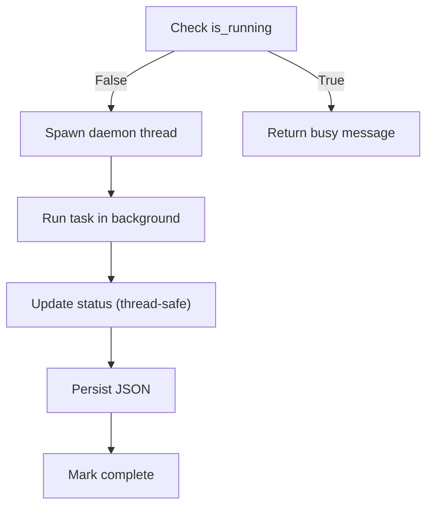

**Diagram sources**
- [indexing_service.py:108-116](file://utils/indexing_service.py#L108-L116)
- [indexing_service.py:23-82](file://utils/indexing_service.py#L23-L82)

**Section sources**
- [indexing_service.py:108-116](file://utils/indexing_service.py#L108-L116)
- [indexing_service.py:23-82](file://utils/indexing_service.py#L23-L82)

### Error Recovery Procedures
- Try/Catch in Runners: Each background runner wraps indexer calls in try/catch to catch exceptions and mark completion with an error message.
- Graceful Degradation: On failure, the status is marked complete with a failure message and no result payload.
- UI Feedback: The UI displays the error message and stops polling.

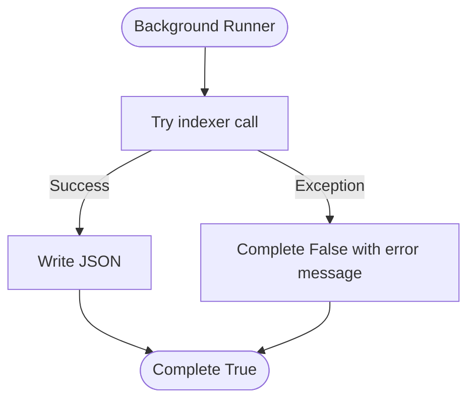

**Diagram sources**
- [indexing_service.py:139-141](file://utils/indexing_service.py#L139-L141)
- [indexing_service.py:175-177](file://utils/indexing_service.py#L175-L177)
- [indexing_service.py:207-209](file://utils/indexing_service.py#L207-L209)
- [indexing_service.py:237-239](file://utils/indexing_service.py#L237-L239)

**Section sources**
- [indexing_service.py:139-141](file://utils/indexing_service.py#L139-L141)
- [indexing_service.py:175-177](file://utils/indexing_service.py#L175-L177)
- [indexing_service.py:207-209](file://utils/indexing_service.py#L207-L209)
- [indexing_service.py:237-239](file://utils/indexing_service.py#L237-L239)

### Integration with Application Lifecycle
- Initialization: Flask app creates repositories, services, and IndexingService instances with configured paths.
- Routes:
  - GET /settings: Renders settings page with current indexing status.
  - POST /settings/index/{task}: Triggers the corresponding indexing task.
  - GET /settings/index/status: Returns the current IndexingStatus snapshot.
- Repositories: Provide cached access to index files for search services.

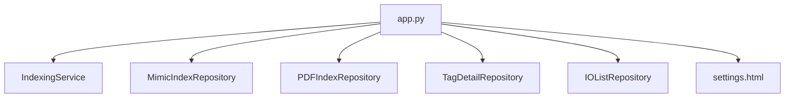

**Diagram sources**
- [app.py:76-84](file://app.py#L76-L84)
- [app.py:158-194](file://app.py#L158-L194)
- [repository.py:13-178](file://utils/repository.py#L13-L178)

**Section sources**
- [app.py:76-84](file://app.py#L76-L84)
- [app.py:158-194](file://app.py#L158-L194)
- [repository.py:13-178](file://utils/repository.py#L13-L178)

## Dependency Analysis
- IndexingService depends on:
  - IndexingStatus (singleton) for thread-safe state.
  - Indexers (mimic_indexer, pdf_indexer, iolist_indexer, ecs2json) for parsing logic.
  - Filesystem paths for output JSON files.
- UI depends on:
  - Flask routes to trigger tasks and poll status.
  - settings.html for rendering and polling.

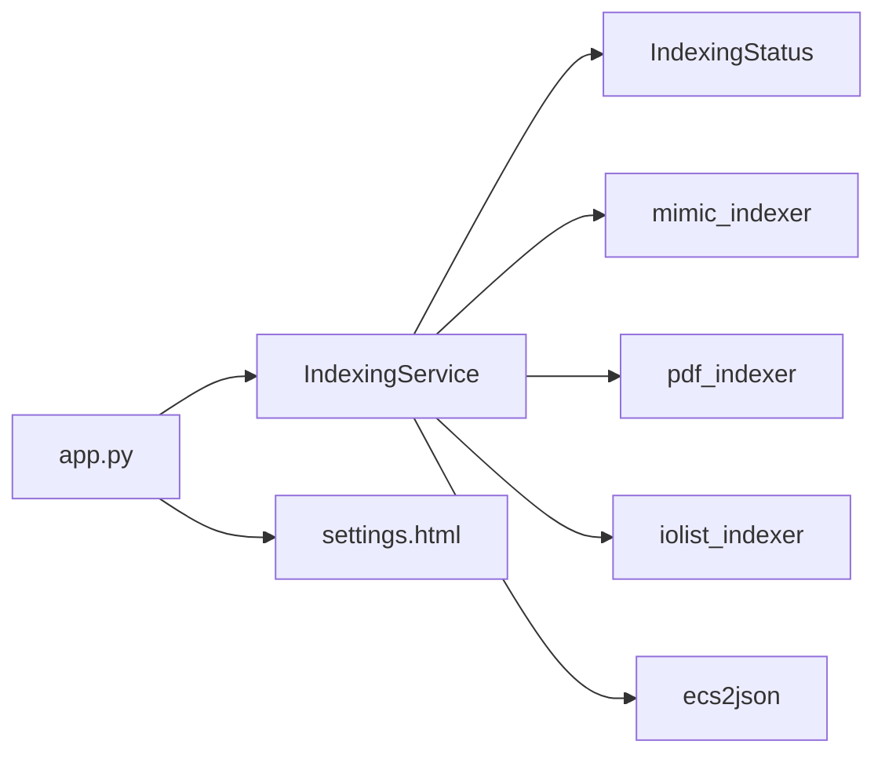

**Diagram sources**
- [indexing_service.py:85-239](file://utils/indexing_service.py#L85-L239)
- [app.py:172-194](file://app.py#L172-L194)

**Section sources**
- [indexing_service.py:85-239](file://utils/indexing_service.py#L85-L239)
- [app.py:172-194](file://app.py#L172-L194)

## Performance Considerations
- Threading Model: Background tasks run in daemon threads, avoiding blocking shutdown. This keeps the UI responsive.
- Memory Management:
  - Indexers aggregate results incrementally and write to disk upon completion, minimizing peak memory usage.
  - Repository loaders cache parsed JSON in memory for search operations; consider clearing caches when indices change.
- I/O Patterns:
  - Mimics and PDF indexers process files sequentially; parallelization could improve throughput but requires careful synchronization of the shared IndexingStatus.
  - Consider batching writes to reduce filesystem overhead.
- Regex Efficiency:
  - Tag extraction uses compiled patterns; ensure patterns remain efficient for large PDFs.
- UI Polling:
  - 1-second polling interval balances responsiveness with server load. Adjust if needed for high concurrency.

[No sources needed since this section provides general guidance]

## Troubleshooting Guide
- Task Already Running:
  - Symptom: Request returns success=false with a “already running” message.
  - Resolution: Wait until the current task completes or cancel the operation externally.
- Indexer Exceptions:
  - Symptom: Status shows failure message and completion timestamp.
  - Resolution: Inspect logs for the specific exception raised by the indexer and fix underlying data issues.
- Missing Output Files:
  - Symptom: Expected JSON files are not created.
  - Resolution: Verify filesystem permissions and paths configured in IndexingService initialization.
- UI Not Updating:
  - Symptom: Progress bar does not move.
  - Resolution: Confirm polling endpoint is reachable and IndexingStatus is being updated by the background thread.

**Section sources**
- [indexing_service.py:108-116](file://utils/indexing_service.py#L108-L116)
- [indexing_service.py:139-141](file://utils/indexing_service.py#L139-L141)
- [indexing_service.py:175-177](file://utils/indexing_service.py#L175-L177)
- [indexing_service.py:207-209](file://utils/indexing_service.py#L207-L209)
- [indexing_service.py:237-239](file://utils/indexing_service.py#L237-L239)

## Conclusion
IndexingService provides a robust, thread-safe mechanism for background indexing of mimics, PDFs, IO lists, and MDB tags. Its integration with the Flask application enables asynchronous operations with live status updates via polling. The singleton IndexingStatus ensures consistent state across threads, while individual indexers encapsulate parsing logic and persistence. Proper error handling and UI feedback make the system resilient and user-friendly. For future enhancements, consider parallelizing tasks safely and optimizing repository caching strategies.