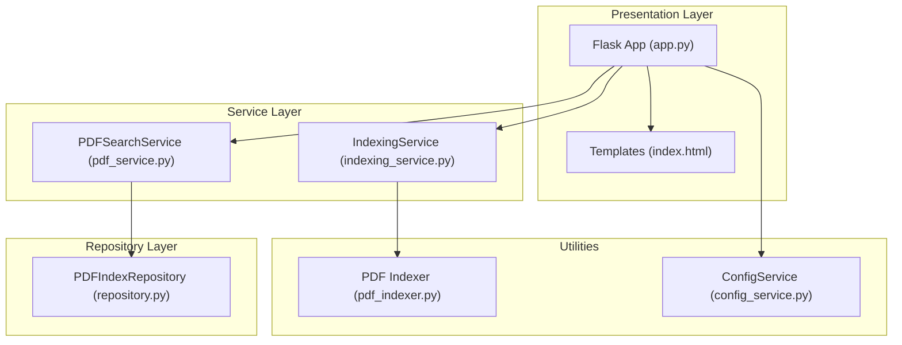
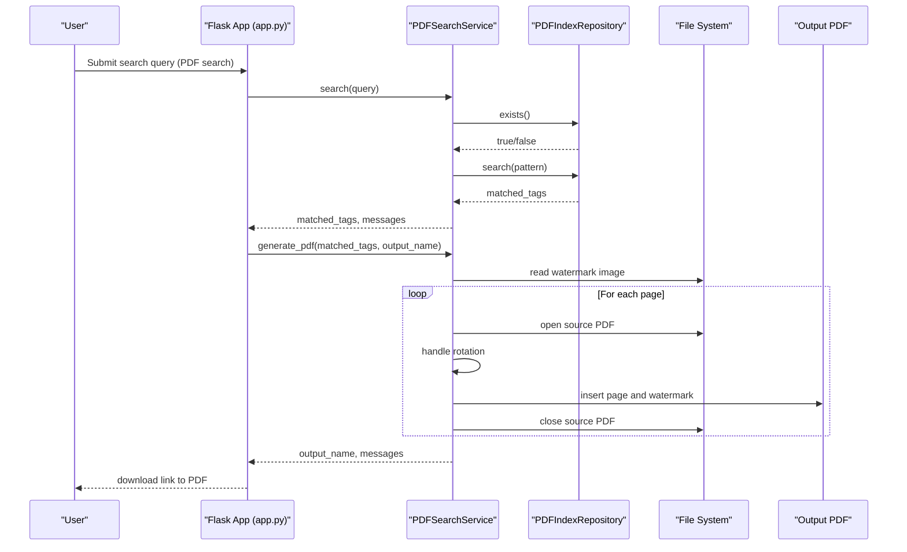
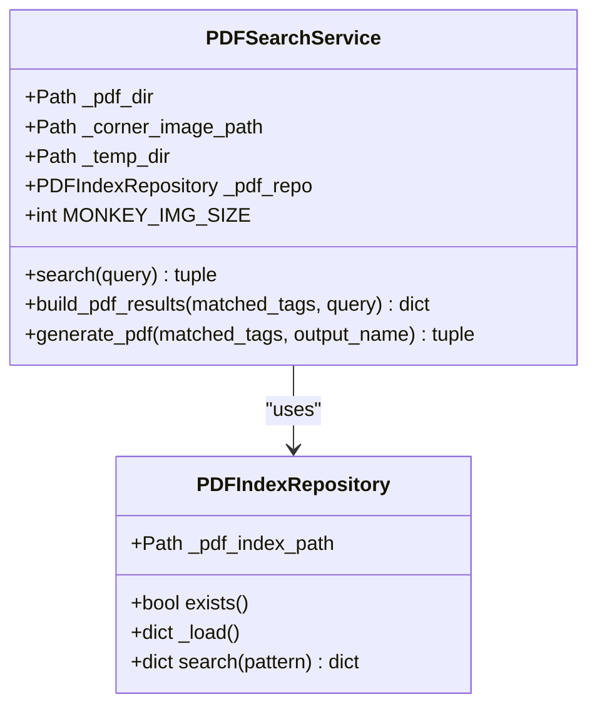
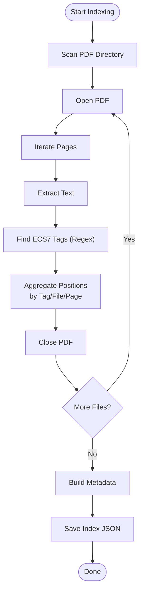
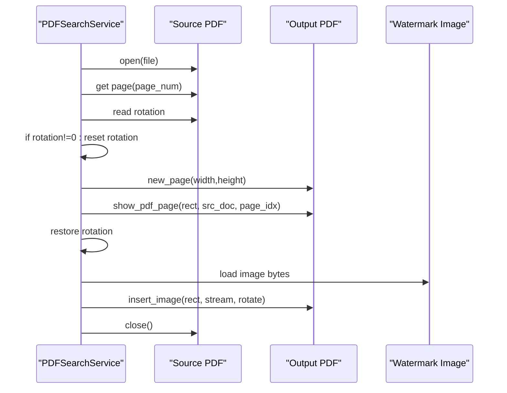
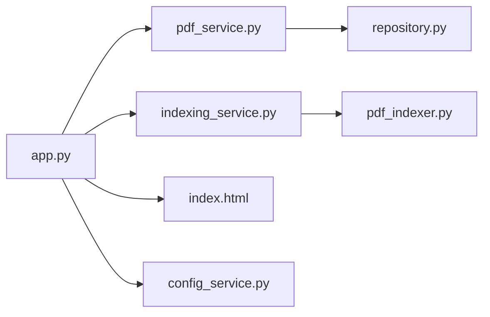

# PDFSearchService

<cite>
**Referenced Files in This Document**
- [pdf_service.py](file://utils/pdf_service.py)
- [pdf_indexer.py](file://utils/pdf_indexer.py)
- [repository.py](file://utils/repository.py)
- [app.py](file://app.py)
- [indexing_service.py](file://utils/indexing_service.py)
- [index.html](file://templates/index.html)
- [config_service.py](file://utils/config_service.py)
- [promt_pdf.md](file://promt_pdf.md)
</cite>

## Table of Contents
1. [Introduction](#introduction)
2. [Project Structure](#project-structure)
3. [Core Components](#core-components)
4. [Architecture Overview](#architecture-overview)
5. [Detailed Component Analysis](#detailed-component-analysis)
6. [Dependency Analysis](#dependency-analysis)
7. [Performance Considerations](#performance-considerations)
8. [Troubleshooting Guide](#troubleshooting-guide)
9. [Conclusion](#conclusion)
10. [Appendices](#appendices)

## Introduction
This document provides comprehensive technical documentation for PDFSearchService, focusing on PDF document search and generation capabilities within the ecs7search project. It explains the PDF-specific search algorithms, page-level positioning, and multi-page result handling. It also covers the integration with PDFIndexRepository, the PDF indexing workflow, and the document processing pipelines. Practical examples illustrate search queries, result extraction, and output generation. Watermark integration, rotation handling, and PDF assembly techniques are documented alongside performance optimization strategies for large documents, memory management, and error handling specific to PDF processing.

## Project Structure
The PDFSearchService is part of a layered architecture:
- Presentation layer: Flask routes and templates
- Service layer: PDFSearchService orchestrates search and PDF generation
- Repository layer: PDFIndexRepository provides cached access to the PDF index
- Utilities: PDF indexer, indexing service, and configuration service support the workflow

**Diagram sources**
- [app.py:1-206](file://app.py#L1-L206)
- [pdf_service.py:18-229](file://utils/pdf_service.py#L18-L229)
- [repository.py:138-178](file://utils/repository.py#L138-L178)
- [indexing_service.py:85-239](file://utils/indexing_service.py#L85-L239)
- [pdf_indexer.py:1-215](file://utils/pdf_indexer.py#L1-L215)
- [index.html:1-260](file://templates/index.html#L1-L260)
- [config_service.py:13-128](file://utils/config_service.py#L13-L128)

**Section sources**
- [app.py:26-85](file://app.py#L26-L85)
- [pdf_service.py:18-35](file://utils/pdf_service.py#L18-L35)
- [repository.py:138-178](file://utils/repository.py#L138-L178)

## Core Components
- PDFSearchService: Implements search over the PDF index, builds result tables, and generates a combined PDF with watermarks and rotation handling.
- PDFIndexRepository: Provides cached access to the PDF index JSON and supports wildcard pattern matching for tag queries.
- PDF Indexer: Extracts ECS7 tags from PDF pages and produces a structured index JSON.
- IndexingService: Runs PDF indexing in a background thread and persists results.
- Flask App and Templates: Provide the UI for initiating PDF search and downloading generated PDFs.

Key responsibilities:
- Search: Pattern-based tag lookup with wildcard support.
- Result aggregation: Deduplicate pages across tags and group tags per page.
- PDF generation: Assemble pages from source PDFs, preserve rotation, apply corner watermark, and save to a temporary directory.

**Section sources**
- [pdf_service.py:36-95](file://utils/pdf_service.py#L36-L95)
- [repository.py:164-178](file://utils/repository.py#L164-L178)
- [pdf_indexer.py:28-131](file://utils/pdf_indexer.py#L28-L131)
- [indexing_service.py:142-177](file://utils/indexing_service.py#L142-L177)

## Architecture Overview
The PDF search and generation pipeline integrates the following steps:
1. Index creation: PDF files are scanned, tags extracted, and stored in a JSON index.
2. Search: Queries are matched against the index using wildcard patterns.
3. Results assembly: Unique pages are collected and grouped by file and page number.
4. PDF generation: Pages are copied from source PDFs, rotations preserved, and a watermark inserted into the corner.

**Diagram sources**
- [app.py:119-146](file://app.py#L119-L146)
- [pdf_service.py:36-229](file://utils/pdf_service.py#L36-L229)
- [repository.py:164-178](file://utils/repository.py#L164-L178)

## Detailed Component Analysis

### PDFSearchService
PDFSearchService encapsulates the PDF search and generation logic:
- Search: Normalizes query to wildcard patterns and delegates to PDFIndexRepository.search.
- Result building: Aggregates matched positions into a table of unique pages, grouping tags per page.
- PDF generation: Iterates matched pages, opens source PDFs, copies pages with rotation handling, inserts a watermark image in the corner, and saves the combined PDF.

**Diagram sources**
- [pdf_service.py:18-35](file://utils/pdf_service.py#L18-L35)
- [pdf_service.py:36-95](file://utils/pdf_service.py#L36-L95)
- [pdf_service.py:97-229](file://utils/pdf_service.py#L97-L229)
- [repository.py:138-178](file://utils/repository.py#L138-L178)

Key behaviors:
- Search normalization: Adds wildcards around the query unless already present.
- Result deduplication: Uses a set of (file, page) tuples to avoid duplicates.
- Watermark placement: Computes corner rectangle based on page dimensions and rotation.
- Rotation handling: Temporarily resets rotation during page copy, then restores it.

Example usage paths:
- Search: [pdf_service.py:36-52](file://utils/pdf_service.py#L36-L52)
- Build results: [pdf_service.py:54-95](file://utils/pdf_service.py#L54-L95)
- Generate PDF: [pdf_service.py:97-229](file://utils/pdf_service.py#L97-L229)

**Section sources**
- [pdf_service.py:36-229](file://utils/pdf_service.py#L36-L229)

### PDF Indexing Workflow
The PDF indexing workflow extracts ECS7 tags from PDF pages and builds a structured index:
- Scanning: Enumerates PDF files in the configured directory.
- Text extraction: Uses PyMuPDF to get page text.
- Tag extraction: Applies a regex pattern to find ECS7 tags and counts occurrences per page.
- Aggregation: Builds a dictionary keyed by tag with lists of positions containing file, page, and count.
- Metadata: Records statistics such as total files, tags, occurrences, and indexing time.

**Diagram sources**
- [pdf_indexer.py:41-131](file://utils/pdf_indexer.py#L41-L131)
- [pdf_indexer.py:149-214](file://utils/pdf_indexer.py#L149-L214)

Integration points:
- Background execution: IndexingService runs PDF indexing in a separate thread and updates global status.
- Persistence: Results are written to the configured PDF index path.

**Section sources**
- [pdf_indexer.py:28-131](file://utils/pdf_indexer.py#L28-L131)
- [indexing_service.py:142-177](file://utils/indexing_service.py#L142-L177)

### PDF Assembly and Watermark Integration
PDF generation involves:
- Page selection: Unique (file, page) pairs derived from matched tags.
- Page copying: New pages are created with the same dimensions as the source page.
- Rotation handling: Rotation is temporarily reset during copy, then restored.
- Watermark insertion: A corner image is inserted at a computed position depending on orientation.

**Diagram sources**
- [pdf_service.py:154-214](file://utils/pdf_service.py#L154-L214)

**Section sources**
- [pdf_service.py:154-214](file://utils/pdf_service.py#L154-L214)

### Multi-Page Result Handling
The service groups matched positions into a table of unique pages:
- Deduplication: A set tracks (file, page) combinations to prevent duplicates.
- Tag aggregation: When a page appears multiple times under different tags, tags are appended to the existing entry.
- Statistics: Total tags, pages, and files are computed for UI presentation.

**Section sources**
- [pdf_service.py:66-95](file://utils/pdf_service.py#L66-L95)

### Search Algorithm Details
- Pattern matching: Uses fnmatch to support wildcard patterns (* and ?).
- Query normalization: If the query does not contain wildcards, it is wrapped with asterisks.
- Repository search: Returns a dictionary mapping tag names to lists of positions with file, page, and count.

**Section sources**
- [pdf_service.py:46-52](file://utils/pdf_service.py#L46-L52)
- [repository.py:164-178](file://utils/repository.py#L164-L178)

### UI Integration and Output Generation
- Route handling: The Flask route triggers PDF search, generates a PDF, and renders results in the template.
- Download link: Generated PDFs are served from the temporary directory.
- Template rendering: Displays aggregated results, metadata, and a download button.

**Section sources**
- [app.py:119-146](file://app.py#L119-L146)
- [index.html:154-209](file://templates/index.html#L154-L209)

## Dependency Analysis
The following diagram shows the primary dependencies among components involved in PDF search and generation:

**Diagram sources**
- [app.py:17-84](file://app.py#L17-L84)
- [pdf_service.py:15-15](file://utils/pdf_service.py#L15-L15)
- [repository.py:138-178](file://utils/repository.py#L138-L178)
- [indexing_service.py:159-171](file://utils/indexing_service.py#L159-L171)
- [pdf_indexer.py:192-202](file://utils/pdf_indexer.py#L192-L202)
- [index.html:173-182](file://templates/index.html#L173-L182)
- [config_service.py:38-106](file://utils/config_service.py#L38-L106)

**Section sources**
- [app.py:17-84](file://app.py#L17-L84)
- [pdf_service.py:15-15](file://utils/pdf_service.py#L15-L15)
- [repository.py:138-178](file://utils/repository.py#L138-L178)
- [indexing_service.py:159-171](file://utils/indexing_service.py#L159-L171)
- [pdf_indexer.py:192-202](file://utils/pdf_indexer.py#L192-L202)
- [index.html:173-182](file://templates/index.html#L173-L182)
- [config_service.py:38-106](file://utils/config_service.py#L38-L106)

## Performance Considerations
- Memory management:
  - Open each source PDF individually and close it after page extraction to avoid accumulating handles.
  - Reuse a single output document and append pages incrementally.
- Large document optimization:
  - Avoid loading entire PDFs into memory; process pages sequentially.
  - Limit watermark image loading to once per generation run.
- I/O efficiency:
  - Sort pages by file and page number to reduce random access and improve throughput.
- Caching:
  - PDFIndexRepository caches the index JSON to minimize repeated disk reads.
- Concurrency:
  - Indexing runs in a background thread to keep the UI responsive.

[No sources needed since this section provides general guidance]

## Troubleshooting Guide
Common issues and resolutions:
- Index not found:
  - Ensure the PDF index JSON exists and is readable. The service checks existence and returns an error message if missing.
- No results:
  - Verify the query pattern and that the index contains the searched tags. Wildcards are automatically added if not present.
- Page out of range:
  - The service validates page numbers and logs warnings for invalid indices.
- File not found:
  - Confirm the PDF directory contains the referenced files.
- Watermark errors:
  - If the watermark image cannot be loaded, the service logs a warning and continues without watermark.
- PDF generation failures:
  - Errors during page copy or saving are captured and returned as messages.

**Section sources**
- [pdf_service.py:43-44](file://utils/pdf_service.py#L43-L44)
- [pdf_service.py:49-50](file://utils/pdf_service.py#L49-L50)
- [pdf_service.py:159-161](file://utils/pdf_service.py#L159-L161)
- [pdf_service.py:166-171](file://utils/pdf_service.py#L166-L171)
- [pdf_service.py:121-123](file://utils/pdf_service.py#L121-L123)
- [pdf_service.py:222-223](file://utils/pdf_service.py#L222-L223)

## Conclusion
PDFSearchService provides a robust mechanism for searching ECS7 tags within PDF documents and generating a consolidated PDF with watermarks and rotation handling. Its integration with PDFIndexRepository and the broader indexing pipeline ensures efficient, scalable operation. By following the outlined patterns for search, result aggregation, and PDF assembly, developers can extend and optimize the system for large-scale PDF processing while maintaining reliability and performance.

[No sources needed since this section summarizes without analyzing specific files]

## Appendices

### Example Workflows
- Running the PDF indexer from the command line:
  - See the CLI interface and arguments defined in the PDF indexer script.
  - Reference: [pdf_indexer.py:149-214](file://utils/pdf_indexer.py#L149-L214)
- Using the web UI to search and generate:
  - Submit a query with wildcard support; the app triggers PDFSearchService and serves the generated PDF from the temp directory.
  - Reference: [app.py:119-146](file://app.py#L119-L146), [index.html:173-182](file://templates/index.html#L173-L182)

### PDF Index Format
- The index follows a structure similar to the mimic index, with metadata and a tags dictionary containing files and positions.
- Reference: [promt_pdf.md:27-48](file://promt_pdf.md#L27-L48)