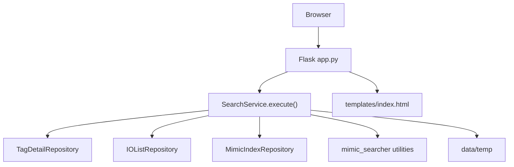
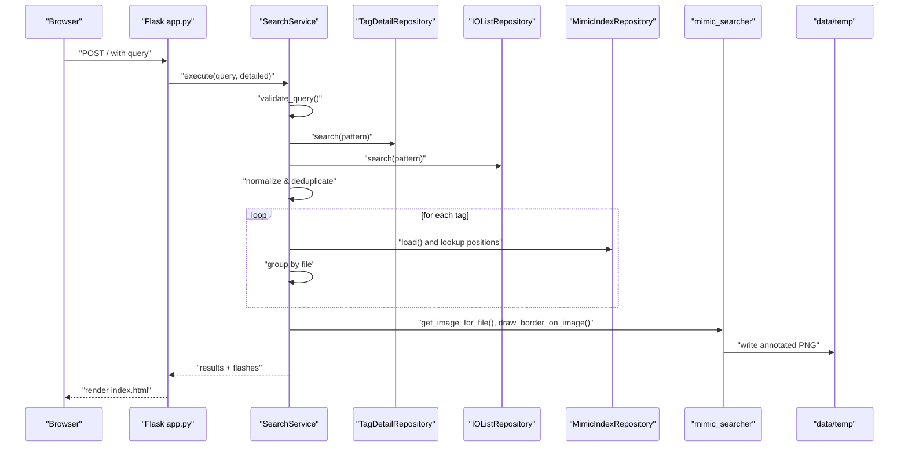
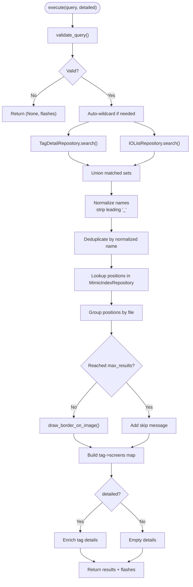
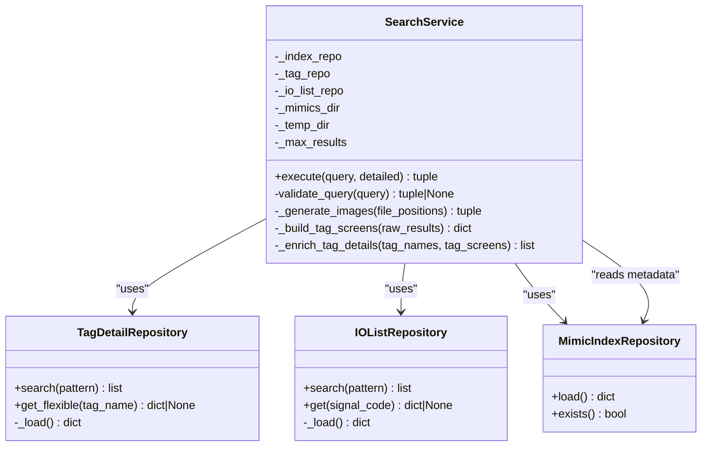

# SearchService

<cite>
**Referenced Files in This Document**
- [app.py](file://app.py)
- [service.py](file://utils/service.py)
- [repository.py](file://utils/repository.py)
- [mimic_searcher.py](file://utils/mimic_searcher.py)
- [index.html](file://templates/index.html)
</cite>

## Table of Contents
1. [Introduction](#introduction)
2. [Project Structure](#project-structure)
3. [Core Components](#core-components)
4. [Architecture Overview](#architecture-overview)
5. [Detailed Component Analysis](#detailed-component-analysis)
6. [Dependency Analysis](#dependency-analysis)
7. [Performance Considerations](#performance-considerations)
8. [Troubleshooting Guide](#troubleshooting-guide)
9. [Conclusion](#conclusion)

## Introduction
This document provides comprehensive documentation for the SearchService class, focusing on multi-source tag search functionality. It explains the execute() method’s query validation, wildcard pattern handling, and result processing algorithms. It also covers the search coordination between TagDetailRepository and IOListRepository, position retrieval from MimicIndexRepository, and the image generation workflow. Additional topics include tag normalization, deduplication strategies, integration with mimic_searcher utilities, performance considerations, result limits, and thread-safety aspects.

## Project Structure
The search pipeline integrates a Flask web interface with service and repository layers:
- The Flask route initializes repositories and invokes SearchService.execute().
- SearchService orchestrates search across tags.json and io_list.json, enriches results with metadata, retrieves screen positions from mimics_index.json, and generates annotated images.
- Repositories encapsulate data access for tags, IO lists, and mimic indices.
- The mimic_searcher module provides low-level utilities for coordinate conversion and image annotation.

**Diagram sources**
- [app.py:88-155](file://app.py#L88-L155)
- [service.py:58-158](file://utils/service.py#L58-L158)
- [repository.py:13-178](file://utils/repository.py#L13-L178)
- [mimic_searcher.py:36-111](file://utils/mimic_searcher.py#L36-L111)
- [index.html:60-254](file://templates/index.html#L60-L254)

**Section sources**
- [app.py:49-56](file://app.py#L49-L56)
- [app.py:114-128](file://app.py#L114-L128)
- [index.html:60-254](file://templates/index.html#L60-L254)

## Core Components
- SearchService: Central orchestration class implementing execute(), validation, deduplication, enrichment, and image generation.
- TagDetailRepository: Loads and searches tags.json with flexible name variants and pattern matching.
- IOListRepository: Loads and searches io_list.json for signal codes and selected fields.
- MimicIndexRepository: Loads mimics_index.json containing tag-to-position mappings.
- mimic_searcher utilities: Coordinate conversion and image border drawing for annotated screenshots.

Key responsibilities:
- Query validation and auto-wildcard expansion.
- Multi-source search across tags and IO lists.
- Deduplication with tag normalization.
- Position retrieval and grouping by file.
- Image generation with result limits and error handling.
- Optional detailed tag enrichment with metadata and IO list fields.

**Section sources**
- [service.py:25-43](file://utils/service.py#L25-L43)
- [repository.py:27-94](file://utils/repository.py#L27-L94)
- [repository.py:96-136](file://utils/repository.py#L96-L136)
- [repository.py:13-25](file://utils/repository.py#L13-L25)
- [mimic_searcher.py:36-111](file://utils/mimic_searcher.py#L36-L111)

## Architecture Overview
The search flow begins at the Flask route, which delegates to SearchService.execute(). The service validates the query, expands wildcards, performs pattern-based searches against TagDetailRepository and IOListRepository, normalizes duplicates, retrieves positions from MimicIndexRepository, groups by file, generates annotated images up to a limit, and builds enriched tag details when requested.

**Diagram sources**
- [app.py:114-128](file://app.py#L114-L128)
- [service.py:58-158](file://utils/service.py#L58-L158)
- [repository.py:78-93](file://utils/repository.py#L78-L93)
- [repository.py:129-135](file://utils/repository.py#L129-L135)
- [repository.py:22-24](file://utils/repository.py#L22-L24)
- [mimic_searcher.py:64-111](file://utils/mimic_searcher.py#L64-L111)

## Detailed Component Analysis

### SearchService.execute(): Orchestration and Processing
The execute() method coordinates the entire search pipeline:
- Validation: Ensures non-empty query length and allowed characters.
- Auto-wildcard: Adds leading/trailing asterisks if no explicit wildcard is present.
- Dual search: Queries TagDetailRepository and IOListRepository using fnmatch patterns.
- Deduplication: Normalizes names by stripping leading underscores and prioritizing non-prefixed variants.
- Position retrieval: Iterates through normalized tags and looks up positions in MimicIndexRepository under multiple variants.
- Grouping: Aggregates positions by file for batch image generation.
- Image generation: Calls mimic_searcher utilities to annotate PNGs, respecting max_results.
- Enrichment: Builds detailed tag records with metadata and IO list fields when requested.
- Output: Returns structured results and flash messages.

**Diagram sources**
- [service.py:58-158](file://utils/service.py#L58-L158)
- [repository.py:78-93](file://utils/repository.py#L78-L93)
- [repository.py:129-135](file://utils/repository.py#L129-L135)
- [repository.py:22-24](file://utils/repository.py#L22-L24)
- [mimic_searcher.py:80-111](file://utils/mimic_searcher.py#L80-L111)

**Section sources**
- [service.py:58-158](file://utils/service.py#L58-L158)

### Query Validation and Wildcard Handling
- Validation enforces non-empty input, minimum length, and allowed character set.
- Wildcard expansion: If no '*' or '?' is present, the query is wrapped with '*' to enable substring matching.

Behavioral notes:
- The allowed character pattern permits letters, digits, asterisk, question mark, and underscore.
- Auto-wildcard ensures broad matching while still honoring explicit patterns.

**Section sources**
- [service.py:46-54](file://utils/service.py#L46-L54)
- [service.py:74](file://utils/service.py#L74)
- [repository.py:78-93](file://utils/repository.py#L78-L93)
- [repository.py:129-135](file://utils/repository.py#L129-L135)

### Tag Normalization and Deduplication
Normalization strategy:
- Leading underscores are stripped to unify variants like "_TAG" and "TAG".
- Deduplication prefers the non-prefixed variant when both forms exist.
- Sorting ensures deterministic order during normalization.

Algorithm highlights:
- Normalize function strips leading underscores.
- Seen set tracks normalized names to avoid duplicates.
- Final list preserves original names while ensuring uniqueness at the normalized level.

**Section sources**
- [service.py:82-96](file://utils/service.py#L82-L96)

### Position Retrieval from MimicIndexRepository
Position retrieval logic:
- Attempts lookup under three variants: original name, stripped name, and underscore-prefixed name.
- Collects positions for each tag and stores them keyed by tag name.
- Tags without positions are tracked separately to inform users about IO-only hits.

Grouping by file:
- Positions are aggregated by file to support batch image generation.

Edge cases:
- Missing PNG files or errors during image drawing are captured and reported via flashes.

**Section sources**
- [service.py:101-138](file://utils/service.py#L101-L138)
- [repository.py:22-24](file://utils/repository.py#L22-L24)

### Image Generation Workflow
Image generation steps:
- Iterates through grouped file positions up to max_results.
- Resolves PNG path for each file; skips if missing.
- Draws borders around positions using mimic_searcher utilities.
- Writes annotated PNGs to data/temp with a derived filename.
- Tracks skipped items and adds a summary message when results are limited.

Coordinate conversion:
- mimic_searcher.convert_ecs_coords maps ECS coordinates to pixel positions on screenshots.
- Special offsets are applied for specific function types.

Error handling:
- Exceptions during drawing are caught and reported with file context.

**Section sources**
- [service.py:162-198](file://utils/service.py#L162-L198)
- [mimic_searcher.py:71-111](file://utils/mimic_searcher.py#L71-L111)

### Detailed Tag Enrichment
When detailed mode is enabled:
- Retrieves tag metadata from TagDetailRepository with flexible variant resolution.
- Builds a screens list per tag by extracting unique files from positions.
- Merges IO list fields (selected subset) into the record.
- For IO-only tags (no positions), synthesizes a minimal record with IO list data and placeholders.

Variant resolution:
- Tries original, underscore-prefixed, and underscore-stripped variants to match metadata and IO records.

**Section sources**
- [service.py:200-270](file://utils/service.py#L200-L270)
- [repository.py:64-76](file://utils/repository.py#L64-L76)
- [repository.py:122-127](file://utils/repository.py#L122-L127)

### Frontend Integration and Result Presentation
The Flask route invokes SearchService and renders results using templates:
- Results include query, counts, images, skipped items, and optional detailed tag records.
- Flash messages communicate warnings and info to the user.
- The template displays annotated images, tag counts, and optional detailed tables.

**Section sources**
- [app.py:114-128](file://app.py#L114-L128)
- [index.html:60-254](file://templates/index.html#L60-L254)

## Dependency Analysis
SearchService depends on:
- TagDetailRepository for tag metadata and pattern-based search.
- IOListRepository for IO list signals and pattern-based search.
- MimicIndexRepository for screen positions mapped to files.
- mimic_searcher utilities for PNG retrieval and border drawing.

**Diagram sources**
- [service.py:25-43](file://utils/service.py#L25-L43)
- [repository.py:27-94](file://utils/repository.py#L27-L94)
- [repository.py:96-136](file://utils/repository.py#L96-L136)
- [repository.py:13-25](file://utils/repository.py#L13-L25)

**Section sources**
- [service.py:25-43](file://utils/service.py#L25-L43)
- [repository.py:27-94](file://utils/repository.py#L27-L94)
- [repository.py:96-136](file://utils/repository.py#L96-L136)
- [repository.py:13-25](file://utils/repository.py#L13-L25)

## Performance Considerations
- Pattern-based searches: Both TagDetailRepository and IOListRepository use fnmatch, which scales with dataset size. Consider narrowing queries with explicit wildcards to reduce matches.
- Deduplication cost: Normalization and deduplication operate on unioned results; keep queries precise to minimize overhead.
- Position lookup: Multiple variant lookups per tag increase constant-time overhead; ensure mimics_index.json is loaded efficiently (repository caches are not used here).
- Image generation: Drawing borders is I/O bound; max_results caps the number of generated images to control resource usage.
- Thread safety: The service is stateless aside from constructor arguments and does not share mutable state across threads. Indexing service uses locks for shared status; SearchService itself is thread-safe by design.

Recommendations:
- Prefer explicit wildcards to reduce pattern matching cost.
- Use detailed mode selectively to avoid unnecessary metadata enrichment.
- Monitor disk I/O when generating many annotated images.

**Section sources**
- [service.py:74](file://utils/service.py#L74)
- [service.py:162-198](file://utils/service.py#L162-L198)
- [repository.py:78-93](file://utils/repository.py#L78-L93)
- [repository.py:129-135](file://utils/repository.py#L129-L135)

## Troubleshooting Guide
Common issues and resolutions:
- Empty or invalid query:
  - Validation returns a warning flash; no results are produced.
  - Ensure the query is at least three characters and contains allowed characters.
- No matches found:
  - A neutral info flash is emitted; verify wildcard usage or spelling.
- Only IO-only tags found:
  - Warning flash indicates tags exist in IO list but not on screens.
- Missing PNGs or drawing errors:
  - Skipped list includes filenames with error messages; verify mimics directory and PNG availability.
- Result limit reached:
  - A skip message indicates only the first N results were processed; refine the query.

**Section sources**
- [service.py:46-54](file://utils/service.py#L46-L54)
- [service.py:97-99](file://utils/service.py#L97-L99)
- [service.py:131-135](file://utils/service.py#L131-L135)
- [service.py:171-175](file://utils/service.py#L171-L175)
- [service.py:195-196](file://utils/service.py#L195-L196)

## Conclusion
SearchService provides a robust, multi-source search pipeline that validates queries, expands wildcards, deduplicates results, retrieves screen positions, and generates annotated images. Its integration with TagDetailRepository, IOListRepository, and MimicIndexRepository enables comprehensive tag discovery across metadata and screen locations. The use of mimic_searcher utilities ensures accurate coordinate mapping and visual highlighting. With explicit result limits and careful error reporting, the service balances usability and performance while remaining thread-safe and easy to integrate into the Flask application.