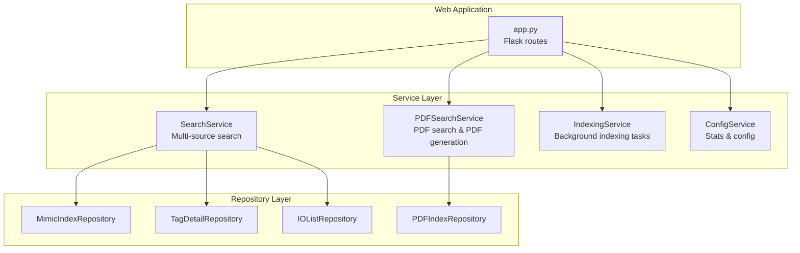
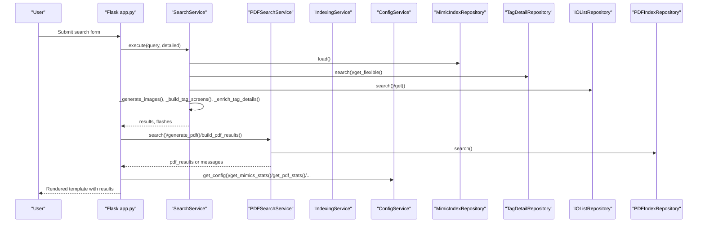
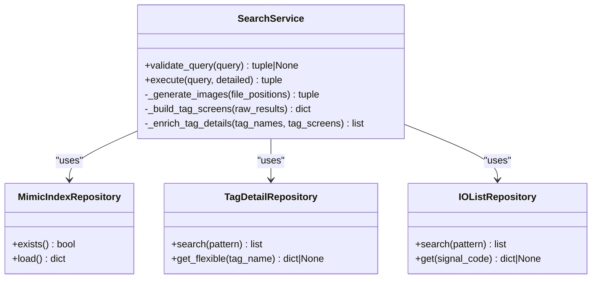
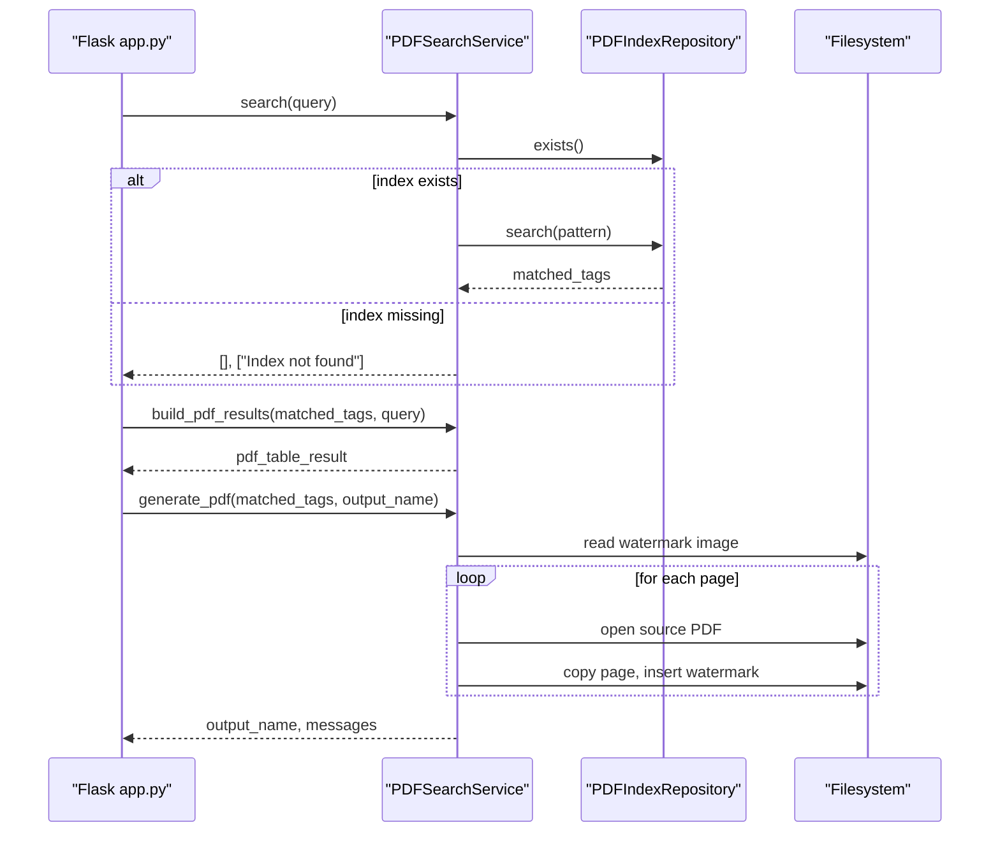
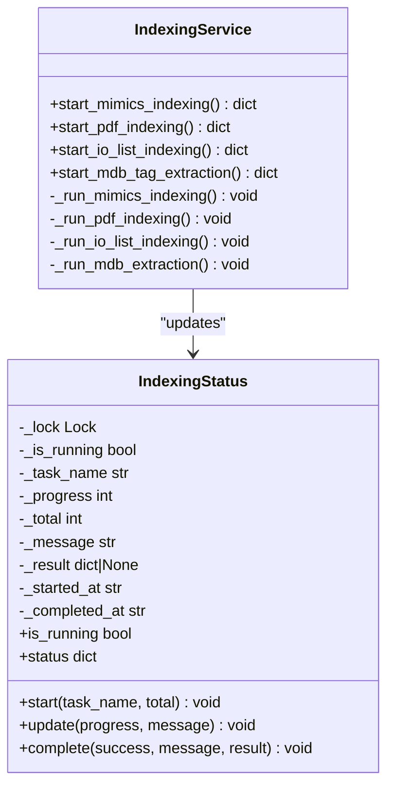
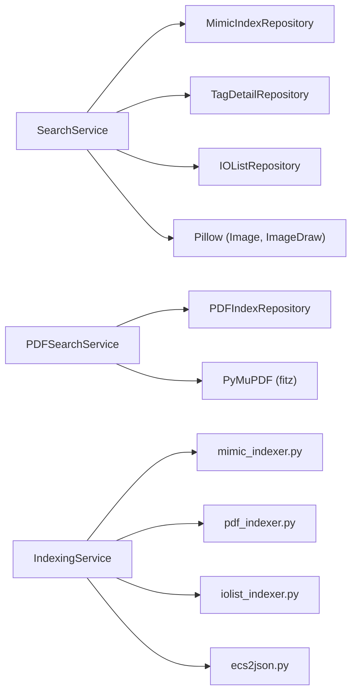

# Service Layer

<cite>
**Referenced Files in This Document**
- [app.py](file://app.py)
- [utils/service.py](file://utils/service.py)
- [utils/pdf_service.py](file://utils/pdf_service.py)
- [utils/indexing_service.py](file://utils/indexing_service.py)
- [utils/config_service.py](file://utils/config_service.py)
- [utils/repository.py](file://utils/repository.py)
- [utils/mimic_searcher.py](file://utils/mimic_searcher.py)
- [utils/mimic_indexer.py](file://utils/mimic_indexer.py)
- [utils/pdf_indexer.py](file://utils/pdf_indexer.py)
- [utils/iolist_indexer.py](file://utils/iolist_indexer.py)
- [utils/ecs2json.py](file://utils/ecs2json.py)
</cite>

## Table of Contents
1. [Introduction](#introduction)
2. [Project Structure](#project-structure)
3. [Core Components](#core-components)
4. [Architecture Overview](#architecture-overview)
5. [Detailed Component Analysis](#detailed-component-analysis)
6. [Dependency Analysis](#dependency-analysis)
7. [Performance Considerations](#performance-considerations)
8. [Troubleshooting Guide](#troubleshooting-guide)
9. [Conclusion](#conclusion)

## Introduction
This document describes the service layer of the ECS7Search application, focusing on the business logic that coordinates multi-source search, PDF-specific operations, background indexing, and system configuration. It explains the SearchService for tag discovery across multiple sources, PDFSearchService for PDF search and report generation, IndexingService for background processing, and ConfigService for system statistics and configuration. The guide covers method signatures, parameter handling, return value structures, error handling strategies, thread-safety considerations, performance characteristics, and lifecycle management.

## Project Structure
The service layer is implemented primarily in Python modules under the utils package, with the Flask application wiring repositories and services together.

**Diagram sources**
- [app.py:88-206](file://app.py#L88-L206)
- [utils/service.py:25-270](file://utils/service.py#L25-L270)
- [utils/pdf_service.py:18-229](file://utils/pdf_service.py#L18-L229)
- [utils/indexing_service.py:85-239](file://utils/indexing_service.py#L85-L239)
- [utils/config_service.py:13-128](file://utils/config_service.py#L13-L128)
- [utils/repository.py:13-178](file://utils/repository.py#L13-L178)

**Section sources**
- [app.py:26-85](file://app.py#L26-L85)
- [utils/service.py:25-270](file://utils/service.py#L25-L270)
- [utils/pdf_service.py:18-229](file://utils/pdf_service.py#L18-L229)
- [utils/indexing_service.py:85-239](file://utils/indexing_service.py#L85-L239)
- [utils/config_service.py:13-128](file://utils/config_service.py#L13-L128)
- [utils/repository.py:13-178](file://utils/repository.py#L13-L178)

## Core Components
- SearchService: Orchestrates multi-source search across mimic index, tags, and IO lists; generates annotated images and builds result structures.
- PDFSearchService: Searches PDF index, builds tabular results, and generates a consolidated PDF with corner watermark.
- IndexingService: Runs background indexing tasks for mimics, PDFs, IO lists, and MDB-derived tags; exposes a thread-safe status object.
- ConfigService: Provides configuration paths and statistics for indices and datasets.
- Repository layer: Provides typed repositories for mimic index, tags, IO list, and PDF index with caching and search capabilities.

**Section sources**
- [utils/service.py:25-270](file://utils/service.py#L25-L270)
- [utils/pdf_service.py:18-229](file://utils/pdf_service.py#L18-L229)
- [utils/indexing_service.py:23-239](file://utils/indexing_service.py#L23-L239)
- [utils/config_service.py:13-128](file://utils/config_service.py#L13-L128)
- [utils/repository.py:13-178](file://utils/repository.py#L13-L178)

## Architecture Overview
The service layer follows a clear separation of concerns:
- Router (Flask): Receives requests, parses form parameters, and invokes services.
- Service: Implements business logic, validates inputs, coordinates repositories, and manages side effects (image generation, PDF creation).
- Repository: Encapsulates data access and caching for JSON indices and structured datasets.

**Diagram sources**
- [app.py:92-155](file://app.py#L92-L155)
- [utils/service.py:58-158](file://utils/service.py#L58-L158)
- [utils/pdf_service.py:36-95](file://utils/pdf_service.py#L36-L95)
- [utils/repository.py:13-178](file://utils/repository.py#L13-L178)
- [utils/config_service.py:38-101](file://utils/config_service.py#L38-L101)

## Detailed Component Analysis

### SearchService
Responsibilities:
- Validates query input against allowed characters and length.
- Executes multi-source search across mimic index, tags.json, and io_list.json.
- Normalizes tag names and deduplicates entries.
- Loads mimic index positions and groups by file.
- Generates annotated PNG images for matched positions up to a configured limit.
- Builds enriched tag details combining tag metadata and IO list fields.
- Returns structured results and flash messages for UI feedback.

Key methods and signatures:
- validate_query(query: str) -> tuple[str, str] | None
- execute(query: str, detailed: bool) -> tuple[dict | None, list[tuple[str, str]]]
- _generate_images(file_positions: dict[str, list[dict]]) -> tuple[list[dict], list[str]]
- _build_tag_screens(raw_results: dict[str, list[dict]]) -> dict[str, list[str]]
- _enrich_tag_details(tag_names: list[str], tag_screens: dict[str, list[str]]) -> list[dict]

Processing logic highlights:
- Auto-wildcard expansion: if no wildcard is present, wraps query with asterisks.
- Deduplication: removes leading underscore variants preferring canonical names.
- Position grouping: aggregates positions per file and limits image generation to a maximum number of results.
- Enrichment: merges tag metadata and IO list fields; synthesizes records for IO-only tags.

Thread-safety and lifecycle:
- Stateless service; relies on injected repositories for data access.
- No internal shared mutable state; safe for concurrent use by multiple threads.

Error handling:
- Returns structured flash tuples for UI notifications.
- Exceptions during image generation are caught and reported as skipped items.

Practical usage:
- Called from Flask route with query and detailed flag.
- Results include query stats, image list, skipped items, and tag details.

**Section sources**
- [utils/service.py:46-270](file://utils/service.py#L46-L270)
- [utils/mimic_searcher.py:42-111](file://utils/mimic_searcher.py#L42-L111)

#### Class diagram for SearchService and related repositories

**Diagram sources**
- [utils/service.py:25-270](file://utils/service.py#L25-L270)
- [utils/repository.py:13-178](file://utils/repository.py#L13-L178)

### PDFSearchService
Responsibilities:
- Searches PDF index for tags using wildcard patterns.
- Builds a table-like structure aggregating unique pages across matched tags.
- Generates a consolidated PDF by extracting pages from source PDFs and overlaying a corner watermark.

Key methods and signatures:
- search(query: str) -> tuple[dict[str, list[dict]], list[str]]
- build_pdf_results(matched_tags: dict[str, list[dict]], query: str) -> dict | None
- generate_pdf(matched_tags: dict[str, list[dict]], output_name: str) -> tuple[str | None, list[str]]

Processing logic highlights:
- Pattern normalization mirrors SearchService behavior.
- Aggregates unique (file, page) pairs and collects tags per page.
- Sorts pages deterministically and copies pages preserving rotation.
- Inserts a corner image watermark with orientation-aware placement.

Thread-safety and lifecycle:
- Stateless service; uses injected repository and filesystem paths.
- Safe for concurrent use.

Error handling:
- Returns empty results with warnings when index does not exist.
- Collects and returns messages for missing files, invalid page ranges, and generation failures.

Practical usage:
- Called from Flask route after performing PDF search.
- Output is a downloadable PDF file stored in the temporary directory.

**Section sources**
- [utils/pdf_service.py:18-229](file://utils/pdf_service.py#L18-L229)

#### Sequence diagram for PDF search and generation

**Diagram sources**
- [app.py:119-146](file://app.py#L119-L146)
- [utils/pdf_service.py:36-229](file://utils/pdf_service.py#L36-L229)
- [utils/repository.py:138-178](file://utils/repository.py#L138-L178)

### IndexingService
Responsibilities:
- Starts background indexing tasks for mimics, PDFs, IO lists, and MDB-derived tags.
- Manages a global thread-safe status object reporting progress and completion.
- Writes index JSON files upon successful completion.

Key methods and signatures:
- start_mimics_indexing() -> dict
- start_pdf_indexing() -> dict
- start_io_list_indexing() -> dict
- start_mdb_tag_extraction() -> dict
- Internal runner methods: _run_mimics_indexing(), _run_pdf_indexing(), _run_io_list_indexing(), _run_mdb_extraction()

Processing logic highlights:
- Prevents overlapping runs by checking a global status guard.
- Uses dedicated indexer modules to build index structures and write JSON.
- Updates a thread-safe status object with task name, progress, messages, and timestamps.

Thread-safety and lifecycle:
- Uses a Lock to protect shared status state.
- Exposes a global singleton status object for UI polling.

Error handling:
- Catches exceptions during indexing and sets failure messages in status.

Practical usage:
- Triggered from Flask settings endpoint; returns immediate acknowledgment.
- UI polls status endpoint to reflect progress.

**Section sources**
- [utils/indexing_service.py:23-239](file://utils/indexing_service.py#L23-L239)

#### Class diagram for IndexingStatus and IndexingService

**Diagram sources**
- [utils/indexing_service.py:23-239](file://utils/indexing_service.py#L23-L239)

### ConfigService
Responsibilities:
- Returns configuration paths for directories and files.
- Computes statistics for mimic index, PDF index, tags, and IO list.
- Safely loads JSON files and handles missing or malformed data.

Key methods and signatures:
- get_config() -> dict[str, str]
- get_mimics_stats() -> dict
- get_pdf_stats() -> dict
- get_tags_stats() -> dict
- get_io_stats() -> dict
- get_index_metadata() -> dict

Processing logic highlights:
- Counts files safely using glob patterns.
- Handles both legacy and modern JSON formats for tags and IO list.

Thread-safety and lifecycle:
- Stateless; pure functions returning computed stats.

Practical usage:
- Used on settings page to display system health and metadata.

**Section sources**
- [utils/config_service.py:13-128](file://utils/config_service.py#L13-L128)

### Repository Layer
Responsibilities:
- Provide typed access to JSON indices and datasets.
- Implement caching to avoid repeated disk reads.
- Offer pattern-based search for tags and signals.

Key classes and methods:
- MimicIndexRepository: exists(), load()
- TagDetailRepository: search(pattern), get_flexible(tag_name), _load()
- IOListRepository: search(pattern), get(signal_code), _load()
- PDFIndexRepository: exists(), search(pattern), _load()

Processing logic highlights:
- Caching: caches loaded dictionaries and clears cache on demand.
- Pattern matching: uses fnmatch for wildcard support.

Thread-safety and lifecycle:
- Repositories are stateless; caching is internal to each instance.
- Safe for concurrent use.

**Section sources**
- [utils/repository.py:13-178](file://utils/repository.py#L13-L178)

## Dependency Analysis
The service layer depends on repository abstractions and external libraries for PDF manipulation and image processing. Background indexing tasks depend on dedicated indexer modules.

**Diagram sources**
- [utils/service.py:15-20](file://utils/service.py#L15-L20)
- [utils/pdf_service.py:13-15](file://utils/pdf_service.py#L13-L15)
- [utils/indexing_service.py:17-21](file://utils/indexing_service.py#L17-L21)
- [utils/mimic_searcher.py:21-26](file://utils/mimic_searcher.py#L21-L26)

**Section sources**
- [utils/service.py:15-20](file://utils/service.py#L15-L20)
- [utils/pdf_service.py:13-15](file://utils/pdf_service.py#L13-L15)
- [utils/indexing_service.py:17-21](file://utils/indexing_service.py#L17-L21)
- [utils/mimic_searcher.py:21-26](file://utils/mimic_searcher.py#L21-L26)

## Performance Considerations
- Caching: TagDetailRepository and IOListRepository cache parsed JSON to reduce I/O.
- Wildcard search: Uses fnmatch for efficient pattern matching; consider precomputing normalized names for frequent queries.
- Image generation: Limits number of generated images to a maximum to bound CPU and I/O.
- PDF generation: Iterates pages and performs page copying; consider batching and avoiding unnecessary rotations.
- Thread-safety: IndexingStatus uses a lock; ensure UI polling avoids blocking long-running tasks.
- I/O: Repository load() opens files; keep repository instances per request scope to minimize contention.

[No sources needed since this section provides general guidance]

## Troubleshooting Guide
Common issues and resolutions:
- Missing indices:
  - Mimic index not found: Ensure mimic indexing has been run and mimics_index.json exists.
  - PDF index not found: Ensure PDF indexing has been run and pdf_index.json exists.
- Invalid query:
  - Empty or short queries: Validation returns a warning; prompt user to enter a longer query.
  - Invalid characters: Validation rejects unsupported symbols; adjust query to allowed characters.
- PDF generation errors:
  - Missing watermark image: Service logs a warning; ensure the corner image exists.
  - Page out of range: Service logs warnings for invalid page numbers; verify page indices.
  - Source PDF not found: Service logs warnings; verify PDF filenames in index.
- Background indexing:
  - Already running: IndexingService prevents overlapping runs; wait until completion or cancel.
  - Exceptions during indexing: Status object captures error messages; check status endpoint.

**Section sources**
- [utils/service.py:46-54](file://utils/service.py#L46-L54)
- [utils/pdf_service.py:43-52](file://utils/pdf_service.py#L43-L52)
- [utils/pdf_service.py:118-124](file://utils/pdf_service.py#L118-L124)
- [utils/pdf_service.py:159-171](file://utils/pdf_service.py#L159-L171)
- [utils/indexing_service.py:108-116](file://utils/indexing_service.py#L108-L116)

## Conclusion
The ECS7Search service layer cleanly separates concerns between routing, business logic, and data access. SearchService orchestrates multi-source discovery and image generation, PDFSearchService provides PDF-centric search and consolidation, IndexingService manages background indexing with thread-safe status reporting, and ConfigService exposes configuration and statistics. The repository layer offers robust caching and pattern-based search. Together, these components deliver a scalable and maintainable architecture suitable for production deployment.