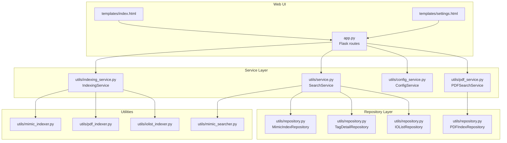
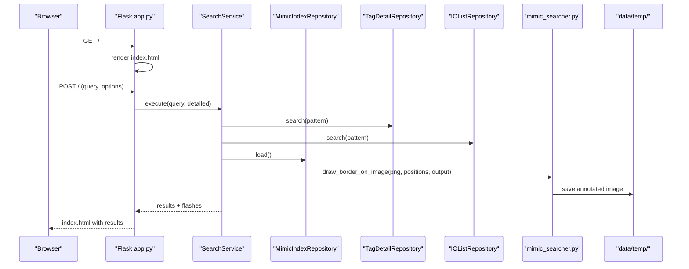
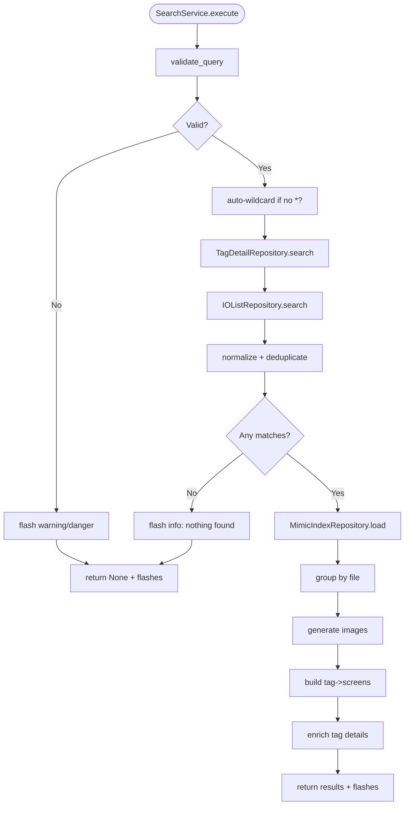
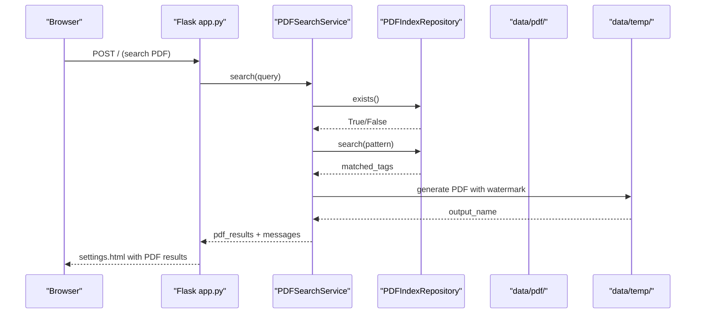
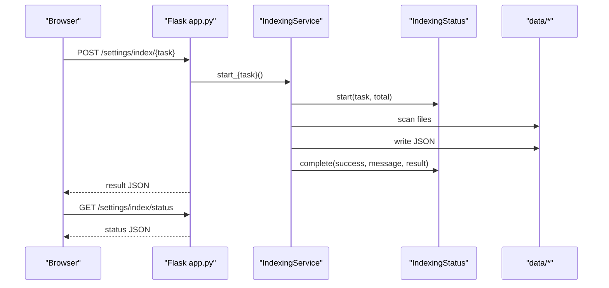
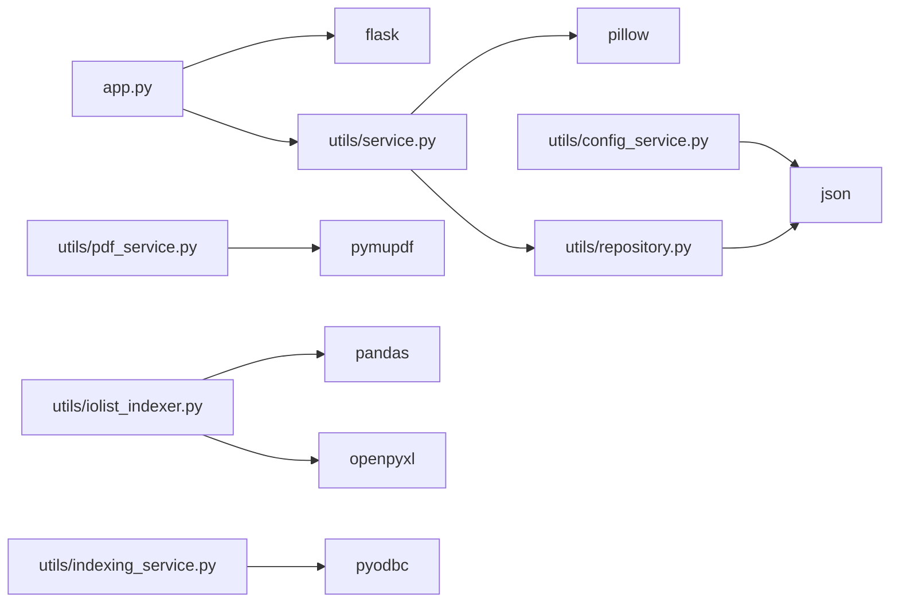

# Troubleshooting and FAQ

<cite>
**Referenced Files in This Document**
- [README.md](file://README.md)
- [app.py](file://app.py)
- [main.py](file://main.py)
- [pyproject.toml](file://pyproject.toml)
- [QWEN.md](file://QWEN.md)
- [templates/index.html](file://templates/index.html)
- [templates/settings.html](file://templates/settings.html)
- [utils/config_service.py](file://utils/config_service.py)
- [utils/repository.py](file://utils/repository.py)
- [utils/service.py](file://utils/service.py)
- [utils/mimic_searcher.py](file://utils/mimic_searcher.py)
- [utils/pdf_service.py](file://utils/pdf_service.py)
- [utils/indexing_service.py](file://utils/indexing_service.py)
- [utils/iolist_indexer.py](file://utils/iolist_indexer.py)
- [utils/mimic_indexer.py](file://utils/mimic_indexer.py)
- [utils/pdf_indexer.py](file://utils/pdf_indexer.py)
</cite>

## Table of Contents
1. [Introduction](#introduction)
2. [Project Structure](#project-structure)
3. [Core Components](#core-components)
4. [Architecture Overview](#architecture-overview)
5. [Detailed Component Analysis](#detailed-component-analysis)
6. [Dependency Analysis](#dependency-analysis)
7. [Performance Considerations](#performance-considerations)
8. [Troubleshooting Guide](#troubleshooting-guide)
9. [FAQ](#faq)
10. [Conclusion](#conclusion)

## Introduction
This document provides comprehensive troubleshooting and FAQ guidance for ECS7Search. It focuses on diagnosing and resolving common issues such as search failures, indexing errors, file system access problems, and performance bottlenecks. It also covers systematic debugging approaches, log analysis techniques, error interpretation, and step-by-step resolution strategies. Preventive measures and escalation procedures are included for complex issues.

## Project Structure
ECS7Search is a Flask-based web application with a layered architecture:
- Web UI (Flask routes) in app.py
- Service layer for search and PDF generation
- Repository layer for JSON data access
- Utilities for indexing mimic files, PDFs, IO lists, and tag extraction
- Templates for rendering search results and settings

**Diagram sources**
- [app.py:88-206](file://app.py#L88-L206)
- [utils/service.py:25-270](file://utils/service.py#L25-L270)
- [utils/pdf_service.py:18-229](file://utils/pdf_service.py#L18-L229)
- [utils/config_service.py:13-128](file://utils/config_service.py#L13-L128)
- [utils/indexing_service.py:85-239](file://utils/indexing_service.py#L85-L239)
- [utils/repository.py:13-178](file://utils/repository.py#L13-L178)
- [utils/mimic_indexer.py:363-436](file://utils/mimic_indexer.py#L363-L436)
- [utils/pdf_indexer.py:41-132](file://utils/pdf_indexer.py#L41-L132)
- [utils/iolist_indexer.py:39-98](file://utils/iolist_indexer.py#L39-L98)
- [utils/mimic_searcher.py:36-111](file://utils/mimic_searcher.py#L36-L111)
- [templates/index.html:1-260](file://templates/index.html#L1-L260)
- [templates/settings.html:1-554](file://templates/settings.html#L1-L554)

**Section sources**
- [app.py:11-85](file://app.py#L11-L85)
- [pyproject.toml:1-19](file://pyproject.toml#L1-L19)

## Core Components
- Flask application with routes for search, settings, and temporary file serving
- SearchService orchestrates tag search across tags.json, io_list.json, and mimics_index.json; generates annotated images
- PDFSearchService searches PDF index and generates a consolidated PDF with corner watermark
- ConfigService provides configuration and statistics for indices and datasets
- IndexingService runs background tasks for mimic, PDF, IO List, and MDB tag extraction
- Repository layer abstracts JSON loading and caching for mimic, tags, IO list, and PDF indices
- Utility scripts handle indexing and searching for standalone CLI usage

Key responsibilities and error-prone areas:
- File system access and permissions for data directories and temporary outputs
- JSON parsing robustness and fallbacks
- Image processing and PDF generation with external libraries
- Background indexing thread safety and status reporting

**Section sources**
- [app.py:88-206](file://app.py#L88-L206)
- [utils/service.py:25-270](file://utils/service.py#L25-L270)
- [utils/pdf_service.py:18-229](file://utils/pdf_service.py#L18-L229)
- [utils/config_service.py:13-128](file://utils/config_service.py#L13-L128)
- [utils/indexing_service.py:85-239](file://utils/indexing_service.py#L85-L239)
- [utils/repository.py:13-178](file://utils/repository.py#L13-L178)

## Architecture Overview
The system follows a clear separation of concerns:
- Router layer (Flask) handles HTTP requests and renders templates
- Service layer encapsulates business logic and integrates repositories
- Repository layer centralizes data access and caching
- Utilities provide CLI tools and background indexing

**Diagram sources**
- [app.py:92-155](file://app.py#L92-L155)
- [utils/service.py:58-158](file://utils/service.py#L58-L158)
- [utils/repository.py:22-62](file://utils/repository.py#L22-L62)
- [utils/mimic_searcher.py:80-111](file://utils/mimic_searcher.py#L80-L111)

## Detailed Component Analysis

### SearchService (Search Failures and Data Processing)
Common issues:
- Invalid query format or too short queries
- No matches in tags.json/io_list.json
- Missing PNG images for mimic results
- Duplicate tag normalization and missing positions

Diagnostic steps:
- Verify query validation and wildcard expansion
- Confirm repository caches are loaded and not empty
- Check PNG availability for matched files
- Review deduplication logic for underscore-prefixed tags

**Diagram sources**
- [utils/service.py:46-158](file://utils/service.py#L46-L158)
- [utils/repository.py:78-93](file://utils/repository.py#L78-L93)
- [utils/repository.py:129-135](file://utils/repository.py#L129-L135)

**Section sources**
- [utils/service.py:46-158](file://utils/service.py#L46-L158)
- [utils/repository.py:22-62](file://utils/repository.py#L22-L62)

### PDFSearchService (PDF Search Failures and Generation)
Common issues:
- Missing PDF index file
- No matches for the query
- PDF file not found or page out of range
- PyMuPDF exceptions during page extraction or watermark insertion

Diagnostic steps:
- Ensure PDF index exists and is up-to-date
- Verify PDF files exist under data/pdf/
- Check page numbers and rotation handling
- Inspect watermark image availability

**Diagram sources**
- [app.py:124-146](file://app.py#L124-L146)
- [utils/pdf_service.py:36-96](file://utils/pdf_service.py#L36-L96)
- [utils/pdf_service.py:97-229](file://utils/pdf_service.py#L97-L229)
- [utils/repository.py:148-177](file://utils/repository.py#L148-L177)

**Section sources**
- [utils/pdf_service.py:36-96](file://utils/pdf_service.py#L36-L96)
- [utils/pdf_service.py:97-229](file://utils/pdf_service.py#L97-L229)
- [utils/repository.py:148-177](file://utils/repository.py#L148-L177)

### IndexingService (Indexing Errors and Background Tasks)
Common issues:
- Concurrent indexing attempts
- Exceptions during indexing routines
- JSON write failures
- Missing source files or directories

Diagnostic steps:
- Check global indexing status before starting new tasks
- Monitor progress endpoint and completion messages
- Validate source directories and file presence
- Inspect JSON output structure and metadata

**Diagram sources**
- [app.py:172-194](file://app.py#L172-L194)
- [utils/indexing_service.py:106-239](file://utils/indexing_service.py#L106-L239)
- [utils/indexing_service.py:23-78](file://utils/indexing_service.py#L23-L78)

**Section sources**
- [utils/indexing_service.py:106-239](file://utils/indexing_service.py#L106-L239)
- [utils/indexing_service.py:23-78](file://utils/indexing_service.py#L23-L78)

### Repository Layer (JSON Access and Caching)
Common issues:
- Missing JSON files
- JSON parsing errors
- Cache invalidation and stale data
- Pattern matching with wildcards

Diagnostic steps:
- Verify file existence before loading
- Wrap loads in try/catch and fall back to empty structures
- Check cache initialization and refresh
- Validate pattern matching and normalization

**Section sources**
- [utils/repository.py:22-62](file://utils/repository.py#L22-L62)
- [utils/repository.py:148-177](file://utils/repository.py#L148-L177)
- [utils/config_service.py:118-127](file://utils/config_service.py#L118-L127)

### ConfigService (Configuration and Statistics)
Common issues:
- Directory traversal errors
- JSON load failures
- Statistic computation anomalies

Diagnostic steps:
- Ensure directories exist and are readable
- Handle exceptions in file counting and JSON loading
- Validate metadata keys presence

**Section sources**
- [utils/config_service.py:110-127](file://utils/config_service.py#L110-L127)

## Dependency Analysis
External dependencies and their roles:
- Flask: web framework for routing and templating
- Pillow: image processing for drawing borders and saving annotated images
- Pandas/OpenPyXL: Excel parsing for IO list
- PyMuPDF: PDF parsing and page extraction
- pyodbc: MDB database connectivity for tag extraction
- alive-progress/yaml: progress reporting and configuration

Potential conflicts and mitigations:
- Version mismatches in Pillow/Pillow-compatible forks
- Large PDFs causing memory spikes
- Excel file locks or malformed sheets

**Diagram sources**
- [pyproject.toml:6-15](file://pyproject.toml#L6-L15)
- [app.py:13-24](file://app.py#L13-L24)
- [utils/service.py:11-20](file://utils/service.py#L11-L20)
- [utils/pdf_service.py:13-15](file://utils/pdf_service.py#L13-L15)
- [utils/iolist_indexer.py:17-18](file://utils/iolist_indexer.py#L17-L18)
- [utils/indexing_service.py:17-20](file://utils/indexing_service.py#L17-L20)
- [utils/config_service.py:9-10](file://utils/config_service.py#L9-L10)
- [utils/repository.py:8-9](file://utils/repository.py#L8-L9)

**Section sources**
- [pyproject.toml:6-15](file://pyproject.toml#L6-L15)

## Performance Considerations
- Limit concurrent indexing tasks to avoid contention
- Control maximum results for image generation to reduce memory usage
- Use caching in repositories to minimize repeated JSON loads
- Optimize PDF processing by avoiding unnecessary rotations and copies
- Monitor disk I/O when writing many annotated images to data/temp/

[No sources needed since this section provides general guidance]

## Troubleshooting Guide

### Search Failures
Symptoms:
- “Nothing found” messages
- Empty results despite valid queries
- Warning about unsupported characters

Steps:
1. Validate query length and allowed characters
2. Confirm tags.json and io_list.json exist and are readable
3. Check mimics_index.json presence and structure
4. Verify PNG files exist for matched mimic files
5. Review deduplication and underscore-normalization logic

Resolution:
- Adjust query to include wildcards or meet minimum length
- Rebuild indices if missing or outdated
- Ensure data directories are mounted and accessible

**Section sources**
- [utils/service.py:46-54](file://utils/service.py#L46-L54)
- [utils/service.py:97-99](file://utils/service.py#L97-L99)
- [utils/repository.py:22-24](file://utils/repository.py#L22-L24)

### Indexing Errors
Symptoms:
- “Indexing already running”
- Exceptions during indexing
- JSON write failures

Steps:
1. Check global indexing status endpoint
2. Stop any ongoing tasks before starting new ones
3. Inspect logs for exceptions raised in indexing routines
4. Verify write permissions for output JSON files

Resolution:
- Wait for current task to complete or restart service
- Fix source file issues (missing files, unreadable formats)
- Ensure sufficient disk space and permissions

**Section sources**
- [utils/indexing_service.py:108-116](file://utils/indexing_service.py#L108-L116)
- [utils/indexing_service.py:139-141](file://utils/indexing_service.py#L139-L141)

### File System Access Issues
Symptoms:
- “Index PDF not found” or “No pages to generate”
- “PNG for X not found”
- “File not found” for PDFs

Steps:
1. Confirm data directories exist and are readable/writable
2. Verify file extensions and paths
3. Check temporary directory permissions
4. Validate that PNGs exist for mimic files

Resolution:
- Create missing directories and set correct permissions
- Copy required files into data/pdf/ and data/mimics/
- Ensure PNGs accompany .g files for visualization

**Section sources**
- [utils/pdf_service.py:43-52](file://utils/pdf_service.py#L43-L52)
- [utils/mimic_searcher.py:128-130](file://utils/mimic_searcher.py#L128-L130)
- [utils/mimic_searcher.py:155-158](file://utils/mimic_searcher.py#L155-L158)

### Performance Bottlenecks
Symptoms:
- Slow search response times
- High memory usage during PDF generation
- Long indexing times for large mimic sets

Steps:
1. Reduce maximum results for image generation
2. Limit PDF processing to necessary pages
3. Split large mimic directories into smaller batches
4. Monitor disk I/O and CPU utilization

Resolution:
- Tune max_results and batch sizes
- Pre-filter PDFs and mimic files
- Use SSD storage for data directories

**Section sources**
- [utils/service.py:171-175](file://utils/service.py#L171-L175)
- [utils/pdf_service.py:154-229](file://utils/pdf_service.py#L154-L229)

### Log Analysis Techniques
- Enable Flask debug mode locally for detailed error traces
- Monitor background indexing status endpoint for progress and completion messages
- Parse printed logs from CLI utilities for indexing and searching
- Check browser developer tools network tab for failed requests

**Section sources**
- [app.py:204-206](file://app.py#L204-L206)
- [app.py:191-194](file://app.py#L191-L194)
- [utils/mimic_indexer.py:409-412](file://utils/mimic_indexer.py#L409-L412)
- [utils/pdf_indexer.py:75-78](file://utils/pdf_indexer.py#L75-L78)

### Error Message Interpretation
- “Unknown task”: route mapped incorrectly or typo in task name
- “Indexing already running”: concurrent tasks detected
- “No pages to generate”: matched_tags empty or no unique pages
- “Page X out of range”: PDF page number mismatch
- “Index PDF not found”: pdf_index.json missing or unreadable

**Section sources**
- [app.py:182-184](file://app.py#L182-L184)
- [utils/indexing_service.py:108-110](file://utils/indexing_service.py#L108-L110)
- [utils/pdf_service.py:150-151](file://utils/pdf_service.py#L150-L151)
- [utils/pdf_service.py:166-170](file://utils/pdf_service.py#L166-L170)
- [utils/pdf_service.py:43-44](file://utils/pdf_service.py#L43-L44)

## FAQ

### Installation Issues
- Problem: Missing dependencies or incompatible versions
  - Resolution: Install using the project’s dependency list and ensure Python 3.10+ is used

- Problem: Import errors for Pillow or PyMuPDF
  - Resolution: Install Pillow and PyMuPDF; reinstall if import fails

**Section sources**
- [pyproject.toml:6-15](file://pyproject.toml#L6-L15)

### Configuration Problems
- Problem: Incorrect data directory paths
  - Resolution: Verify mimics_dir, pdf_dir, temp_dir in settings page and ensure they exist

- Problem: Stats show zero counts
  - Resolution: Confirm JSON files exist and are readable; rebuild indices if needed

**Section sources**
- [templates/settings.html:102-119](file://templates/settings.html#L102-L119)
- [utils/config_service.py:110-127](file://utils/config_service.py#L110-L127)

### Data Processing Errors
- Problem: IO List parsing fails
  - Resolution: Ensure IO_list.xlsx exists and is readable; check for locked files

- Problem: MDB tag extraction fails
  - Resolution: Verify MDB files exist and pyodbc connection succeeds

**Section sources**
- [utils/iolist_indexer.py:101-103](file://utils/iolist_indexer.py#L101-L103)
- [utils/indexing_service.py:222-238](file://utils/indexing_service.py#L222-L238)

### Web Interface Troubleshooting
- Problem: Search form does not submit
  - Resolution: Check browser JavaScript; ensure Flask routes are reachable

- Problem: Annotated images not displayed
  - Resolution: Confirm PNGs exist and temporary directory is writable

**Section sources**
- [templates/index.html:8-37](file://templates/index.html#L8-L37)
- [app.py:197-201](file://app.py#L197-L201)

### Performance Optimization
- Reduce max_results for image generation
- Pre-index mimic and PDF sets incrementally
- Use SSD for data directories
- Monitor memory usage during PDF generation

**Section sources**
- [utils/service.py:171-175](file://utils/service.py#L171-L175)
- [utils/pdf_service.py:154-229](file://utils/pdf_service.py#L154-L229)

### Memory Usage Monitoring
- Monitor RSS and VMS during PDF generation
- Limit concurrent background tasks
- Use streaming when possible for large PDFs

[No sources needed since this section provides general guidance]

### System Resource Requirements
- Minimum: Python 3.10+, 1 GB RAM, 500 MB free disk space
- Recommended: 4+ GB RAM, SSD storage, multiple CPU cores for indexing

[No sources needed since this section provides general guidance]

### Step-by-Step Resolution Guides
- Search not returning results:
  1. Validate query format and length
  2. Confirm indices exist and are recent
  3. Rebuild indices if necessary
  4. Check PNG availability for mimic files

- PDF search failing:
  1. Ensure PDF index exists
  2. Verify PDF files exist under data/pdf/
  3. Check page numbers and rotation handling
  4. Regenerate PDF index

- Indexing stuck or failing:
  1. Check status endpoint for progress
  2. Cancel or wait for current task
  3. Re-run with corrected source files
  4. Monitor logs for exceptions

**Section sources**
- [utils/service.py:46-54](file://utils/service.py#L46-L54)
- [utils/pdf_service.py:43-52](file://utils/pdf_service.py#L43-L52)
- [utils/indexing_service.py:108-116](file://utils/indexing_service.py#L108-L116)

### Preventive Measures
- Regularly rebuild indices after data updates
- Maintain separate directories for mimic, PDF, and temp data
- Use version-controlled configurations for paths
- Schedule periodic checks of file system permissions

[No sources needed since this section provides general guidance]

### Escalation Procedures
- For persistent indexing failures:
  - Collect logs from CLI utilities and Flask debug output
  - Provide environment details (Python version, OS, installed packages)
  - Open an issue with reproduction steps and sample data (anonymized)

[No sources needed since this section provides general guidance]

## Conclusion
This guide consolidates practical troubleshooting steps, diagnostic procedures, and resolution strategies for ECS7Search. By following the structured approaches outlined here—validating queries, checking indices, verifying file system access, and monitoring performance—you can quickly identify and resolve most issues. For persistent or complex problems, escalate with detailed logs and environment information.