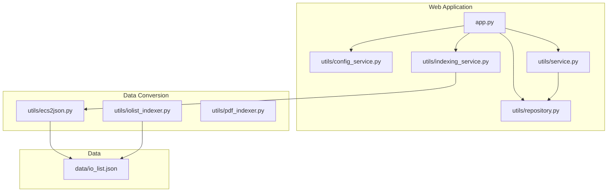
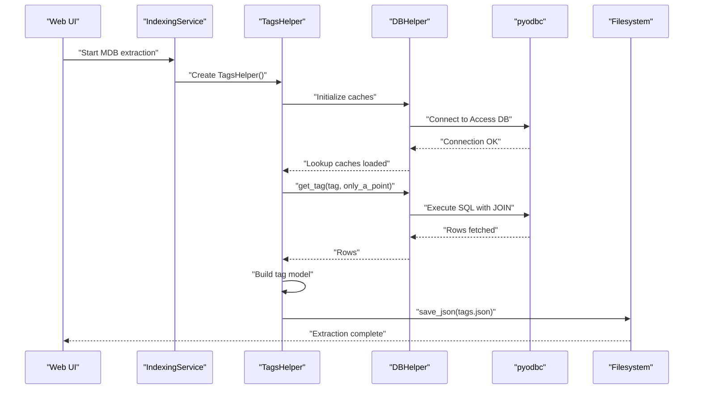
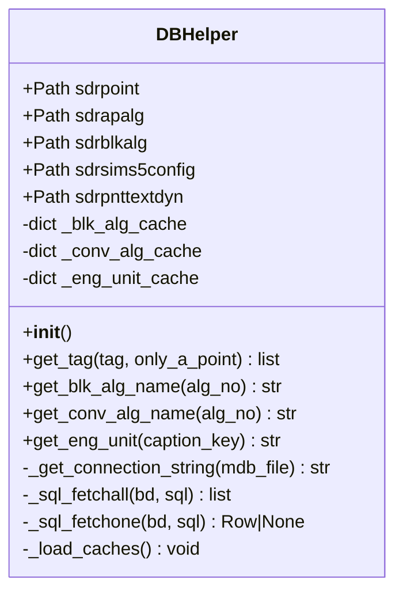
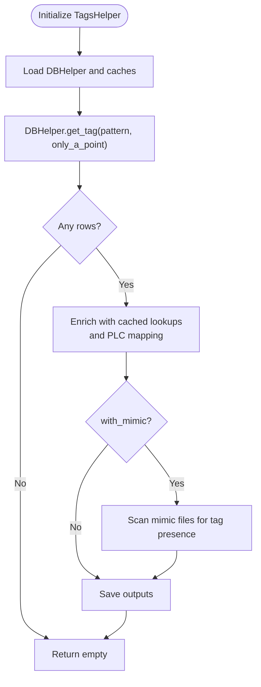
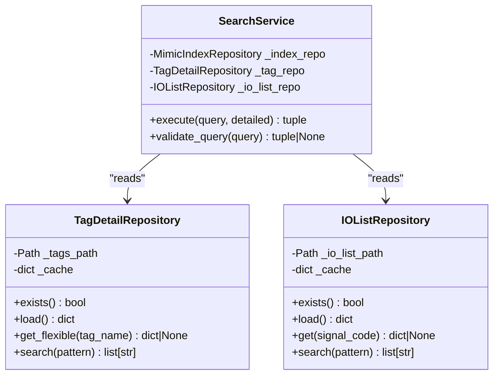
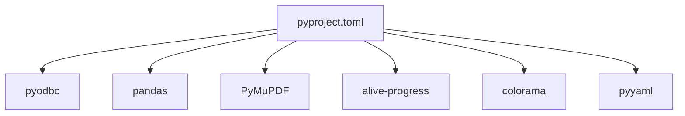

# Data Conversion Tools

<cite>
**Referenced Files in This Document**
- [README.md](file://README.md)
- [QWEN.md](file://QWEN.md)
- [pyproject.toml](file://pyproject.toml)
- [app.py](file://app.py)
- [main.py](file://main.py)
- [utils/ecs2json.py](file://utils/ecs2json.py)
- [utils/repository.py](file://utils/repository.py)
- [utils/service.py](file://utils/service.py)
- [utils/indexing_service.py](file://utils/indexing_service.py)
- [utils/config_service.py](file://utils/config_service.py)
- [utils/iolist_indexer.py](file://utils/iolist_indexer.py)
- [utils/pdf_indexer.py](file://utils/pdf_indexer.py)
- [data/io_list.json](file://data/io_list.json)
</cite>

## Table of Contents
1. [Introduction](#introduction)
2. [Project Structure](#project-structure)
3. [Core Components](#core-components)
4. [Architecture Overview](#architecture-overview)
5. [Detailed Component Analysis](#detailed-component-analysis)
6. [Dependency Analysis](#dependency-analysis)
7. [Performance Considerations](#performance-considerations)
8. [Troubleshooting Guide](#troubleshooting-guide)
9. [Conclusion](#conclusion)
10. [Appendices](#appendices)

## Introduction
This document describes the ECS7 data conversion tools that extract and transform SCADA tag data from Microsoft Access databases into structured output formats consumable by the main search application. It focuses on:
- Database connectivity and query construction for ECS7 Access databases
- Lookup table caching for performance
- Tag extraction and transformation into a unified data model
- Output generation in JSON, YAML, CSV, and Telegraf-compatible formats
- Integration with the web application’s search pipeline

The documentation also explains how the main search application consumes the transformed tag data and how the conversion pipeline integrates with the broader indexing and retrieval system.

## Project Structure
The repository is organized around a Flask web application and a set of utility modules responsible for data conversion, indexing, and search integration. The key areas for data conversion are:
- Web application entry and routing
- Data conversion utilities for ECS7 Access databases
- Repository and service layers for consuming converted data
- Supporting indexers for IO lists and PDFs

**Diagram sources**
- [app.py:1-206](file://app.py#L1-L206)
- [utils/indexing_service.py:1-239](file://utils/indexing_service.py#L1-L239)
- [utils/ecs2json.py:1-480](file://utils/ecs2json.py#L1-L480)
- [utils/repository.py:1-178](file://utils/repository.py#L1-L178)
- [utils/service.py:1-270](file://utils/service.py#L1-L270)
- [utils/iolist_indexer.py:1-122](file://utils/iolist_indexer.py#L1-L122)
- [utils/pdf_indexer.py:1-215](file://utils/pdf_indexer.py#L1-L215)
- [data/io_list.json:1-200](file://data/io_list.json#L1-L200)

**Section sources**
- [README.md:1-1](file://README.md#L1-L1)
- [QWEN.md:48-93](file://QWEN.md#L48-L93)
- [pyproject.toml:1-18](file://pyproject.toml#L1-L18)
- [app.py:1-206](file://app.py#L1-L206)

## Core Components
This section documents the primary classes and functions used for ECS7 data conversion and transformation.

- DBHelper: Manages connections to ECS7 Access databases, executes SQL queries, and caches lookup tables for performance.
- TagsHelper: Orchestrates tag extraction from Access databases, transforms rows into a unified tag data model, and writes outputs in multiple formats.
- IndexingService: Provides a web-driven interface to trigger MDB tag extraction and persist the resulting tags.json consumed by the search application.
- Repository and Service layers: Provide cached access to tags.json and support search workflows.

Key responsibilities:
- Database connectivity patterns and SQL construction
- Cache management for lookup tables
- Tag data structure formatting
- Output generation (JSON, YAML, CSV, Telegraf)
- Integration with the main search application

**Section sources**
- [utils/ecs2json.py:39-480](file://utils/ecs2json.py#L39-L480)
- [utils/indexing_service.py:85-239](file://utils/indexing_service.py#L85-L239)
- [utils/repository.py:27-178](file://utils/repository.py#L27-L178)
- [utils/service.py:25-270](file://utils/service.py#L25-L270)

## Architecture Overview
The data conversion architecture connects the web application to the ECS7 Access databases and produces a normalized tags dataset. The flow is:

- Web UI triggers MDB tag extraction
- IndexingService spawns a background thread to run TagsHelper
- TagsHelper queries Access databases and caches lookup tables
- TagsHelper builds a unified tag data model and persists to tags.json
- Search service reads tags.json and IO list data to power search results

**Diagram sources**
- [utils/indexing_service.py:210-238](file://utils/indexing_service.py#L210-L238)
- [utils/ecs2json.py:159-221](file://utils/ecs2json.py#L159-L221)
- [utils/ecs2json.py:98-130](file://utils/ecs2json.py#L98-L130)

## Detailed Component Analysis

### DBHelper: MS Access Connectivity and Caching
DBHelper encapsulates:
- Database file discovery and validation
- Connection string construction for Access
- SQL execution helpers for fetching all or single rows
- Lookup table caching for block algorithms, conversion algorithms, and engineering units

Implementation highlights:
- Connection string uses the Microsoft Access ODBC driver
- SQL queries leverage a JOIN with an external Access database mounted via a database path
- Caches are populated once during initialization and reused across lookups

**Diagram sources**
- [utils/ecs2json.py:39-158](file://utils/ecs2json.py#L39-L158)

Key behaviors:
- Initialization validates required Access database files and loads caches
- SQL queries filter by tag pattern and optional A-point constraint
- Lookup methods return localized names or unit descriptions using cached dictionaries

**Section sources**
- [utils/ecs2json.py:44-68](file://utils/ecs2json.py#L44-L68)
- [utils/ecs2json.py:62-97](file://utils/ecs2json.py#L62-L97)
- [utils/ecs2json.py:98-130](file://utils/ecs2json.py#L98-L130)
- [utils/ecs2json.py:131-158](file://utils/ecs2json.py#L131-L158)
- [utils/ecs2json.py:159-221](file://utils/ecs2json.py#L159-L221)

### TagsHelper: Tag Extraction and Transformation
TagsHelper orchestrates:
- Initialization with a pattern and optional mimic search
- Fetching tags from Access databases via DBHelper
- Transforming rows into a unified tag data model
- Writing outputs in multiple formats

Processing logic:
- Iterates over fetched rows and constructs a dictionary per tag
- Uses cached lookup methods to enrich algorithm and unit descriptions
- Optionally scans mimic files to annotate tags with screen references
- Saves outputs to JSON, YAML, CSV, Telegraf configuration, and a custom equipment JSON

**Diagram sources**
- [utils/ecs2json.py:224-454](file://utils/ecs2json.py#L224-L454)
- [utils/ecs2json.py:256-335](file://utils/ecs2json.py#L256-L335)
- [utils/ecs2json.py:337-380](file://utils/ecs2json.py#L337-L380)

Output formats:
- JSON: includes metadata such as directory, indexing time, and total tags
- YAML: human-readable tag list
- CSV: tabular representation suitable for spreadsheets
- Telegraf: nodes configuration for OPC tag discovery

**Section sources**
- [utils/ecs2json.py:224-454](file://utils/ecs2json.py#L224-L454)
- [utils/ecs2json.py:385-454](file://utils/ecs2json.py#L385-L454)

### IndexingService: Web-Driven MDB Extraction
IndexingService exposes endpoints to start background tasks. For MDB extraction:
- Validates that no other task is running
- Spawns a thread to run TagsHelper and persist tags.json
- Updates global indexing status with progress and completion messages

Integration with the web app:
- The web UI calls endpoints to start tasks and polls for status
- On completion, the tags.json produced by TagsHelper becomes the source for the search service

**Section sources**
- [utils/indexing_service.py:85-239](file://utils/indexing_service.py#L85-L239)
- [app.py:172-189](file://app.py#L172-L189)

### Repository and Service Layers: Consuming Converted Data
Repository layer:
- TagDetailRepository: cached loader for tags.json supporting flexible tag name variants
- IOListRepository: cached loader for io_list.json with field projection and pattern search
- MimicIndexRepository and PDFIndexRepository: loaders for mimic and PDF indices

Service layer:
- SearchService: orchestrates search across tags.json, io_list.json, and mimic index
- Builds results with tag details, screen references, and optional IO list enrichment

**Diagram sources**
- [utils/repository.py:27-178](file://utils/repository.py#L27-L178)
- [utils/service.py:25-270](file://utils/service.py#L25-L270)

**Section sources**
- [utils/repository.py:27-178](file://utils/repository.py#L27-L178)
- [utils/service.py:25-270](file://utils/service.py#L25-L270)

## Dependency Analysis
External dependencies and runtime requirements:
- pyodbc for Access database connectivity
- pandas for Excel parsing (IO list)
- PyMuPDF for PDF indexing
- alive-progress and colorama for CLI feedback
- yaml for YAML output
- flask for the web application

**Diagram sources**
- [pyproject.toml:6-15](file://pyproject.toml#L6-L15)

**Section sources**
- [pyproject.toml:1-18](file://pyproject.toml#L1-L18)

## Performance Considerations
- Lookup table caching: DBHelper preloads three lookup tables into memory to avoid repeated database hits during tag processing.
- Localized method references: TagsHelper caches method references for enriched lookups to reduce attribute access overhead inside tight loops.
- Batched output writing: Outputs are written once after processing completes, minimizing I/O contention.
- Optional mimic scanning: Mimic search is off by default and can be disabled to improve performance when not needed.

[No sources needed since this section provides general guidance]

## Troubleshooting Guide
Common issues and resolutions:
- Missing Access database files: Ensure the required MDB files are present in the configured directory. The constructor raises an exception if any required file is missing.
- ODBC driver errors: Confirm the Microsoft Access ODBC driver is installed and accessible.
- Empty tag results: Verify the tag pattern and A-point filter. Adjust the pattern or remove the A-point restriction to broaden results.
- Slow processing: Enable caching (already built-in) and avoid enabling mimic scanning unless necessary.
- Web UI extraction not completing: Check the indexing status endpoint and logs for errors.

**Section sources**
- [utils/ecs2json.py:52-54](file://utils/ecs2json.py#L52-L54)
- [utils/ecs2json.py:80-82](file://utils/ecs2json.py#L80-L82)
- [utils/ecs2json.py:94-96](file://utils/ecs2json.py#L94-L96)
- [utils/indexing_service.py:210-238](file://utils/indexing_service.py#L210-L238)

## Conclusion
The ECS7 data conversion tools provide a robust pipeline to extract, enrich, and transform tag data from Access databases into formats consumable by the main search application. By leveraging caching, structured SQL queries, and multiple output formats, the system supports efficient search and integration workflows. The web application’s indexing service and repository/service layers complete the ecosystem by exposing extraction capabilities and powering search results.

[No sources needed since this section summarizes without analyzing specific files]

## Appendices

### Practical Examples and Workflows
- Database connectivity requirements:
  - Ensure the Microsoft Access ODBC driver is installed.
  - Place the required MDB files in the configured directory.
- Tag filtering options:
  - Pattern-based filtering using LIKE with wildcards.
  - Optional A-point-only filtering to restrict to analog points.
- PLC configuration mapping:
  - Input and output memory types mapped via lookup tables.
  - Memory addresses formatted as DB offsets for downstream systems.
- Output format generation:
  - JSON with metadata for integration with the search application.
  - YAML and CSV for manual inspection and spreadsheet workflows.
  - Telegraf configuration for OPC tag discovery.

**Section sources**
- [utils/ecs2json.py:159-221](file://utils/ecs2json.py#L159-L221)
- [utils/ecs2json.py:385-454](file://utils/ecs2json.py#L385-L454)
- [utils/indexing_service.py:210-238](file://utils/indexing_service.py#L210-L238)
- [data/io_list.json:1-200](file://data/io_list.json#L1-L200)