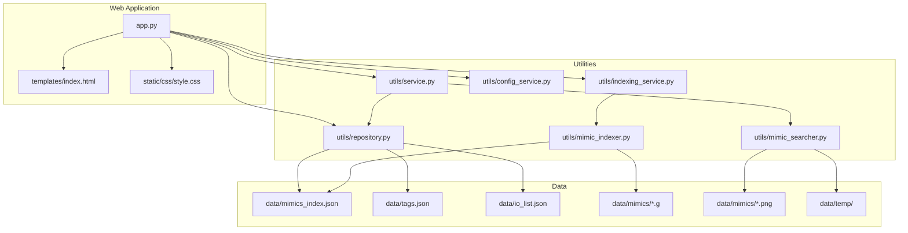
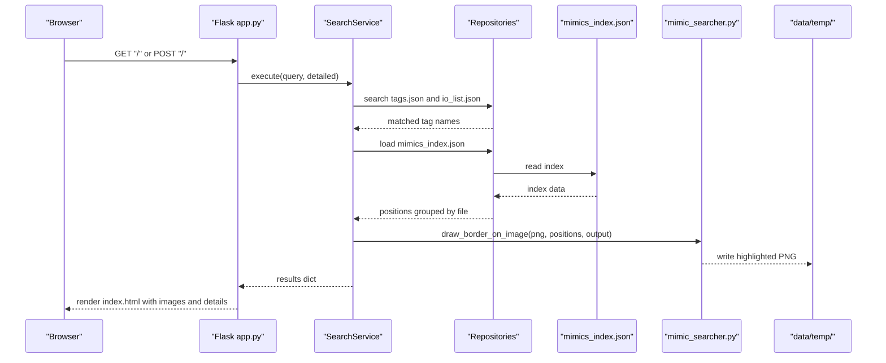
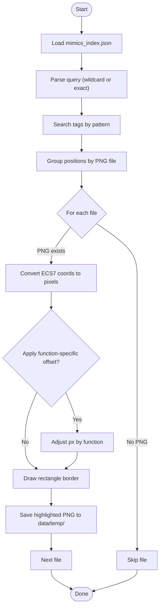
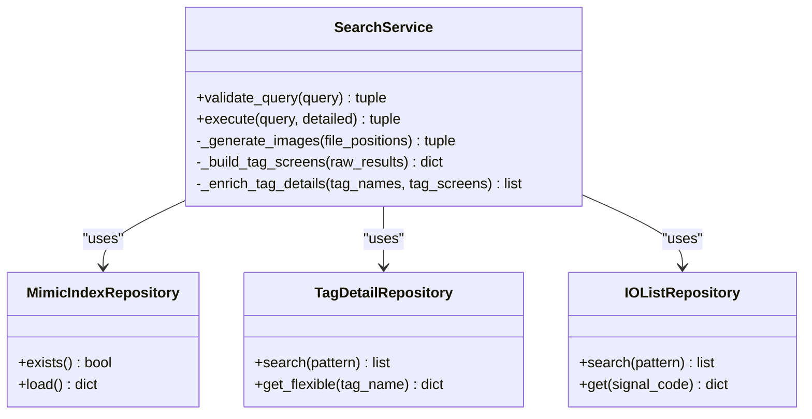
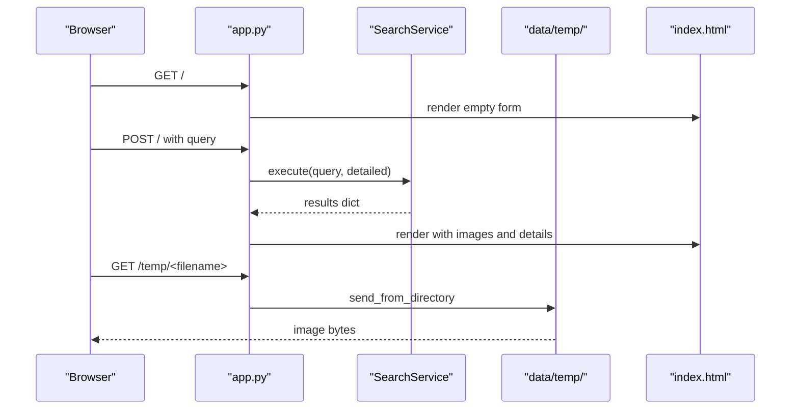
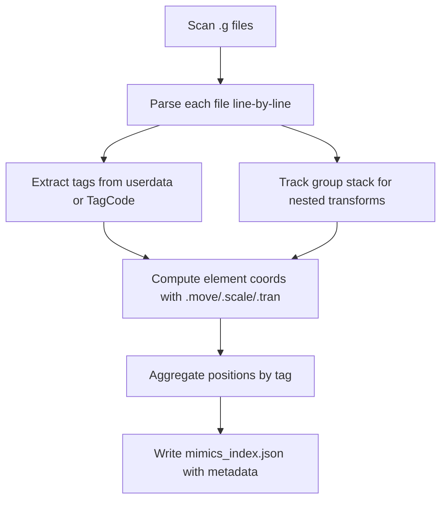
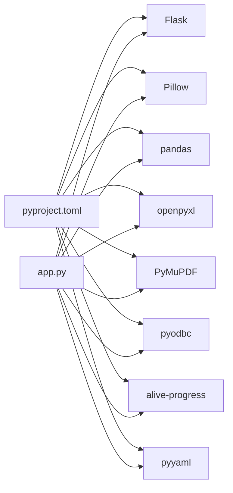

# Image Processing

<cite>
**Referenced Files in This Document**
- [mimic_searcher.py](file://utils/mimic_searcher.py)
- [service.py](file://utils/service.py)
- [repository.py](file://utils/repository.py)
- [app.py](file://app.py)
- [index.html](file://templates/index.html)
- [style.css](file://static/css/style.css)
- [mimic_indexer.py](file://utils/mimic_indexer.py)
- [mimics_index.json](file://data/mimics_index.json)
- [tags.json](file://data/tags.json)
- [io_list.json](file://data/io_list.json)
- [config_service.py](file://utils/config_service.py)
- [indexing_service.py](file://utils/indexing_service.py)
- [QWEN.md](file://QWEN.md)
- [promt.md](file://promt.md)
- [pyproject.toml](file://pyproject.toml)
</cite>

## Table of Contents
1. [Introduction](#introduction)
2. [Project Structure](#project-structure)
3. [Core Components](#core-components)
4. [Architecture Overview](#architecture-overview)
5. [Detailed Component Analysis](#detailed-component-analysis)
6. [Dependency Analysis](#dependency-analysis)
7. [Performance Considerations](#performance-considerations)
8. [Troubleshooting Guide](#troubleshooting-guide)
9. [Conclusion](#conclusion)
10. [Appendices](#appendices)

## Introduction
This document explains the ECS7 image processing utilities with a focus on screen mimic visualization and tag location detection. It covers the mimic searcher functionality for locating tags across ECS7 mimic screenshots, converting ECS7 logical coordinates to pixel coordinates, drawing borders around detected positions, and generating visual results. It also documents the web interface integration, image format requirements, resolution handling, performance optimization for large images, and quality assurance for visual results.

## Project Structure
The project is organized into:
- Utilities for indexing, searching, and image processing
- A Flask web application serving search results and visualizations
- Templates and static assets for rendering
- Data directories containing mimic indices, tags, IO lists, and temporary outputs

**Diagram sources**
- [app.py:1-206](file://app.py#L1-L206)
- [service.py:1-270](file://utils/service.py#L1-L270)
- [repository.py:1-178](file://utils/repository.py#L1-L178)
- [mimic_searcher.py:1-174](file://utils/mimic_searcher.py#L1-L174)
- [mimic_indexer.py:1-484](file://utils/mimic_indexer.py#L1-L484)
- [indexing_service.py:1-239](file://utils/indexing_service.py#L1-L239)
- [index.html:1-260](file://templates/index.html#L1-L260)
- [style.css:1-154](file://static/css/style.css#L1-L154)

**Section sources**
- [app.py:1-206](file://app.py#L1-L206)
- [QWEN.md:1-93](file://QWEN.md#L1-L93)

## Core Components
- Mimic Searcher: Loads the mimic index, searches tags by exact match or wildcard patterns, resolves PNG images for mimic files, converts ECS7 coordinates to pixels, and draws yellow borders around tag positions.
- Search Service: Orchestrates search across tags.json and io_list.json, enriches results with tag metadata, groups positions by PNG files, generates highlighted images, and prepares web results.
- Repository Layer: Provides cached access to mimic index, tags.json, io_list.json, and PDF index.
- Web Application: Flask routes for search, settings, and serving temporary images; integrates with Search Service and renders results in templates.
- Indexing Pipeline: Builds mimic index from .g files and writes mimics_index.json.

Key responsibilities:
- Coordinate conversion from ECS7 logical units to pixel coordinates
- Border drawing with special offsets for specific element types
- Automated screenshot generation with tag highlighting
- Validation of queries and robust error handling
- Integration with the web interface for displaying results

**Section sources**
- [mimic_searcher.py:1-174](file://utils/mimic_searcher.py#L1-L174)
- [service.py:1-270](file://utils/service.py#L1-L270)
- [repository.py:1-178](file://utils/repository.py#L1-L178)
- [app.py:1-206](file://app.py#L1-L206)

## Architecture Overview
The system follows a layered architecture:
- Router (Flask) handles requests and delegates to services
- Service layer performs search, enrichment, and image generation
- Repository layer abstracts data access
- Utility layer encapsulates mimic parsing and visualization

**Diagram sources**
- [app.py:92-155](file://app.py#L92-L155)
- [service.py:58-158](file://utils/service.py#L58-L158)
- [repository.py:13-178](file://utils/repository.py#L13-L178)
- [mimic_searcher.py:80-111](file://utils/mimic_searcher.py#L80-L111)

## Detailed Component Analysis

### Mimic Searcher: Tag Location Detection and Visualization
The mimic searcher module implements:
- Index loading and tag search with wildcard support
- ECS7-to-pixel coordinate conversion
- Special offset adjustments for specific element functions
- Border drawing on PNG images and saving results

**Diagram sources**
- [mimic_searcher.py:36-111](file://utils/mimic_searcher.py#L36-L111)

Key functions and behaviors:
- Index loading: [load_index:36-39](file://utils/mimic_searcher.py#L36-L39)
- Pattern search: [search_tags:42-61](file://utils/mimic_searcher.py#L42-L61)
- ECS7 to pixel conversion: [convert_ecs_coords:71-77](file://utils/mimic_searcher.py#L71-L77)
- Border drawing with offsets: [draw_border_on_image:80-111](file://utils/mimic_searcher.py#L80-L111)
- File resolution: [get_image_for_file:64-68](file://utils/mimic_searcher.py#L64-L68)

Practical examples:
- Exact tag match: search for a specific tag name
- Prefix wildcard: search for tags starting with a given prefix
- Contains wildcard: search for tags containing a substring
- Position calculation: convert ECS7 coordinates to pixel positions and draw rectangles
- Error handling: skip missing PNGs and report skipped files

**Section sources**
- [mimic_searcher.py:1-174](file://utils/mimic_searcher.py#L1-L174)

### Search Service: Orchestration and Result Enrichment
The Search Service:
- Validates user queries
- Searches tags.json and io_list.json
- Deduplicates and normalizes tag names
- Loads mimic index and retrieves positions
- Groups positions by PNG file and generates highlighted images
- Enriches results with tag metadata and IO list details

**Diagram sources**
- [service.py:25-270](file://utils/service.py#L25-L270)
- [repository.py:13-178](file://utils/repository.py#L13-L178)

Highlights:
- Query validation and normalization: [validate_query:46-54](file://utils/service.py#L46-L54)
- Execution pipeline: [execute:58-158](file://utils/service.py#L58-L158)
- Image generation loop: [_generate_images:162-198](file://utils/service.py#L162-L198)
- Metadata enrichment: [_enrich_tag_details:215-269](file://utils/service.py#L215-L269)

**Section sources**
- [service.py:1-270](file://utils/service.py#L1-L270)
- [repository.py:1-178](file://utils/repository.py#L1-L178)

### Web Interface Integration
The Flask application:
- Routes: index page, settings, and serving temporary images
- Renders results with images and tag details
- Integrates with Search Service and repositories
- Serves highlighted images from data/temp/

**Diagram sources**
- [app.py:92-155](file://app.py#L92-L155)
- [app.py:197-201](file://app.py#L197-L201)
- [index.html:231-252](file://templates/index.html#L231-L252)

**Section sources**
- [app.py:1-206](file://app.py#L1-L206)
- [index.html:1-260](file://templates/index.html#L1-L260)
- [style.css:1-154](file://static/css/style.css#L1-L154)

### Indexing Pipeline: Building the Mimic Index
The indexer parses .g mimic files, extracts tags, computes coordinates considering nested groups, and writes mimics_index.json.

**Diagram sources**
- [mimic_indexer.py:83-361](file://utils/mimic_indexer.py#L83-L361)
- [mimic_indexer.py:363-435](file://utils/mimic_indexer.py#L363-L435)

**Section sources**
- [mimic_indexer.py:1-484](file://utils/mimic_indexer.py#L1-L484)
- [mimics_index.json:1-800](file://data/mimics_index.json#L1-L800)

## Dependency Analysis
External dependencies and their roles:
- Flask: web framework for routing and templating
- Pillow: image processing for drawing borders and saving images
- pandas/openpyxl: Excel parsing for IO list
- PyMuPDF: PDF indexing and search
- pyodbc: database connectivity for MDB extraction
- alive-progress: progress reporting during indexing
- pyyaml: YAML support

**Diagram sources**
- [pyproject.toml:1-19](file://pyproject.toml#L1-L19)
- [app.py:1-206](file://app.py#L1-L206)

**Section sources**
- [pyproject.toml:1-19](file://pyproject.toml#L1-L19)
- [app.py:1-206](file://app.py#L1-L206)

## Performance Considerations
- Large images: For very large PNGs, consider resizing or tiling to reduce memory usage and rendering time. The current implementation opens and draws on full-resolution images.
- Batch processing: Limit concurrent image generations to avoid I/O saturation; the service caps results to a maximum count.
- Caching: Repositories cache parsed JSON to minimize repeated disk reads.
- Regex parsing: Indexer uses compiled patterns; keep patterns efficient to avoid slow parsing on large .g files.
- Temporary storage: Ensure sufficient disk space in data/temp/ for generated images.

[No sources needed since this section provides general guidance]

## Troubleshooting Guide
Common issues and resolutions:
- Missing PNG for a mimic file: The system skips missing PNGs and reports them as skipped items. Verify that PNGs exist in data/mimics/ with matching names.
- Index not found: If mimics_index.json is missing, the system reports an error. Rebuild the index using the mimic indexer.
- No results found: Queries shorter than 3 characters are rejected. Wildcards are supported; ensure patterns match tag names.
- Image not displayed: Confirm that the image was generated in data/temp/ and served via /temp/<filename>.
- Coordinate mismatches: Ensure ECS7 logical coordinates are present in the index and that PNG resolution matches expectations.

**Section sources**
- [service.py:162-198](file://utils/service.py#L162-L198)
- [mimic_searcher.py:128-131](file://utils/mimic_searcher.py#L128-L131)
- [app.py:197-201](file://app.py#L197-L201)

## Conclusion
The ECS7 image processing utilities provide a complete pipeline for detecting tag locations on mimic screenshots, converting logical coordinates to pixels, and generating visual results with highlighted borders. The web interface integrates seamlessly with the backend services, enabling quick identification of tags across multiple screens. By following the guidelines in this document, developers can maintain and extend the system while ensuring robustness, performance, and quality.

[No sources needed since this section summarizes without analyzing specific files]

## Appendices

### Coordinate System Conversion Details
- ECS7 logical bounds: 137×77 units
- Conversion formula: x_pixel = width_px / 137 × x_logical; y_pixel = height_px / 77 × y_logical
- Y-axis inversion: ECS7 y increases upward; image y increases downward, so y is inverted before scaling
- Special offsets: Adjustments for specific element functions (valves, unimotors, group selectors, pumps)

**Section sources**
- [mimic_searcher.py:71-77](file://utils/mimic_searcher.py#L71-L77)

### Image Format and Resolution Handling
- Input: .g mimic files and corresponding .png screenshots
- Output: Highlighted .png images saved to data/temp/ with a suffix indicating search results
- Resolution: Uses actual PNG dimensions for pixel conversion; ensure PNGs reflect the intended display resolution

**Section sources**
- [mimic_searcher.py:80-111](file://utils/mimic_searcher.py#L80-L111)
- [QWEN.md:14-17](file://QWEN.md#L14-L17)

### Practical Examples
- Tag location calculation: Use convert_ecs_coords to transform ECS7 positions to pixel coordinates for a given PNG size.
- Image validation: Check for PNG existence before attempting to draw borders.
- Error handling: Skip missing PNGs and collect skipped items for user feedback.
- Integration: Call SearchService.execute from Flask routes to generate and render results.

**Section sources**
- [service.py:162-198](file://utils/service.py#L162-L198)
- [app.py:92-155](file://app.py#L92-L155)