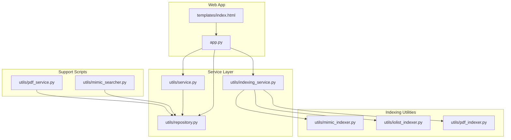
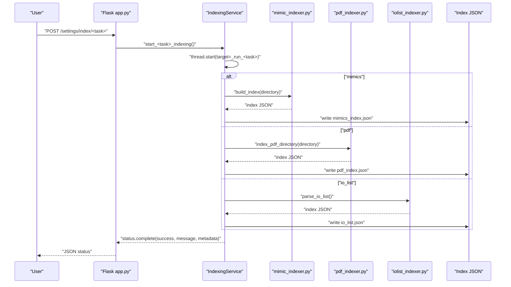
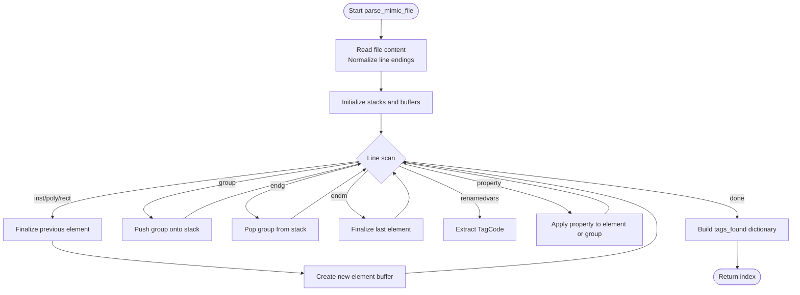
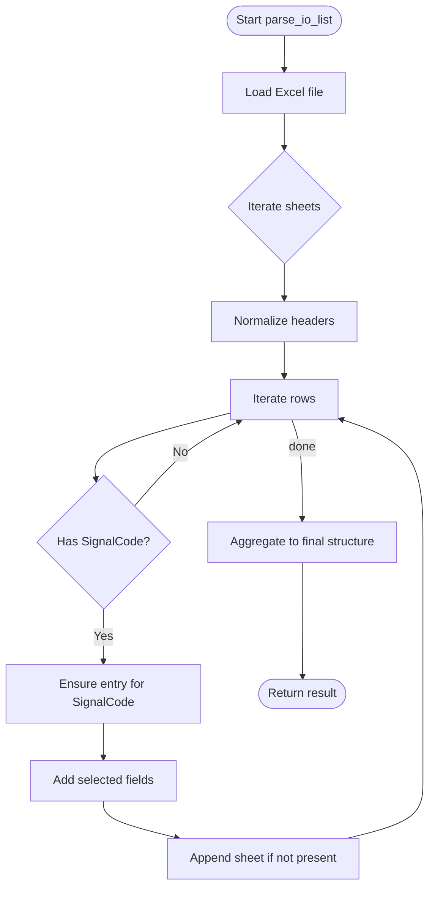
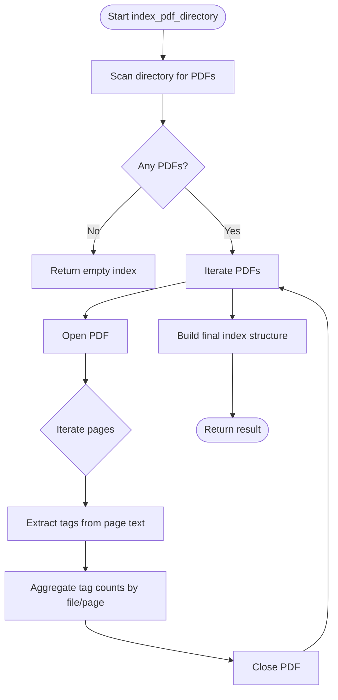
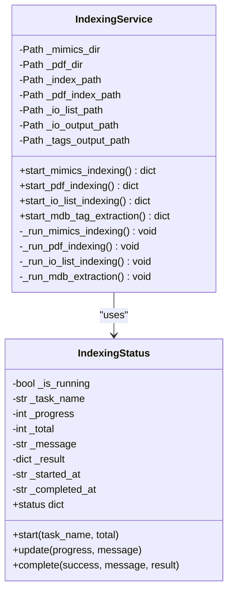
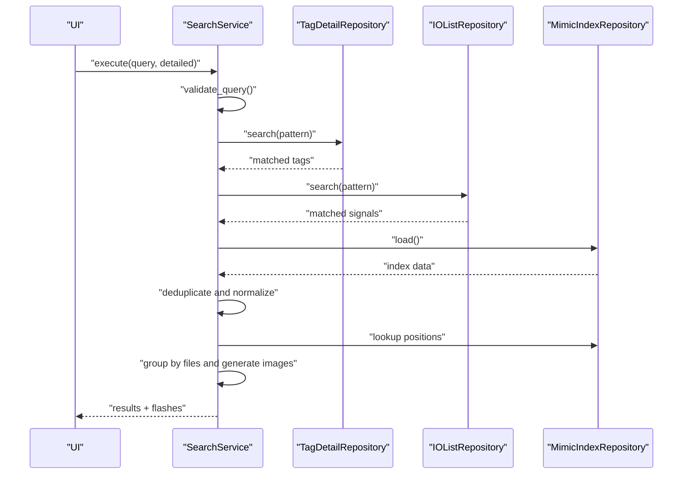
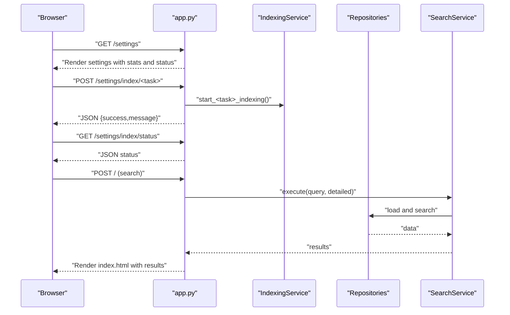
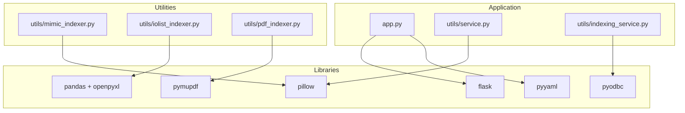

# Indexing Utilities

<cite>
**Referenced Files in This Document**
- [mimic_indexer.py](file://utils/mimic_indexer.py)
- [iolist_indexer.py](file://utils/iolist_indexer.py)
- [pdf_indexer.py](file://utils/pdf_indexer.py)
- [indexing_service.py](file://utils/indexing_service.py)
- [app.py](file://app.py)
- [repository.py](file://utils/repository.py)
- [service.py](file://utils/service.py)
- [mimic_searcher.py](file://utils/mimic_searcher.py)
- [pdf_service.py](file://utils/pdf_service.py)
- [index.html](file://templates/index.html)
- [pyproject.toml](file://pyproject.toml)
</cite>

## Table of Contents
1. [Introduction](#introduction)
2. [Project Structure](#project-structure)
3. [Core Components](#core-components)
4. [Architecture Overview](#architecture-overview)
5. [Detailed Component Analysis](#detailed-component-analysis)
6. [Dependency Analysis](#dependency-analysis)
7. [Performance Considerations](#performance-considerations)
8. [Troubleshooting Guide](#troubleshooting-guide)
9. [Conclusion](#conclusion)
10. [Appendices](#appendices)

## Introduction
This document describes the ECS7 indexing utilities that power specialized indexing for different data sources:
- Mimic indexer for SCADA ECS7 screen mimic files (.g)
- IO list indexer for process variable data from Excel spreadsheets
- PDF indexer for document-based tag indexing from PDFs

It explains indexing algorithms, file processing workflows, data extraction patterns, index generation procedures, and how these utilities integrate with the web application. It also covers practical examples, validation rules, optimization strategies, batch processing, error recovery, and performance considerations for large-scale indexing operations.

## Project Structure
The project is organized around a Flask web application with dedicated indexing utilities and repositories/services for search and rendering.

**Diagram sources**
- [app.py:1-206](file://app.py#L1-L206)
- [mimic_indexer.py:1-484](file://utils/mimic_indexer.py#L1-L484)
- [iolist_indexer.py:1-122](file://utils/iolist_indexer.py#L1-L122)
- [pdf_indexer.py:1-215](file://utils/pdf_indexer.py#L1-L215)
- [indexing_service.py:1-239](file://utils/indexing_service.py#L1-L239)
- [repository.py:1-178](file://utils/repository.py#L1-L178)
- [service.py:1-270](file://utils/service.py#L1-L270)
- [mimic_searcher.py:1-174](file://utils/mimic_searcher.py#L1-L174)
- [pdf_service.py:1-229](file://utils/pdf_service.py#L1-L229)
- [index.html:1-260](file://templates/index.html#L1-L260)

**Section sources**
- [app.py:1-206](file://app.py#L1-L206)
- [pyproject.toml:1-19](file://pyproject.toml#L1-L19)

## Core Components
- Mimic indexer: Parses ECS7 mimic files (.g), extracts tags from userdata and renamedvars, computes coordinates considering groups, moves, scales, and transforms, and builds a JSON index mapping tags to files and positions.
- IO list indexer: Reads an Excel spreadsheet (IO_list.xlsx), normalizes headers, extracts fields, and creates a JSON index keyed by SignalCode with sheets where each signal appears.
- PDF indexer: Scans PDFs in a directory, extracts ECS7 tags using a regex pattern, counts occurrences per page per file, and produces a JSON index with positions and counts.
- Indexing service: Orchestrates background indexing tasks for mimics, PDFs, IO lists, and MDB tag extraction, tracks progress, and persists results.
- Repositories and services: Provide read-only access to indices and implement search logic combining tags, IO list, and mimic positions.

**Section sources**
- [mimic_indexer.py:363-435](file://utils/mimic_indexer.py#L363-L435)
- [iolist_indexer.py:39-97](file://utils/iolist_indexer.py#L39-L97)
- [pdf_indexer.py:41-131](file://utils/pdf_indexer.py#L41-L131)
- [indexing_service.py:85-239](file://utils/indexing_service.py#L85-L239)
- [repository.py:13-178](file://utils/repository.py#L13-L178)
- [service.py:25-270](file://utils/service.py#L25-L270)

## Architecture Overview
The system follows a layered architecture:
- Web routes (Flask) trigger indexing and search actions.
- Indexing service runs tasks in background threads and updates a shared status object.
- Repositories load cached JSON indices for fast lookups.
- Services implement search logic and result formatting.
- Utility scripts handle file parsing and index generation.

**Diagram sources**
- [app.py:172-194](file://app.py#L172-L194)
- [indexing_service.py:106-239](file://utils/indexing_service.py#L106-L239)
- [mimic_indexer.py:363-435](file://utils/mimic_indexer.py#L363-L435)
- [pdf_indexer.py:41-131](file://utils/pdf_indexer.py#L41-L131)
- [iolist_indexer.py:39-97](file://utils/iolist_indexer.py#L39-L97)

## Detailed Component Analysis

### Mimic Indexer
The mimic indexer parses ECS7 mimic files (.g) and builds a tag-to-position index. It handles:
- Element blocks (inst, group, endg, endm)
- Property blocks (.userdata, .move, .scale, .tran)
- Renamed variables (TagCode)
- Coordinate computation with stacking of group transforms
- Output index structure with metadata and tag entries

Key processing steps:
- Normalize line endings and remove continuation line markers
- Iterate lines to detect element commands and properties
- Maintain a stack of group transforms and a current element buffer
- Finalize elements when encountering new elements or closing blocks
- Extract tags from userdata or renamedvars TagCode
- Compute absolute coordinates by applying group moves/scales/tran and element move

**Diagram sources**
- [mimic_indexer.py:83-360](file://utils/mimic_indexer.py#L83-L360)

Practical examples:
- Tag extraction from userdata: the indexer identifies ECS7 tag patterns and selects the last match as the primary tag.
- Coordinate calculation: absolute positions are computed by summing element base coordinates, element move, and cumulative group moves; scales and transforms are tracked but coordinate computation focuses on move and group stacking.
- Output structure: each tag maps to a list of positions with file, x, y, and function type.

Validation and error handling:
- Robust file reading with encoding fallback
- Graceful skipping of malformed lines
- Aggregated timing and counts in metadata

Batch processing and performance:
- Recursive directory scanning for .g files
- Single-pass parsing per file with minimal memory overhead
- Metadata includes total files, tags, positions, and indexing time

**Section sources**
- [mimic_indexer.py:70-160](file://utils/mimic_indexer.py#L70-L160)
- [mimic_indexer.py:169-360](file://utils/mimic_indexer.py#L169-L360)
- [mimic_indexer.py:363-435](file://utils/mimic_indexer.py#L363-L435)

### IO List Indexer
The IO list indexer reads an Excel file (IO_list.xlsx) and generates a JSON index keyed by SignalCode. It:
- Loads each sheet, normalizes headers, and skips rows without SignalCode
- Collects selected columns into entries
- Tracks sheets where each SignalCode appears
- Produces metadata with source file, sheet names, and counts

**Diagram sources**
- [iolist_indexer.py:39-97](file://utils/iolist_indexer.py#L39-L97)

Validation and error handling:
- Skips empty or null SignalCode values
- Strips whitespace and normalizes values
- Handles missing columns gracefully

Batch processing and performance:
- Iterates all sheets and rows once
- Efficient dictionary aggregation by SignalCode

**Section sources**
- [iolist_indexer.py:39-97](file://utils/iolist_indexer.py#L39-L97)

### PDF Indexer
The PDF indexer scans a directory for PDFs, extracts ECS7 tags from each page’s text, and builds an index with counts per page per file. It:
- Enumerates PDF files
- Opens each PDF and iterates pages
- Uses a regex to find tag occurrences
- Aggregates counts per tag, file, and page
- Filters tags below a minimum occurrence threshold
- Produces metadata with totals and timing

**Diagram sources**
- [pdf_indexer.py:41-131](file://utils/pdf_indexer.py#L41-L131)

Validation and error handling:
- Handles PDF open failures and continues with remaining files
- Validates directory existence and type
- Provides verbose mode for progress reporting

Batch processing and performance:
- Sequential processing per PDF with page iteration
- Filtering by minimum count reduces index size

**Section sources**
- [pdf_indexer.py:28-87](file://utils/pdf_indexer.py#L28-L87)
- [pdf_indexer.py:41-131](file://utils/pdf_indexer.py#L41-L131)

### Indexing Service
The indexing service orchestrates background indexing tasks:
- Mimics: scans recursively, builds index, writes JSON, updates status
- PDFs: scans directory, builds index, writes JSON, updates status
- IO List: loads Excel, builds index, writes JSON, updates status
- MDB tags: extracts tags from database and saves JSON

It maintains a thread-safe status object with progress, messages, and timestamps.

**Diagram sources**
- [indexing_service.py:23-78](file://utils/indexing_service.py#L23-L78)
- [indexing_service.py:85-239](file://utils/indexing_service.py#L85-L239)

**Section sources**
- [indexing_service.py:85-239](file://utils/indexing_service.py#L85-L239)

### Repositories and Search Service
Repositories provide cached access to indices:
- MimicIndexRepository: loads mimic index JSON
- TagDetailRepository: flexible lookup with underscore variants and pattern search
- IOListRepository: cached IO list signals and pattern search
- PDFIndexRepository: cached PDF index and pattern search

Search service implements:
- Query validation (non-empty, length, allowed characters)
- Combined search across tags.json and io_list.json
- Deduplication and normalization
- Position retrieval from mimic index
- Image generation for matched positions
- Enrichment with tag details and IO list data

**Diagram sources**
- [service.py:58-158](file://utils/service.py#L58-L158)
- [repository.py:13-178](file://utils/repository.py#L13-L178)

**Section sources**
- [repository.py:13-178](file://utils/repository.py#L13-L178)
- [service.py:25-270](file://utils/service.py#L25-L270)

### Web UI Integration
The Flask app integrates indexing and search:
- Routes for home search and settings
- Starts indexing tasks via IndexingService
- Polls status endpoint for progress
- Renders results with images and PDF summaries

**Diagram sources**
- [app.py:92-194](file://app.py#L92-L194)
- [indexing_service.py:106-239](file://utils/indexing_service.py#L106-L239)
- [service.py:58-158](file://utils/service.py#L58-L158)
- [index.html:1-260](file://templates/index.html#L1-L260)

**Section sources**
- [app.py:92-194](file://app.py#L92-L194)
- [index.html:1-260](file://templates/index.html#L1-L260)

## Dependency Analysis
External dependencies include:
- Flask for web framework
- Pillow for image manipulation
- Pandas and openpyxl for Excel parsing
- PyMuPDF for PDF text extraction
- pyodbc for MDB access
- alive-progress and PyYAML for progress and configuration

**Diagram sources**
- [pyproject.toml:6-15](file://pyproject.toml#L6-L15)
- [app.py:13-24](file://app.py#L13-L24)
- [service.py:11-20](file://utils/service.py#L11-L20)
- [mimic_indexer.py:24-30](file://utils/mimic_indexer.py#L24-L30)
- [pdf_indexer.py:22](file://utils/pdf_indexer.py#L22)
- [iolist_indexer.py:17](file://utils/iolist_indexer.py#L17)
- [indexing_service.py:17-20](file://utils/indexing_service.py#L17-L20)

**Section sources**
- [pyproject.toml:1-19](file://pyproject.toml#L1-L19)

## Performance Considerations
- Mimic indexer
  - Single-pass parsing with minimal memory footprint
  - Stack-based transform accumulation is linear in group nesting depth
  - Regex-based extraction is efficient for typical mimic sizes
- IO list indexer
  - Single pass over all sheets and rows
  - Dictionary aggregation by SignalCode minimizes repeated lookups
- PDF indexer
  - Page-wise text extraction; consider limiting pages or using OCR for scanned documents
  - Filtering by minimum count reduces index size and improves search speed
- Web UI
  - Background threading prevents blocking the interface
  - Status polling allows responsive feedback
  - Image generation caps results to avoid excessive rendering

[No sources needed since this section provides general guidance]

## Troubleshooting Guide
Common issues and resolutions:
- Mimic files not found or unreadable
  - Ensure the mimic directory exists and contains .g files
  - Verify encoding handling and line ending normalization
- PDF parsing errors
  - Some PDFs may fail to open; the indexer logs errors and continues
  - Confirm the directory path and file permissions
- Excel parsing issues
  - Missing SignalCode or unexpected headers cause rows to be skipped
  - Ensure the Excel file is readable and sheets are accessible
- Index not generated
  - Check that output paths exist or are creatable
  - Verify write permissions for the data directory
- Web UI status stuck
  - Confirm that background threads are running and not raising exceptions
  - Review server logs for unhandled exceptions

**Section sources**
- [mimic_indexer.py:408-412](file://utils/mimic_indexer.py#L408-L412)
- [pdf_indexer.py:74-78](file://utils/pdf_indexer.py#L74-L78)
- [iolist_indexer.py:101-103](file://utils/iolist_indexer.py#L101-L103)
- [indexing_service.py:139-140](file://utils/indexing_service.py#L139-L140)

## Conclusion
The ECS7 indexing utilities provide robust, modular support for indexing mimic screens, IO lists, and PDF documents. They offer scalable batch processing, resilient error handling, and seamless integration with the web application. By leveraging structured indices and repository-backed lookups, the system delivers fast search results and actionable insights for SCADA ECS7 environments.

[No sources needed since this section summarizes without analyzing specific files]

## Appendices

### Practical Examples
- Mimic indexing
  - Run the mimic indexer to build an index from a directory of .g files
  - Use the resulting JSON to locate tags on screens and generate annotated images
- IO list indexing
  - Parse IO_list.xlsx to produce a JSON index keyed by SignalCode
  - Combine with tag details and mimic positions for comprehensive search
- PDF indexing
  - Index PDFs to discover tag occurrences across documents
  - Generate a consolidated PDF with watermarks and page-level results

[No sources needed since this section provides general guidance]