# Utility Modules

<cite>
**Referenced Files in This Document**
- [app.py](file://app.py)
- [main.py](file://main.py)
- [README.md](file://README.md)
- [utils/ecs2json.py](file://utils/ecs2json.py)
- [utils/mimic_indexer.py](file://utils/mimic_indexer.py)
- [utils/iolist_indexer.py](file://utils/iolist_indexer.py)
- [utils/pdf_indexer.py](file://utils/pdf_indexer.py)
- [utils/indexing_service.py](file://utils/indexing_service.py)
- [utils/repository.py](file://utils/repository.py)
- [utils/service.py](file://utils/service.py)
- [utils/mimic_searcher.py](file://utils/mimic_searcher.py)
- [utils/pdf_service.py](file://utils/pdf_service.py)
- [utils/config_service.py](file://utils/config_service.py)
</cite>

## Table of Contents
1. [Introduction](#introduction)
2. [Project Structure](#project-structure)
3. [Core Components](#core-components)
4. [Architecture Overview](#architecture-overview)
5. [Detailed Component Analysis](#detailed-component-analysis)
6. [Dependency Analysis](#dependency-analysis)
7. [Performance Considerations](#performance-considerations)
8. [Troubleshooting Guide](#troubleshooting-guide)
9. [Conclusion](#conclusion)
10. [Appendices](#appendices)

## Introduction
This document describes the ECS7Search utility modules that power specialized data processing and indexing for SCADA ECS7 systems. It covers:
- ECS7 data conversion utilities for Microsoft Access databases
- Screen mimic indexing operations for ECS7 .g files
- IO list processing algorithms for Excel-based IO lists
- PDF indexing workflows for ECS7 documents
- Image processing for tag visualization on screenshots
It explains utility module patterns, input/output specifications, error handling, and integration with the main Flask application. Practical usage examples, configuration options, and performance considerations are included.

## Project Structure
The project follows a layered architecture:
- Web application entrypoint initializes repositories, services, and routes
- Utilities provide modular indexing and processing capabilities
- Data assets live under data/ (indices, images, IO list, PDFs, temporary outputs)

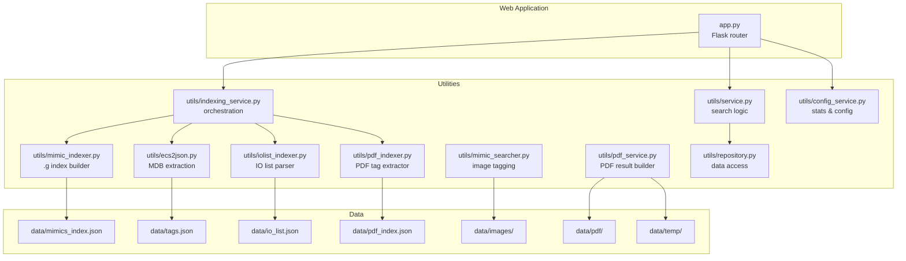

**Diagram sources**
- [app.py:86-206](file://app.py#L86-L206)
- [utils/indexing_service.py:85-239](file://utils/indexing_service.py#L85-L239)
- [utils/mimic_indexer.py:363-436](file://utils/mimic_indexer.py#L363-L436)
- [utils/pdf_indexer.py:41-132](file://utils/pdf_indexer.py#L41-L132)
- [utils/iolist_indexer.py:39-98](file://utils/iolist_indexer.py#L39-L98)
- [utils/ecs2json.py:459-480](file://utils/ecs2json.py#L459-L480)
- [utils/mimic_searcher.py:113-174](file://utils/mimic_searcher.py#L113-L174)
- [utils/pdf_service.py:18-229](file://utils/pdf_service.py#L18-L229)
- [utils/repository.py:13-178](file://utils/repository.py#L13-L178)
- [utils/service.py:25-270](file://utils/service.py#L25-L270)
- [utils/config_service.py:13-128](file://utils/config_service.py#L13-L128)

**Section sources**
- [app.py:26-85](file://app.py#L26-L85)
- [utils/indexing_service.py:85-239](file://utils/indexing_service.py#L85-L239)

## Core Components
- ECS7 MDB extraction: Reads Microsoft Access databases and produces structured tag data with metadata and PLC mappings.
- Mimic indexer: Parses ECS7 .g files to locate tags and compute screen coordinates, saving a JSON index.
- IO list indexer: Converts Excel IO lists into a normalized JSON structure keyed by SignalCode.
- PDF indexer: Extracts ECS7 tags from PDF documents and builds a searchable index with page-level occurrences.
- Search service: Orchestrates tag discovery across indices and generates annotated images for visualization.
- PDF service: Builds a consolidated PDF from matched PDF pages with corner markers.
- Repository layer: Provides cached access to indices and tag metadata.
- Indexing service: Coordinates background indexing tasks and exposes status.
- Config service: Aggregates configuration and statistics for the UI.

**Section sources**
- [utils/ecs2json.py:39-480](file://utils/ecs2json.py#L39-L480)
- [utils/mimic_indexer.py:83-436](file://utils/mimic_indexer.py#L83-L436)
- [utils/iolist_indexer.py:39-122](file://utils/iolist_indexer.py#L39-L122)
- [utils/pdf_indexer.py:28-215](file://utils/pdf_indexer.py#L28-L215)
- [utils/service.py:25-270](file://utils/service.py#L25-L270)
- [utils/pdf_service.py:18-229](file://utils/pdf_service.py#L18-L229)
- [utils/repository.py:13-178](file://utils/repository.py#L13-L178)
- [utils/indexing_service.py:85-239](file://utils/indexing_service.py#L85-L239)
- [utils/config_service.py:13-128](file://utils/config_service.py#L13-L128)

## Architecture Overview
The system integrates a Flask web interface with modular utility modules. Repositories encapsulate data access, services implement business logic, and the indexing service orchestrates background tasks.

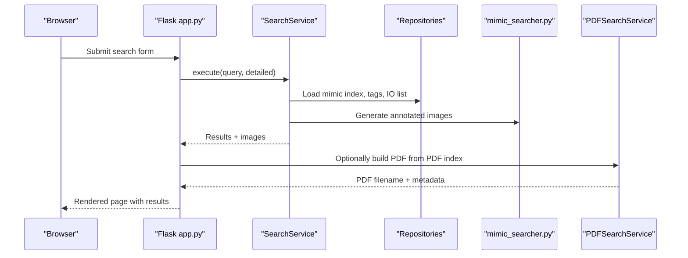

**Diagram sources**
- [app.py:92-155](file://app.py#L92-L155)
- [utils/service.py:58-159](file://utils/service.py#L58-L159)
- [utils/mimic_searcher.py:80-111](file://utils/mimic_searcher.py#L80-L111)
- [utils/pdf_service.py:36-96](file://utils/pdf_service.py#L36-L96)

## Detailed Component Analysis

### ECS7 MDB Extraction (utils/ecs2json.py)
- Purpose: Connects to Microsoft Access databases, joins tag tables, enriches with caches, and exports to JSON/YAML/CSV/Telegraf formats.
- Key classes:
  - DBHelper: Manages database connections and caches for block algorithms, conversion algorithms, and engineering units.
  - TagsHelper: Builds tag dictionaries, optionally scans mimic files for tag presence, and persists outputs.
- Inputs:
  - Access database files under data/FlsaProDb
  - Optional mimic directory for cross-checking tag presence
- Outputs:
  - JSON with metadata and tag entries
  - YAML, CSV, Telegraf configuration fragments
- Error handling:
  - Catches exceptions during SQL execution and file operations, logs errors, and continues gracefully.

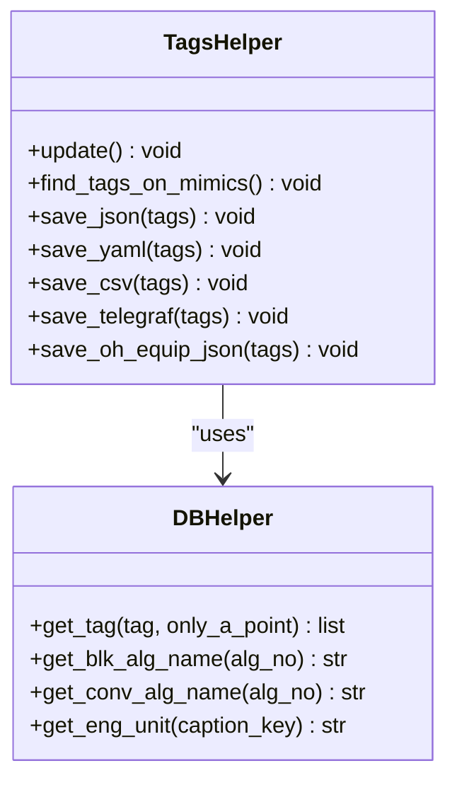

**Diagram sources**
- [utils/ecs2json.py:39-480](file://utils/ecs2json.py#L39-L480)

**Section sources**
- [utils/ecs2json.py:39-480](file://utils/ecs2json.py#L39-L480)

### Mimic Indexer (utils/mimic_indexer.py)
- Purpose: Scans ECS7 .g files, extracts tags from userdata and renamedvars, computes absolute coordinates considering groups, moves, scales, and transforms, and writes a JSON index.
- Inputs:
  - Directory containing .g files
  - Optional recursive flag
- Output:
  - JSON with metadata and tags mapping to files and positions
- Processing logic:
  - Parses inst, group, endg, endm commands
  - Tracks stack of group transformations
  - Applies move/scale/tran to derive absolute coordinates
  - Normalizes continuation lines and handles property blocks

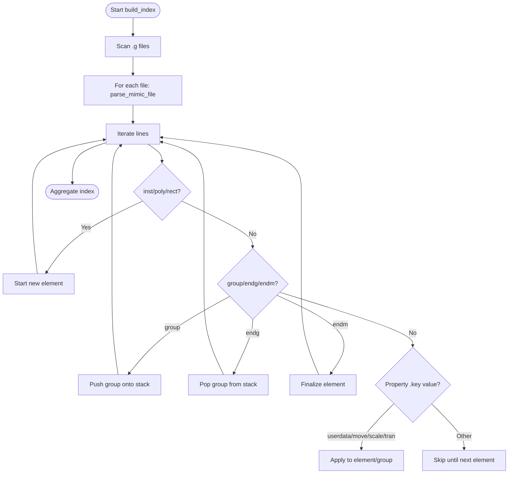

**Diagram sources**
- [utils/mimic_indexer.py:83-436](file://utils/mimic_indexer.py#L83-L436)

**Section sources**
- [utils/mimic_indexer.py:83-436](file://utils/mimic_indexer.py#L83-L436)

### IO List Indexer (utils/iolist_indexer.py)
- Purpose: Parses IO_list.xlsx and creates io_list.json keyed by SignalCode with selected fields and sheet lists.
- Inputs:
  - IO_list.xlsx
- Output:
  - JSON with metadata and signals dictionary
- Processing logic:
  - Iterates sheets, normalizes headers, filters rows with empty SignalCode, and aggregates sheets per signal.

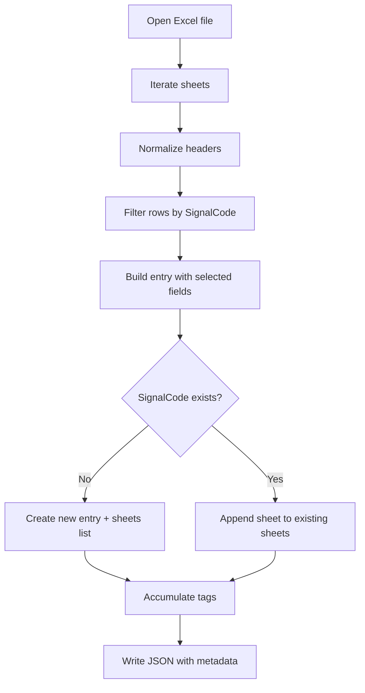

**Diagram sources**
- [utils/iolist_indexer.py:39-98](file://utils/iolist_indexer.py#L39-L98)

**Section sources**
- [utils/iolist_indexer.py:39-122](file://utils/iolist_indexer.py#L39-L122)

### PDF Indexer (utils/pdf_indexer.py)
- Purpose: Extracts ECS7 tags from PDFs and builds a JSON index with file/page counts.
- Inputs:
  - Directory of PDFs
  - Optional minimum occurrence threshold
- Output:
  - JSON with metadata and tags mapping to positions
- Processing logic:
  - Uses PyMuPDF to iterate pages and regex to find tag patterns
  - Aggregates occurrences by tag, file, and page

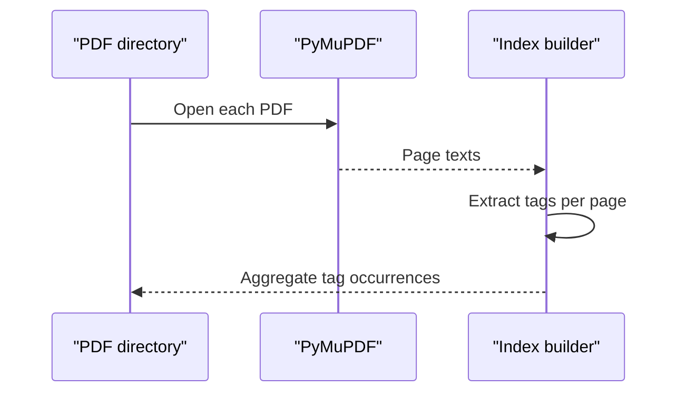

**Diagram sources**
- [utils/pdf_indexer.py:28-132](file://utils/pdf_indexer.py#L28-L132)

**Section sources**
- [utils/pdf_indexer.py:28-215](file://utils/pdf_indexer.py#L28-L215)

### Search Service (utils/service.py)
- Purpose: Validates queries, searches tags and IO lists, merges mimic positions, generates annotated images, and enriches results with tag details and IO metadata.
- Inputs:
  - Mimic index JSON, tags JSON, IO list JSON
  - Query string with wildcards support
- Output:
  - Structured results for rendering, including images, tag details, and metadata
- Processing logic:
  - Deduplicates names with underscore variants
  - Groups positions by file and limits results
  - Generates annotated PNGs and enriches with tag/IO details

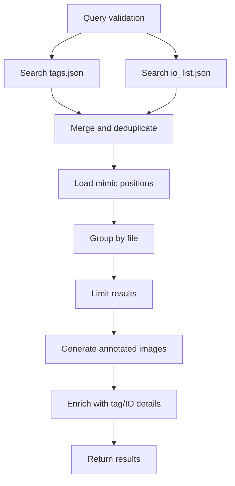

**Diagram sources**
- [utils/service.py:58-159](file://utils/service.py#L58-L159)

**Section sources**
- [utils/service.py:25-270](file://utils/service.py#L25-L270)

### PDF Search Service (utils/pdf_service.py)
- Purpose: Searches PDF index by tag pattern, builds a table of matched pages, and generates a consolidated PDF with corner markers.
- Inputs:
  - PDF index JSON, PDF source directory, corner image
- Output:
  - PDF filename and metadata for display
- Processing logic:
  - Extracts unique pages across matched tags
  - Copies pages preserving rotation and inserts corner image

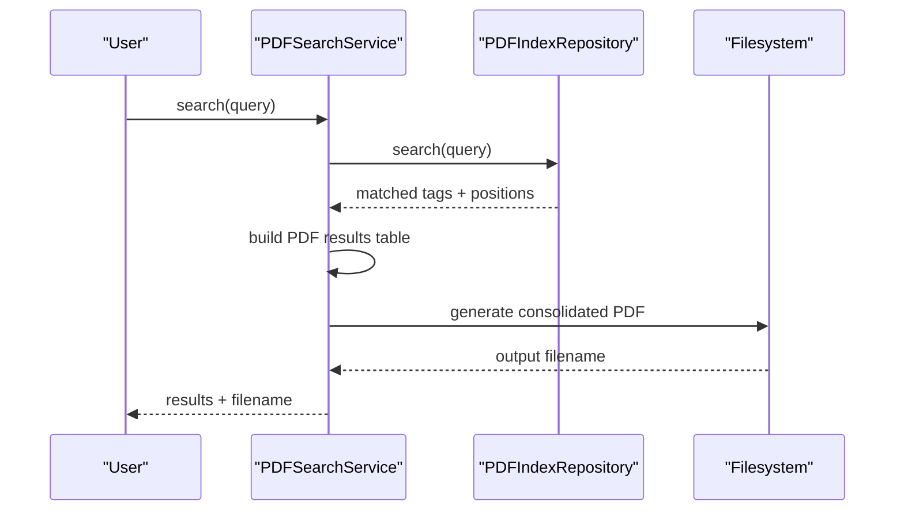

**Diagram sources**
- [utils/pdf_service.py:36-229](file://utils/pdf_service.py#L36-L229)

**Section sources**
- [utils/pdf_service.py:18-229](file://utils/pdf_service.py#L18-L229)

### Repository Layer (utils/repository.py)
- Purpose: Provides cached access to mimic index, tags, IO list, and PDF index with flexible tag lookup and pattern matching.
- Features:
  - MimicIndexRepository: loads mimic index JSON
  - TagDetailRepository: cached tag lookup with underscore variants
  - IOListRepository: cached IO list lookup and search
  - PDFIndexRepository: cached PDF index search

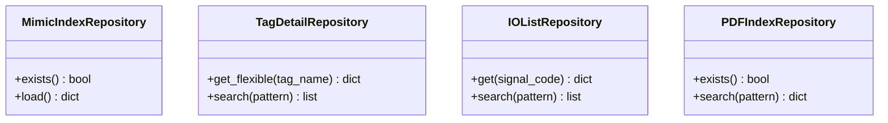

**Diagram sources**
- [utils/repository.py:13-178](file://utils/repository.py#L13-L178)

**Section sources**
- [utils/repository.py:13-178](file://utils/repository.py#L13-L178)

### Indexing Service (utils/indexing_service.py)
- Purpose: Runs mimic, PDF, IO list, and MDB extraction tasks in background threads, tracks progress, and persists results.
- Inputs:
  - Paths to mimic, PDF, IO list, and output JSONs
- Output:
  - Status updates and completion messages
- Threading:
  - Uses daemon threads to prevent blocking the main process

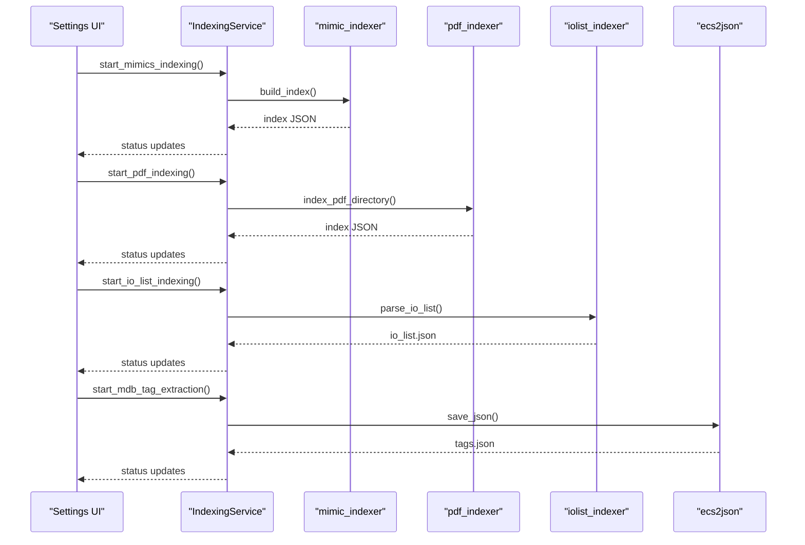

**Diagram sources**
- [utils/indexing_service.py:106-239](file://utils/indexing_service.py#L106-L239)
- [utils/mimic_indexer.py:438-484](file://utils/mimic_indexer.py#L438-L484)
- [utils/pdf_indexer.py:149-215](file://utils/pdf_indexer.py#L149-L215)
- [utils/iolist_indexer.py:100-122](file://utils/iolist_indexer.py#L100-L122)
- [utils/ecs2json.py:459-480](file://utils/ecs2json.py#L459-L480)

**Section sources**
- [utils/indexing_service.py:85-239](file://utils/indexing_service.py#L85-L239)

### Config Service (utils/config_service.py)
- Purpose: Aggregates configuration paths and statistics for UI display.
- Inputs:
  - Paths to data directories and index files
- Output:
  - Config dictionary and stats for mimics, PDFs, tags, and IO list

**Section sources**
- [utils/config_service.py:13-128](file://utils/config_service.py#L13-L128)

## Dependency Analysis
- app.py wires repositories, services, and routes; it depends on all utility modules.
- IndexingService composes mimic_indexer, pdf_indexer, iolist_indexer, and ecs2json.
- SearchService depends on repositories and mimic_searcher for image annotation.
- PDFSearchService depends on PDFIndexRepository and filesystem paths.
- Repository layer isolates data access and caching.

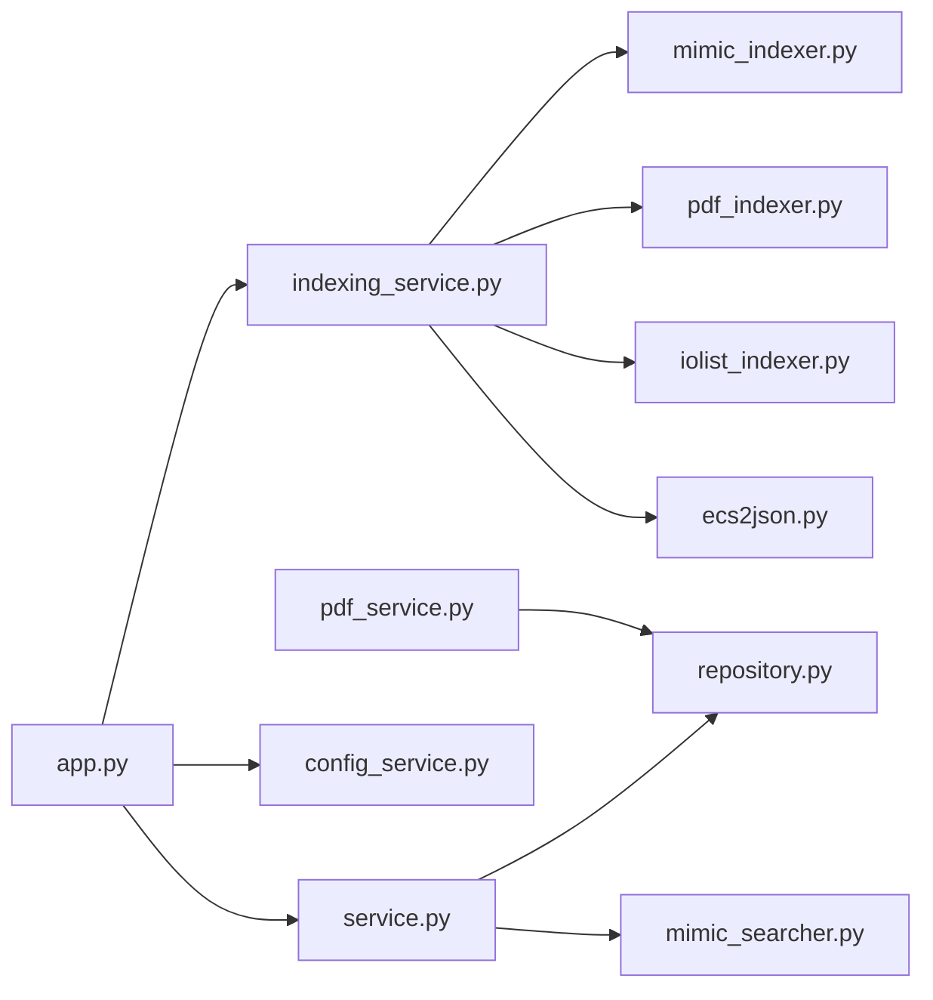

**Diagram sources**
- [app.py:15-84](file://app.py#L15-L84)
- [utils/indexing_service.py:17-20](file://utils/indexing_service.py#L17-L20)
- [utils/service.py:15-20](file://utils/service.py#L15-L20)
- [utils/pdf_service.py:15](file://utils/pdf_service.py#L15)
- [utils/repository.py:13-178](file://utils/repository.py#L13-L178)

**Section sources**
- [app.py:15-84](file://app.py#L15-L84)
- [utils/indexing_service.py:17-20](file://utils/indexing_service.py#L17-L20)
- [utils/service.py:15-20](file://utils/service.py#L15-L20)
- [utils/pdf_service.py:15](file://utils/pdf_service.py#L15)

## Performance Considerations
- Caching:
  - DBHelper caches lookup tables for block algorithms, conversion algorithms, and engineering units to reduce repeated database reads.
  - Repository layer caches indices to avoid repeated JSON loads.
- Parallelism:
  - IndexingService runs tasks in daemon threads to keep UI responsive.
- I/O:
  - Mimic indexer normalizes line endings and removes continuation lines to speed up parsing.
  - PDF indexer uses PyMuPDF for efficient page iteration.
- Memory:
  - Repository caches are invalidated on demand; consider clearing cache when large datasets change frequently.
- Limits:
  - SearchService caps the number of generated images to avoid excessive disk usage.

[No sources needed since this section provides general guidance]

## Troubleshooting Guide
- Missing database files:
  - Ensure all required Access database files exist under the configured directory; otherwise, initialization raises an exception.
- Missing mimic images:
  - The image annotation step requires PNG files matching .g filenames; missing PNGs cause skipped results with warnings.
- PDF processing errors:
  - PDF indexer reports errors opening documents and continues; verify PDF accessibility and permissions.
- Index not found:
  - PDFSearchService checks for index existence and returns a warning if absent.
- IO list missing:
  - iolist_indexer exits early if the Excel file is not present; ensure the file exists and is readable.
- MDB extraction failures:
  - Exceptions during SQL execution are logged and surfaced to the caller; verify ODBC drivers and database connectivity.

**Section sources**
- [utils/ecs2json.py:52-54](file://utils/ecs2json.py#L52-L54)
- [utils/mimic_searcher.py:154-167](file://utils/mimic_searcher.py#L154-L167)
- [utils/pdf_indexer.py:74-78](file://utils/pdf_indexer.py#L74-L78)
- [utils/pdf_service.py:43-52](file://utils/pdf_service.py#L43-L52)
- [utils/iolist_indexer.py:101-103](file://utils/iolist_indexer.py#L101-L103)

## Conclusion
The ECS7Search utility modules provide a robust foundation for indexing and searching ECS7-related assets. They integrate cleanly with the Flask application, offer modular processing, and expose status and statistics for operational visibility. By leveraging caching, parallelization, and structured outputs, the system supports efficient workflows for tag discovery across screens, PDFs, and IO lists.

[No sources needed since this section summarizes without analyzing specific files]

## Appendices

### Practical Usage Examples
- Run mimic indexing:
  - Command-line: mimic_indexer.py with directory and output options
  - Web UI: Settings → Start indexing → mimics
- Run PDF indexing:
  - Command-line: pdf_indexer.py with directory and output options
  - Web UI: Settings → Start indexing → pdf
- Run IO list indexing:
  - Command-line: iolist_indexer.py
  - Web UI: Settings → Start indexing → io_list
- Run MDB tag extraction:
  - Command-line: ecs2json.py main routine
  - Web UI: Settings → Start indexing → mdb
- Search for tags:
  - Web UI: Enter query with wildcards; toggle detailed view; annotate images
- Generate PDF results:
  - Web UI: Enable PDF search; download consolidated PDF from results

**Section sources**
- [utils/mimic_indexer.py:438-484](file://utils/mimic_indexer.py#L438-L484)
- [utils/pdf_indexer.py:149-215](file://utils/pdf_indexer.py#L149-L215)
- [utils/iolist_indexer.py:100-122](file://utils/iolist_indexer.py#L100-L122)
- [utils/ecs2json.py:459-480](file://utils/ecs2json.py#L459-L480)
- [app.py:172-194](file://app.py#L172-L194)

### Configuration Options
- Paths:
  - Project directory, mimic directory, PDF directory, temp directory, index files, IO list file, tags file
- Indexing:
  - Recursive mimic scanning, minimum tag count for PDF inclusion
- Search:
  - Maximum number of annotated images generated
- Web UI:
  - Flask secret key, debug mode, host/port

**Section sources**
- [app.py:28-38](file://app.py#L28-L38)
- [utils/pdf_indexer.py:150-176](file://utils/pdf_indexer.py#L150-L176)
- [utils/service.py:36](file://utils/service.py#L36-L42)

### Data Validation and Processing Pipeline Coordination
- Validation:
  - Query pattern validation ensures acceptable characters and minimum length
  - Repository search supports wildcard patterns for flexible matching
- Pipeline:
  - IndexingService coordinates multiple background tasks and updates status
  - SearchService merges results from multiple sources and generates images
  - PDFSearchService consolidates matched pages into a single PDF

**Section sources**
- [utils/service.py:46-54](file://utils/service.py#L46-L54)
- [utils/repository.py:78-93](file://utils/repository.py#L78-L93)
- [utils/indexing_service.py:106-239](file://utils/indexing_service.py#L106-L239)