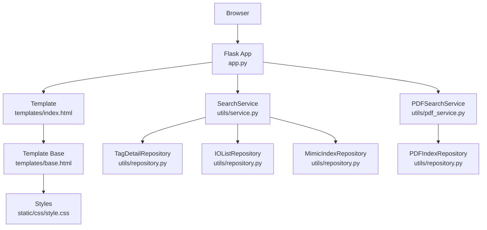
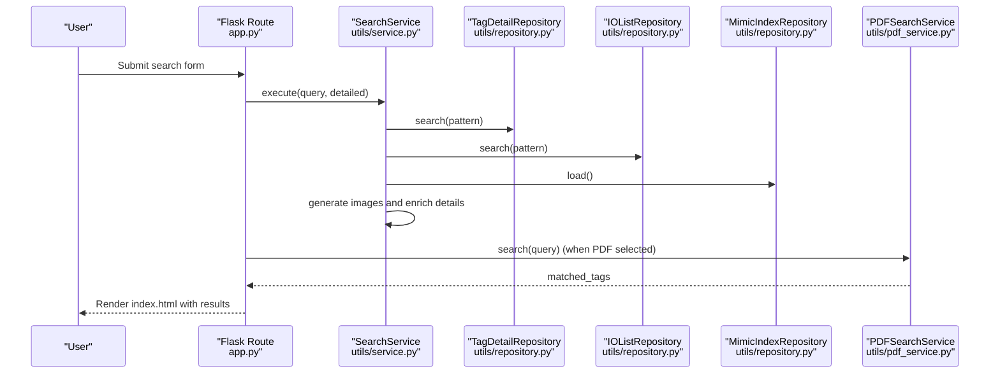
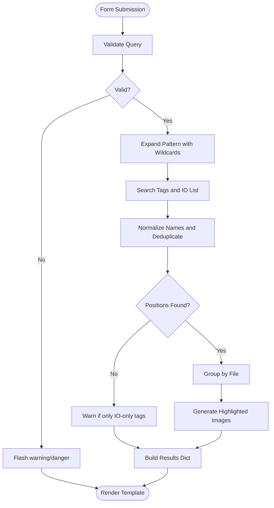
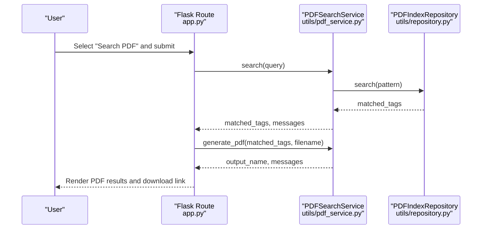
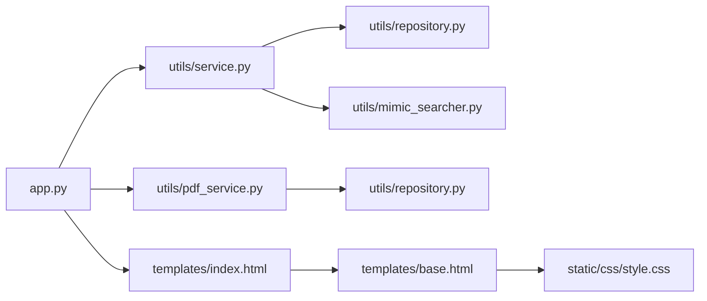

# Search Interface

<cite>
**Referenced Files in This Document**
- [app.py](file://app.py)
- [index.html](file://templates/index.html)
- [base.html](file://templates/base.html)
- [style.css](file://static/css/style.css)
- [service.py](file://utils/service.py)
- [repository.py](file://utils/repository.py)
- [mimic_searcher.py](file://utils/mimic_searcher.py)
- [pdf_service.py](file://utils/pdf_service.py)
- [config_service.py](file://utils/config_service.py)
- [pyproject.toml](file://pyproject.toml)
</cite>

## Table of Contents
1. [Introduction](#introduction)
2. [Project Structure](#project-structure)
3. [Core Components](#core-components)
4. [Architecture Overview](#architecture-overview)
5. [Detailed Component Analysis](#detailed-component-analysis)
6. [Dependency Analysis](#dependency-analysis)
7. [Performance Considerations](#performance-considerations)
8. [Troubleshooting Guide](#troubleshooting-guide)
9. [Conclusion](#conclusion)

## Introduction
This document describes the ECS7Search main search interface focused on the user input form, search functionality, and result presentation. It explains the search form structure with query input field, checkbox options for searching mimics, PDF documents, and detailed information, and wildcard pattern support. It covers search validation, form submission handling, and result rendering including tag details table, PDF search results, and image gallery with highlighted positions. It also includes examples of search queries, result interpretation, troubleshooting common search issues, and responsive design elements.

## Project Structure
The search interface is implemented as a Flask web application with a Jinja2 template-based frontend and Python backend services. The key components are:
- Flask routes and request handling in the application entrypoint
- HTML templates for the search form and results
- CSS for responsive styling and interactive elements
- Backend services for search logic, repositories, and PDF generation

**Diagram sources**
- [app.py:92-155](file://app.py#L92-L155)
- [index.html:1-260](file://templates/index.html#L1-L260)
- [base.html:1-658](file://templates/base.html#L1-L658)
- [style.css:1-154](file://static/css/style.css#L1-L154)
- [service.py:25-270](file://utils/service.py#L25-L270)
- [repository.py:13-178](file://utils/repository.py#L13-L178)
- [pdf_service.py:18-229](file://utils/pdf_service.py#L18-L229)

**Section sources**
- [app.py:88-206](file://app.py#L88-L206)
- [index.html:1-260](file://templates/index.html#L1-L260)
- [base.html:1-658](file://templates/base.html#L1-L658)
- [style.css:1-154](file://static/css/style.css#L1-L154)

## Core Components
- Search Form: Text input for the query, checkboxes for search scope, and submit button.
- Validation: Input validation and wildcard expansion for pattern matching.
- Search Execution: Orchestrates search across tags, IO lists, and mimics index; generates highlighted images; enriches with tag details.
- PDF Search: Searches PDF index and generates a consolidated PDF with watermarks.
- Results Rendering: Displays tag details table, PDF results table, and image gallery with zoom modal.

Key behaviors:
- Wildcard support: The form allows wildcard patterns with asterisk (*) and question mark (?). If no wildcards are present, the system auto-expands the query to include leading/trailing wildcards.
- Checkbox options: Users can toggle searching mimics, PDFs, and detailed tag information independently.
- Responsive design: Flexbox layout, wrapping rows, and viewport-aware styles ensure usability on various screen sizes.

**Section sources**
- [index.html:8-37](file://templates/index.html#L8-L37)
- [service.py:46-74](file://utils/service.py#L46-L74)
- [service.py:74-158](file://utils/service.py#L74-L158)
- [pdf_service.py:36-52](file://utils/pdf_service.py#L36-L52)
- [style.css:26-71](file://static/css/style.css#L26-L71)

## Architecture Overview
The search interface follows a layered architecture:
- Presentation Layer: Flask routes render templates and handle form submissions.
- Service Layer: SearchService coordinates repositories and image generation.
- Repository Layer: Accessors for tags, IO lists, mimics index, and PDF index.
- PDF Service: Generates consolidated PDFs from matched positions.

**Diagram sources**
- [app.py:92-155](file://app.py#L92-L155)
- [service.py:58-158](file://utils/service.py#L58-L158)
- [repository.py:78-93](file://utils/repository.py#L78-L93)
- [repository.py:129-135](file://utils/repository.py#L129-L135)
- [repository.py:22-24](file://utils/repository.py#L22-L24)
- [pdf_service.py:36-52](file://utils/pdf_service.py#L36-L52)

## Detailed Component Analysis

### Search Form and Submission Handling
- Form structure:
  - Query input field with placeholder examples and autofocus.
  - Checkbox options: search mimics, search PDF, detailed information.
  - Wildcard hint indicating supported special characters.
- Submission handling:
  - On GET, renders the form with defaults.
  - On POST, reads form values, executes search logic, and renders results.

Validation and wildcard expansion:
- Validates that the query is not empty and meets minimum length.
- Allows letters, digits, asterisk, question mark, underscore.
- Auto-expands query to include wildcards if none are present.

Checkbox behavior:
- search_mimics: enables mimic search and tag details enrichment.
- search_pdf: enables PDF search and optional PDF generation.
- detailed: toggles detailed tag information rendering.

**Section sources**
- [index.html:8-37](file://templates/index.html#L8-L37)
- [app.py:92-155](file://app.py#L92-L155)
- [service.py:46-74](file://utils/service.py#L46-L74)

### Search Execution and Result Generation
- Validation: Ensures query conforms to allowed characters and length.
- Pattern expansion: Adds wildcards around the query if not provided.
- Tag discovery:
  - Searches tags.json and io_list.json using fnmatch-compatible patterns.
  - Normalizes names by removing leading underscores to deduplicate entries.
- Position retrieval:
  - Uses mimics index to find positions for matched tags.
  - Groups positions by source file for image generation.
- Image generation:
  - Draws highlight boxes around tag positions on PNG screenshots.
  - Saves processed images to a temporary directory and limits results count.
- Tag details enrichment:
  - Retrieves tag metadata and IO list data.
  - Builds a screens list for each tag.
- Result packaging:
  - Returns structured results including query, counts, images, skipped items, tag details, and index metadata.

**Diagram sources**
- [service.py:46-158](file://utils/service.py#L46-L158)
- [repository.py:78-93](file://utils/repository.py#L78-L93)
- [repository.py:129-135](file://utils/repository.py#L129-L135)
- [mimic_searcher.py:42-61](file://utils/mimic_searcher.py#L42-L61)

**Section sources**
- [service.py:58-158](file://utils/service.py#L58-L158)
- [repository.py:78-93](file://utils/repository.py#L78-L93)
- [repository.py:129-135](file://utils/repository.py#L129-L135)
- [mimic_searcher.py:42-61](file://utils/mimic_searcher.py#L42-L61)

### PDF Search and Consolidated PDF Generation
- PDF search:
  - Uses PDF index repository to match tags by pattern.
  - Returns matched tags grouped by file and page.
- PDF results building:
  - Aggregates unique pages and associated tags for display.
  - Computes totals for tags, pages, and files.
- PDF generation:
  - Extracts pages from source PDFs and inserts a watermark image in the corner.
  - Preserves page rotations and writes to a temporary file.
  - Provides download link for the generated PDF.

**Diagram sources**
- [app.py:119-146](file://app.py#L119-L146)
- [pdf_service.py:36-96](file://utils/pdf_service.py#L36-L96)
- [repository.py:164-177](file://utils/repository.py#L164-L177)

**Section sources**
- [pdf_service.py:36-96](file://utils/pdf_service.py#L36-L96)
- [repository.py:164-177](file://utils/repository.py#L164-L177)
- [app.py:119-146](file://app.py#L119-L146)

### Result Presentation
- Tag Details Table:
  - Displays tag, groups, descriptions, algorithms, PLC info, IO list fields, and associated screens.
  - Shows warnings when tags are found only in IO lists without positions.
- PDF Results Table:
  - Lists matched files, pages, and tags per page.
  - Provides a download link to the generated PDF.
- Image Gallery:
  - Renders highlighted PNG images with clickable zoom.
  - Shows unique tags per image and a counter of positions.
  - Uses a modal overlay for zoomed view with navigation controls.

Responsive design elements:
- Flexible layout with wrapping rows and adjustable widths.
- Viewport-aware max heights and object-fit for images.
- Interactive elements with hover states and focus indicators.

**Section sources**
- [index.html:60-254](file://templates/index.html#L60-L254)
- [base.html:503-658](file://templates/base.html#L503-L658)
- [style.css:12-154](file://static/css/style.css#L12-L154)

## Dependency Analysis
The search interface relies on several modules with clear separation of concerns:
- app.py: Routes, request handling, and orchestration of services.
- utils/service.py: Central search logic, validation, and result assembly.
- utils/repository.py: Data access for tags, IO lists, mimics index, and PDF index.
- utils/mimic_searcher.py: Low-level pattern matching and image highlighting.
- utils/pdf_service.py: PDF search and consolidated PDF generation.
- templates/index.html and base.html: UI templates and modal/script logic.
- static/css/style.css: Responsive styles and interactive elements.

**Diagram sources**
- [app.py:49-84](file://app.py#L49-L84)
- [service.py:25-43](file://utils/service.py#L25-L43)
- [repository.py:13-178](file://utils/repository.py#L13-L178)
- [mimic_searcher.py:15-26](file://utils/mimic_searcher.py#L15-L26)
- [pdf_service.py:18-35](file://utils/pdf_service.py#L18-L35)
- [index.html:1-260](file://templates/index.html#L1-L260)
- [base.html:1-658](file://templates/base.html#L1-L658)
- [style.css:1-154](file://static/css/style.css#L1-L154)

**Section sources**
- [app.py:49-84](file://app.py#L49-L84)
- [service.py:25-43](file://utils/service.py#L25-L43)
- [repository.py:13-178](file://utils/repository.py#L13-L178)
- [mimic_searcher.py:15-26](file://utils/mimic_searcher.py#L15-L26)
- [pdf_service.py:18-35](file://utils/pdf_service.py#L18-L35)
- [index.html:1-260](file://templates/index.html#L1-L260)
- [base.html:1-658](file://templates/base.html#L1-L658)
- [style.css:1-154](file://static/css/style.css#L1-L154)

## Performance Considerations
- Limit results: The service caps the number of generated images to avoid excessive processing and memory usage.
- Efficient pattern matching: Uses fnmatch for pattern matching and deduplication to minimize redundant lookups.
- Lazy loading: Images are generated on demand and served from a temporary directory.
- PDF generation: Pages are extracted and merged efficiently, preserving rotations and inserting a watermark.

[No sources needed since this section provides general guidance]

## Troubleshooting Guide
Common issues and resolutions:
- No results found:
  - Verify the query length and allowed characters.
  - Ensure wildcard patterns are correctly formed; if omitted, the system auto-expands the query.
  - Confirm that mimics index and PDF index exist and are up to date.
- Missing PNG images:
  - The system skips files without corresponding PNGs and displays a warning list.
  - Ensure PNG files exist for all .g files referenced in the mimics index.
- PDF search errors:
  - If the PDF index does not exist, the system prompts to run the indexer.
  - Generated PDFs may be missing pages if source files are missing or pages are out of range.
- Validation errors:
  - Queries must not be empty and must meet minimum length.
  - Only letters, digits, asterisk, question mark, underscore are allowed.

**Section sources**
- [service.py:46-54](file://utils/service.py#L46-L54)
- [service.py:137-198](file://utils/service.py#L137-L198)
- [pdf_service.py:43-52](file://utils/pdf_service.py#L43-L52)
- [index.html:219-228](file://templates/index.html#L219-L228)

## Conclusion
The ECS7Search search interface provides a robust, user-friendly way to locate tags across SCADA ECS7 mimics and PDF documents. Its form-based design, wildcard pattern support, and responsive layout ensure efficient and accessible search experiences. The modular backend services cleanly separate concerns, enabling maintainability and extensibility. By following the validation rules and troubleshooting tips, users can achieve reliable and fast search results.