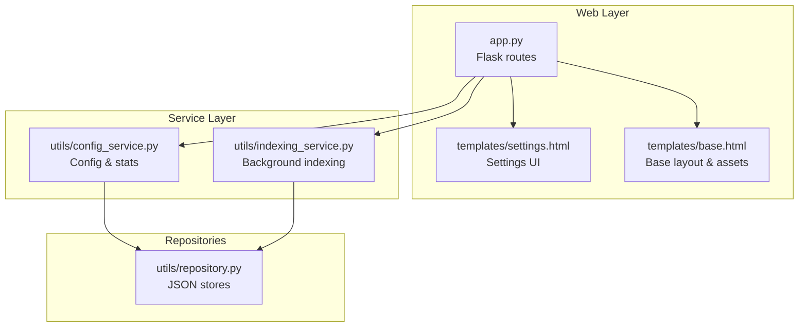
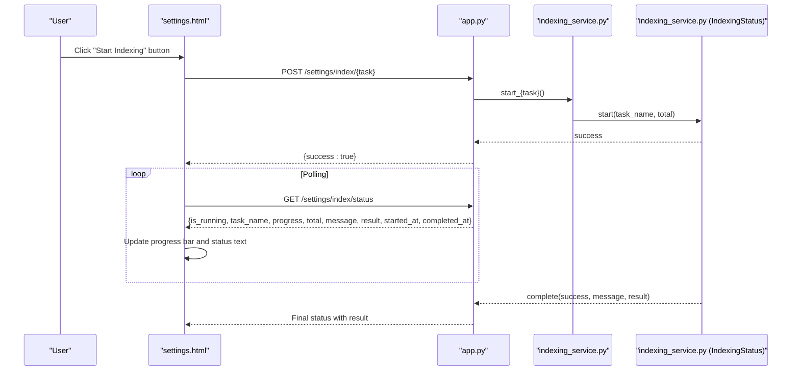
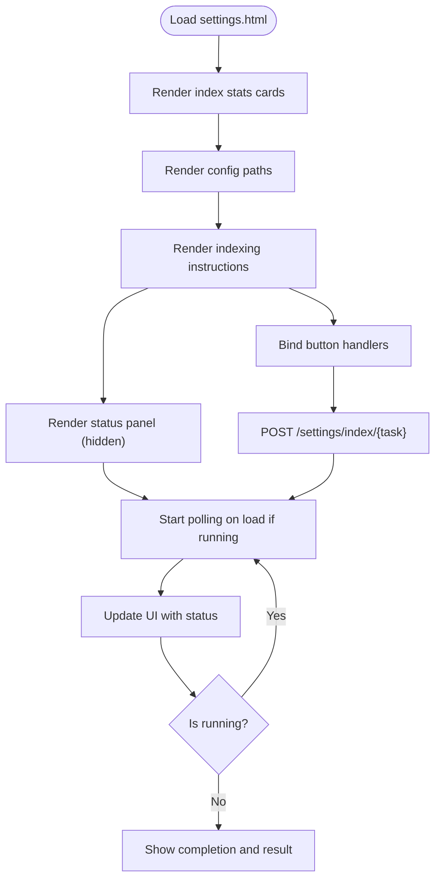
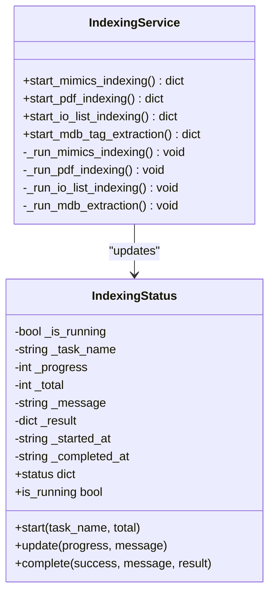
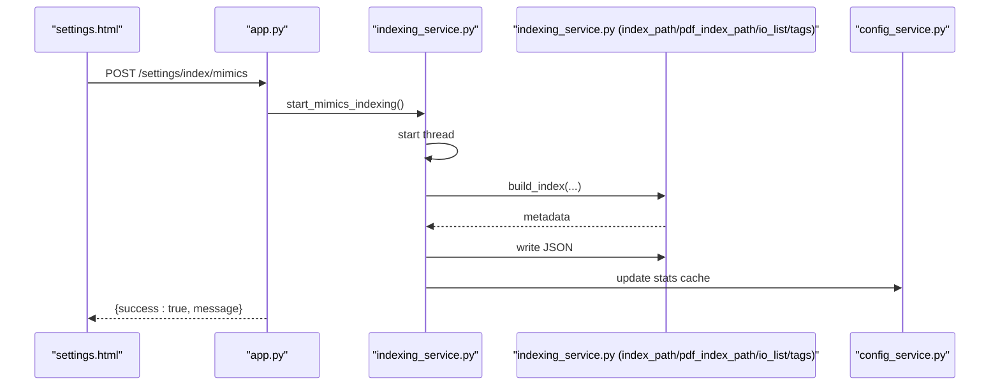
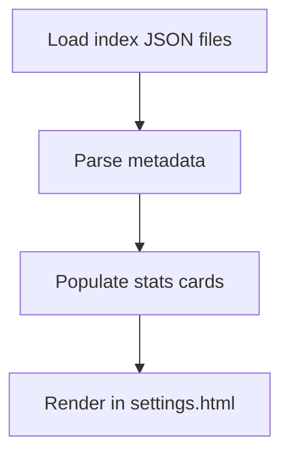
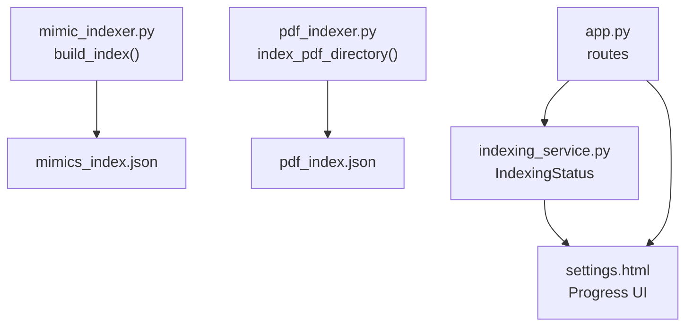
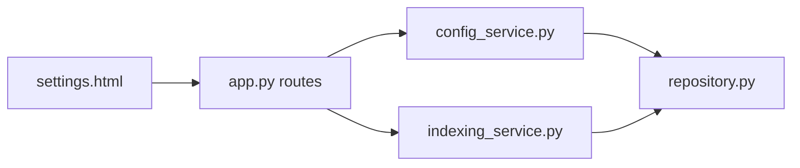

# Settings Interface

<cite>
**Referenced Files in This Document**
- [settings.html](file://templates/settings.html)
- [base.html](file://templates/base.html)
- [app.py](file://app.py)
- [config_service.py](file://utils/config_service.py)
- [indexing_service.py](file://utils/indexing_service.py)
- [repository.py](file://utils/repository.py)
- [service.py](file://utils/service.py)
- [pdf_service.py](file://utils/pdf_service.py)
- [mimic_indexer.py](file://utils/mimic_indexer.py)
- [pdf_indexer.py](file://utils/pdf_indexer.py)
</cite>

## Table of Contents
1. [Introduction](#introduction)
2. [Project Structure](#project-structure)
3. [Core Components](#core-components)
4. [Architecture Overview](#architecture-overview)
5. [Detailed Component Analysis](#detailed-component-analysis)
6. [Dependency Analysis](#dependency-analysis)
7. [Performance Considerations](#performance-considerations)
8. [Troubleshooting Guide](#troubleshooting-guide)
9. [Conclusion](#conclusion)

## Introduction
This document describes the ECS7Search Settings interface for system management and index operations. It explains the settings page layout, index status monitoring, background task controls, and system statistics display. It also covers index management functionality including manual re-indexing triggers, progress tracking, and status reporting, along with configuration options, system health indicators, and administrative controls. Practical examples and troubleshooting guidance are included for common administrative tasks and monitoring system performance, with emphasis on the integration with background indexing services and real-time status updates.

## Project Structure
The settings interface is implemented as a Flask route rendering a Jinja2 template with embedded JavaScript for asynchronous status polling. The backend orchestrates index operations via a dedicated service and exposes a global status object for real-time updates.

**Diagram sources**
- [app.py:158-194](file://app.py#L158-L194)
- [settings.html:1-554](file://templates/settings.html#L1-L554)
- [base.html:1-658](file://templates/base.html#L1-L658)
- [config_service.py:13-128](file://utils/config_service.py#L13-L128)
- [indexing_service.py:85-239](file://utils/indexing_service.py#L85-L239)
- [repository.py:13-178](file://utils/repository.py#L13-L178)

**Section sources**
- [app.py:158-194](file://app.py#L158-L194)
- [settings.html:1-554](file://templates/settings.html#L1-L554)
- [base.html:1-658](file://templates/base.html#L1-L658)

## Core Components
- Settings page renderer: renders index statistics, configuration paths, and indexing instructions.
- Background indexing service: runs index builds in separate threads and exposes a shared status object.
- Status polling: client-side JavaScript polls the status endpoint and updates the UI in real time.
- Statistics provider: loads and formats index metadata and counts for display.

Key responsibilities:
- Provide index status cards for mimics, PDF, tags, and IO list.
- Expose configuration paths for data directories.
- Trigger manual indexing tasks and show progress.
- Display completion results and timestamps.

**Section sources**
- [app.py:158-194](file://app.py#L158-L194)
- [settings.html:8-224](file://templates/settings.html#L8-L224)
- [config_service.py:38-106](file://utils/config_service.py#L38-L106)
- [indexing_service.py:23-82](file://utils/indexing_service.py#L23-L82)

## Architecture Overview
The settings interface integrates Flask routes, a configuration service, and a background indexing service. The UI communicates with the backend via AJAX to start tasks and poll for status updates.

**Diagram sources**
- [app.py:172-194](file://app.py#L172-L194)
- [indexing_service.py:106-239](file://utils/indexing_service.py#L106-L239)
- [settings.html:229-341](file://templates/settings.html#L229-L341)

## Detailed Component Analysis

### Settings Page Layout and Sections
- Index status cards: displays total files/images for mimics, total PDFs and metadata for PDF, total tags and indexed date for tags, and total records and generation date for IO list.
- Configuration paths: shows project, mimics, PDF, and temp directories.
- Indexing instructions: step-by-step guidance for mimics, PDF, IO list, and MDB tag extraction, with dedicated buttons to trigger indexing tasks.
- Real-time status panel: shows current task name, animated spinner, progress bar, progress text, and result details upon completion.

**Diagram sources**
- [settings.html:8-224](file://templates/settings.html#L8-L224)
- [settings.html:229-341](file://templates/settings.html#L229-L341)

**Section sources**
- [settings.html:8-224](file://templates/settings.html#L8-L224)
- [settings.html:229-341](file://templates/settings.html#L229-L341)

### Index Status Monitoring and Progress Tracking
- Global status object: maintains thread-safe state for running tasks, progress, message, and timestamps.
- Endpoint: returns current status as JSON for polling.
- UI updates: progress percentage, message, and result details are rendered dynamically.

**Diagram sources**
- [indexing_service.py:23-82](file://utils/indexing_service.py#L23-L82)
- [indexing_service.py:85-239](file://utils/indexing_service.py#L85-L239)

**Section sources**
- [indexing_service.py:23-82](file://utils/indexing_service.py#L23-L82)
- [indexing_service.py:106-239](file://utils/indexing_service.py#L106-L239)

### Background Task Controls and Manual Re-indexing
- Task triggers: POST endpoints for mimics, PDF, IO list, and MDB tag extraction.
- Threading: each task starts a daemon thread to avoid blocking the server.
- Concurrency guard: prevents overlapping tasks by checking the global status.
- Completion: writes index JSON files and populates result metadata.

**Diagram sources**
- [app.py:172-188](file://app.py#L172-L188)
- [indexing_service.py:106-141](file://utils/indexing_service.py#L106-L141)
- [config_service.py:47-54](file://utils/config_service.py#L47-L54)

**Section sources**
- [app.py:172-188](file://app.py#L172-L188)
- [indexing_service.py:106-141](file://utils/indexing_service.py#L106-L141)
- [config_service.py:47-54](file://utils/config_service.py#L47-L54)

### System Statistics Display
- Mimics stats: total .g and .png files plus metadata (indexed date, total tags).
- PDF stats: total PDF files plus metadata (indexed date, total tags, total occurrences).
- Tags stats: total tags and indexed date, supporting both old and new JSON formats.
- IO list stats: total records and generation date.

**Diagram sources**
- [config_service.py:47-106](file://utils/config_service.py#L47-L106)
- [settings.html:11-95](file://templates/settings.html#L11-L95)

**Section sources**
- [config_service.py:47-106](file://utils/config_service.py#L47-L106)
- [settings.html:11-95](file://templates/settings.html#L11-L95)

### Configuration Options and Administrative Controls
- Configuration paths: project, mimics, PDF, and temp directories are displayed for quick verification.
- Administrative actions: buttons to trigger indexing tasks with clear instructions and expected outcomes.

**Section sources**
- [config_service.py:38-45](file://utils/config_service.py#L38-L45)
- [settings.html:100-119](file://templates/settings.html#L100-L119)
- [settings.html:144-222](file://templates/settings.html#L144-L222)

### Integration with Background Indexing Services and Real-time Updates
- Mimics indexer: parses .g files and builds a tag-to-position index with metadata.
- PDF indexer: extracts ECS7 tags from PDF text and builds a tag-to-file/page index with metadata.
- Status polling: client-side script polls the status endpoint every second and updates the UI until completion.

**Diagram sources**
- [mimic_indexer.py:363-435](file://utils/mimic_indexer.py#L363-L435)
- [pdf_indexer.py:41-131](file://utils/pdf_indexer.py#L41-L131)
- [indexing_service.py:23-82](file://utils/indexing_service.py#L23-L82)
- [settings.html:229-341](file://templates/settings.html#L229-L341)

**Section sources**
- [mimic_indexer.py:363-435](file://utils/mimic_indexer.py#L363-L435)
- [pdf_indexer.py:41-131](file://utils/pdf_indexer.py#L41-L131)
- [indexing_service.py:23-82](file://utils/indexing_service.py#L23-L82)
- [settings.html:229-341](file://templates/settings.html#L229-L341)

## Dependency Analysis
The settings interface depends on:
- Flask routes for rendering and API endpoints.
- Config service for statistics and configuration paths.
- Indexing service for background indexing and status management.
- Repositories for loading index metadata.

**Diagram sources**
- [app.py:158-194](file://app.py#L158-L194)
- [config_service.py:13-128](file://utils/config_service.py#L13-L128)
- [indexing_service.py:85-239](file://utils/indexing_service.py#L85-L239)
- [repository.py:13-178](file://utils/repository.py#L13-L178)

**Section sources**
- [app.py:158-194](file://app.py#L158-L194)
- [config_service.py:13-128](file://utils/config_service.py#L13-L128)
- [indexing_service.py:85-239](file://utils/indexing_service.py#L85-L239)
- [repository.py:13-178](file://utils/repository.py#L13-L178)

## Performance Considerations
- Background threading: indexing tasks run in daemon threads to keep the UI responsive.
- Status polling interval: 1 second is reasonable for frequent updates without excessive load.
- File counting and JSON loading: guarded with safe loaders to prevent crashes on missing or malformed files.
- Result caching: repositories cache loaded data to reduce repeated I/O during search operations.

## Troubleshooting Guide
Common administrative tasks and troubleshooting tips:
- Verify configuration paths: ensure project, mimics, PDF, and temp directories are correct and accessible.
- Check index metadata: confirm indexed dates and totals in the stats cards reflect recent activity.
- Start indexing tasks: use the dedicated buttons for mimics, PDF, IO list, and MDB tag extraction; watch the status panel for progress.
- Resolve concurrency issues: if a task is already running, wait for completion or cancel the current task before starting a new one.
- Inspect results: upon completion, review the result details displayed in the status panel for counts and timestamps.
- Handle errors: if an error occurs, the status message will indicate failure; check logs and retry after correcting the issue.

**Section sources**
- [config_service.py:110-128](file://utils/config_service.py#L110-L128)
- [indexing_service.py:106-141](file://utils/indexing_service.py#L106-L141)
- [settings.html:229-341](file://templates/settings.html#L229-L341)

## Conclusion
The ECS7Search Settings interface provides a centralized, user-friendly way to monitor index statuses, configure data paths, and trigger manual re-indexing tasks. Its integration with background indexing services and real-time status updates ensures administrators can efficiently manage and troubleshoot index operations. The modular design of the service and repository layers supports maintainability and extensibility for future enhancements.