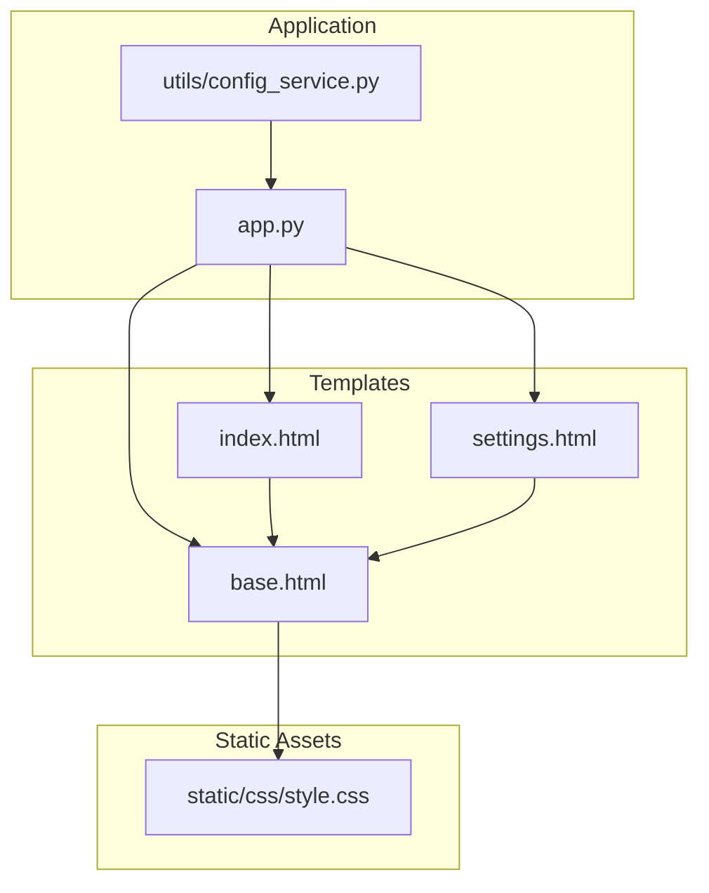
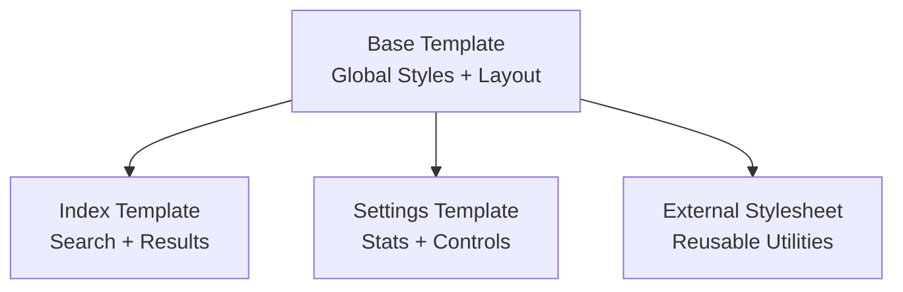
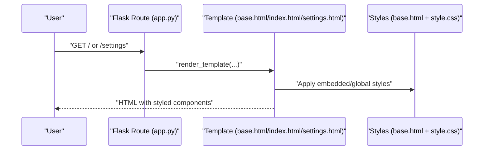
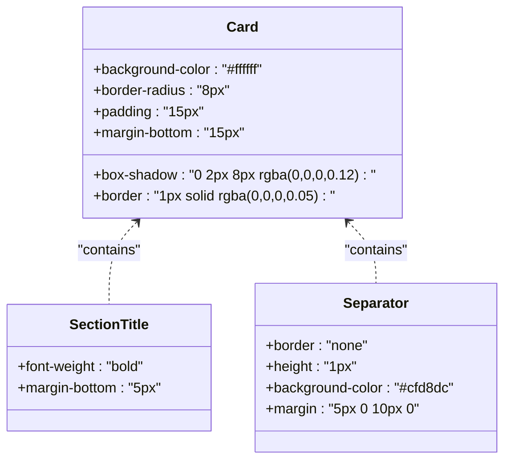
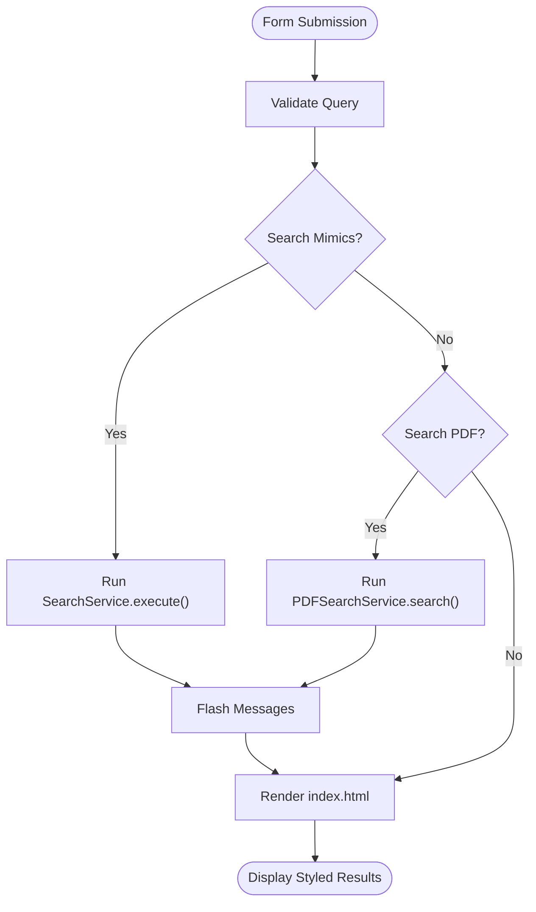
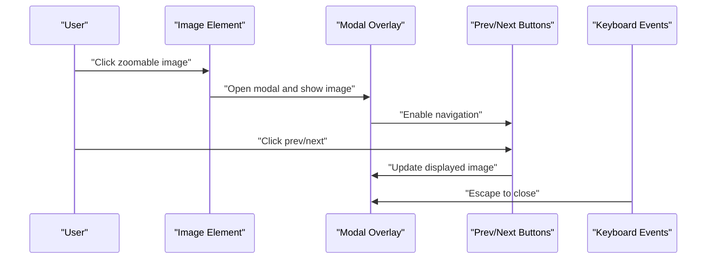
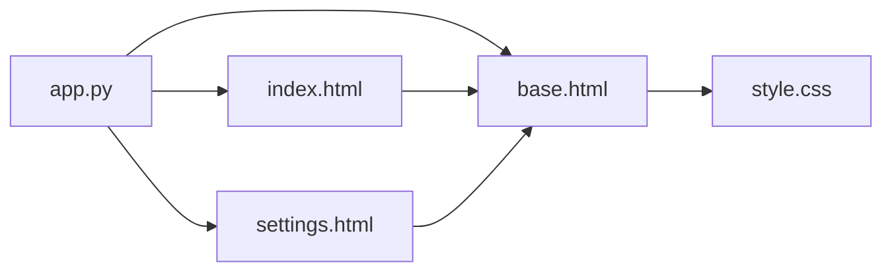

# Styling System

<cite>
**Referenced Files in This Document**
- [style.css](file://static/css/style.css)
- [base.html](file://templates/base.html)
- [index.html](file://templates/index.html)
- [settings.html](file://templates/settings.html)
- [app.py](file://app.py)
- [config_service.py](file://utils/config_service.py)
- [pyproject.toml](file://pyproject.toml)
</cite>

## Table of Contents
1. [Introduction](#introduction)
2. [Project Structure](#project-structure)
3. [Core Components](#core-components)
4. [Architecture Overview](#architecture-overview)
5. [Detailed Component Analysis](#detailed-component-analysis)
6. [Dependency Analysis](#dependency-analysis)
7. [Performance Considerations](#performance-considerations)
8. [Troubleshooting Guide](#troubleshooting-guide)
9. [Conclusion](#conclusion)
10. [Appendices](#appendices)

## Introduction
This document describes the ECS7Search CSS styling system with a focus on visual design, responsive layout, and component styling. It covers the CSS architecture including card layouts, form styling, button designs, badge systems, and table presentations. It also explains responsive design principles, media queries, and mobile-friendly adaptations. Practical guidance is included for customizing colors, typography, spacing, and component appearance, along with best practices for organizing and extending the styling system. Browser compatibility and performance optimization techniques are addressed.

## Project Structure
The styling system is primarily implemented in a single stylesheet and embedded styles within the Jinja2 templates. The application renders HTML pages that apply these styles directly, enabling a compact and maintainable front-end approach.

**Diagram sources**
- [base.html:1-658](file://templates/base.html#L1-L658)
- [index.html:1-261](file://templates/index.html#L1-L261)
- [settings.html:1-554](file://templates/settings.html#L1-L554)
- [style.css:1-160](file://static/css/style.css#L1-L160)
- [app.py:1-206](file://app.py#L1-L206)
- [config_service.py:1-128](file://utils/config_service.py#L1-L128)

**Section sources**
- [base.html:1-658](file://templates/base.html#L1-L658)
- [index.html:1-261](file://templates/index.html#L1-L261)
- [settings.html:1-554](file://templates/settings.html#L1-L554)
- [style.css:1-160](file://static/css/style.css#L1-L160)
- [app.py:1-206](file://app.py#L1-L206)
- [config_service.py:1-128](file://utils/config_service.py#L1-L128)

## Core Components
- Base layout and global styles: defined in the base template’s internal style block.
- Card-based content containers: reusable card components for content sections.
- Form controls and search interface: input fields, checkboxes, and submit buttons.
- Badge system: small, styled indicators for counts and statuses.
- Status banners: contextual feedback blocks for warnings, errors, and success.
- Tables: structured presentation of tag details and PDF results.
- Modal gallery: zoomable image viewer with navigation and keyboard support.
- Settings page grid: statistics cards and configuration panels.

Key styling patterns:
- Utility-first naming for badges and buttons.
- Semantic class names for layout and content areas.
- Embedded CSS in templates for simplicity and reduced asset management overhead.
- Minimal media queries and responsive utilities via Flexbox/Grid.

**Section sources**
- [base.html:7-502](file://templates/base.html#L7-L502)
- [index.html:4-255](file://templates/index.html#L4-L255)
- [settings.html:11-551](file://templates/settings.html#L11-L551)
- [style.css:1-160](file://static/css/style.css#L1-L160)

## Architecture Overview
The styling architecture centers around:
- A shared base template that defines global styles, layout, and interactive components.
- Page-specific templates that extend the base and add content-specific styles.
- A minimal external stylesheet for shared reusable components and utilities.

**Diagram sources**
- [base.html:1-658](file://templates/base.html#L1-L658)
- [index.html:1-261](file://templates/index.html#L1-L261)
- [settings.html:1-554](file://templates/settings.html#L1-L554)
- [style.css:1-160](file://static/css/style.css#L1-L160)

## Detailed Component Analysis

### Global Layout and Typography
- Body and typography: system fonts, gradient background, and consistent color palette.
- Container sizing and spacing: max-width container with centered content.
- Navbar: dark-themed header with navigation links and hover effects.
- Footer: subtle, muted typography for attribution.

Responsive characteristics:
- Flexible container with horizontal padding.
- Navbar items wrap on smaller screens due to flex wrapping.

Best practices:
- Prefer system fonts for readability and performance.
- Use a consistent color scheme across components.

**Section sources**
- [base.html:8-15](file://templates/base.html#L8-L15)
- [base.html:23-50](file://templates/base.html#L23-L50)
- [base.html:51-55](file://templates/base.html#L51-L55)
- [base.html:328-333](file://templates/base.html#L328-L333)

### Cards and Content Areas
- Card: rounded corners, soft shadow, subtle border, and internal spacing.
- Section title and separator: bold titles and thin separators for visual grouping.
- Status banners: contextual backgrounds and left accent borders for warnings, errors, info, and success.

Usage:
- Search form and results are wrapped in cards.
- Settings page organizes content into stat cards and instruction cards.

**Section sources**
- [base.html:56-63](file://templates/base.html#L56-L63)
- [base.html:93-102](file://templates/base.html#L93-L102)
- [base.html:103-124](file://templates/base.html#L103-L124)
- [settings.html:4-95](file://templates/settings.html#L4-L95)

### Forms and Inputs
- Search form: flex layout with gap, alignment, and wrapping for responsiveness.
- Input groups: label and input arranged vertically with flexible widths.
- Text inputs: consistent padding, border radius, border, and focus state with a green accent.
- Checkbox labels: aligned with inputs, accent color for checkbox indicator.
- Submit button: primary button variant with hover effect.

Mobile adaptation:
- Flex wrapping allows inputs to stack on narrow screens.
- Minimum width constraints ensure usability on small devices.

**Section sources**
- [base.html:125-177](file://templates/base.html#L125-L177)
- [base.html:139-172](file://templates/base.html#L139-L172)
- [base.html:144-156](file://templates/base.html#L144-L156)
- [base.html:167-172](file://templates/base.html#L167-L172)
- [index.html:8-38](file://templates/index.html#L8-L38)

### Buttons and Interactions
- Button base: inline-block, padding, border-radius, cursor pointer, and font size.
- Primary button: green background with hover darkening.
- Settings page buttons: primary variants with hover and disabled states.
- Scroll-to-top and scroll-to-bottom floating buttons: circular, subtle shadows, transitions.

Accessibility and UX:
- Hover states improve interactivity.
- Floating buttons are hidden until scrolled, reducing clutter.

**Section sources**
- [base.html:77-92](file://templates/base.html#L77-L92)
- [settings.html:428-446](file://templates/settings.html#L428-L446)
- [base.html:284-307](file://templates/base.html#L284-L307)
- [base.html:308-327](file://templates/base.html#L308-L327)

### Badges and Indicators
- Badge base: inline-block, small padding, rounded pill shape, and white text.
- Variants: info (blue), ok (green), and custom usage for counts.
- Tag lists: badges grouped with small margins for readability.

Customization:
- Adjust background color and text color to match brand or status semantics.

**Section sources**
- [base.html:64-70](file://templates/base.html#L64-L70)
- [base.html:71-77](file://templates/base.html#L71-L77)
- [index.html:65-66](file://templates/index.html#L65-L66)
- [index.html:240-242](file://templates/index.html#L240-L242)

### Tables and Data Presentation
- Table base: full width, collapsed borders, small font size.
- Header: dark background, light text, sticky top, and nowrap for column headers.
- Rows: alternating borders and hover highlight for readability.
- Code cells: subtle background, padding, rounded corners, and red text for tag-like identifiers.
- Specialized text classes: Russian descriptions, purpose notes, PLC subsections, and monospace IO entries.

Responsive considerations:
- Horizontal scrolling is enabled for long tables to preserve readability on small screens.

**Section sources**
- [base.html:214-245](file://templates/base.html#L214-L245)
- [index.html:74-151](file://templates/index.html#L74-L151)
- [index.html:186-208](file://templates/index.html#L186-L208)

### Modal Gallery and Zoomable Images
- Overlay: full-screen fixed-position background with centered content.
- Navigation: prev/next buttons with hover effects and disabled states.
- Counter: positioned below the image with neutral color.
- Close button: prominent circular button with hover danger color.

Behavior:
- Clicking an image with a specific class opens the modal and displays the image.
- Keyboard navigation supports Escape, arrow keys, and space.

**Section sources**
- [base.html:403-501](file://templates/base.html#L403-L501)
- [base.html:565-655](file://templates/base.html#L565-L655)
- [index.html:245-251](file://templates/index.html#L245-L251)

### Settings Page Grid and Panels
- Stats grid: responsive grid using auto-fit minmax for cards.
- Stat cards: subtle borders, rounded corners, and internal spacing.
- Config table: label/value rows with monospace values for technical paths.
- Indexing instructions: card-based steps with numbered markers and full-width buttons.

Responsive characteristics:
- Grid automatically adjusts columns based on viewport width.
- Instructions cards stack on small screens.

**Section sources**
- [settings.html:11-95](file://templates/settings.html#L11-L95)
- [settings.html:342-401](file://templates/settings.html#L342-L401)
- [settings.html:456-551](file://templates/settings.html#L456-L551)

### External Stylesheet Utilities
- Reusable utilities: result items, image zoom, tag lists, and table styles.
- Shared patterns: consistent spacing, typography, and colors across components.

Integration:
- The base template embeds most styles, while the external stylesheet provides additional reusable utilities.

**Section sources**
- [style.css:1-160](file://static/css/style.css#L1-L160)

## Architecture Overview

**Diagram sources**
- [app.py:92-169](file://app.py#L92-L169)
- [base.html:1-658](file://templates/base.html#L1-L658)
- [index.html:1-261](file://templates/index.html#L1-L261)
- [settings.html:1-554](file://templates/settings.html#L1-L554)
- [style.css:1-160](file://static/css/style.css#L1-L160)

## Detailed Component Analysis

### Card Layout System

**Diagram sources**
- [base.html:56-63](file://templates/base.html#L56-L63)
- [base.html:93-102](file://templates/base.html#L93-L102)

**Section sources**
- [base.html:56-63](file://templates/base.html#L56-L63)
- [base.html:93-102](file://templates/base.html#L93-L102)

### Form and Input Flow

**Diagram sources**
- [app.py:92-155](file://app.py#L92-L155)
- [index.html:8-38](file://templates/index.html#L8-L38)

**Section sources**
- [app.py:92-155](file://app.py#L92-L155)
- [index.html:8-38](file://templates/index.html#L8-L38)

### Modal Interaction Flow

**Diagram sources**
- [base.html:565-655](file://templates/base.html#L565-L655)

**Section sources**
- [base.html:565-655](file://templates/base.html#L565-L655)

## Dependency Analysis
- Templates depend on embedded styles for layout and components.
- The external stylesheet provides additional reusable utilities.
- Application routes render templates and pass data for dynamic content rendering.

**Diagram sources**
- [app.py:1-206](file://app.py#L1-L206)
- [base.html:1-658](file://templates/base.html#L1-L658)
- [index.html:1-261](file://templates/index.html#L1-L261)
- [settings.html:1-554](file://templates/settings.html#L1-L554)
- [style.css:1-160](file://static/css/style.css#L1-L160)

**Section sources**
- [app.py:1-206](file://app.py#L1-L206)
- [base.html:1-658](file://templates/base.html#L1-L658)
- [index.html:1-261](file://templates/index.html#L1-L261)
- [settings.html:1-554](file://templates/settings.html#L1-L554)
- [style.css:1-160](file://static/css/style.css#L1-L160)

## Performance Considerations
- Inline styles reduce HTTP requests and simplify deployment for this small application.
- Minimal CSS reduces parsing and rendering overhead.
- Avoid heavy animations or excessive shadows for better performance on older devices.
- Lazy loading of images is already handled by the modal system; keep image sizes reasonable.
- Consider extracting shared styles to the external stylesheet to reduce duplication if the project grows.

[No sources needed since this section provides general guidance]

## Troubleshooting Guide
Common styling issues and resolutions:
- Elements not appearing due to missing classes: ensure classes like card, section-title, search-form, result-img, and modal-overlay are present in templates.
- Focus styles not visible: verify input focus styles are applied consistently.
- Tables overflow horizontally: enable horizontal scrolling for tables as implemented.
- Modal not opening: confirm the zoomable class is applied to images and that the modal overlay is present.
- Responsive layout breaks: check flex wrapping and minimum widths for inputs.

**Section sources**
- [base.html:125-177](file://templates/base.html#L125-L177)
- [base.html:403-501](file://templates/base.html#L403-L501)
- [index.html:245-251](file://templates/index.html#L245-L251)

## Conclusion
ECS7Search employs a pragmatic, embedded-CSS approach that balances simplicity and maintainability. The styling system emphasizes:
- Consistent card-based layouts for content sections.
- Clear form controls with accessible focus states.
- Lightweight badges and status banners for feedback.
- Structured tables with hover and sticky headers.
- A modal gallery for zoomable images with keyboard navigation.
- Responsive behavior through flex wrapping and grid-based stats.

Extending the system:
- Add new component classes to the base template’s style block for immediate availability.
- Introduce a dedicated stylesheet for shared utilities as the project scales.
- Use semantic class names and maintain a consistent color palette.

[No sources needed since this section summarizes without analyzing specific files]

## Appendices

### Customization Guide
Colors:
- Accent color: green (#18bc9c) used for inputs, buttons, and highlights.
- Background gradients: light blue tones for body background.
- Borders and separators: subtle grays for depth.

Typography:
- System font stack for cross-platform readability.
- Consistent font sizes across components.

Spacing:
- Uniform padding and margins within cards and lists.
- Gap-based spacing for flex layouts.

Component appearance:
- Buttons: rounded, padded, hover transitions.
- Badges: pill-shaped with white text.
- Tables: compact, readable with hover states.

**Section sources**
- [base.html:10-15](file://templates/base.html#L10-L15)
- [base.html:16-22](file://templates/base.html#L16-L22)
- [base.html:85-92](file://templates/base.html#L85-L92)
- [base.html:64-70](file://templates/base.html#L64-L70)
- [base.html:214-245](file://templates/base.html#L214-L245)

### Browser Compatibility
- Modern browsers: Flexbox, Grid, and CSS variables are widely supported.
- Legacy support: No vendor prefixes are used; ensure fallbacks if targeting older environments.
- Mobile: Flex wrapping and viewport meta tag support modern mobile browsers.

**Section sources**
- [base.html:5-5](file://templates/base.html#L5-L5)
- [base.html:125-177](file://templates/base.html#L125-L177)
- [base.html:456-479](file://templates/base.html#L456-L479)

### Dependencies and Scripts
- Flask: templating and routing.
- Pillow, pandas, openpyxl, pymupdf, pyodbc, alive-progress, yaml: backend services.

**Section sources**
- [pyproject.toml:6-15](file://pyproject.toml#L6-L15)