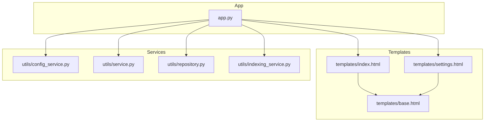
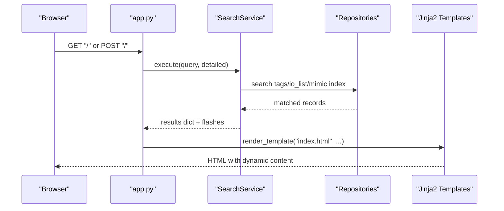
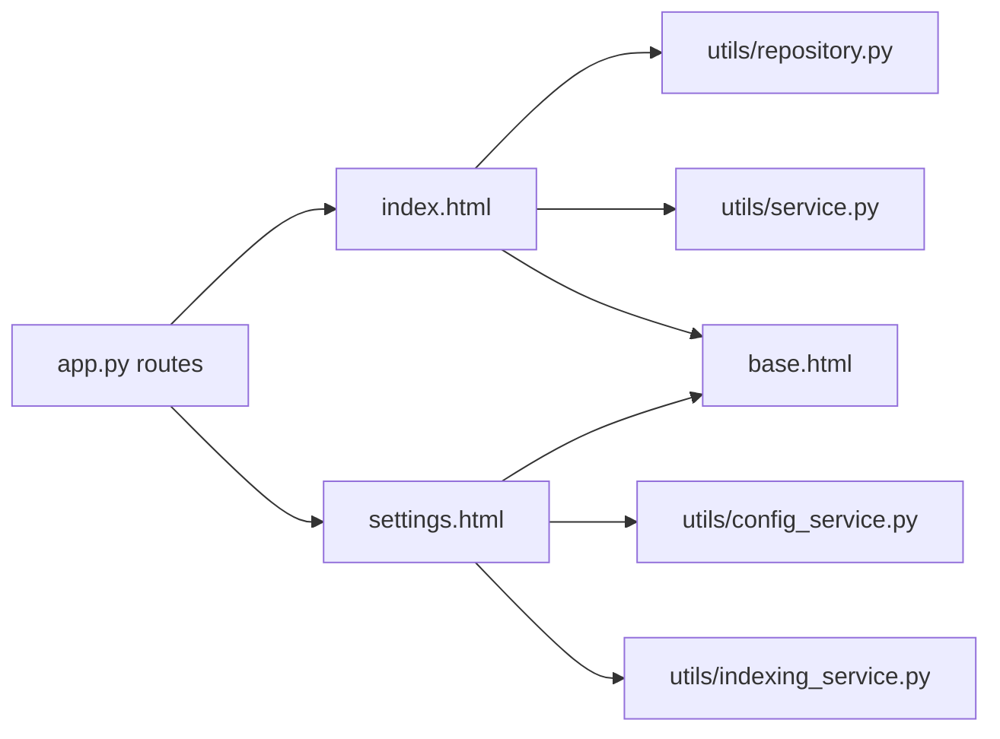

# Template System

<cite>
**Referenced Files in This Document**
- [base.html](file://templates/base.html)
- [index.html](file://templates/index.html)
- [settings.html](file://templates/settings.html)
- [app.py](file://app.py)
- [config_service.py](file://utils/config_service.py)
- [service.py](file://utils/service.py)
- [repository.py](file://utils/repository.py)
- [indexing_service.py](file://utils/indexing_service.py)
</cite>

## Table of Contents
1. [Introduction](#introduction)
2. [Project Structure](#project-structure)
3. [Core Components](#core-components)
4. [Architecture Overview](#architecture-overview)
5. [Detailed Component Analysis](#detailed-component-analysis)
6. [Dependency Analysis](#dependency-analysis)
7. [Performance Considerations](#performance-considerations)
8. [Troubleshooting Guide](#troubleshooting-guide)
9. [Conclusion](#conclusion)

## Introduction
This document explains the Jinja2 template system used by the ECS7Search application. It focuses on the base template architecture, template inheritance, reusable components, and layout management. It documents the content blocks, template variables, conditional rendering, loops, and filters used for dynamic content generation across index.html and settings.html. It also provides practical guidance for extending templates, adding new content blocks, customizing layouts, debugging templates, and maintaining performance.

## Project Structure
The template system centers around a single base template that defines shared HTML structure, navigation, and global styles. Two pages extend the base template to implement distinct views:
- index.html: search interface and results gallery
- settings.html: configuration, statistics, and indexing controls

The Flask application routes render these templates and supply the variables consumed by the templates.

**Diagram sources**
- [base.html](file://templates/base.html)
- [index.html](file://templates/index.html)
- [settings.html](file://templates/settings.html)
- [app.py](file://app.py)
- [config_service.py](file://utils/config_service.py)
- [service.py](file://utils/service.py)
- [repository.py](file://utils/repository.py)
- [indexing_service.py](file://utils/indexing_service.py)

**Section sources**
- [base.html](file://templates/base.html)
- [index.html](file://templates/index.html)
- [settings.html](file://templates/settings.html)
- [app.py](file://app.py)

## Core Components
- Base template (base.html): Provides the global HTML skeleton, navigation bar, container, and shared CSS/JS. It exposes a single content block for child templates to populate.
- Index template (index.html): Extends base.html and renders the search form, flash messages, tag details table, PDF results, and image gallery. It uses conditionals, loops, and filters to render dynamic content.
- Settings template (settings.html): Extends base.html and renders statistics cards, configuration paths, and interactive indexing controls with live status updates.

Key template variables supplied by the application:
- index.html receives: query, detailed, search_mimics, search_pdf, results, pdf_results, and flash messages.
- settings.html receives: config, mimics_stats, pdf_stats, tags_stats, io_stats, and indexing_status.

**Section sources**
- [base.html](file://templates/base.html)
- [index.html](file://templates/index.html)
- [settings.html](file://templates/settings.html)
- [app.py](file://app.py)

## Architecture Overview
The template architecture follows a strict inheritance model:
- Child templates declare .
- Child templates override  to insert page-specific markup.
- Global navigation and layout are centralized in base.html.
- Pages consume variables passed by Flask routes and services.

**Diagram sources**
- [app.py](file://app.py)
- [service.py](file://utils/service.py)
- [repository.py](file://utils/repository.py)
- [index.html](file://templates/index.html)

## Detailed Component Analysis

### Base Template (base.html)
- Purpose: Centralized layout, navigation, and shared assets.
- Navigation: Navbar links to home and settings.
- Content area: Single  for child templates.
- Global scripts: Back-to-top and scroll-to-bottom buttons, image modal for zoomable results.
- Styles: Comprehensive CSS for cards, badges, forms, tables, and modals.

Best practices:
- Keep base.html minimal and stable.
- Add new global UI elements here to propagate across all pages.
- Avoid embedding page-specific logic in base.html.

**Section sources**
- [base.html](file://templates/base.html)

### Index Template (index.html)
- Extends base.html and overrides content block.
- Renders:
  - Search form with query input and checkboxes for search scope.
  - Flash messages with category-based banners.
  - Tag details table with conditional rendering for missing fields.
  - PDF results table with download link and metadata.
  - Image gallery with zoomable results and badges for unique tags.
- Dynamic constructs:
  - Conditionals: if/elif/else for banners and visibility.
  - Loops: for over results, pdf_results, images, and tag details.
  - Filters: map(attribute='tag') | unique | list for deduplicated tag lists.

Extending index.html:
- Add new content blocks inside the existing content block.
- Use existing classes and styles for consistency.
- Leverage existing filters and helpers for consistent rendering.

**Section sources**
- [index.html](file://templates/index.html)

### Settings Template (settings.html)
- Extends base.html and overrides content block.
- Renders:
  - Statistics grid for mimics, PDF, tags, and IO list.
  - Configuration paths table.
  - Interactive indexing controls with live status polling.
- Dynamic constructs:
  - Conditionals for optional metadata.
  - Loops for instruction steps and buttons.
  - JavaScript-driven status panel updates.

Extending settings.html:
- Add new stats cards or configuration rows.
- Introduce new indexing tasks by adding buttons and handlers.
- Reuse the existing status panel and polling mechanism.

**Section sources**
- [settings.html](file://templates/settings.html)

### Template Variables and Data Flow
- index.html variables:
  - query, detailed, search_mimics, search_pdf: form state.
  - results: structured search results from SearchService.
  - pdf_results: PDF search results and metadata.
  - get_flashed_messages(): Flask’s flash storage.
- settings.html variables:
  - config: paths from ConfigService.
  - mimics_stats, pdf_stats, tags_stats, io_stats: statistics from ConfigService.
  - indexing_status: current status from IndexingStatus.

These variables originate from:
- app.py routes: render_template(...) calls.
- Services: SearchService, ConfigService, IndexingService.

**Section sources**
- [app.py](file://app.py)
- [service.py](file://utils/service.py)
- [config_service.py](file://utils/config_service.py)
- [indexing_service.py](file://utils/indexing_service.py)

### Conditional Rendering and Loops
- Conditional rendering:
  - Banner selection based on flash categories.
  - Visibility of detailed tag tables and PDF sections.
  - Optional metadata display for index creation dates.
- Loops:
  - Iterating over results.images, pdf_results.table, and tag details.
  - Building unique tag lists with filters.

Filters used:
- map(attribute='tag'): Extract attributes for deduplication.
- unique: Remove duplicates.
- list: Convert iterator to list for iteration.

**Section sources**
- [index.html](file://templates/index.html)

### Layout Management and Reusable Components
- Shared layout: base.html provides container, navbar, and footer.
- Reusable components:
  - Cards for grouping content.
  - Badges for counts and statuses.
  - Status banners for flash messages.
  - Tables for structured data presentation.
- Consistent styling: CSS classes define consistent spacing, typography, and colors.

**Section sources**
- [base.html](file://templates/base.html)
- [index.html](file://templates/index.html)
- [settings.html](file://templates/settings.html)

### Template Inheritance Patterns
- Pattern: Child templates declare  and override .
- Benefits:
  - Centralized navigation and layout.
  - Consistent styling across pages.
  - Easy maintenance and extension.

**Section sources**
- [base.html](file://templates/base.html)
- [index.html](file://templates/index.html)
- [settings.html](file://templates/settings.html)

### Adding New Content Blocks
- Extend base.html in a new child template.
- Define new blocks alongside content if needed.
- Populate blocks with variables from the route handler.

Example pattern:
- Create a new template that extends base.html.
- Add a new block and render your content.
- Pass variables from app.py to the new template.

**Section sources**
- [base.html](file://templates/base.html)
- [app.py](file://app.py)

### Customizing the Layout
- Modify base.html to change global styles, navigation, or scripts.
- Use existing CSS classes to keep new content consistent.
- Avoid altering the content block signature to preserve inheritance.

**Section sources**
- [base.html](file://templates/base.html)

## Dependency Analysis
Template dependencies are primarily runtime:
- index.html depends on variables provided by app.py and SearchService.
- settings.html depends on variables provided by app.py and ConfigService/IndexingService.
- Both templates depend on base.html for layout and shared assets.

**Diagram sources**
- [app.py](file://app.py)
- [index.html](file://templates/index.html)
- [settings.html](file://templates/settings.html)
- [base.html](file://templates/base.html)
- [repository.py](file://utils/repository.py)
- [service.py](file://utils/service.py)
- [config_service.py](file://utils/config_service.py)
- [indexing_service.py](file://utils/indexing_service.py)

**Section sources**
- [app.py](file://app.py)
- [index.html](file://templates/index.html)
- [settings.html](file://templates/settings.html)
- [base.html](file://templates/base.html)
- [repository.py](file://utils/repository.py)
- [service.py](file://utils/service.py)
- [config_service.py](file://utils/config_service.py)
- [indexing_service.py](file://utils/indexing_service.py)

## Performance Considerations
- Minimize heavy computations in templates. Move logic to services where possible.
- Use filters judiciously; prefer efficient Python-side transformations.
- Limit the number of rendered images and tables to avoid excessive DOM.
- Cache frequently accessed data in repositories to reduce repeated I/O.

[No sources needed since this section provides general guidance]

## Troubleshooting Guide
Common template issues and resolutions:
- Missing variables:
  - Ensure routes pass all required variables to render_template.
  - Verify service methods return expected structures.
- Incorrect rendering:
  - Confirm conditional branches match expected data shapes.
  - Validate loop targets are iterable and non-empty.
- Styling inconsistencies:
  - Use existing CSS classes from base.html.
  - Avoid overriding global styles unless necessary.
- Debugging techniques:
  - Temporarily log variables in routes/services to inspect data.
  - Use Jinja2’s built-in debug features in development mode.
  - Inspect network requests for status updates in settings.html.

**Section sources**
- [app.py](file://app.py)
- [index.html](file://templates/index.html)
- [settings.html](file://templates/settings.html)

## Conclusion
The ECS7Search template system leverages Jinja2 inheritance to centralize layout and navigation while enabling page-specific customization. By understanding the base template, content blocks, and the variables supplied by the application, developers can confidently extend the system, add new content blocks, and maintain consistent layouts. Following the outlined best practices ensures reliable rendering, easy debugging, and sustainable maintenance.