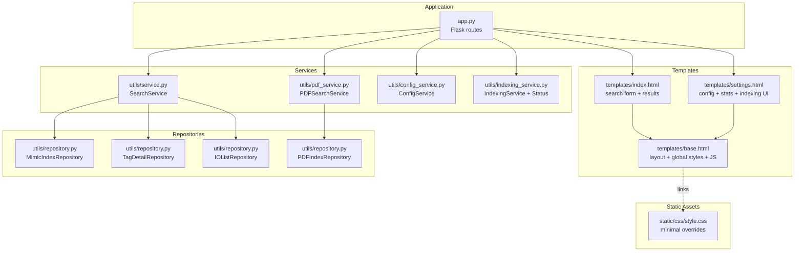
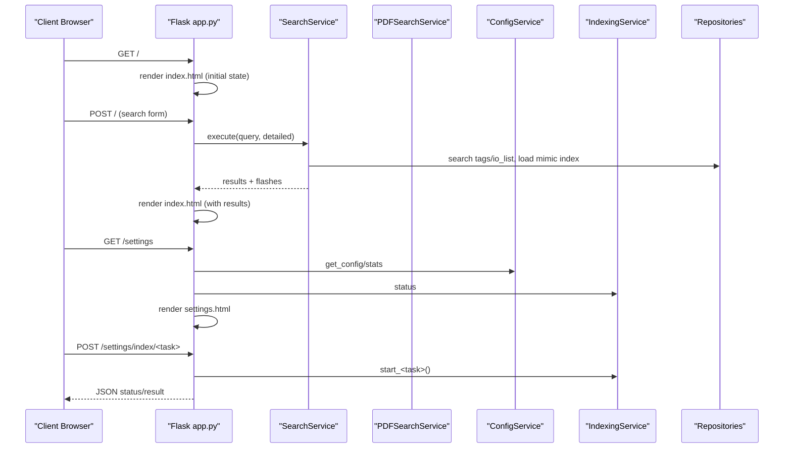
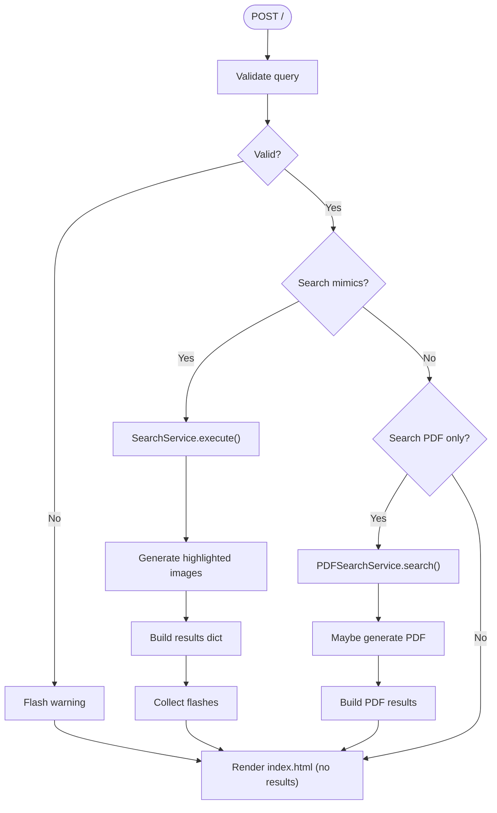
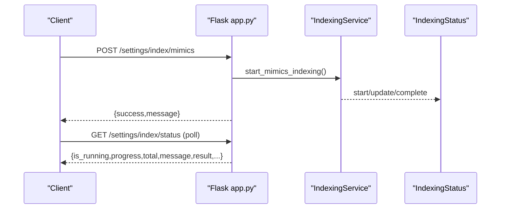
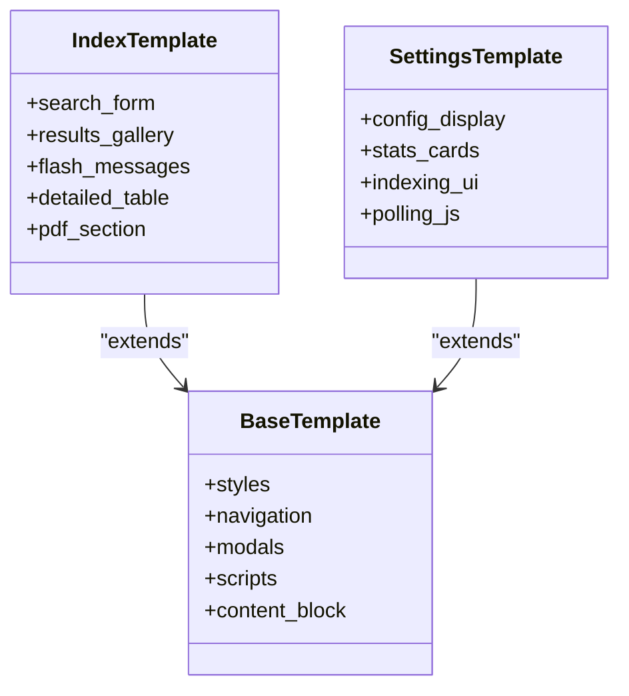
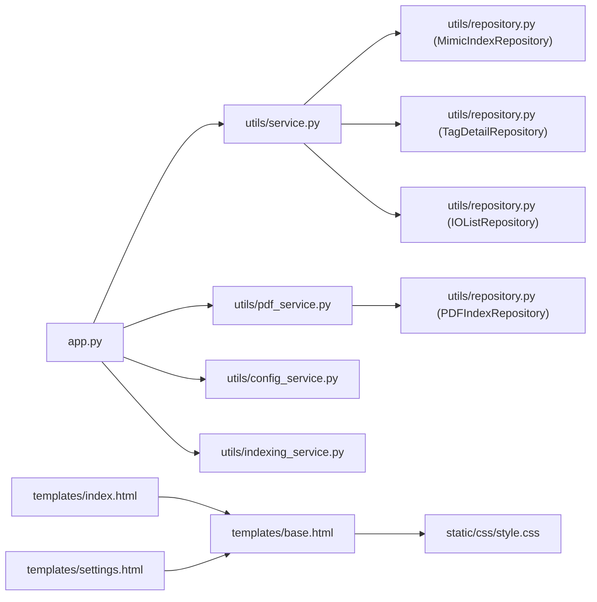

# Web Interface

<cite>
**Referenced Files in This Document**
- [app.py](file://app.py)
- [templates/base.html](file://templates/base.html)
- [templates/index.html](file://templates/index.html)
- [templates/settings.html](file://templates/settings.html)
- [static/css/style.css](file://static/css/style.css)
- [utils/config_service.py](file://utils/config_service.py)
- [utils/service.py](file://utils/service.py)
- [utils/repository.py](file://utils/repository.py)
- [utils/pdf_service.py](file://utils/pdf_service.py)
- [utils/indexing_service.py](file://utils/indexing_service.py)
- [README.md](file://README.md)
</cite>

## Table of Contents
1. [Introduction](#introduction)
2. [Project Structure](#project-structure)
3. [Core Components](#core-components)
4. [Architecture Overview](#architecture-overview)
5. [Detailed Component Analysis](#detailed-component-analysis)
6. [Dependency Analysis](#dependency-analysis)
7. [Performance Considerations](#performance-considerations)
8. [Troubleshooting Guide](#troubleshooting-guide)
9. [Conclusion](#conclusion)
10. [Appendices](#appendices)

## Introduction
This document describes the ECS7Search web interface built with Flask, Jinja2 templates, and CSS styling. It focuses on:
- Search form functionality with validation, results display, and navigation features
- Settings and configuration management interface
- Template inheritance system, CSS styling approach, and static asset management
- User interaction patterns, accessibility considerations, and customization options
- Browser compatibility and performance optimization

The application exposes two primary pages:
- Home page with a search form and results gallery
- Settings page for configuration, statistics, and index management

## Project Structure
The web interface is organized around a small Flask application with a clear separation of concerns:
- Routing and controllers live in the application entrypoint
- Business logic resides in service modules
- Data access is handled by repository modules
- Templates define UI composition and styling via Jinja2
- Static assets provide minimal additional CSS

**Diagram sources**
- [app.py:1-206](file://app.py#L1-L206)
- [templates/base.html:1-658](file://templates/base.html#L1-L658)
- [templates/index.html:1-260](file://templates/index.html#L1-L260)
- [templates/settings.html:1-554](file://templates/settings.html#L1-L554)
- [static/css/style.css:1-154](file://static/css/style.css#L1-L154)
- [utils/service.py:1-270](file://utils/service.py#L1-L270)
- [utils/pdf_service.py:1-229](file://utils/pdf_service.py#L1-L229)
- [utils/config_service.py:1-128](file://utils/config_service.py#L1-L128)
- [utils/indexing_service.py:1-239](file://utils/indexing_service.py#L1-L239)
- [utils/repository.py:1-178](file://utils/repository.py#L1-L178)

**Section sources**
- [app.py:86-206](file://app.py#L86-L206)
- [templates/base.html:1-658](file://templates/base.html#L1-L658)
- [templates/index.html:1-260](file://templates/index.html#L1-L260)
- [templates/settings.html:1-554](file://templates/settings.html#L1-L554)
- [static/css/style.css:1-154](file://static/css/style.css#L1-L154)

## Core Components
- Flask application and routing
  - Routes for home search and settings
  - Temporary image serving endpoint
  - Flash messaging for user feedback
- Template inheritance
  - Base layout defines global styles, navigation, modals, and shared scripts
  - Child templates extend base and inject content blocks
- Services and repositories
  - SearchService orchestrates tag discovery, deduplication, and image generation
  - PDFSearchService handles PDF index search and aggregated PDF generation
  - Repositories encapsulate JSON data access and caching
  - ConfigService aggregates configuration and statistics
  - IndexingService runs long-running tasks and exposes status

**Section sources**
- [app.py:92-206](file://app.py#L92-L206)
- [templates/base.html:1-658](file://templates/base.html#L1-L658)
- [utils/service.py:25-270](file://utils/service.py#L25-L270)
- [utils/pdf_service.py:18-229](file://utils/pdf_service.py#L18-L229)
- [utils/repository.py:13-178](file://utils/repository.py#L13-L178)
- [utils/config_service.py:13-128](file://utils/config_service.py#L13-L128)
- [utils/indexing_service.py:23-239](file://utils/indexing_service.py#L23-L239)

## Architecture Overview
The web interface follows a layered architecture:
- Presentation layer: Flask routes render Jinja2 templates
- Service layer: business logic for search and PDF generation
- Repository layer: data access for indices and JSON datasets
- Static assets: minimal CSS overrides layered over base styles

**Diagram sources**
- [app.py:92-194](file://app.py#L92-L194)
- [utils/service.py:58-158](file://utils/service.py#L58-L158)
- [utils/pdf_service.py:36-52](file://utils/pdf_service.py#L36-L52)
- [utils/config_service.py:38-106](file://utils/config_service.py#L38-L106)
- [utils/indexing_service.py:106-238](file://utils/indexing_service.py#L106-L238)

## Detailed Component Analysis

### Search Form and Results Display
- Form controls
  - Query input with placeholder and autofocus
  - Options: search mimics, search PDF, detailed tag info
  - Validation enforces minimum length and allowed characters
- Results presentation
  - Flash banners for warnings, errors, and successes
  - Gallery of highlighted images with clickable zoom
  - Optional detailed tag table with descriptions, PLC info, IO list, and screen references
  - PDF results section with aggregated table and download link
- Navigation helpers
  - Back-to-top and scroll-to-bottom floating buttons
  - Modal overlay for zoomed image viewing with keyboard and navigation controls

**Diagram sources**
- [app.py:106-155](file://app.py#L106-L155)
- [utils/service.py:46-158](file://utils/service.py#L46-L158)
- [utils/pdf_service.py:36-96](file://utils/pdf_service.py#L36-L96)
- [templates/index.html:8-254](file://templates/index.html#L8-L254)

**Section sources**
- [app.py:92-155](file://app.py#L92-L155)
- [utils/service.py:46-158](file://utils/service.py#L46-L158)
- [utils/pdf_service.py:36-96](file://utils/pdf_service.py#L36-L96)
- [templates/index.html:8-254](file://templates/index.html#L8-L254)
- [templates/base.html:536-655](file://templates/base.html#L536-L655)

### Settings and Configuration Management
- Configuration display
  - Paths to project directories and data folders
  - Statistics cards for mimics, PDF, tags, and IO list
- Indexing workflow
  - Start tasks via AJAX POST to /settings/index/<task>
  - Polling endpoint /settings/index/status for progress updates
  - Animated progress bar and completion details
- Task types
  - Index mimics, PDF, IO list, and extract tags from MDB

**Diagram sources**
- [app.py:172-194](file://app.py#L172-L194)
- [utils/indexing_service.py:106-141](file://utils/indexing_service.py#L106-L141)
- [utils/indexing_service.py:23-78](file://utils/indexing_service.py#L23-L78)
- [templates/settings.html:226-342](file://templates/settings.html#L226-L342)

**Section sources**
- [app.py:158-194](file://app.py#L158-L194)
- [utils/config_service.py:38-106](file://utils/config_service.py#L38-L106)
- [utils/indexing_service.py:85-239](file://utils/indexing_service.py#L85-L239)
- [templates/settings.html:1-554](file://templates/settings.html#L1-L554)

### Template Inheritance and Layout
- Base template
  - Defines global styles, navigation, container, and reusable components
  - Provides a content block for child templates
  - Includes JavaScript for scroll buttons, modal image viewer, and keyboard navigation
- Child templates
  - index.html extends base and injects search form, results, and flash messages
  - settings.html extends base and injects configuration, stats, and indexing UI

**Diagram sources**
- [templates/base.html:1-658](file://templates/base.html#L1-L658)
- [templates/index.html:1-260](file://templates/index.html#L1-L260)
- [templates/settings.html:1-554](file://templates/settings.html#L1-L554)

**Section sources**
- [templates/base.html:1-658](file://templates/base.html#L1-L658)
- [templates/index.html:1-260](file://templates/index.html#L1-L260)
- [templates/settings.html:1-554](file://templates/settings.html#L1-L554)

### CSS Styling Approach and Static Asset Management
- Base styles
  - Comprehensive CSS embedded in base.html covers typography, layout, cards, badges, forms, tables, and modal UI
  - Uses modern CSS features (flexbox, grid, sticky headers, transitions)
- Minimal overrides
  - Additional CSS in static/css/style.css provides targeted overrides for result items, images, and tables
- Asset loading
  - Base template embeds styles directly; static/css/style.css is included via base.html’s style block
  - Images served via a dedicated route for temporary files

**Section sources**
- [templates/base.html:7-502](file://templates/base.html#L7-L502)
- [static/css/style.css:1-154](file://static/css/style.css#L1-L154)
- [app.py:197-201](file://app.py#L197-L201)

### User Interaction Patterns and Accessibility
- Interaction patterns
  - Search form submission triggers server-side processing and renders results
  - Clicking images opens a modal with navigation and counter
  - Floating buttons enable quick navigation to top/bottom
  - Settings page uses AJAX to start tasks and poll status
- Accessibility considerations
  - Semantic HTML and focusable elements
  - Keyboard navigation for modal (Escape, arrows)
  - Clear labels and readable contrast in base styles
  - Focus states for inputs and buttons

**Section sources**
- [templates/base.html:536-655](file://templates/base.html#L536-L655)
- [templates/index.html:8-254](file://templates/index.html#L8-L254)
- [templates/settings.html:226-342](file://templates/settings.html#L226-L342)

### Customization Options
- Template customization
  - Extend base.html and override content block
  - Modify badges, buttons, and card styles within base.html
  - Adjust modal behavior and counters in base.js
- Styling customization
  - Override base styles by editing base.html or adding scoped styles in child templates
  - Use static/css/style.css for incremental adjustments
- Behavior customization
  - Add new routes and endpoints in app.py
  - Introduce new services and repositories under utils/
  - Extend settings UI with additional configuration panels

**Section sources**
- [templates/base.html:1-658](file://templates/base.html#L1-L658)
- [templates/index.html:1-260](file://templates/index.html#L1-L260)
- [templates/settings.html:1-554](file://templates/settings.html#L1-L554)
- [static/css/style.css:1-154](file://static/css/style.css#L1-L154)
- [app.py:86-206](file://app.py#L86-L206)

## Dependency Analysis
The application exhibits clean separation of concerns:
- app.py depends on services and repositories to fulfill requests
- Services depend on repositories for data access
- Templates depend on base.html for layout and styling
- Static assets depend on base.html for inclusion

**Diagram sources**
- [app.py:13-84](file://app.py#L13-L84)
- [utils/service.py:15-20](file://utils/service.py#L15-L20)
- [utils/pdf_service.py:15](file://utils/pdf_service.py#L15)
- [utils/repository.py:13-178](file://utils/repository.py#L13-L178)
- [templates/index.html:1](file://templates/index.html#L1)
- [templates/settings.html:1](file://templates/settings.html#L1)
- [templates/base.html:1](file://templates/base.html#L1)
- [static/css/style.css:1](file://static/css/style.css#L1)

**Section sources**
- [app.py:13-84](file://app.py#L13-L84)
- [utils/service.py:15-20](file://utils/service.py#L15-L20)
- [utils/pdf_service.py:15](file://utils/pdf_service.py#L15)
- [utils/repository.py:13-178](file://utils/repository.py#L13-L178)
- [templates/index.html:1](file://templates/index.html#L1)
- [templates/settings.html:1](file://templates/settings.html#L1)
- [templates/base.html:1](file://templates/base.html#L1)
- [static/css/style.css:1](file://static/css/style.css#L1)

## Performance Considerations
- Rendering limits
  - SearchService caps the number of generated images to avoid excessive rendering
- Data access caching
  - Repositories cache loaded JSON data to reduce repeated disk reads
- Asynchronous operations
  - Indexing tasks run in separate threads to keep the UI responsive
- Static asset delivery
  - Base styles embedded in HTML reduce HTTP requests; minimal overrides in static/css/style.css
- Image handling
  - Temporary images are generated and served on-demand; consider caching strategies for repeated queries

**Section sources**
- [utils/service.py:162-198](file://utils/service.py#L162-L198)
- [utils/repository.py:34-62](file://utils/repository.py#L34-L62)
- [utils/repository.py:105-120](file://utils/repository.py#L105-L120)
- [utils/repository.py:148-162](file://utils/repository.py#L148-L162)
- [utils/indexing_service.py:106-141](file://utils/indexing_service.py#L106-L141)

## Troubleshooting Guide
- Search validation failures
  - Ensure query length meets minimum requirements and uses allowed characters
- No results found
  - Verify indices exist and are up-to-date; check skipped files and warnings
- PDF search issues
  - Confirm PDF index exists and contains matching tags; handle missing index gracefully
- Indexing problems
  - Check that required directories are populated; review status polling messages
- Image modal not opening
  - Ensure images have the zoomable class and that base.js is loaded

**Section sources**
- [utils/service.py:46-54](file://utils/service.py#L46-L54)
- [utils/pdf_service.py:43-52](file://utils/pdf_service.py#L43-L52)
- [templates/index.html:219-228](file://templates/index.html#L219-L228)
- [templates/base.html:565-655](file://templates/base.html#L565-L655)

## Conclusion
The ECS7Search web interface provides a cohesive, modular solution for searching SCADA ECS7 tags across mimic screens and PDF documents. Its design emphasizes:
- Clean separation of concerns across routing, services, and repositories
- Reusable template inheritance with robust base styles and interactive components
- Practical user workflows for search, results visualization, and configuration management
- Extensibility through template overrides, CSS customization, and new endpoints

## Appendices

### Browser Compatibility
- Modern browsers support the CSS and JavaScript used (flexbox, grid, transitions, fetch, etc.)
- Base styles rely on widely supported CSS properties
- Modal and navigation features tested across recent desktop browsers

### Installation and Setup
- Run the application using the provided entrypoint
- Ensure required data directories and indices are present
- Access the interface locally via the configured host and port

**Section sources**
- [README.md:1](file://README.md#L1)
- [app.py:204-206](file://app.py#L204-L206)